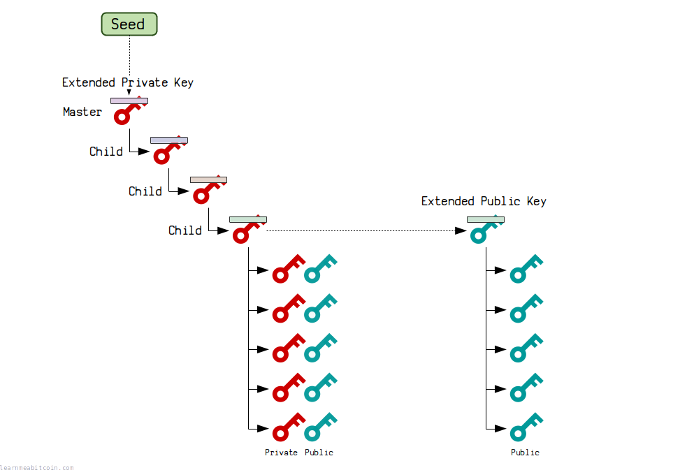
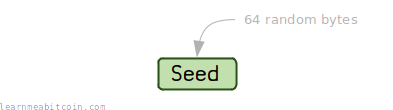
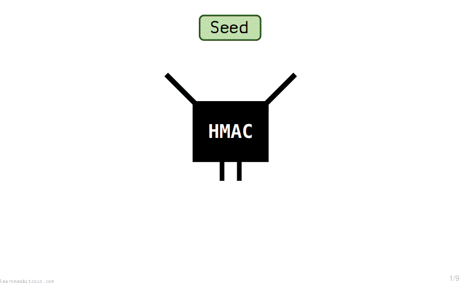
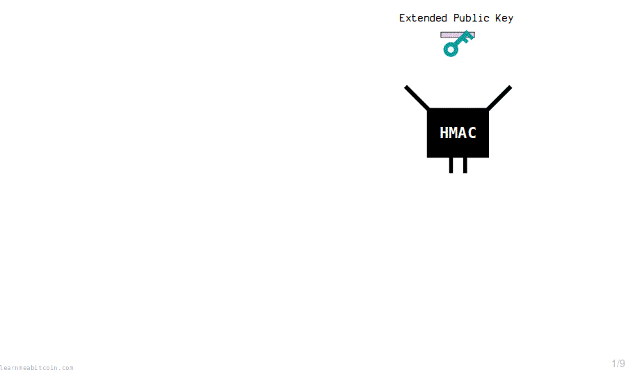
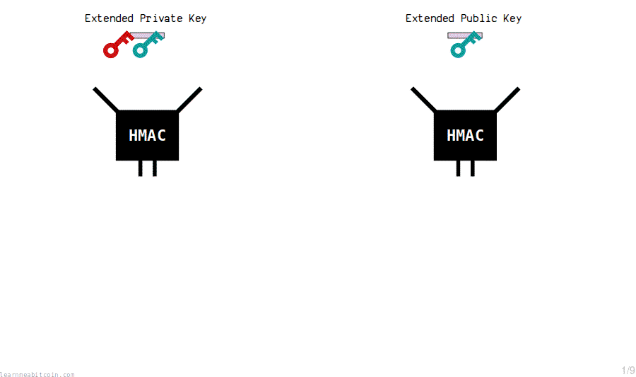
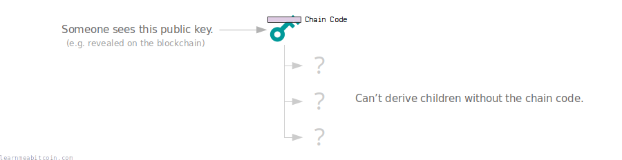
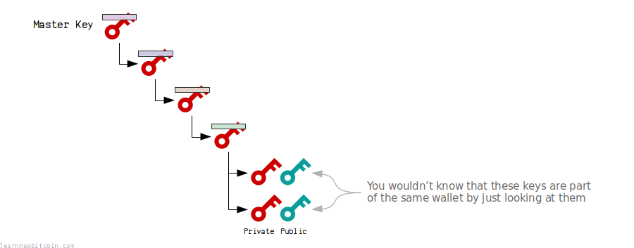
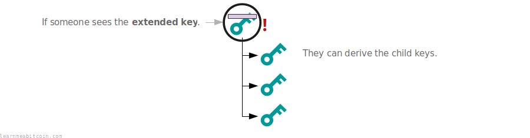
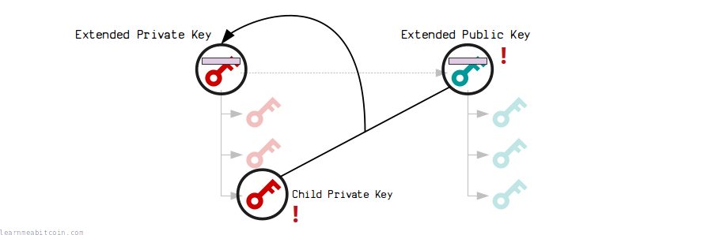

[BIP 32: Hierarchical Deterministic Wallets](https://github.com/bitcoin/bips/blob/master/bip-0032.mediawiki)

[](https://static.learnmeabitcoin.com/diagrams/png/hd-wallets.png)

A hierarchical deterministic wallet (or "HD Wallet") is a wallet that generates all of its keys and addresses from a single source.

* **Hierarchical** – The keys and addresses can be organized into a *tree*.
* **Deterministic** – The keys and addresses are always generated in the *same way*.

So basically, an HD Wallet allows you to generate billions of [private keys](/technical/keys/private-key/) using a single [seed](/technical/keys/hd-wallets/mnemonic-seed/). So as long as you remember the seed, you'll always be able to recover the same keys and [addresses](/technical/keys/address/).

This makes them much more user-friendly than early [bitcoin wallets](/beginners/wallets/) that generated and stored private keys individually.

The most interesting feature of HD wallets is that you can generate new public keys *without* having to generate the private keys for them at the same time.

## Examples

Here are some examples of popular HD wallets that I like:

* [Electrum](https://electrum.org/) (Desktop)
* [Sparrow Wallet](https://www.sparrowwallet.com/) (Desktop)
* [Trezor](https://trezor.io/) (Hardware Wallet)
* [Coldcard](https://coldcard.com/) (Hardware Wallet)

Almost all modern wallets (since 2013) are hierarchical deterministic.

### Mnemonic Sentence

When you create an HD wallet you will be given a 12 or 24-word [mnemonic sentence](/technical/keys/hd-wallets/mnemonic-seed/). This is the source of the *seed*, which is then used to generate all the keys and addresses in your wallet.

For example:

New Seed

**Never use a seed generated by a website, or enter your seed into a website.** Websites can easily save the seed and use it to steal all your bitcoins.


### Derivation Paths

The keys in your HD wallet will be generated using one of the following [derivation paths](/technical/keys/hd-wallets/derivation-paths/) depending on the type of [addresses](/technical/keys/address/) you want to use:

```
m/44'/0'/0' <- 1addresses (P2PKH)
m/49'/0'/0' <- 3addresses (P2SH-P2WPKH)
m/84'/0'/0' <- bc1addresses (P2WPKH)
```

## Benefits

What are the benefits of a HD wallet?

### 1. Single backup

In a basic wallet, you would generate pairs of [private keys](/technical/keys/private-key/) and [public keys](/technical/keys/public-key/) independently each time you want to receive bitcoins.

[](https://static.learnmeabitcoin.com/technical/keys/hd-wallets/basic-wallet.gif)


Basic Wallet.

This works perfectly fine, but it means that you would need to back up your wallet *every time you receive a new payment*.

However, with a hierarchical deterministic wallet, you can use a single **[seed](/technical/keys/hd-wallets/mnemonic-seed/)** to create a **[master private key](/technical/keys/hd-wallets/extended-keys/#master-extended-key)**, and you can use this to generate billions of "child" private keys and public keys.

[](https://static.learnmeabitcoin.com/technical/keys/hd-wallets/hd-wallet.gif)


HD Wallet (Deterministic).

So now all you need to back up is the **seed**, as the master private key you create from it will always generate the keys for your wallet in the same way (*deterministically*).

### 2. Organization

Another cool thing about hierarchical deterministic wallets is the *hierarchical* part.

Each [**child key**](/technical/keys/hd-wallets/extended-keys/#child-key-derivation) in the wallet can also **generate its own keys**, which means you can create a **tree structure** (or *hierarchy*) to organize the keys in your wallet.

[](https://static.learnmeabitcoin.com/technical/keys/hd-wallets/hierarchical.gif)


HD Wallet (Hierarchical).

You then use different parts of the tree to separate the keys into different "accounts".

### 3. Generating public keys independently

But the really cool thing about a **master private key** is that it has a corresponding **master public key**, and this can generate the same child public keys without the private keys.

[](https://static.learnmeabitcoin.com/technical/keys/hd-wallets/extended-public-key.gif)


You can generate public keys independently of their corresponding private keys.

So you could send the **master public key** to a different computer (e.g. a webshop server) to generate new receiving addresses, without worrying that the private keys will get stolen if the server gets hacked.

This may seem like magic, but it's all just mathematics.

This is also useful for things like **hardware wallets** – you can keep your private keys on a secure device, and generate new addresses on a different computer for receiving payments.

## How do HD wallets work?

The following is a **visual overview** of how HD wallets work.

For technical details, see [extended keys](/technical/keys/hd-wallets/extended-keys/).

### 1. Seed

[](https://static.learnmeabitcoin.com/diagrams/png/hd-wallets-seed.png)

To create an HD wallet, you start by generating 64 random [bytes](/technical/general/bytes/). This is our **seed**.

#### Example


New Seed

### 2. Master Private Key

[](https://static.learnmeabitcoin.com/technical/keys/hd-wallets/master-key.gif)

The "master key" is created by putting the seed through a hash function (called a HMAC) to generate *another* set of 64 bytes.

 HMAC-SHA512

Random Example

Data (Hex)

seed or (private/public key + 4-byte index)

`0 bytes`

Key (Hex)

"Bitcoin seed" or chain code

`0 bytes`

"Bitcoin seed"
(ASCII)


HMAC-SHA512

Result

HMAC-SHA512(data, key)

`0 bytes`


0 secs

We use these 64 bytes to create our **master** extended private key.

* The **first** 32 bytes is the private key.
* The **last** 32 bytes is the chain code.

The chain code is just an extra 32 bytes that we couple with the private key to create what we call an [extended key](/technical/keys/hd-wallets/extended-keys/).

#### Example

An "extended key" is just a normal key coupled with a chain code.

**Why do we hash the seed?** We *could* directly use the 64 byte seed to create the master extended private key. However, future child extended keys are created using the HMAC, so it's good to be consistent with how we create both.

The private key embedded inside an extended key can be used to create a corresponding [public key](/technical/keys/public-key/) as normal:

 Public Key

Generate Random

Private Key

`0 bytes`

Public Key


Coordinates

x:

0d

y:

0d

parity:

A public key is just a point on an elliptic curve. The final public key is these coordinates in hexadecimal.

Compression
 Compressed (02 or 03 prefix)
 Uncompressed (04 prefix)
 x-only (no prefix)

The elliptic curve is symmetrical along the x-axis, so a *compressed* public key only needs to store the full x-coordinate and whether the y-coordinate is even or odd.

An x-only public key is used in [Taproot](/technical/upgrades/taproot/) outputs. The corresponding y-coordinate is assumed to be even.

`0 bytes`


**Never enter your private key into a website, or use a private key generated by a website.** Websites can easily save the private key and use it to steal your bitcoins.

0 secs

The *actual* **master** extended private key itself is just the private key and chain code.

### 3. Child Keys (Basic)

Deriving private keys and public keys

New child private keys are generated from an extended private key by putting it (the private key and chain code) through the HMAC function.

We also include an **index** number each time, which allows us to create multiple child keys from a single master key.

[](https://static.learnmeabitcoin.com/technical/keys/hd-wallets/child-keys-basic-private.gif)


By changing the **index** you get a completely different result from the hash function.

So essentially, new private keys are generated by [hashing](/technical/cryptography/hash-function/) the master extended private key with an **index** number.


#### Example

There is an extra mathematical step when calculating the child private key after hashing the parent extended private key. So that's why you won't get the correct results by simply putting the (32-byte private key | 4-byte index) and (32-byte chain code) through the HMAC. See [extended keys](/technical/keys/hd-wallets/extended-keys/) for details.

An extended key can generate 2,147,483,648 of these "basic" (hardened) child keys.

### 4. Child Keys (Advanced)

Deriving private keys and public keys, and also public keys independently

Now this is the fun part.

What if we want an extended private key to create child private keys and public keys, but also want a corresponding extended public key for it that can generate the same child public keys?

In other words, how can we generate public keys without the private keys?

#### 1. Extended Public Key

First, we need to construct the extended public key.

This is just the public key from the extended private key, coupled with the same chain code:

[](https://static.learnmeabitcoin.com/technical/keys/hd-wallets/corresponding-extended-public-key.gif)

 Public Key

Generate Random

Private Key

`0 bytes`

Public Key


Coordinates

x:

0d

y:

0d

parity:

A public key is just a point on an elliptic curve. The final public key is these coordinates in hexadecimal.

Compression
 Compressed (02 or 03 prefix)
 Uncompressed (04 prefix)
 x-only (no prefix)

The elliptic curve is symmetrical along the x-axis, so a *compressed* public key only needs to store the full x-coordinate and whether the y-coordinate is even or odd.

An x-only public key is used in [Taproot](/technical/upgrades/taproot/) outputs. The corresponding y-coordinate is assumed to be even.

`0 bytes`


**Never enter your private key into a website, or use a private key generated by a website.** Websites can easily save the private key and use it to steal your bitcoins.

0 secs

#### Example


#### 2. Extended Private Key Children

The master extended private key creates **child** private keys by putting the contents of its corresponding extended public key through the HMAC function, and *adding* the result to the *original* private key.

[](https://static.learnmeabitcoin.com/technical/keys/hd-wallets/child-keys-advanced-private.gif)


#### Example

#### 3. Extended Public Key Children

The master extended public key creates **child** public keys by putting its contents through the HMAC function, and *adding* the result to the *original* public key.

[](https://static.learnmeabitcoin.com/technical/keys/hd-wallets/child-keys-advanced-public.gif)


#### Example

* An extended key can generate 2,147,483,648 of these "advanced" (normal) child keys.
* So an extended key can derive 4,294,967,296 children in total:
  + **Normal** = 2,147,483,648 (indexes `0` to `2147483647`)
  + **Hardened** = 2,147,483,648 (indexes `2147483648` to `4294967295`)

Now, because this time the child keys have been *adjusted* based on the **parent** private key and public key, the magic of [elliptic curve](/technical/cryptography/elliptic-curve/) mathematics means that the **child** private keys and public keys will correspond.

[](https://static.learnmeabitcoin.com/technical/keys/hd-wallets/child-keys-advanced-private-public.gif)

It seems like magic, I know, but it's just mathematics.

## FAQ

### Why do we use a chain code?

Adding a chain code means that child keys are not derived *solely* from the key.

For example, we may use one of the public keys in the tree to receive a payment, which would make it visible on the [blockchain](/technical/blockchain/). If we didn't use chain codes, anyone could take this public key and derive all the children for it:

[](https://static.learnmeabitcoin.com/technical/keys/hd-wallets/without-chain-code.png)

But by using chain codes (which do not hit the blockchain), other people are unable to derive the children from the public key:

[](https://static.learnmeabitcoin.com/technical/keys/hd-wallets/with-chain-code.png)

So in other words, the chain code is additional secret data that prevents other people from deriving the children of a key.

### Are the keys in an HD wallet connected?

**No**.

You cannot tell that any two public keys (or [addresses](/technical/keys/address/)) in the tree are part of the same wallet (i.e. derived from the same master extended key).

Even though child keys are derived from the master extended key deterministically, the actual private keys and public keys themselves do not share any resemblance to each other.

So to the outside world it's as though all the private keys and public keys were generated completely independently.

[](https://static.learnmeabitcoin.com/technical/keys/hd-wallets/hd-wallet-are-keys-connected.png)

### Are the keys in an HD wallet secure?

Yes, all of the private keys and public keys you get from an HD wallet are as secure as if you generated them independently using a random number generator.

However, **extended keys should be kept extra safe**, as anyone who has access to them can derive all their children.

For example, if you revealed your master extended public key, other people would be able to find all the addresses in your wallet. They *can't steal anything* because they cannot generate the private keys for them, but they can still see how much bitcoin you own.

[](https://static.learnmeabitcoin.com/technical/keys/hd-wallets/security-extended-public-key.png)

Leaking a parent extended public key *and* any child private key allows someone to calculate the parent extended private key.

And if they can calculate the extended private key, they can generate all the private keys at that level of the wallet (and below) **and steal your bitcoins**:

[](https://static.learnmeabitcoin.com/technical/keys/hd-wallets/security-extended-public-key-child-private-key.png)

You might not think this would be possible at first, but it is, so be aware of it.

* Try not to reveal your extended public key. If you do, other people can find the addresses in your wallet.
* If you were to reveal a child private key *as well*, then that's as bad as revealing the extended private key.

## Address

The extended private keys and extended public keys in an HD wallet have their own address format.

 Address (Extended Key)

Generate Random Example


Extended Key Data


Type

Legacy ([BIP 44](https://github.com/bitcoin/bips/blob/master/bip-0044.mediawiki))
 Extended Private Key (xprv)
 Extended Public Key (xpub)

Note: 1addresses ([P2PKH](/technical/script/p2pkh/))


Segwit ([BIP 49](https://github.com/bitcoin/bips/blob/master/bip-0049.mediawiki))
 Extended Private Key (yprv)
 Extended Public Key (ypub)

Note: 3addresses (P2SH-P2WPKH)


Segwit ([BIP 84](https://github.com/bitcoin/bips/blob/master/bip-0084.mediawiki))
 Extended Private Key (zprv)
 Extended Public Key (zpub)

Note: bc1addresses ([P2WPKH](/technical/script/p2wpkh/))

Depth

How many derivations deep from the master key (0 if master key)

0d


+1

Fingerprint

The first 4 bytes of the HASH160 of the parent's public key (00000000 if master key)

Index

The index number of this key from its parent (0 if master key)

0d


+1

Chain Code

The last 32 bytes from the HMAC-SHA512 of the parent key (key+index, chain code) or (seed, passphrase)

`0 bytes`

Key

Raw private key (32 bytes) or public key (33 bytes)

`0 bytes`


Serialized (Hex)

`0 bytes`

Checksum`0 bytes`

Address

Base58 encoding of the serialized extended key and checksum

`0 characters`


**Never use a private key generated by a website, or enter your private key into a website.** Websites can easily save the private key and use it to steal your bitcoins.

0 secs

For example, this is what our master extended private key looks like when serialized:

We can then make this into an address by [base58check](/technical/keys/base58/#base58check) encoding it:

This is now a more useful format for our extended private key, as it's easier to share between computers and import in to wallets.

See [extended key address](/technical/keys/hd-wallets/extended-keys/#address) for details.

## History

Who invented HD wallets?

1. [**Gregory Maxwell**](https://github.com/gmaxwell) came up with the initial idea that you can tweak public keys to get new public keys without knowing the private keys for them, otherwise known as *homomorphic derivation*.
2. [**Armory**](https://btcarmory.com/) was the first wallet to implement this homomorphic derivation, and also introduced the concept of using a chain code.
3. [**Pieter Wuille**](https://github.com/sipa) came up with the idea to use a *hierarchical* structure, and built upon the scheme used by Armory to create the [BIP 32](https://github.com/bitcoin/bips/blob/master/bip-0032.mediawiki) specification.

> The [FSF](https://www.fsf.org/) wanted to accept donations in Bitcoin and wanted to generate new addresses for each user, but didn't want their private key on their webserver.

Gregory Maxwell, (on IRC)


> HD wallets (BIP32) was based on Armory's scheme, but with more flexibility (the hierarchical structure), and random-access in the index (Armory's scheme required generating all N addresses before N to derivate address number n).

Pieter Wuille, (on IRC)

## Summary

[](https://static.learnmeabitcoin.com/technical/keys/hd-wallets/hierarchical-deterministic-wallets.gif)

A **hierarchical deterministic wallet** provides a useful method for generating new [private keys](/technical/keys/private-key/) and [public keys](/technical/keys/public-key/).

It's *deterministic* because all of the child keys are generated from a single seed in the **same way** each time, and it's *hierarchical* because you can organize the keys into a **tree structure** (or hierarchy). The additional benefit is that it's possible to derive the public keys in the wallet without having any knowledge of the private keys, which is pretty amazing.

Here are some more technical explanations if you're interested in the details of HD wallets:

* [Mnemonic Seed](/technical/keys/hd-wallets/mnemonic-seed/) – Generating a user-friendly seed for your HD wallet.
* [Extended Keys](/technical/keys/hd-wallets/extended-keys/) –Creating a master extended key, and deriving children from it.
* [Derivation Paths](/technical/keys/hd-wallets/derivation-paths/) – Common hierarchies used by wallets for organizing keys.

## Resources

* <https://bitcointalk.org/index.php?topic=19137> – Discussion about deterministic wallets by Gregory Maxwell
* <https://github.com/bitcoin/bips/blob/master/bip-0032.mediawiki> – BIP by Pieter Wuille
* <https://iancoleman.io/bip39/> – An amazing web tool for generating HD wallets
* <https://github.com/lian/bitcoin-ruby/blob/master/lib/bitcoin/ext_key.rb> – A clean implementation in Ruby
* <https://www.youtube.com/watch?v=OVvue2dXkJo> – Talk by James Chiang
* <https://www.cs.cornell.edu/~iddo/detwal.pdf> – Gregory Maxwell slides on Deterministic Wallets
* <https://eprint.iacr.org/2014/998.pdf> – Interesting paper by Gus Gutoski and Douglas Stebila
* [Hierarchical determinism: how Bitcoin's HD wallets are born](https://bennet.org/learn/hierarchical-determinism-how-bitcoin-hd-wallets-are-born/) – An introduction to HD Wallets with interactive tools