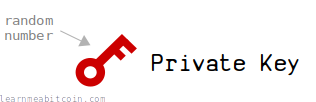
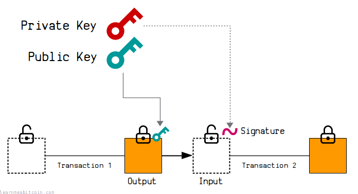

[](https://static.learnmeabitcoin.com/diagrams/png/keys-private-key.png)

A private key is a very large **random number**.

It's used as the source for creating a [public key](/docs/technical/keys/public-key.md).

Generate Random
Reset


Bits

0

0

0

0

0

0

0

0

0

0

0

0

0

0

0

0

0

0

0

0

0

0

0

0

0

0

0

0

0

0

0

0

0

0

0

0

0

0

0

0

0

0

0

0

0

0

0

0

0

0

0

0

0

0

0

0

0

0

0

0

0

0

0

0

0

0

0

0

0

0

0

0

0

0

0

0

0

0

0

0

0

0

0

0

0

0

0

0

0

0

0

0

0

0

0

0

0

0

0

0

0

0

0

0

0

0

0

0

0

0

0

0

0

0

0

0

0

0

0

0

0

0

0

0

0

0

0

0

0

0

0

0

0

0

0

0

0

0

0

0

0

0

0

0

0

0

0

0

0

0

0

0

0

0

0

0

0

0

0

0

0

0

0

0

0

0

0

0

0

0

0

0

0

0

0

0

0

0

0

0

0

0

0

0

0

0

0

0

0

0

0

0

0

0

0

0

0

0

0

0

0

0

0

0

0

0

0

0

0

0

0

0

0

0

0

0

0

0

0

0

0

0

0

0

0

0

0

0

0

0

0

0

0

0

0

0

0

0

0

0

0

0

0

0

0

0

0

0

0

0

0

0

0

0

0

0

Binary

0b

`0 bits`

Decimal

0d

Hexadecimal

0x

`0 bytes`


**Never use a private key generated by a website, or enter your private key into a website.** Websites can easily save the private key and use it to steal your bitcoins.

0 secs

## Generating

How do you create a private key?

To create a private key you just need to **generate a random 256-[bit](/docs/technical/general/bytes.md#bit) number**[\*](#range).

The critical part to generating a private key is to use a *reliable* source of randomness. If you're using Linux, a reliable source of randomness is [/dev/urandom](https://linux.die.net/man/4/urandom):

```


copied


copied

# generate 256 bits of random data
urandom = File.open("/dev/urandom")    # urandom is a "file"
bytes = urandom.read(32)               # read 32 bytes from it (256 bits)
privatekey = bytes.unpack("H*")[0]     # the data is binary, so unpack it to hexadecimal

# print the private key
puts privatekey
```

### Private key range

A valid private key is any number between (and including) the following range of numbers:

```
min: 1
max: 115792089237316195423570985008687907852837564279074904382605163141518161494336
```

This maximum value is `n-1`, where [`n`](/docs/technical/cryptography/elliptic-curve.md#parameters-n) is the number of points on the [elliptic curve](/docs/technical/cryptography/elliptic-curve.md) used in Bitcoin (*secp256k1*). This is slightly less than the maximum value for a 256-bit number.

So if you're generating a random 256-bit (32-[byte](/docs/technical/general/bytes.md)) number, you want to check it's not above the maximum value before using it.

### Cryptographically secure random numbers

The default random number functions in programming languages are typically not secure enough for generating private keys.

The standard "`rand()`" functions in most languages are just quick and easy ways for generating a "random" looking numbers, but they're not random *enough* to use for cryptographic purposes, such as generating private keys.

For example:

```


copied


copied

# simple random number (do not use for generating private keys)
puts rand(1..115792089237316195423570985008687907852837564279074904382605163141518161494336)

# cryptographically secure random number (can use for generating private keys)
require 'securerandom'
puts SecureRandom.random_number(1..115792089237316195423570985008687907852837564279074904382605163141518161494336)

# NOTE: These random number functions include the given minimum and maximum values as part of the range of possible results.
```

So for whatever programming language you're using, make sure you search for how to generate "cryptographically secure random numbers" to find out which function you should be using (instead of the default functions you may be familiar with).

For example, the [libbitcoin](https://github.com/libbitcoin) library (specifically the `bx seed` command line tool) caused the loss of over $900,000 worth of bitcoin in 2023 due to not using cryptographically secure random numbers for generating [seed phrases](/docs/technical/keys/hd-wallets/mnemonic-seed.md). For a full explanation of what happened and why, see [Milk Sad](https://milksad.info/disclosure.html).

It's sometimes easier to generate *random bytes* instead of random numbers. So you can always just generate 32 random bytes and use that as your private key, as that's equivalent to generating a 256-bit number.

If you're on Linux, the secure random numbers are usually sourced from /dev/urandom anyway, so it's more straightforward to get your bytes from that source directly.

## Formats

What does a private key look like?

Generate

### Decimal

A private key is ultimately just a random number, so it's perfectly fine to store it as a decimal number. For example:

### Hexadecimal (most common)

You'll usually see raw private keys displayed as 32-byte [hexadecimal](/docs/technical/general/hexadecimal.md) strings in tutorials and on websites. For example:

This is the **same a random number**, it's just a different way of displaying it (using hexadecimal digits instead of decimal digits).

 Number Converter

Binary (Base 2)

0b

`0 digits`

Decimal (Base 10)

0d

`0 digits`

Hexadecimal (Base 16)

0x

`0 digits`


+1


0 secs

### WIF (Wallet Import Format)

A private key can be converted to [WIF](/docs/technical/keys/private-key/wif.md) (Wallet Import Format) for convenience. For example:

This is like an [address](/docs/technical/keys/address.md) format for private keys. It's sometimes used when importing a private key into a wallet (e.g. [Electrum](https://electrum.org/)).

Generate Random


Prefix`1 byte`

Network
 Mainnet
 Testnet

Private Key`0 bytes`

Compression`1 byte`

Compressed
 True (default)
 False

Checksum`0 bytes`

WIF Private Key

Base58 encoding of above data

`0 characters`


**Never enter your private key into a website, or use a private key generated by a website.** Websites can easily save the private key and use it to steal your bitcoins.

0 secs

## Usage

How are private keys used in Bitcoin?

[](https://static.learnmeabitcoin.com/diagrams/png/keys.png)

A private key is the starting point for calculating a public key.

A private key is also used to generate [signatures](/docs/technical/keys/signature.md), and these signatures have a mathematical connection to the public key. These mathematical connections are what allow you to [lock](/docs/technical/transaction/output/scriptpubkey.md) and [unlock](/docs/technical/transaction/input/scriptsig.md) bitcoins when making [transactions](/docs/technical/transaction.md).

Private keys themselves do not appear publicly in the [blockchain](/docs/technical/blockchain.md). The purpose of a private key is to be kept private (hence the name), so they should be stored securely on your computer and only used when generating signatures to unlock bitcoins (which is what a [bitcoin wallet](/docs/beginners/wallets.md) does when you make a transaction).

## Security

How secure are private keys?

*Never* reveal your private key.

The only thing stopping someone from stealing your bitcoins is the fact that they cannot guess or randomly generate the same private key as you.

The range of possible private keys (the "key space") is so inconceivably large that it's **effectively impossible for two different people/computers to ever generate the same private key** (as long as they have been generated securely).

This may seem hard to believe, but to give you some perspective, there are roughly 2256 or 1077 possible private keys, and there are roughly 1078 atoms in the universe[[1]](#fn1). So it's like asking two different people to randomly select an atom in the universe and for both to choose the exact same one.

```
# number of private keys (roughly)
1077 = 100000000000000000000000000000000000000000000000000000000000000000000000000000

# number of atoms in the universe (roughly)
1078 = 1000000000000000000000000000000000000000000000000000000000000000000000000000000
```

To put it another way, it's like two people choosing the same grain of sand from anywhere on the earth (1018)[[2]](#fn2). Except each grain of sand contains another earth-worth of sand, and each grain of that sand contains another earth-worth of sand, and each grain of that sand also contains another earth worth of sand.

And even this amount of sand is still far, far less than the number of possible private keys.

```
# grains of sand on the earth (roughly)
1018 = 1000000000000000000

# grains of sand on the earth where each grain of sand contains an earth of sand (4 times recursively)
1018 * 1018 * 1018 * 1018 
= 1000000000000000000000000000000000000000000000000000000000000000000000000
```

So as you can see, it's very difficult to conceive just how large this number is.

Anyway, the moral of the story is that you should **never enter your private key into a website** or leave it somewhere that someone could access it; because that's the only way someone is ever going to find out your private key.

[keys.lol](https://keys.lol) is a fun website that allows you to browse every possible private key in existence. Aside from the obviously insecure low-number private keys that have been used in the past, good luck finding a genuinely random private key with a balance on it.

## Summary

If you can securely generate random numbers on your computer, you can generate your own private keys.

The key (heh) thing though is to figure out how to generate *cryptographically secure* random numbers, so it's worth taking your time to find out how to do it properly in the programming language of your choice. Because if your random numbers aren't random enough, you're going to lose bitcoins.

But don't let that put you off. I'm sure many guides will advise against generating your own private keys, but that's just because they don't want to be responsible for any mistakes that you make. But if you're careful and work out to do it properly, there's nothing wrong with generating your own private keys if you want to. And hey, everyone has to start somewhere.

I do it all the time when making test transactions, and I've never had a problem.

Plus, it's pretty cool to be able to generate your own keys and send bitcoins to them. And if you're interested in programming bitcoin stuff, generating your own private keys is a good place to start.

Good luck.

I use a wallet for storing my bitcoins. It's easier than generating and managing individual private keys.

### Thanks

* **David Plotz** – Pointed out a copy and paste error I made with the maximum value of a private key. David has a cool website with useful [Excel spreadsheets for Bitcoin](https://www.modulo.network/).