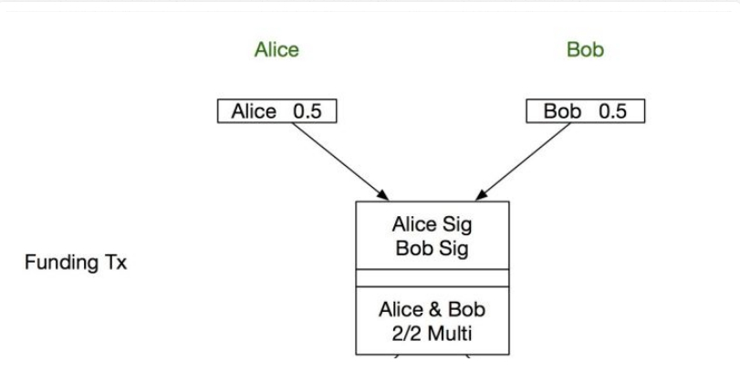
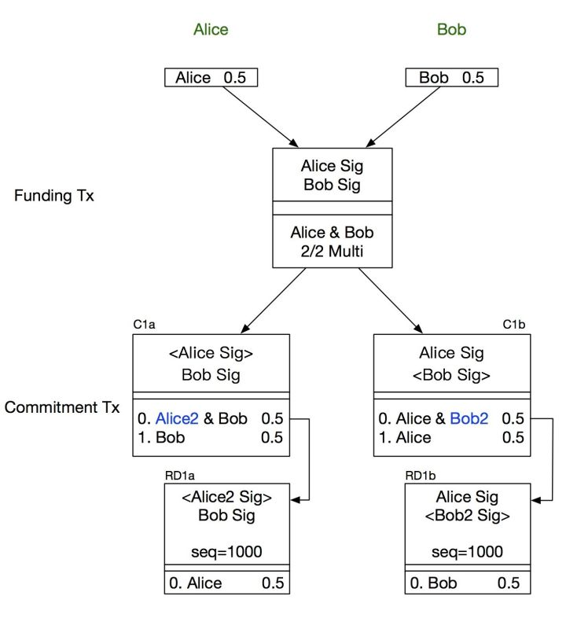
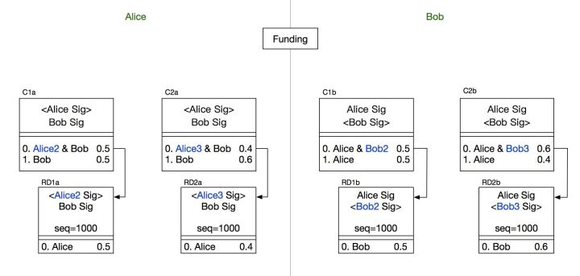
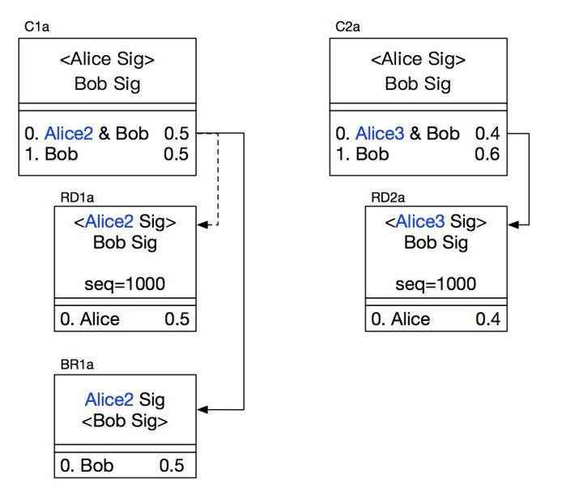
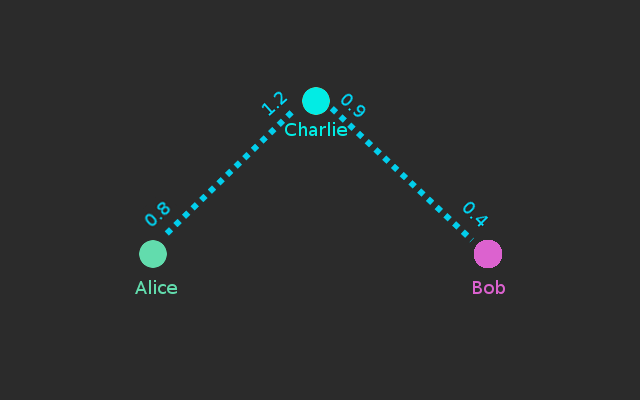

# 核心机制深潜：深度图解 RSMC 与 HTLC (RSMC & HTLC Deep Dive)

闪电网络之所以被称为区块链技术最华彩的乐章，其核心精髓在于它不依赖任何可信第三方，纯粹通过**巧妙的交易脚本嵌套、相对时间锁与博弈论威慑**，构建了一个在零信任下保证各方绝无作恶可能的闭环体系。

这一体系由两大核心机制支撑：
1. **RSMC（序列到期可撤销合约）**：保障两点之间的单通道状态可被无限次安全撤销与更新；
2. **HTLC（哈希时间锁合约）**：保障跨越多跳中继节点的支付能够在确定时间内原子化传递。

---

## 1. RSMC：单通道状态的可撤销与博弈惩罚

假设 Alice 和 Bob 打算建立一条链下支付通道，双方各出资 0.5 BTC。

### 阶段一：通道开启与注资 (Funding Tx)
首先，双方协商构造一笔主链交易 **Funding Tx**，将各自的 0.5 BTC 打入一个由 Alice 和 Bob 共同控制的 2/2 多重签名输出中：

> **关键死锁问题**：如果双方直接对 Funding Tx 签名并广播上链，一旦之后某一方失联或拒绝合作，这 1.0 BTC 将永久冻结在 2/2 多签地址中。因此，在 Funding Tx 真正广播前，双方必须先预签好一套**随时可以安全退款退出的承诺交易 (Commitment Tx)**。

### 阶段二：承诺交易 (Commitment Tx) 与延迟交付 (RD Tx)
为了防止单方广播提款后卷款跑路，双方各自持有一份非对称的承诺交易：
* Alice 持有 $C_{1a}$，Bob 持有 $C_{1b}$。
* 这两笔交易的花费输入都是 Funding Tx 的同一个 2/2 输出，因此在链上**两者互斥，只有一个能被打包进块**。

以 Alice 的视角为例，她持有的 $C_{1a}$ 包含两个输出：
1. **输出 1（0.5 BTC，归 Alice）**：为了防止 Alice 单方广播偷跑，这笔钱并不是立即给 Alice，而是输出到一个 `Alice2 & Bob` 的 2/2 多签地址，并挂接了一笔带有相对时间锁（`CSV` 或 `Sequence = 1000`）的延迟交付交易 **$RD_{1a}$**。
2. **输出 2（0.5 BTC，归 Bob）**：立即生效，Bob 无需等待即可立即拿走自己的 0.5 BTC。

**双重博弈规则**：
* 任何一方想要单方面强行关闭通道，对方能**立即**拿到属于自己的钱；
* 而主动关闭通道的一方，必须等待约 1000 个区块的成熟期，才能通过 $RD$ 交易取回自己的本金。这极大地鼓励了双方保持通道长久开启。

### 阶段三：状态更新与旧状态“自我毁灭”
假设 Alice 向 Bob 购买了价值 0.1 BTC 的服务，此时通道内部余额应更新为：**Alice 0.4 BTC，Bob 0.6 BTC**。

双方构造新一代承诺交易 $C_{2a}$ / $C_{2b}$，那么如何彻底作废旧状态 $C_{1a}$ / $C_{1b}$，防止 Alice 日后偷偷广播对她更有利的 $C_{1a}$（0.5 BTC）呢？

**作废密钥的移交**：
1. Alice 将用于控制 $C_{1a}$ 第一个输出的临时私钥 **`Alice2` 的私钥**交付给 Bob；
2. Bob 同样将 `Bob2` 的私钥交付给 Alice。

交出旧私钥，就等于在密码学上完成了对旧状态的“自我毁灭”。

### 阶段四：违约惩罚交易 (Breach Remedy Tx - BR)
假设 Alice 见利忘义，在通道余额已是 0.4 BTC 的情况下，恶意将旧状态 $C_{1a}$ 广播上链企图骗取 0.5 BTC：

1. $C_{1a}$ 上链后，Bob 立即拿到 0.5 BTC。
2. Alice 必须等待 1000 个区块的时间锁到期，才能动用 $RD_{1a}$。
3. **雷霆惩罚**：在这 1000 个区块的窗口期内，由于 Bob 已经掌握了 `Alice2` 的私钥，Bob 可以凭借 `Alice2 + Bob` 的双重签名，直接构造并广播 **惩罚交易 $BR_{1a}$**！
4. $BR_{1a}$ 赶在 $RD_{1a}$ 解锁前，**将 Alice 输出 1 中的全部 0.5 BTC 没收转入 Bob 的钱包**！

> **博弈论极刑**：任何一方胆敢广播过期历史状态，不仅拿不回应得的本金，还会被对方依法全额没收通道内的一切资金。在这一严苛的博弈威慑下，理性参与者绝不会尝试作恶。

---

## 2. HTLC：多跳路由与跨节点价值传递

RSMC 解决了两个直接互联节点之间的双向支付，但如果全网每一个用户想给其他人付款都需要专门开一条链上通道，资金沉淀成本将极其高昂。

**HTLC（哈希时间锁合约）** 允许资金跨越多个中间节点进行点对点跳转。

### 核心原理：密码学原像与时间锁
HTLC 的输出包含两个分支条件：
* **条件 1（原像兑付）**：在超时前，任何人只要提供哈希值 $H$ 的原像秘密 $R$（满足 $\text{SHA256}(R) = H$），并附带收款方签名，即可取款。
* **条件 2（超时退款）**：如果超过指定时间 $T$ 仍无人提供原像 $R$，付款方可凭自身签名全额取回退款。

### 多跳传递示例：Alice ➔ Charlie ➔ Bob
假设 Alice 想向 Bob 支付 0.5 BTC，但 Alice 与 Bob 之间没有直接通道，只有共同的中间节点 Charlie：

1. **秘密生成**：收款方 Bob 在本地生成一个随机秘密原像 $R$，计算其哈希值 $H = \text{SHA256}(R)$，并将 $H$ 发送给 Alice。
2. **第一跳合约 (Alice ➔ Charlie)**：Alice 与 Charlie 在已有通道内建立一个 HTLC：如果 Charlie 能在 3 天内提供原像 $R$，Charlie 获得 0.501 BTC（含小额手续费）；否则超时退还 Alice。
3. **第二跳合约 (Charlie ➔ Bob)**：Charlie 转身与 Bob 建立一个 HTLC：如果 Bob 能在 2 天内（**必须比前一跳时间短！**）提供原像 $R$，Bob 获得 0.5 BTC；否则超时退还 Charlie。
4. **原像逐级揭露**：
   * Bob 为了拿到钱，向 Charlie 出示秘密 $R$ 并提现 0.5 BTC。
   * Charlie 获得了 $R$，立即向 Alice 出示 $R$ 并提现 0.501 BTC（赚取 0.001 BTC 路由费）。
   * 全流程完成，Alice 成功将 0.5 BTC 送达 Bob。
5. **异常与退款**：如果中途任何节点断网或超时，由于各跳时间锁梯次递减，未成交的资金将沿原路各自自动解锁退还，无任何资金损失风险。

---

## 3. 小结

RSMC 与 HTLC 的合体，铸就了闪电网络无坚不摧的底层逻辑：
* **RSMC 赋予了通道持久的生命力**，用惩罚机制压制欺诈；
* **HTLC 赋予了通道网状扩展的能力**，用哈希原像串联全球。

然而，当我们在真实网络中运行节点并打开通道后，很快会迎来下一个工程现实考题：**为什么我的通道建好了，却无法向他人收款？** 接下来请阅读：[真实工程困境：通道入站容量谜题](inbound-capacity.md)。
