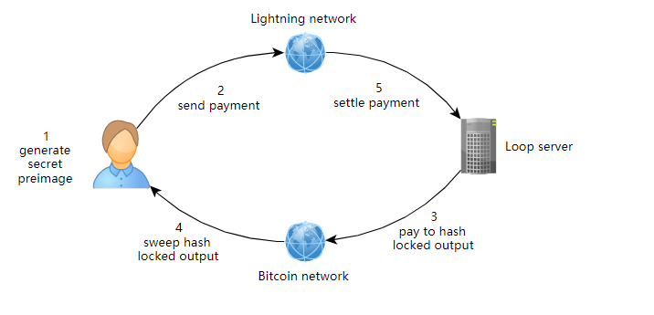

# 容量破局之道：Loop 潜艇互换机制 (Submarine Swaps & Loop)

在上一章[真实工程困境：通道入站容量谜题](inbound-capacity.md)中，我们指出了单通道资金流动的不对称性：无论是闪电网络商家还是普通收款者，都会面临入站容量（远程余额）被耗尽而无法继续收款的难题。

如果每次为了重新获得收款额度都要彻底关闭通道、重新发起链上开通道交易，不仅手续费昂贵，更会破坏既有的通道拓扑关系。**如何在无需关闭通道的前提下，平滑地在链上比特币与闪电网络通道之间循环调度资金？**

Lightning Labs 给出的答案是 **Lightning Loop** 及其背后的核心密码学技术——**潜艇互换（Submarine Swaps）**。

---

## 1. 什么是潜艇互换 (Submarine Swap)？

潜艇互换是一种在**链上比特币 UTXO** 与**闪电网络链下通道**之间执行的非托管原子跨层兑换技术。

* **Loop Out（循环移出）**：将通道内的本地余额通过闪电网络支付出去，换取在链上地址收到等额比特币。**效果：通道腾出了远程余额（瞬间恢复入站收款容量）**。
* **Loop In（循环移入）**：用链上钱包中的比特币发起链上合约锁定，换取闪电通道充值本地余额。**效果：无需新建通道即可提升向外付款额度**。

整个过程基于 HTLC 构建，即便兑换服务商中途崩溃或恶意离线，合约也会在超时后自动全额退款，**完全不依赖中心化托管**。

---

## 2. Loop Out 运行流程深度拆解

以闪电网络商家 Bob 为例，Bob 的通道入站容量已耗尽，他希望把通道内的 0.1 BTC“抽回”到自己的冷钱包链上地址，从而为通道腾出 0.1 BTC 的收款空间：

### 五步原子互换闭环：
1. **秘密原像生成**：Bob 在本地生成一个随机原像 $R$，并计算哈希值 $H = \text{SHA256}(R)$。
2. **持有型发票 (HODL Invoice)**：Bob 向 Loop 服务端发起一笔绑定该哈希值 $H$ 的闪电支付（0.1 BTC）。服务端此时不知道原像 $R$，因此该闪电付款处于挂起状态（Held）。
3. **链上 HTLC 锁定**：服务端在比特币区块链上广播一笔链上合约交易 $C_{1a}$，锁定 0.1 BTC 到一个特殊的 P2WSH 地址。解锁条件为：
   * 条件 A：Bob 出示原像 $R$（提现）；
   * 条件 B：超时后服务端凭自身签名撤回。
4. **Bob 链上提款 (Sweep Tx)**：Bob 监听到链上交易 $C_{1a}$ 确认后，向比特币主网广播一笔扫资交易（Sweep Tx），**在链上公开出示原像 $R$**，将 0.1 BTC 划入自己的链上地址。
5. **服务端结算闪电支付**：由于 Bob 广播了 Sweep 交易，原像 $R$ 成为了全网可见的公开信息。Loop 服务端立即从内存池中提取 $R$，用以结算第 2 步中挂起的闪电支付。

**结果**：Bob 的通道成功“推出”了 0.1 BTC（恢复了 0.1 BTC 的入站收款额度），同时链上地址实打实地收到了 0.1 BTC。双方未产生任何信任风险。

---

## 3. 防范 DoS 攻击与时间锁窗口

在潜艇互换的工程落地中，有两个必须权衡的安全机制：

### 1. 预付款机制 (Prepayments)
服务端构造链上 HTLC 交易必须由服务端垫付链上矿工费。如果有恶意用户大量发起 Loop Out，但在服务端广播链上交易后故意不提款，就会导致服务端的链上矿工费白白损失（沉没成本 DoS 攻击）。
为了解决该问题，Loop 协议要求用户在发起互换时先支付一笔极其微小的闪电网络预付款（如几百聪）。若用户无故放弃互换，该预付款将补偿给服务端作为链上矿工费损失。

### 2. 时间压力与交易确认风险 (RBF / CPFP)
当 Bob 在链上出示原像 $R$ 时，计时器便开始倒计时。Bob 必须在服务端超时退款时间到期前，让自己的 Sweep 提款交易获得区块确认。
如果主网突然拥堵导致手续费暴涨，Bob 的提款交易可能面临卡池风险。为此，Loop 客户端内置了 **RBF（Replace-By-Fee）** 和 **CPFP（Child-Pays-For-Parent）** 动态追加矿工费能力，确保提款交易能够被矿工优先打包。

---

## 4. 小结

潜艇互换打破了链上与链下的资产物理隔阂：
* 它让闪电节点能够像“资金呼吸机”一样，在不反复重开通道的前提下长久维系网络拓扑的稳定性；
* 它将比特币主网的冷钱包储备与闪电网络的热钱包流动性紧密交融；
* 为交易所、商家以及大型节点运营商提供了真正企业级、非托管的流动性自平衡手段。
