[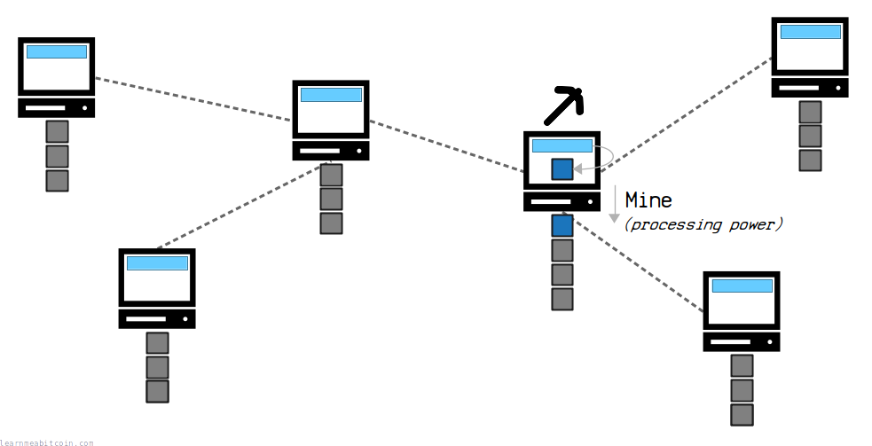](https://static.learnmeabitcoin.com/diagrams/png/mining.png)

Mining is the process of trying to add a new [block](/technical/block/) of [transactions](/technical/transaction/) on to the [blockchain](/technical/blockchain/).

It's a **network-wide competition** where any [node](/technical/networking/node/) on the network can *work* to try and add the next block on to the chain.

When a new block is mined, it gets broadcast across the network, where each node independently verifies and adds it on to their blockchain.

[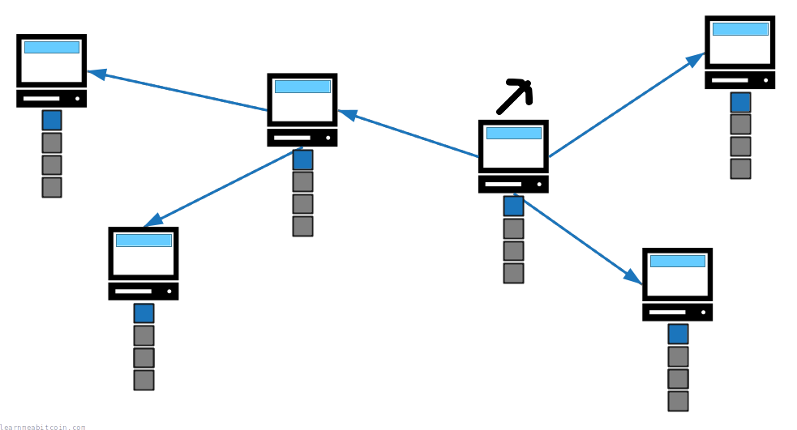](https://static.learnmeabitcoin.com/diagrams/png/mining-broadcast.png)


Nodes update their blockchains with the new block.

After adding the new block, each mining node restarts the process to try to build *on top* of this new block in the chain. As a result, the blockchain is regularly updated thanks to a collaborative effort of nodes across the network.

The system is designed so that a new block is mined **once every 10 minutes** on average.

## Method

How does mining work?

The mining process begins by filling a [candidate block](/technical/mining/candidate-block/) with transactions from your node's [memory pool](/technical/mining/memory-pool/).

This candidate block is what we're going to try and mine on to our blockchain (and then send to everyone else so they can add it to their blockchain too).

[](https://static.learnmeabitcoin.com/diagrams/png/mining-candidate-block.png)


Every node keeps a copy of the latest transactions in their memory pool.

Next we construct a [block header](/technical/block/#header) for this candidate block. This is basically a short summary of all of the data inside the block, which includes a *reference to an existing block* in the blockchain that we want to build on.

[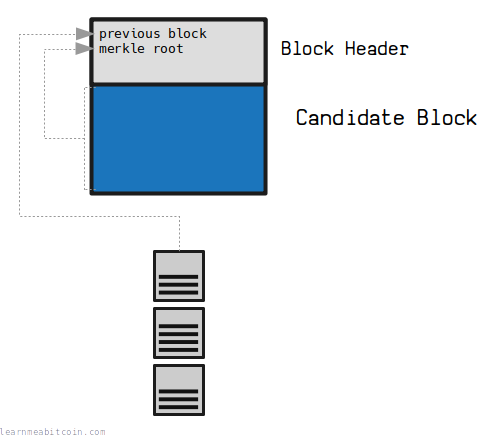](https://static.learnmeabitcoin.com/diagrams/png/mining-block-header.png)


You refer to a previous block by its [block hash](/technical/block/hash/). A summary of all the transactions in the block is contained in the [merkle root](/technical/block/merkle-root/).

 Block Header

Random Example

Block:

Block Header (Hex)

`0 bytes`


Block Header (Fields)


Version


0

0

0

0

0

0

0

0

0

0

0

0

0

0

0

0

0

0

0

0

0

0

0

0

0

0

0

0

0

0

0

0

Previous Block:
Merkle Root
Time

0d

Bits
Nonce

0d


+1


Block Hash

This is the HASH256 of the hex block header. It's also in reverse byte order, because that's how block hashes are displayed in block explorers.


0 secs

Now we are ready to start *mining* this block.

To do this, we put this block's **block header** through the SHA-256 [hash function](/technical/cryptography/hash-function/) *twice* (called HASH256 for short), and hope that the number it spits out is below the current [target](/technical/mining/target/).

[](https://static.learnmeabitcoin.com/diagrams/png/mining-block-header-hash.png)


The target is the number your block hash must get below to add the block on to the blockchain.

 HASH256

Random Transaction Data

Random Block Header

Data (Hex)

`0 bytes`


SHA-256


SHA-256

HASH256

SHA-256(SHA-256(data))

`0 bytes`


0 secs

If the hash of your block header *isn't* below the target, you can *keep trying* by incrementing the [nonce](/technical/block/nonce/) field in the block header. This allows you to keep the same basic block header, but get a completely different hash result for it.

[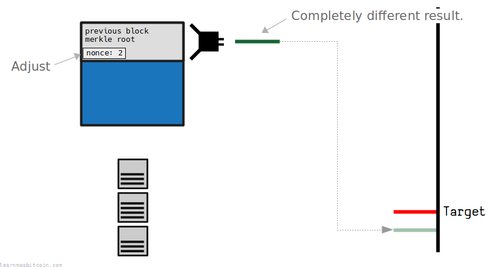](https://static.learnmeabitcoin.com/diagrams/png/mining-block-header-hash-nonce.png)


The mining process is basically hashing a block header as fast as you can to try and be the first node to get a low enough result.

And if you're lucky, you may end up getting a block hash that's below the current target.

## Synchronization

How do nodes update their blockchain?

If a miner manages to get a block hash for their candidate block below the target, they will **broadcast that block to the rest of network**.

Each node will then confirm that the block header hashes below the target, then add this "mined" block on to their blockchain.

[](https://static.learnmeabitcoin.com/diagrams/png/mining-block-broadcast.png)


Congratulations, you have just mined a block of transactions onto the blockchain.

From here, each node will stop working on their own candidate block, construct a new one (with fresh transactions from their memory pool), and start trying to build on top of this new block in the chain.

[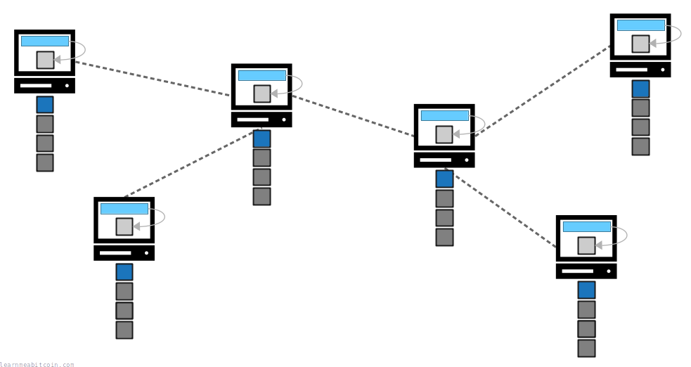](https://static.learnmeabitcoin.com/diagrams/png/mining-block-broadcast-restart-mining.png)


Miners start trying to add the next batch of transactions on to the chain.

As a result, miners are constantly working independently (yet collaboratively) to extend the blockchain with new blocks of transactions.

## Proof of Work

What does proof of work mean?

The mining process is often referred to as **proof of work**.

The term "proof of work" just refers to the fact that it takes *work* to get a block hash below the target. And if you can, anyone else can check that work has been done by confirming that the hash for the block you have constructed is indeed below the target.

In other words, the hash function is used as a way to prove that you have performed a required amount of "work" on your block.

> The proof-of-work involves scanning for a value that when hashed, such as with SHA-256, the hash begins with a number of zero bits.

Satoshi Nakamoto, [Bitcoin Whitepaper](/bitcoin.pdf)

## Miners

Who can mine blocks?

**Any** node can try to mine a block, and each node has a *chance* of being successful.

This means we have a network-wide competition where any node on the network could be the one to add the next batch of transactions on to the blockchain.

[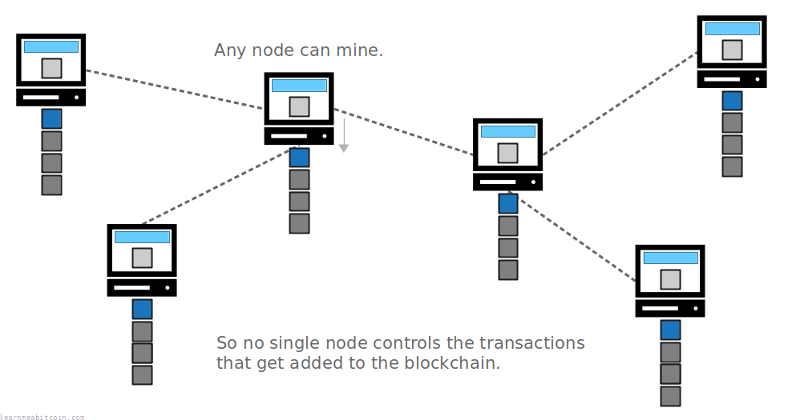](https://static.learnmeabitcoin.com/diagrams/png/mining-competition.png)

However, although anyone can try mining, being able to perform hash calculations *as fast as possible* improves your chances of successfully mining the next block.

[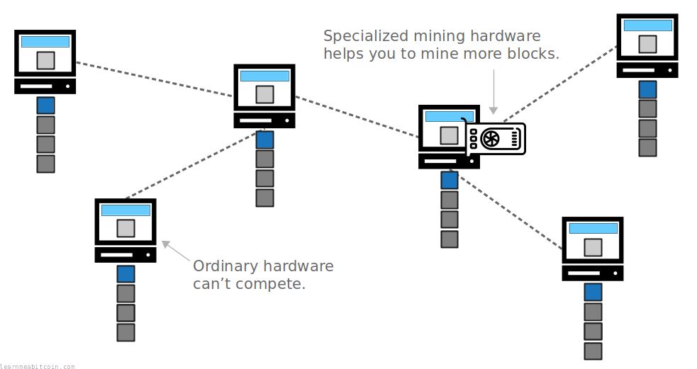](https://static.learnmeabitcoin.com/diagrams/png/mining-competition-hardware.png)

> Anyone's chance of finding a solution at any time is proportional to their CPU power.

Satoshi Nakamoto, [Cryptography Mailing List](https://www.metzdowd.com/pipermail/cryptography/2008-November/014858.html)

As a result, miners with the most processing power (or "hashing power") are more likely to mine a block than those who cannot hash as quickly. So even though anyone can mine, it **favors those with specialized mining hardware** and access to cheap electricity to power that hardware.

But still, nothing is stopping you from mining if you want to.

## [Block Reward](/technical/mining/block-reward/)

What's the incentive to mine blocks?

If you are able to mine a block you can claim a **block reward**.

You see, when you construct a candidate block, you can put your own special transaction at the top of the block. This is called the [coinbase transaction](/technical/mining/coinbase-transaction/), and it allows you to send yourself a fixed amount of bitcoins that did not previously exist.

[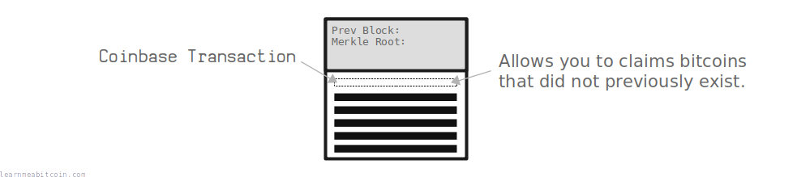](https://static.learnmeabitcoin.com/diagrams/png/mining-coinbase-transaction.png)


The coinbase transaction is the first transaction in a block.

So if you end up mining this block, you would be able to spend the bitcoins you claimed from the coinbase transaction *after* the block reaches 100 blocks deep in the [longest chain](/technical/blockchain/longest-chain/).

[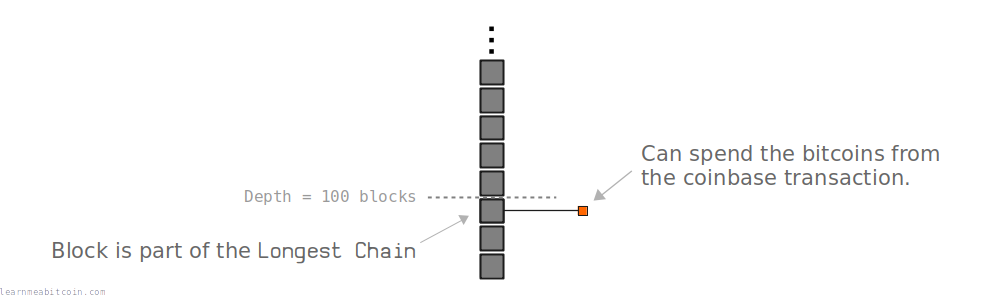](https://static.learnmeabitcoin.com/diagrams/png/mining-block-reward-longest-chain.png)

Therefore, this **block reward acts as an incentive** for miners to mine new blocks and continually try to extend the *longest* known chain of blocks.

[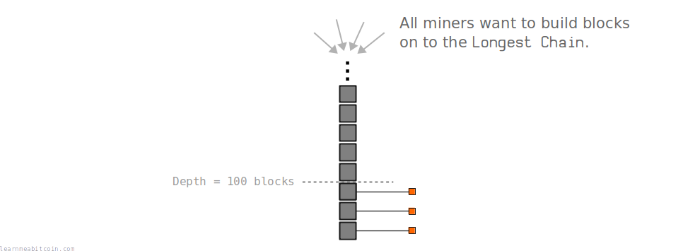](https://static.learnmeabitcoin.com/diagrams/png/mining-block-reward-longest-chain-building.png)

* **Sending bitcoins that did not previously exist is only allowed in the coinbase transaction.** This makes the coinbase transaction the source of all new bitcoins.
* **The presence of the block reward is why this process is called "mining".** However, from a technical point of view, mining is mainly concerned with adding new transactions to the blockchain.

## Interval

How long does it take to mine a block?

The mining system is designed so that one miner across the bitcoin network will successfully mine a new block **once every 10 minutes** (on average).

[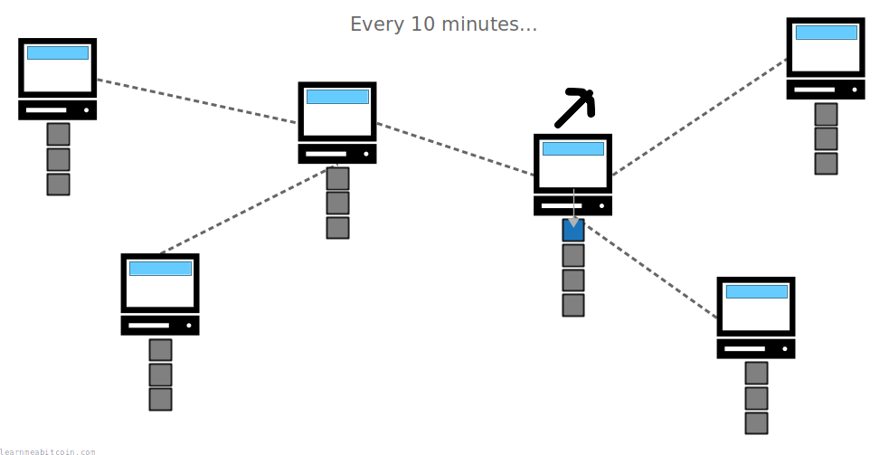](https://static.learnmeabitcoin.com/diagrams/png/mining-target-ten-minutes.png)

The timing is controlled by the [target](/technical/mining/target/), which is like a limbo pole that a block's hash has to get under for the block to be allowed on to the blockchain.

[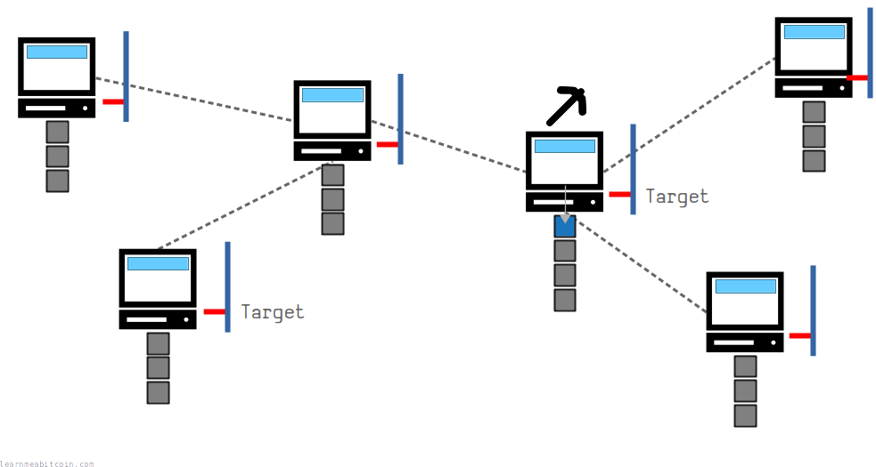](https://static.learnmeabitcoin.com/diagrams/png/mining-target-nodes.png)


Each node agrees upon the target value for the current height of the blockchain.

 Target Adjustment

Previous Adjustment
Current Target

0x

`0 bytes`


Time (seconds)

Actual

0d

Expected

0d

The target adjustment period is 2016 blocks. A block is mined on average every 600 seconds (10 minutes), so the expected time is 2016 \* 600 = 1209600 seconds.

Ratio

The *actual* time divided by the *expected* time. We multiply the current target by this ratio to get the new target.

New Target (Full Precision)

0x

New Target

0x

`0 bytes`

Note: This target value has been truncated slightly for storage in the bits field of the block header, and that's the target value that's actually used when mining.


0 secs

If blocks are mined faster than 10 minutes on average over a two-week period (e.g. because more miners join the network), the target will adjust downwards so that it becomes *more difficult* to mine a block, and so the average time between blocks reverts back to around 10 minutes.

[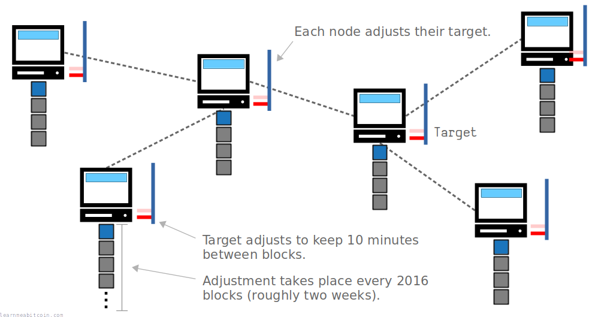](https://static.learnmeabitcoin.com/diagrams/png/mining-target-nodes-adjust.png)


Each node adjusts the target independently, but they will each calculate the *same target* if they have the *same chain of blocks*.

As a result, the target *regularly adjusts* to try and keep a regular interval of 10 minutes between newly-mined blocks. This enforces a **consistent rate of new blocks**, in addition to a consistent issuance of new bitcoins into the network.

## Purpose

Why do we use mining?

The mining system **allows computers across a network to resolve conflicts** without the need for a central computer to sort them out.

Bitcoin runs across a network of *independent* computers, so it's possible to create two conflicting transactions (sending the same bitcoins to different places) and insert them in to different nodes on the network at the same time. Some nodes will receive **transaction A** first, and other nodes will receive **transaction B** first.

[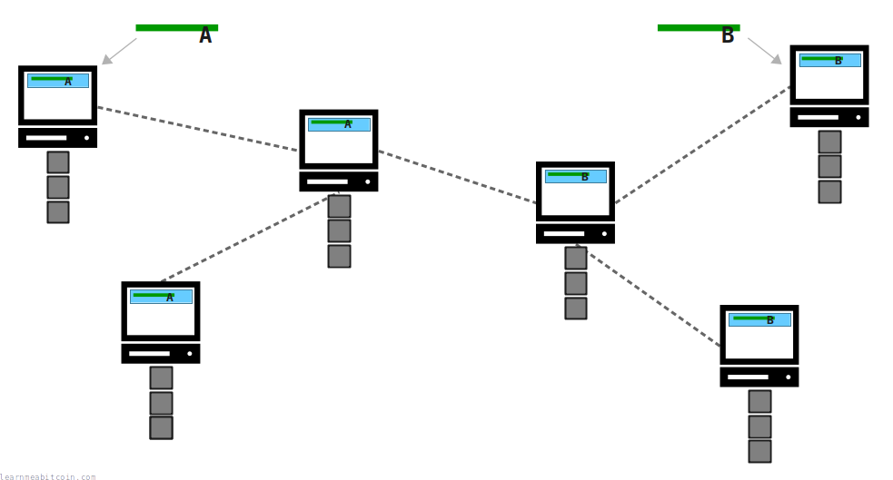](https://static.learnmeabitcoin.com/diagrams/png/mining-double-spend.png)


How can all the computers agree on which transaction should make it into the blockchain?

But thanks to the mechanism of mining, **only one of these transactions will make it into the blockchain**.

Eventually, one of the nodes on the network will mine a block of transactions from *their* memory pool, and broadcast this block to the rest of the network. When nodes receive this block, they will add it to their chain and **remove any conflicting transactions from their memory pool**.

[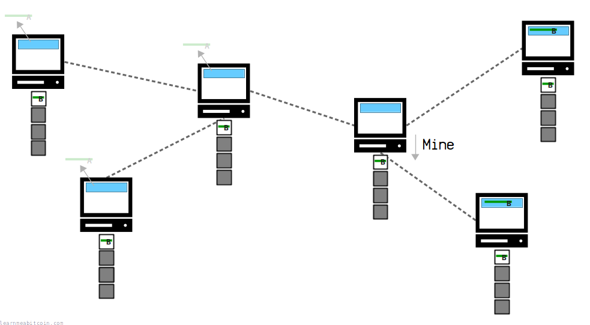](https://static.learnmeabitcoin.com/diagrams/png/mining-double-spend-resolved.png)

As a result, the process of mining acts as a sorting mechanism for transactions across a network of computers; the *mined* blocks have the final say on which transactions belong in the blockchain.

Better still, thanks to the fact that anyone can mine, no single node on the network is ever in complete control of which transactions make it into the blockchain.

**A single miner can control which transactions make it on to the blockchain if they can acquire a *majority* of the mining power.** This is known as a [51% attack](/technical/blockchain/51-attack/).

## Technical

How do you mine a block?

To mine a block, you start by constructing a [block header](/technical/block/#header) for your candidate block.

For example, here's what the block header for [block 100,000](/explorer/block/000000000003ba27aa200b1cecaad478d2b00432346c3f1f3986da1afd33e506) would have *started* out like:

```
0100000050120119172a610421a6c3011dd330d9df07b63616c2cc1f1cd00200000000006657a9252aacd5c0b2940996ecff952228c3067cc38d4885efb5a4ac4247e9f337221b4d4c86041b00000000
```

Now you've got a block header, you try and "mine" it by putting it through [HASH256](/technical/cryptography/hash-function/#hash256). You keep incrementing the [nonce](/technical/block/nonce/) value as you go to try and get a result below the [target](/technical/mining/target/).

 HASH256

Random Transaction Data

Random Block Header

Data (Hex)

`0 bytes`


SHA-256


SHA-256

HASH256

SHA-256(SHA-256(data))

`0 bytes`


0 secs

For example:

```
Nonce     Hash256
--------  -------
00000000: 5bd0d617b30a972407ad69a845cd74fb201d940cd45acc15fcd4761493bc3ae2
01000000: 6879c316d8a96269825111bb0616331307bb6677b2af55127922d8c568e4b2db
02000000: 34d69cb489442234ec54462e18262bf1a9c756a4e7909e68edf979a0cb39a3fa
03000000: 8cf5e032093cfcbf4f6b443608631dd33699fca13dcbd6118992f9d451b70dd8
04000000: a32d73e3f2fd0579c44080cb6b1717582d37b8f47a8445922dee0996b503c04c
05000000: 70b11dabc90a107918a55eff7e940d41b0ce1924aeed2f0b7ccb2d4ee60e1617
06000000: b38afc30567703629226557a7748bea449693156e0b116b03a8442ccc3b9005e
07000000: 2a6008f39daa1238388eadcab111c6b556c3d89a46558c98f8ed32746fb5d7b8
08000000: 248e33c82a744786e7e16336612221850e32f8e6cb09b2eb0b0730ac6beb71b4
09000000: a4aea05d2750e49e8f95f5608293f6b4f45bd34aee51e86893dd8c0230d19185
0a000000: ce2225a69a5bf2dbb25cbb27fda78a8c4c3ac5280ec7996426eeefeb0e5e1ecb
...
```

Eventually you may find a nonce value that produces a hash result below the target:

```
Nonce    Hash256
-------- -------
0f2b5710: 000000000003ba27aa200b1cecaad478d2b00432346c3f1f3986da1afd33e506
```

* The nonce is a 4-byte field in [little-endian](/technical/general/little-endian/) byte order.
* **The result of hashing the raw block header through HASH256 will appear to be *backwards* at first.** This is because block hashes are displayed in [reverse byte order](/technical/general/byte-order/#reverse-byte-order) on blockchain explorers.

 Reverse Bytes

Random Example

Bytes

`0 bytes`

Reversed

`0 bytes`


 Show Details


0 secs

## Code

Here's some Ruby code that shows how you can mine a block (like the one above).

The code is simpler than you might think. The only tricky part is getting the [block header](/technical/block/#header) data in the correct format before hashing it.

### Mining Simulator

```


copied


copied

require 'digest/sha2'

# -----------------
# Utility Functions
# -----------------

# The hash function used in mining (convert hexadecimal to binary first, then SHA256 twice)
def hash256(data)
  binary = [data].pack("H*")
  hash1 = Digest::SHA256.digest(binary)
  hash2 = Digest::SHA256.hexdigest(hash1)
end

# Convert a number to fit inside a field that is a specific number of bytes e.g. field(1, 4) = 00000001
def field(data, size)
  hex = data.to_i.to_s(16).rjust(size * 2, '0')
end

# Reverse the order of bytes (often happens when working with raw bitcoin data)
def reversebytes(data)
  data.scan(/../).reverse.join
end

# ------------
# Block Header (e.g. block 100,000)
# ------------

# Target (optional)
target = '000000000004864c000000000000000000000000000000000000000000000000'

# Block Header (Fields)
version    = '1'
prevblock  = '000000000002d01c1fccc21636b607dfd930d31d01c3a62104612a1719011250'
merkleroot = 'f3e94742aca4b5ef85488dc37c06c3282295ffec960994b2c0d5ac2a25a95766'
time       = '1293623863'  # Unixtime (29 Dec 2010, 11:57:43)
bits       = '1b04864c'
nonce      = 0             # 274148111

# Block Header (Serialized)
header = reversebytes(field(version, 4)) + reversebytes(prevblock) + reversebytes(merkleroot) + reversebytes(field(time, 4)) + reversebytes(bits)

# -----
# Mine!
# -----
loop do
  # hash the block header
  attempt = header + reversebytes(field(nonce, 4))
  result = reversebytes(hash256(attempt))

  # show result
  puts "#{nonce}: #{result}"

  # end if we get a block hash below the target
  if result.to_i(16) < target.to_i(16)
    break
  end
  
  # increment the nonce and try again...
  nonce += 1
end
```

## Commands

### `bitcoin-cli getblocktemplate`

This command grabs transactions from your node's [memory pool](/technical/mining/memory-pool/) and returns the data you need to start mining a new block.

Annoyingly, you also have to provide an awkward array to specify the kind of block template you want (see [BIP22](https://github.com/bitcoin/bips/blob/master/bip-0022.mediawiki)). This is what I typically use: `bitcoin-cli getblocktemplate '{"rules": ["segwit"]}'`

This command returns the key block header information like the `previous block`, `time`, and `bits`, but you will need to construct the [merkle root](/technical/block/merkle-root/) yourself.

### `bitcoin-cli submitblock [hex]`

Send a raw block into the network.

For example, this is the [genesis block](/explorer/block/000000000019d6689c085ae165831e934ff763ae46a2a6c172b3f1b60a8ce26f):

```
$ bitcoin-cli submitblock 0100000000000000000000000000000000000000000000000000000000000000000000003ba3edfd7a7b12b27ac72c3e67768f617fc81bc3888a51323a9fb8aa4b1e5e4a29ab5f49ffff001d1dac2b7c0101000000010000000000000000000000000000000000000000000000000000000000000000ffffffff4d04ffff001d0104455468652054696d65732030332f4a616e2f32303039204368616e63656c6c6f72206f6e206272696e6b206f66207365636f6e64206261696c6f757420666f722062616e6b73ffffffff0100f2052a01000000434104678afdb0fe5548271967f1a67130b7105cd6a828e03909a67962e0ea1f61deb649f6bc3f4cef38c4f35504e51ec112de5c384df7ba0b8d578a4c702b6bf11d5fac00000000
```

**This is a complete raw [block](/technical/block/).** It must include the block header, the transaction count, and all the raw transaction data.

### `bitcoin-cli getmininginfo`

This command returns some interesting mining information.

For example:

```
$ bitcoin-cli getmininginfo
{
    "blocks": 956472,
    "currentblockweight": 2150476,
    "currentblocktx": 1904,
    "bits": "17021a42",
    "difficulty": 133869853540305.4,
    "target": "000000000000000000021a420000000000000000000000000000000000000000",
    "networkhashps": 9.224574509210502e+20,
    "pooledtx": 1917,
    "chain": "main",
    "next": {
        "height": 956473,
        "bits": "17021a42",
        "difficulty": 133869853540305.4,
        "target": "000000000000000000021a420000000000000000000000000000000000000000"
    },
    "warnings": []
}
```

If you run `bitcoin-cli getblocktemplate` beforehand it will also show you how many transactions from the memory pool are currently being included in the next block (under `currentblocktx`).

## Resources

* [en.bitcoin.it/wiki/Proof\_of\_work](https://en.bitcoin.it/wiki/Proof_of_work)