# 挖矿总览 (Mining)


[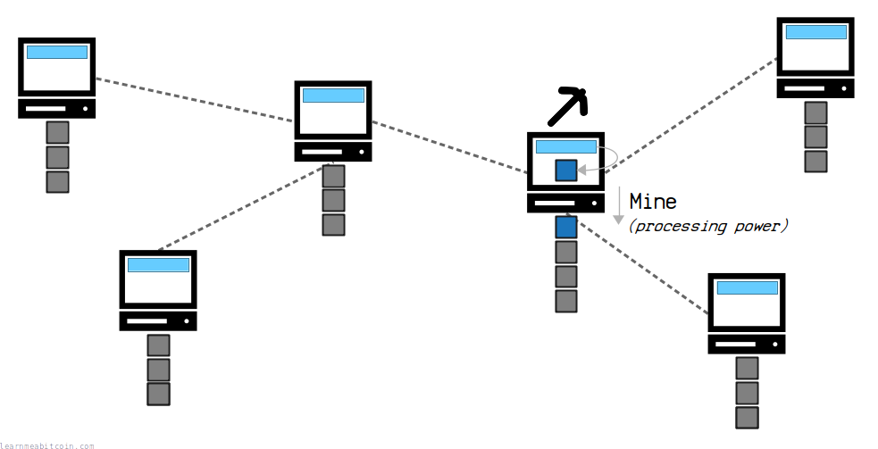](../images/diagrams_png_mining.png)

挖矿（Mining）是指尝试将一个包含[交易](transaction.md)的全新[区块](block.md)添加到[区块链](blockchain.md)上的过程。

这是一场**全网竞争**，网络上的任何[节点](networking/node.md)都可以*努力*尝试将下一个区块添加到链上。

当新区块被挖出时，它会被广播到整个网络，其中每个节点都会独立验证它并将其添加到自己的区块链中。

[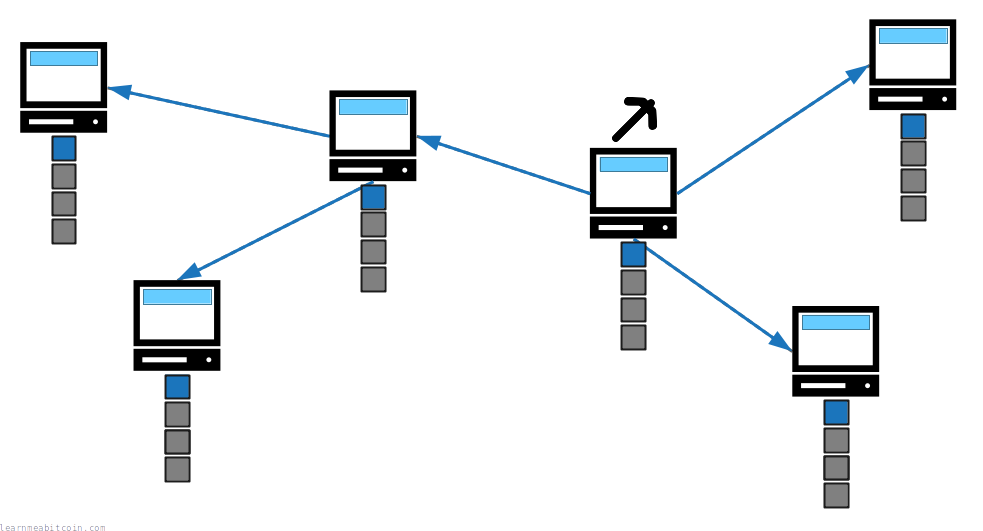](../images/diagrams_png_mining-broadcast.png)


节点会使用新区块更新它们的区块链。

添加新区块后，每个挖矿节点都会重新开始这个过程，尝试在链上的这个新区块*之上*进行构建。由此一来，得益于网络上各个节点的协作努力，区块链得以定期更新。

该系统被设计为平均**每 10 分钟**挖出一个新区块。

## 原理 (Method)

挖矿是如何运作的？

挖矿过程始于用你节点[内存池](mining/memory-pool.md)中的交易填充一个[候选区块](mining/candidate-block.md)。

这个候选区块就是我们将要尝试挖掘并添加到我们区块链上的内容（然后再发送给其他人，以便他们也可以将其添加到自己的区块链中）。

[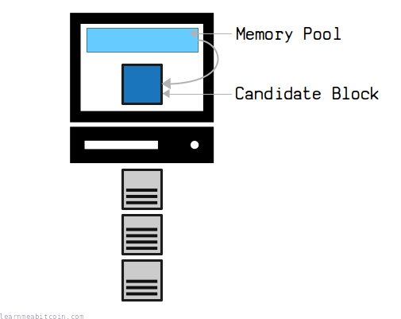](../images/diagrams_png_mining-candidate-block.png)


每个节点都会在其内存池中保留最新交易的副本。

接下来我们为这个候选区块构建一个[区块头](block.md#header)。这基本上是区块内所有数据的简短摘要，其中包括一个指向我们想要在其之上进行构建的区块链中*现有区块的引用*。

[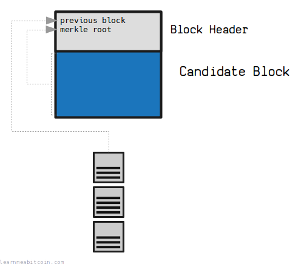](../images/diagrams_png_mining-block-header.png)


你可以通过[区块哈希](block/hash.md)引用前一个区块。区块中所有交易的摘要包含在[默克尔根](block/merkle-root.md)中。

| 字段 (Field) | 值 (Value) |
| --- | --- |
| 区块 (Block) | |
| 区块头（十六进制）(Block Header (Hex)) | `0 bytes` |
| 区块头字段<br>版本 (Block Header (Fields)<br>Version) | 0 |
| 前一个区块 (Previous Block) | |
| 默克尔根 (Merkle Root) | |
| 时间 (Time) | 0d |
| 难度目标 (Bits) | |
| 随机数 (Nonce) | 0d<br>+1 |
| 区块哈希 (Block Hash) | 这是十六进制区块头的 HASH256 结果。它还处于反向字节序状态，因为这正是区块浏览器显示区块哈希的方式。 |

现在我们准备开始*挖掘*这个区块了。

为了做到这一点，我们将这个区块的**区块头**放入 SHA-256 [哈希函数](cryptography/hash-function.md)计算*两次*（简称为 HASH256），并希望它得出的数字低于当前的[目标值](mining/target.md)。

[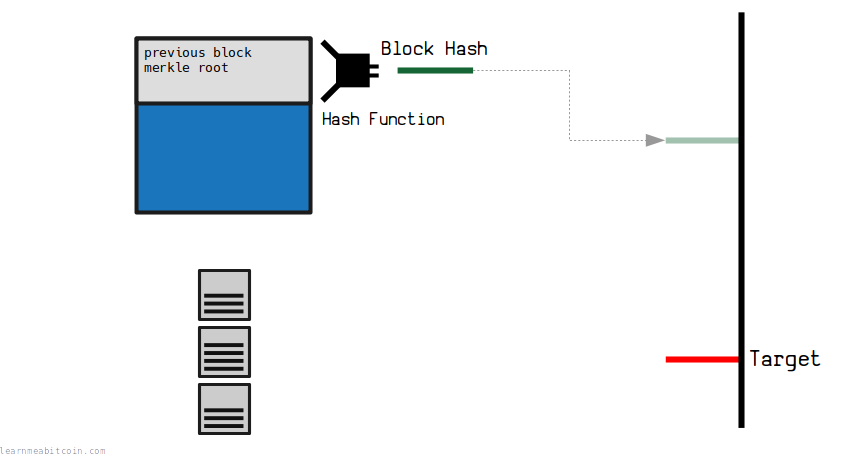](../images/diagrams_png_mining-block-header-hash.png)


目标值是你的区块哈希必须低于的数值，只有低于它才能将区块添加到区块链上。

| 字段 (Field) | 值 (Value) |
| --- | --- |
| 数据（十六进制）(Data (Hex)) | `0 bytes` |
| HASH256 | SHA-256(SHA-256(data))<br>`0 bytes` |

如果你区块头的哈希值*没有*低于目标值，你可以通过递增区块头中的[随机数 (nonce)](block/nonce.md) 字段来*继续尝试*。这允许你在保持相同的基本区块头的同时，获得一个完全不同的哈希结果。

[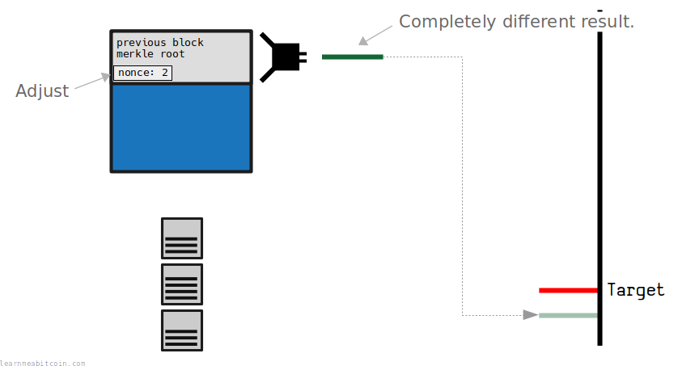](../images/diagrams_png_mining-block-header-hash-nonce.png)


挖矿过程基本上就是尽可能快地对区块头进行哈希计算，试图成为第一个获得足够低的计算结果的节点。

如果你足够幸运，你最终可能会得到一个低于当前目标值的区块哈希。

## 同步 (Synchronization)

节点如何更新它们的区块链？

如果某个矿工设法使其候选区块的区块哈希低于目标值，他们就会**将该区块广播到网络的其余部分**。

每个节点随后将确认该区块头的哈希值低于目标值，然后将这个“挖出”的区块添加到它们的区块链中。

[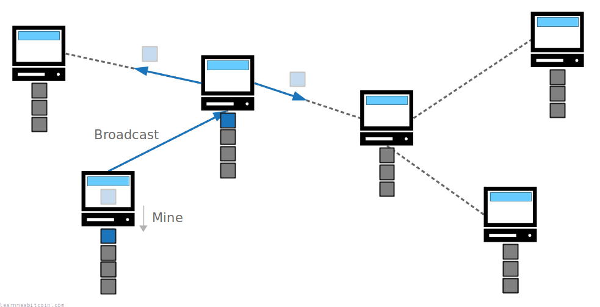](../images/diagrams_png_mining-block-broadcast.png)


恭喜，你刚刚将一个交易区块挖到了区块链上。

从这里开始，每个节点都将停止处理它们自己的候选区块，构建一个新的（使用其内存池中全新交易），并开始尝试在链上的这个新区块之上进行构建。

[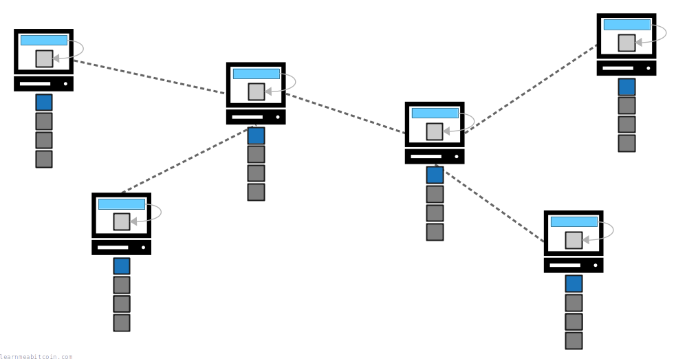](../images/diagrams_png_mining-block-broadcast-restart-mining.png)


矿工们开始尝试将下一批交易添加到链上。

结果是，矿工们不断独立（但协作地）工作，以新的交易区块扩展区块链。

## 工作量证明 (Proof of Work)

工作量证明意味着什么？

挖矿过程通常被称为**工作量证明 (proof of work)**。

“工作量证明”这个术语仅仅是指获得一个低于目标值的区块哈希需要花费*工作量 (work)*。而且如果你能做到，任何其他人都可以通过确认你构建的区块的哈希值确实低于目标值，来验证该工作确实已经被完成了。

换句话说，哈希函数被用作一种证明你已经在你的区块上执行了所需数量的“工作”的方式。

> 工作量证明涉及扫描一个值，该值在经过如 SHA-256 等哈希计算后，其哈希值以一定数量的零位开始。

中本聪 (Satoshi Nakamoto), [比特币白皮书 (Bitcoin Whitepaper)](/bitcoin.pdf)

## 矿工 (Miners)

谁能挖掘区块？

**任何**节点都可以尝试挖掘区块，并且每个节点都有*机会*成功。

这意味着我们有一个全网范围的竞争，网络上的任何节点都可能成为那个将下一批交易添加到区块链上的节点。

[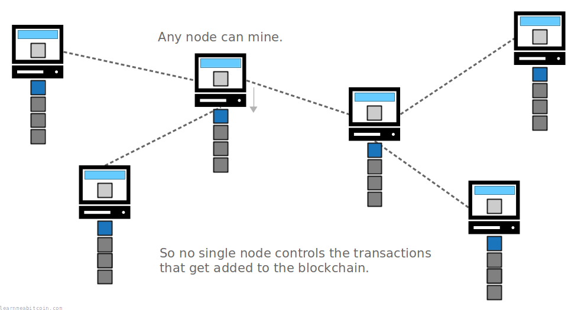](../images/diagrams_png_mining-competition.png)

然而，尽管任何人都可以尝试挖矿，但能够*尽可能快地*执行哈希计算会提高你成功挖掘下一个区块的机会。

[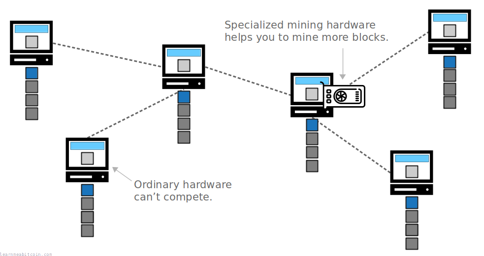](../images/diagrams_png_mining-competition-hardware.png)

> 任何人在任何时候找到解决方案的机会都与其 CPU 算力成正比。

中本聪 (Satoshi Nakamoto), [密码学邮件列表 (Cryptography Mailing List)](https://www.metzdowd.com/pipermail/cryptography/2008-November/014858.html)

结果是，拥有最多处理能力（或“算力”）的矿工比那些哈希速度较慢的人更有可能挖出区块。因此，即使任何人都可以挖矿，它也**偏向于那些拥有专用挖矿硬件**以及获得廉价电力来驱动该硬件的人。

但是，如果你想的话，依然没有什么能阻止你挖矿。

## [区块奖励](mining/block-reward.md) (Block Reward)

挖区块的动机是什么？

如果你能够挖出一个区块，你可以获得**区块奖励**。

要知道，当你构建一个候选区块时，你可以将你自己特殊的交易放在区块的顶部。这被称为[币基交易 (coinbase transaction)](mining/coinbase-transaction.md)，它允许你向自己发送一定数量的以前不存在的比特币。

[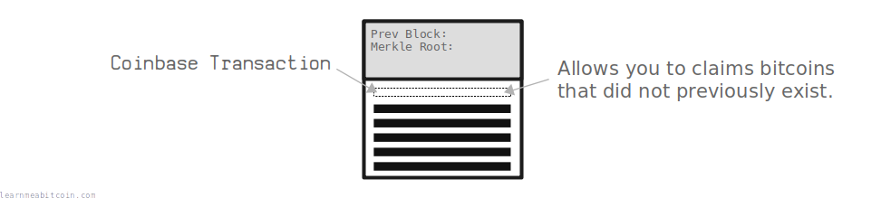](../images/diagrams_png_mining-coinbase-transaction.png)


币基交易是区块中的第一笔交易。

所以如果你最终挖出了这个区块，你将能够在该区块在[最长链 (longest chain)](blockchain/longest-chain.md) 中达到 100 个区块深度*之后*，花费你从币基交易中获得的比特币。

[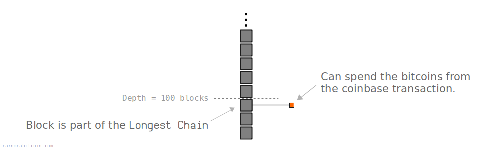](../images/diagrams_png_mining-block-reward-longest-chain.png)

因此，这个**区块奖励作为一种激励**，促使矿工挖掘新区块并不断尝试扩展已知的*最长*区块链。

[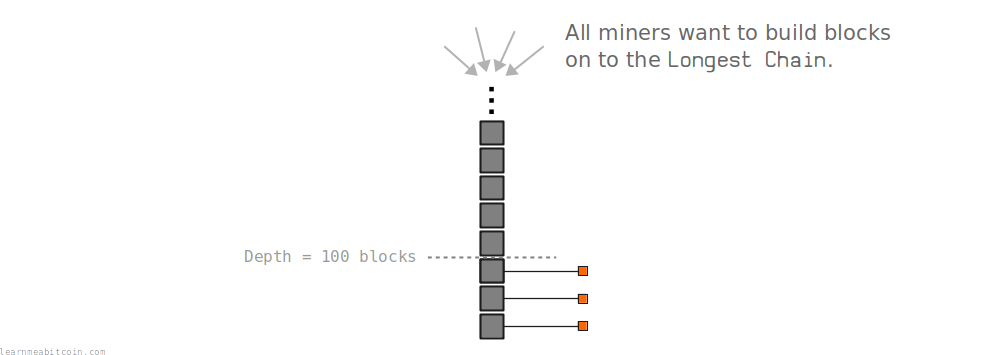](../images/diagrams_png_mining-block-reward-longest-chain-building.png)

* **发送以前不存在的比特币仅在币基交易中被允许。**这使得币基交易成为所有新比特币的来源。
* **区块奖励的存在是为什么这个过程被称为“挖矿”的原因。**然而，从技术的角度来看，挖矿主要关注的是将新的交易添加到区块链中。

## 间隔 (Interval)

挖出一个区块需要多长时间？

挖矿系统的设计使得比特币网络中平均**每 10 分钟**会有一名矿工成功挖出一个新区块。

[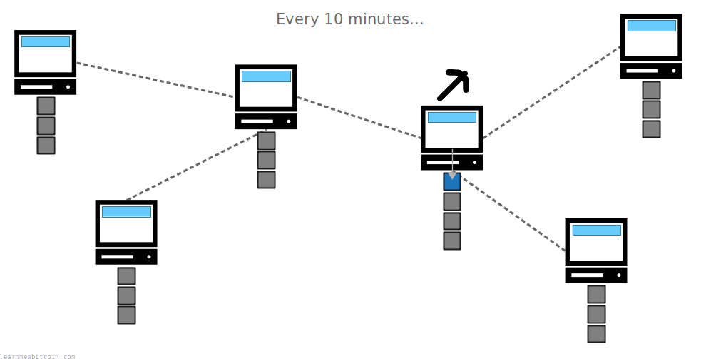](../images/diagrams_png_mining-target-ten-minutes.png)

时间是由[目标值 (target)](mining/target.md) 控制的，它就像一根限制杆，区块的哈希值必须低于它，该区块才被允许上链。

[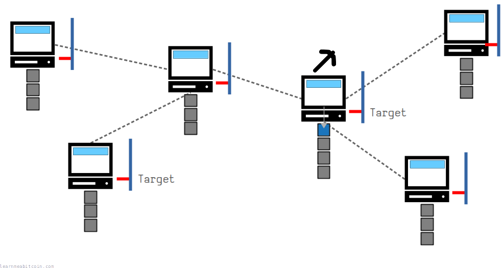](../images/diagrams_png_mining-target-nodes.png)


每个节点都同意当前区块链高度的目标值。

| 字段 (Field) | 值 (Value) |
| --- | --- |
| 当前目标值 (Current Target) | 0x<br>`0 bytes` |
| 实际时间（秒）(Time (seconds)<br>Actual) | 0d |
| 预期时间（秒）(Time (seconds)<br>Expected) | 0d<br><br>目标调整周期是 2016 个区块。平均每 600 秒（10分钟）挖出一个区块，所以预期时间是 2016 \* 600 = 1209600 秒。 |
| 比例 (Ratio) | *实际*时间除以*预期*时间。我们将当前目标值乘以这个比例来获得新的目标值。 |
| 新目标值（全精度）(New Target (Full Precision)) | 0x |
| 新目标值 (New Target) | 0x<br>`0 bytes`<br><br>注意：这个目标值被轻微截断以便存储在区块头的 bits 字段中，而这才是挖矿时实际使用的目标值。 |

如果在两周的时间内，挖出区块的速度平均快于 10 分钟（例如，因为更多矿工加入了网络），目标值将向下调整，以便挖掘区块变得*更加困难*，从而使区块之间的平均时间恢复到 10 分钟左右。

[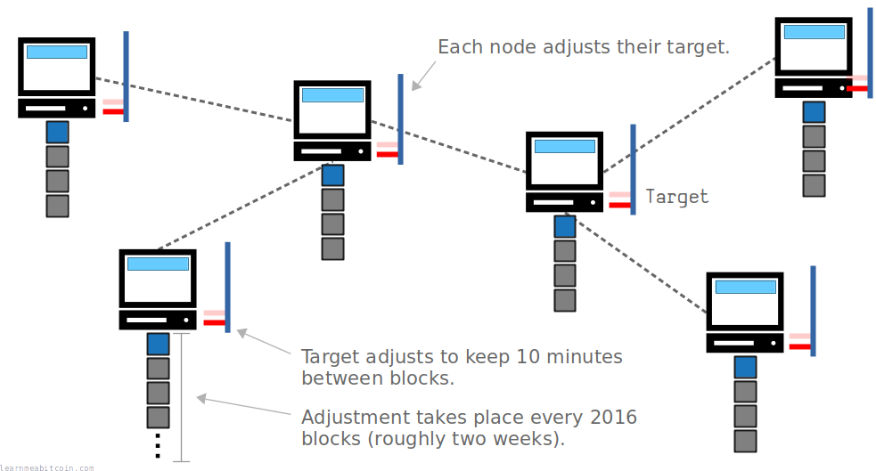](../images/diagrams_png_mining-target-nodes-adjust.png)


每个节点独立调整目标值，但如果它们拥有*相同的区块链*，它们都会计算出*相同的目标值*。

结果是，目标值会*定期调整*，以试图在最新挖出的区块之间保持 10 分钟的规律间隔。这确保了**稳定的新区块生成率**，并且也使得新比特币在网络中的发行速度保持稳定。

## 目的 (Purpose)

我们为什么要使用挖矿？

挖矿系统**允许整个网络中的计算机解决冲突**，而无需中央计算机来处理这些问题。

比特币运行在一个由*独立*计算机组成的网络上，因此有可能创建两笔冲突的交易（将相同的比特币发送到不同的地方），并同时将它们插入到网络上的不同节点中。有些节点会先收到**交易 A**，而其他节点会先收到**交易 B**。

[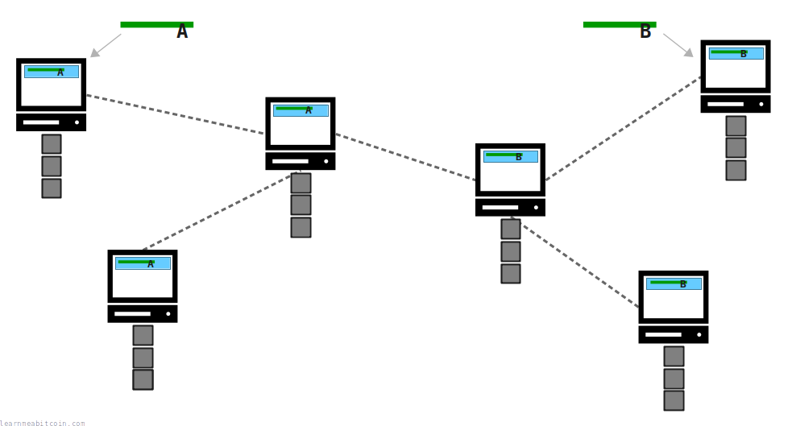](../images/diagrams_png_mining-double-spend.png)


所有计算机如何就哪笔交易应该进入区块链达成一致？

但得益于挖矿机制，**这些交易中只有一笔能够进入区块链**。

最终，网络上的其中一个节点将从*他们*的内存池中挖出一个包含交易的区块，并将这个区块广播给网络的其他部分。当节点接收到这个区块时，他们会将其添加到他们的链中，并**从内存池中移除任何冲突的交易**。

[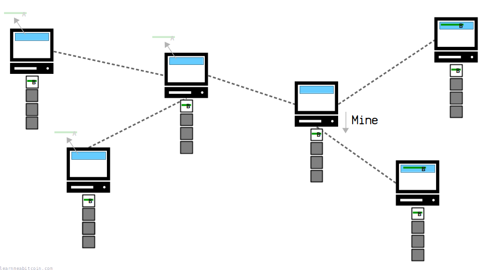](../images/diagrams_png_mining-double-spend-resolved.png)

因此，挖矿过程充当了整个计算机网络中交易的分类机制；*挖出*的区块对于哪些交易属于区块链拥有最终决定权。

更好的是，得益于任何人都可以挖矿的事实，网络上没有任何单个节点能够完全控制哪些交易进入区块链。

**如果单个矿工能够获得*大部分*算力，那么他们就可以控制哪些交易进入区块链。** 这被称为 [51% 攻击](blockchain/51-attack.md)。

## 技术层面 (Technical)

你如何挖掘一个区块？

为了挖掘一个区块，你要从为你的候选区块构建一个[区块头](block.md#header)开始。

例如，这里是[第 100,000 个区块](/explorer/block/000000000003ba27aa200b1cecaad478d2b00432346c3f1f3986da1afd33e506)的区块头起初看起来的样子：

```text
0100000050120119172a610421a6c3011dd330d9df07b63616c2cc1f1cd00200000000006657a9252aacd5c0b2940996ecff952228c3067cc38d4885efb5a4ac4247e9f337221b4d4c86041b00000000
```

现在你有了区块头，你尝试通过将其放入 [HASH256](cryptography/hash-function.md#hash256) 中来进行“挖掘”。随着过程的进行，你不断递增[随机数 (nonce)](block/nonce.md) 值，试图获得一个低于[目标值](mining/target.md)的结果。

| 字段 (Field) | 值 (Value) |
| --- | --- |
| 数据（十六进制）(Data (Hex)) | `0 bytes` |
| HASH256 | SHA-256(SHA-256(data))<br>`0 bytes` |

例如：

```text
Nonce     Hash256
--------  -------
00000000: 5bd0d617b30a972407ad69a845cd74fb201d940cd45acc15fcd4761493bc3ae2
01000000: 6879c316d8a96269825111bb0616331307bb6677b2af55127922d8c568e4b2db
02000000: 34d69cb489442234ec54462e18262bf1a9c756a4e7909e68edf979a0cb39a3fa
03000000: 8cf5e032093cfcbf4f6b443608631dd33699fca13dcbd6118992f9d451b70dd8
04000000: a32d73e3f2fd0579c44080cb6b1717582d37b8f47a8445922dee0996b503c04c
05000000: 70b11dabc90a107918a55eff7e940d41b0ce1924aeed2f0b7ccb2d4ee60e1617
06000000: b38afc30567703629226557a7748bea449693156e0b116b03a8442ccc3b9005e
07000000: 2a6008f39daa1238388eadcab111c6b556c3d89a46558c98f8ed32746fb5d7b8
08000000: 248e33c82a744786e7e16336612221850e32f8e6cb09b2eb0b0730ac6beb71b4
09000000: a4aea05d2750e49e8f95f5608293f6b4f45bd34aee51e86893dd8c0230d19185
0a000000: ce2225a69a5bf2dbb25cbb27fda78a8c4c3ac5280ec7996426eeefeb0e5e1ecb
...
```

最终，你可能会找到一个能产生低于目标值的哈希结果的随机数：

```text
Nonce    Hash256
-------- -------
0f2b5710: 000000000003ba27aa200b1cecaad478d2b00432346c3f1f3986da1afd33e506
```

* 随机数是一个采用[小端序 (little-endian)](general/little-endian.md) 字节顺序的 4 字节字段。
* **通过 HASH256 计算原始区块头所得的结果最初看起来是*倒序*的。** 这是因为在区块浏览器上，区块哈希是以[反向字节序 (reverse byte order)](general/byte-order.md#reverse-byte-order) 显示的。

| 字段 (Field) | 值 (Value) |
| --- | --- |
| 字节 (Bytes) | `0 bytes` |
| 反向 (Reversed) | `0 bytes` |

## 代码 (Code)

以下是一些展示你如何挖掘区块（类似上述区块）的 Ruby 代码。

代码比你想象的要简单。唯一棘手的部分是在进行哈希计算之前，使[区块头](block.md#header)数据呈正确格式。

### 挖矿模拟器 (Mining Simulator)

```
require 'digest/sha2'

# -----------------
# Utility Functions
# -----------------

# The hash function used in mining (convert hexadecimal to binary first, then SHA256 twice)
def hash256(data)
  binary = [data].pack("H*")
  hash1 = Digest::SHA256.digest(binary)
  hash2 = Digest::SHA256.hexdigest(hash1)
end

# Convert a number to fit inside a field that is a specific number of bytes e.g. field(1, 4) = 00000001
def field(data, size)
  hex = data.to_i.to_s(16).rjust(size * 2, '0')
end

# Reverse the order of bytes (often happens when working with raw bitcoin data)
def reversebytes(data)
  data.scan(/../).reverse.join
end

# ------------
# Block Header (e.g. block 100,000)
# ------------

# Target (optional)
target = '000000000004864c000000000000000000000000000000000000000000000000'

# Block Header (Fields)
version    = '1'
prevblock  = '000000000002d01c1fccc21636b607dfd930d31d01c3a62104612a1719011250'
merkleroot = 'f3e94742aca4b5ef85488dc37c06c3282295ffec960994b2c0d5ac2a25a95766'
time       = '1293623863'  # Unixtime (29 Dec 2010, 11:57:43)
bits       = '1b04864c'
nonce      = 0             # 274148111

# Block Header (Serialized)
header = reversebytes(field(version, 4)) + reversebytes(prevblock) + reversebytes(merkleroot) + reversebytes(field(time, 4)) + reversebytes(bits)

# -----
# Mine!
# -----
loop do
  # hash the block header
  attempt = header + reversebytes(field(nonce, 4))
  result = reversebytes(hash256(attempt))

  # show result
  puts "#{nonce}: #{result}"

  # end if we get a block hash below the target
  if result.to_i(16) < target.to_i(16)
    break
  end
  
  # increment the nonce and try again...
  nonce += 1
end
```

## 命令 (Commands)

### `bitcoin-cli getblocktemplate`

此命令会从你节点的[内存池](mining/memory-pool.md)中获取交易，并返回你开始挖掘新区块所需的数据。

令人烦恼的是，你还必须提供一个有些别扭的数组来指定你想要的区块模板的类型（请参阅 [BIP22](https://github.com/bitcoin/bips/blob/master/bip-0022.mediawiki)）。这是我通常使用的格式：`bitcoin-cli getblocktemplate '{"rules": ["segwit"]}'`

该命令返回如 `previous block`（前一个区块）、`time`（时间）和 `bits`（难度目标）等关键区块头信息，但你需要自己构建[默克尔根 (merkle root)](block/merkle-root.md)。

### `bitcoin-cli submitblock [hex]`

将一个原始区块发送到网络中。

例如，这是[创世区块 (genesis block)](/explorer/block/000000000019d6689c085ae165831e934ff763ae46a2a6c172b3f1b60a8ce26f)：

```
$ bitcoin-cli submitblock 0100000000000000000000000000000000000000000000000000000000000000000000003ba3edfd7a7b12b27ac72c3e67768f617fc81bc3888a51323a9fb8aa4b1e5e4a29ab5f49ffff001d1dac2b7c0101000000010000000000000000000000000000000000000000000000000000000000000000ffffffff4d04ffff001d0104455468652054696d65732030332f4a616e2f32303039204368616e63656c6c6f72206f6e206272696e6b206f66207365636f6e64206261696c6f757420666f722062616e6b73ffffffff0100f2052a01000000434104678afdb0fe5548271967f1a67130b7105cd6a828e03909a67962e0ea1f61deb649f6bc3f4cef38c4f35504e51ec112de5c384df7ba0b8d578a4c702b6bf11d5fac00000000
```

**这是一个完整的原始[区块](block.md)。** 它必须包括区块头、交易计数以及所有的原始交易数据。

### `bitcoin-cli getmininginfo`

此命令会返回一些有趣的挖矿信息。

例如：

```
$ bitcoin-cli getmininginfo
{
    "blocks": 956479,
    "currentblockweight": 3999974,
    "currentblocktx": 4392,
    "bits": "17021a42",
    "difficulty": 133869853540305.4,
    "target": "000000000000000000021a420000000000000000000000000000000000000000",
    "networkhashps": 9.351601354893779e+20,
    "pooledtx": 9571,
    "chain": "main",
    "next": {
        "height": 956480,
        "bits": "17021a42",
        "difficulty": 133869853540305.4,
        "target": "000000000000000000021a420000000000000000000000000000000000000000"
    },
    "warnings": []
}
```

如果你预先运行 `bitcoin-cli getblocktemplate`，它还会向你显示当前有多少内存池中的交易被包含在了下一个区块中（在 `currentblocktx` 下）。

## 资源 (Resources)

* [en.bitcoin.it/wiki/Proof\_of\_work](https://en.bitcoin.it/wiki/Proof_of_work)
