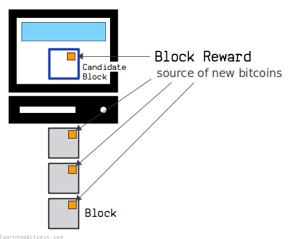
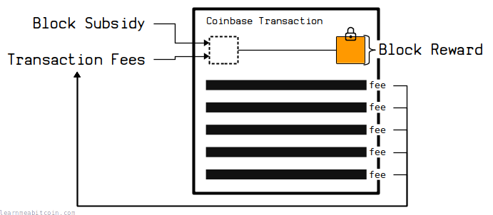
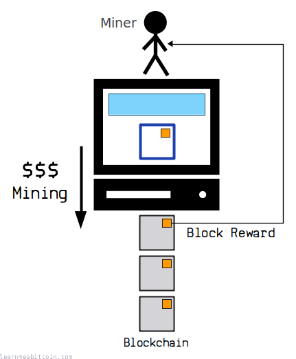
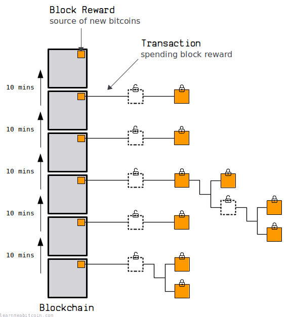

[](https://static.learnmeabitcoin.com/diagrams/png/mining-block-reward.png)

Most Recent Block Reward:

Height: [913,801](/explorer/913801#blockchain)

[3.1308941](/explorer/tx/7d78089b332d721ee9e960c61959c49cad3896cc2b6141846014fb9e5628ec66) BTC

Block Subsidy:    3.125 BTC

Transaction Fees: 0.0058941 BTC

The block reward is an amount of bitcoins that a miner can collect for [mining](/docs/technical/mining.md) a [block](/docs/technical/block.md).

It is claimed via a [coinbase transaction](/docs/technical/mining/coinbase-transaction.md), and provides an **incentive** for miners to mine new blocks on to the [blockchain](/docs/technical/blockchain.md).

## Source

Where does the block reward come from?

[](https://static.learnmeabitcoin.com/diagrams/png/mining-block-reward-source.png)

The block reward consists of two parts:

1. [Block Subsidy](#block-subsidy)
2. [Transaction Fees](#transaction-fees)

### 1. Block Subsidy

Current Block Subsidy:

3.125 BTC

Height: [913,801](/explorer/913801#blockchain)

The block subsidy is a set amount of **new bitcoins** that a miner is allowed to send themselves for mining a block.

The size of the block subsidy is based on the [height](/docs/technical/blockchain/height.md) of the block.

See [halving](#halving) section for a full table of past, current, and future block subsidies.

### 2. Transaction Fees

Most Recent Transaction Fees:

0.0058941 BTC

Height: [913,801](/explorer/913801#blockchain)

The block reward also consists of all the **fees** from the transactions included in the block.

A [transaction fee](/docs/technical/transaction/fee.md) is an amount of bitcoin that doesn't get "used up" in a transaction, and miners are able to claim these "leftover" bitcoins as part of the block reward too.

Miners fill their [candidate blocks](/docs/technical/mining/candidate-block.md) with transactions from the [memory pool](/docs/technical/mining/memory-pool.md) that contain the highest fees on them to maximize the amount of bitcoins they can claim from the block reward. Therefore, setting a high fee on a transaction acts as an incentive for miners to include your transaction in their next block.

> The incentive can also be funded with transaction fees. If the output value of a transaction is less than its input value, the difference is a transaction fee that is added to the incentive value of the block containing the transaction.

Satoshi Nakamoto, [Bitcoin Whitepaper](/bitcoin.pdf)

The block reward will be made up entirely of [transaction fees](/docs/technical/transaction/fee.md) when there's no more block subsidy left.

## Purpose

What is the purpose of the block reward?

The block reward serves two purposes:

### 1. Incentive

[](https://static.learnmeabitcoin.com/diagrams/png/mining-block-reward-incentive.png)

As already mentioned, the block reward provides an **incentive for miners to add new blocks on to the [blockchain](/docs/technical/blockchain.md)**.

It requires *energy* to try and mine new blocks on the blockchain, so the block reward compensates miners for the processing power they use during [mining](/docs/technical/mining.md).

And if the block reward is substantial enough, it encourages *more* miners to join the network to help build the blockchain, which in turn makes the blockchain even more secure (as it would require more energy for a single miner to attempt to rewrite the blockchain).

#### 51% Attacks

The block reward also helps to discourage against [51% attacks](/docs/technical/blockchain/51-attack.md).

If a miner can acquire a majority of the mining power, they have the *ability* to rewrite the blockchain, effectively allowing them to reverse transactions and "steal back" bitcoins from previous transactions they have made.

However, due to the existence of the block reward, we can assume that it would be more profitable to continue mining blocks and claiming block rewards than it would be to attempt to steal bitcoins by reversing transactions.

So the block reward doesn't *prevent* a miner from performing a 51% attack, but it does discourage them from undermining the integrity of the system in favor of just claiming the block reward instead.

### 2. Distribution

[](https://static.learnmeabitcoin.com/diagrams/png/mining-block-reward-distribution.png)

The block reward (well, the *block subsidy*) is used to **distribute new bitcoins into the network**.

Bitcoin is a decentralized currency, which means there's no central "bank" to control the amount of new bitcoins that enter the network, or who they get sent to. Therefore, new bitcoins enter the network via the mining process, which means that new bitcoins are issued are *regular intervals*, and *any miner* can be in with a chance of claiming them.

> The [block subsidy] provides a way to initially distribute coins into circulation, since there is no central authority to issue them.

Satoshi Nakamoto, [Bitcoin Whitepaper](/bitcoin.pdf)

## Halving

What is "the halvening"?

The block subsidy started at **50 BTC**, and it **halves every 210,000 blocks** (roughly every 4 years).

This creates a *fixed supply* of bitcoin, where the issuance of new coins diminishes over time until it reaches zero.

### Table

This table shows the dates and amounts for previous and upcoming Bitcoin halvings. The current block subsidy is highlighted.

Current Height: 956,479

| Halving | Height | Subsidy (BTC) | Date | Total Mined (BTC) |
| --- | --- | --- | --- | --- |
| 0 | [0](/explorer/0#blockchain) | 50.00000000 | 03 Jan 2009, 18:15:05 | 0.00000000 |
| 1 | [210,000](/explorer/210000#blockchain) | 25.00000000 | 28 Nov 2012, 15:24:38 | 10,500,000.00000000 |
| 2 | [420,000](/explorer/420000#blockchain) | 12.50000000 | 09 Jul 2016, 16:46:13 | 15,750,000.00000000 |
| 3 | [630,000](/explorer/630000#blockchain) | 6.25000000 | 11 May 2020, 19:23:43 | 18,375,000.00000000 |
| 4 | [840,000](/explorer/840000#blockchain) | 3.12500000 | 20 Apr 2024, 00:09:27 | 19,687,500.00000000 |
| 5 | 1,050,000 | 1.56250000 | 12 Apr 2028 (estimate) | 20,343,750.00000000 |
| 6 | 1,260,000 | 0.78125000 | 10 Apr 2032 (estimate) | 20,671,875.00000000 |
| 7 | 1,470,000 | 0.39062500 | 07 Apr 2036 (estimate) | 20,835,937.50000000 |
| 8 | 1,680,000 | 0.19531250 | 04 Apr 2040 (estimate) | 20,917,968.75000000 |
| 9 | 1,890,000 | 0.09765625 | 02 Apr 2044 (estimate) | 20,958,984.37500000 |
| 10 | 2,100,000 | 0.04882812 | 30 Mar 2048 (estimate) | 20,979,492.18750000 |
| 11 | 2,310,000 | 0.02441406 | 27 Mar 2052 (estimate) | 20,989,746.09270000 |
| 12 | 2,520,000 | 0.01220703 | 25 Mar 2056 (estimate) | 20,994,873.04530000 |
| 13 | 2,730,000 | 0.00610351 | 22 Mar 2060 (estimate) | 20,997,436.52160000 |
| 14 | 2,940,000 | 0.00305175 | 19 Mar 2064 (estimate) | 20,998,718.25870000 |
| 15 | 3,150,000 | 0.00152587 | 17 Mar 2068 (estimate) | 20,999,359.12620000 |
| 16 | 3,360,000 | 0.00076293 | 14 Mar 2072 (estimate) | 20,999,679.55890000 |
| 17 | 3,570,000 | 0.00038146 | 11 Mar 2076 (estimate) | 20,999,839.77420000 |
| 18 | 3,780,000 | 0.00019073 | 09 Mar 2080 (estimate) | 20,999,919.88080000 |
| 19 | 3,990,000 | 0.00009536 | 06 Mar 2084 (estimate) | 20,999,959.93410000 |
| 20 | 4,200,000 | 0.00004768 | 03 Mar 2088 (estimate) | 20,999,979.95970000 |
| 21 | 4,410,000 | 0.00002384 | 01 Mar 2092 (estimate) | 20,999,989.97250000 |
| 22 | 4,620,000 | 0.00001192 | 27 Feb 2096 (estimate) | 20,999,994.97890000 |
| 23 | 4,830,000 | 0.00000596 | 24 Feb 2100 (estimate) | 20,999,997.48210000 |
| 24 | 5,040,000 | 0.00000298 | 23 Feb 2104 (estimate) | 20,999,998.73370000 |
| 25 | 5,250,000 | 0.00000149 | 20 Feb 2108 (estimate) | 20,999,999.35950000 |
| 26 | 5,460,000 | 0.00000074 | 17 Feb 2112 (estimate) | 20,999,999.67240000 |
| 27 | 5,670,000 | 0.00000037 | 15 Feb 2116 (estimate) | 20,999,999.82780000 |
| 28 | 5,880,000 | 0.00000018 | 12 Feb 2120 (estimate) | 20,999,999.90550000 |
| 29 | 6,090,000 | 0.00000009 | 09 Feb 2124 (estimate) | 20,999,999.94330000 |
| 30 | 6,300,000 | 0.00000004 | 07 Feb 2128 (estimate) | 20,999,999.96220000 |
| 31 | 6,510,000 | 0.00000002 | 04 Feb 2132 (estimate) | 20,999,999.97060000 |
| 32 | 6,720,000 | 0.00000001 | 01 Feb 2136 (estimate) | 20,999,999.97480000 |
| 33 | 6,930,000 | 0.00000000 | 30 Jan 2140 (estimate) | 20,999,999.97690000 |

Total Supply: 20,999,999.9769 BTC

### Code

Here's some simple Ruby code for calculating the block subsidy based on block height.

```
# function for calculating the subsidy for a given height (in satoshis)
def subsidy(height) 
  # calculate how many halvings there have been based on the height
  halvings = height / 210000 # halving is every 210,000 blocks

  # set the starting block subsidy
  subsidy_initial = 5000000000 # 50 BTC in satoshis

  # calculate the current block subsidy based on the height
  subsidy_current = subsidy_initial >> halvings # bit shift right for every halving
  # TIP: A right bit shift is a quick and easy way to divide by 2 (rounded down)

  return subsidy_current
end

# get block subsidy for a specific height
puts subsidy(300000) #=> 250000000 sats
```

The actual code for the halving can be found in [validation.cpp](https://github.com/bitcoin/bitcoin/blob/master/src/validation.cpp) (search for `GetBlockSubsidy`)

#### Bit Shift

The halving is actually a **right [bit shift](https://www.interviewcake.com/concept/java/bit-shift).**

This is pretty much the same as *dividing by 2*, except the result of division is *rounded down* if the starting number is odd.

You can see what I mean by entering 5000000000 (the initial block subsidy in satoshis) into the *decimal* field of the number converter tool below, and then removing the rightmost bits from the *binary* field (which is equivalent to performing a right bit shift):

 Number Converter

Binary (Base 2)

0b

`0 digits`

Decimal (Base 10)

0d

`0 digits`

Hexadecimal (Base 16)

0x

`0 digits`


+1


0 secs

So instead of calling it "the bitcoin halving", it could more affectionately be referred to as "[the bitshift righting](https://www.reddit.com/r/Bitcoin/comments/173ljh7/the_halving_aka_the_bitshift_righting/)".

## Examples

Here are a few examples of block rewards from previous blocks in the blockchain:

* Height: [100](/explorer/100#blockchain)
* Block Reward: [50 BTC](/explorer/tx/2d05f0c9c3e1c226e63b5fac240137687544cf631cd616fd34fd188fc9020866)
  + Block Subsidy: 50 BTC
  + Transaction Fees: 0 BTC
* This is one of the earliest blocks. It claimed the maximum 50 BTC block subsidy, but there were no transactions included in the block (other than the coinbase transaction), so no transaction fees could be claimed on top of the block subsidy.

* Height: [2,817](/explorer/2817#blockchain)
* Block Reward: [52.01 BTC](/explorer/tx/e958faf790304fc4185b377552e93fddae3a513c255f8bb09526b5886ab83936)
  + Block Subsidy: 50 BTC
  + Transaction Fees: 2.01 BTC
* This was the **first block that collected transaction fees** as part of the block reward. It was completely unnecessary for the transactions in this block to pay fees, but nonetheless it's the first example of a miner collecting fees along with the block subsidy.

* Height: [100,000](/explorer/100000#blockchain)
* Block Reward: [50 BTC](/explorer/tx/8c14f0db3df150123e6f3dbbf30f8b955a8249b62ac1d1ff16284aefa3d06d87)
  + Block Subsidy: 50 BTC
  + Transaction Fees: 0 BTC
* This block contains 3 transactions (not including the coinbase transaction). However, there wasn't much competition to get into a block during this time, so transactions didn't need to include a fee to get mined.

* Height: [124,724](/explorer/124724#blockchain)
* Block Reward: [49.99999999 BTC](/explorer/tx/5d80a29be1609db91658b401f85921a86ab4755969729b65257651bb9fd2c10d)
  + Block Subsidy: 50 BTC
  + Transaction Fees: 0.01 BTC
* This is an example of a block **not claiming the full block reward**. This particular block did not claim the maximum available subsidy of 50 BTC, nor did it claim the transaction fee of 0.01 BTC also available.

  So it's perfectly valid for a miner to *not* claim the full block reward within their coinbase transaction, although this is usually due to an error on the miner's part.

* Height: [210,000](/explorer/210000#blockchain)
* Block Reward: [38.56295554 BTC](/explorer/tx/76a30f7eefb41cd01733b23218faea8a1a1a2f6bbf1a2c11e4bc77f62c8e7ce9)
  + Block Subsidy: 25 BTC
  + Transaction Fees: 13.56295554 BTC
* This was the **first halving** block. The block subsidy was halved from 50 BTC to 25 BTC.

* Height: [788,695](/explorer/788695#blockchain)
* Block Reward: [12.95074657 BTC](/explorer/tx/8174154423ceb97ead7356b8fd2109795edda6444a0e76f13526d2ad9f895e37)
  + Block Subsidy: 6.25 BTC
  + Transaction Fees: 6.70074657 BTC
* This was the first block where the size of the **transaction fees was greater than the block subsidy**.

## Spending

When can you spend the block reward?

The block reward can only be spent by a miner when the block reaches over **100 blocks deep** in the blockchain.

See [coinbase maturity](/docs/technical/mining/coinbase-transaction.md#coinbase-maturity).

## Notes

* **A miner does not *have* to claim the block reward.** There's no reason why they wouldn't, but there's nothing stopping a miner from not claiming the full block reward if they don't want to. In this situation the bitcoins would be lost forever, as there would be no way to spend those bitcoins in a future transaction. For example, the block reward for block [501,726](/explorer/block/0000000000000000004b27f9ee7ba33d6f048f684aaeb0eea4befd80f1701126) was 12.5 BTC, but the miner didn't send themselves any bitcoin in the [coinbase transaction for that block](/explorer/tx/9bf8853b3a823bbfa1e54017ae11a9e1f4d08a854dcce9f24e08114f2c921182), so those bitcoins are lost forever. This was most likely a mistake.
* **The *block subsidy* is often mistakenly referred to as the "block reward".** It's common to see the new bitcoins referred to as the "block reward", but technically speaking the block reward is made up of the *block subsidy* (the new bitcoins) + *transactions fees*. I don't think it's going to cause you any problems if you get it wrong, but I just thought I'd mention as I've made this mistake in the past.
* **The term "block reward" was not used in the whitepaper.** Satoshi only referred to the mining reward as being an *incentive*, and didn't use the term "block reward" until [over a year later on the bitcointalk forums](https://satoshi.nakamotoinstitute.org/posts/bitcointalk/441/). Just a fun fact for your next pub quiz.
* **The total supply of bitcoin is 20,999,999.9769 BTC.** So it's technically less than the "21 million cap" you keep hearing about. This is due in part to the fact that the halving is a right bit shift, which means that the block subsidy gets rounded down if the previous block subsidy was an odd number. Again, another great night at the pub quiz.