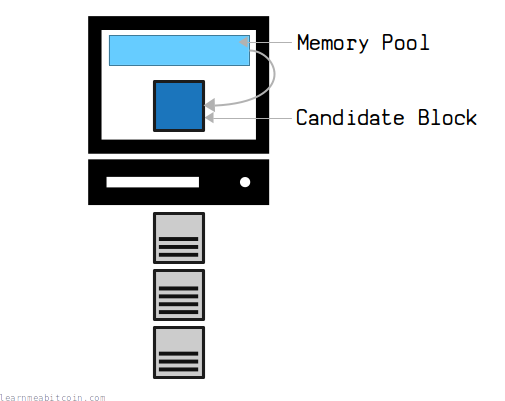
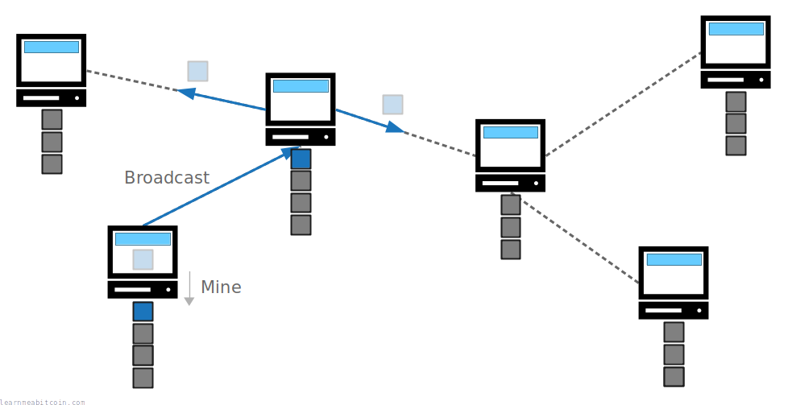
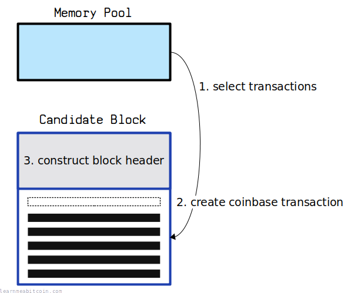
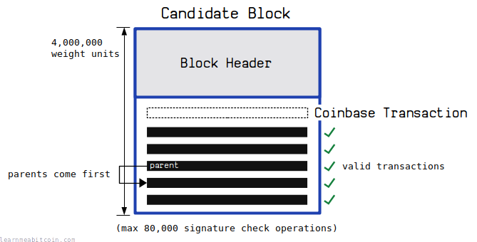
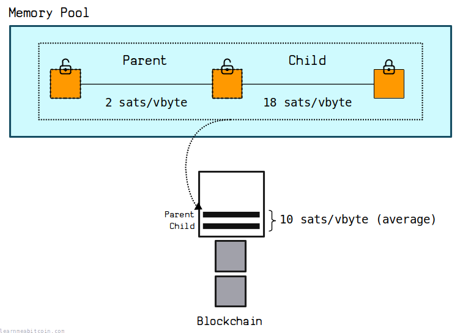
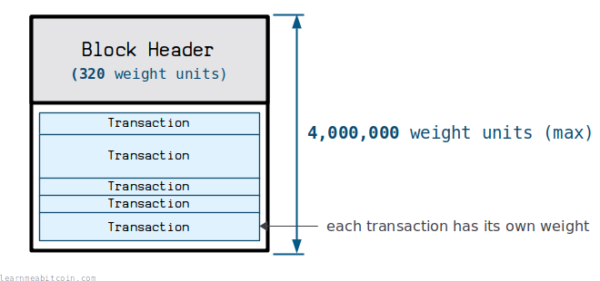
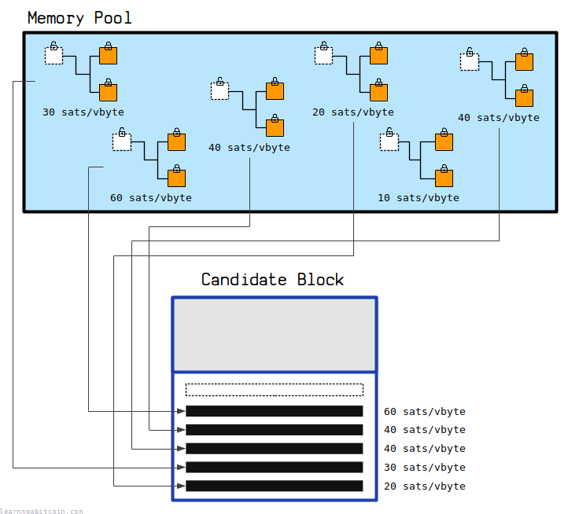
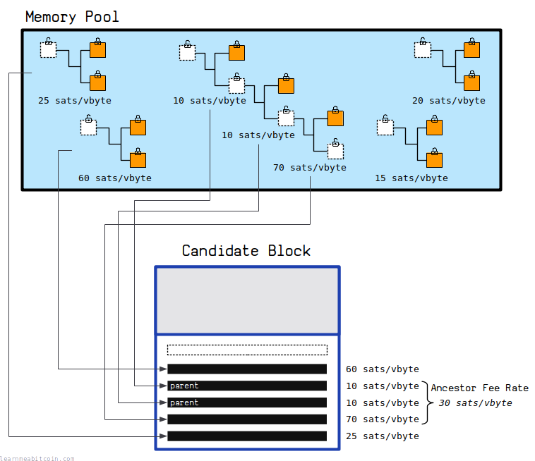
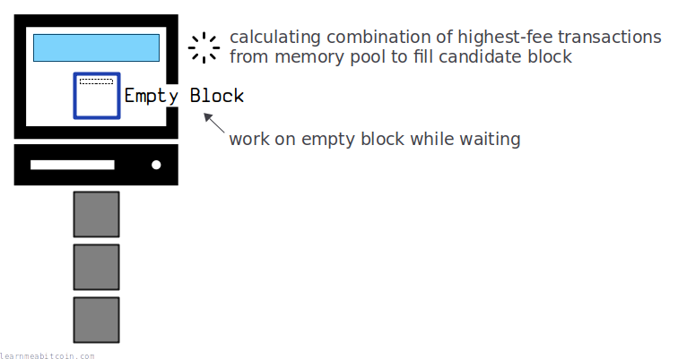

候选区块是**矿工试图添加到[区块链](../blockchain.md)中的[交易](../transaction.md)[区块](../block.md)**。

在[挖矿](/)过程中，每个矿工都会从他们的[内存池](memory-pool.md)中收集交易到一个*候选区块*中。然后，他们会反复对该区块进行[哈希](../cryptography/hash-function.md)运算，以试图获得一个低于[目标值](target.md)的[区块哈希](../block/hash.md)。

如果矿工能够获得低于目标值的区块哈希，他们的候选区块就可以被添加到区块链上。

然后，他们会将这个“已开采”的候选区块广播给网络上的其他[节点](../networking/node.md)，每个节点都将对其进行验证并将其添加到自己的区块链中。

换句话说，候选区块*代表*要添加到区块链上的**下一个交易区块**。

## 示例

当前的候选区块长什么样？

根据我的[本地节点](/explorer/)，*当前*的候选区块如下所示：

### 区块头 

|  |  |
| --- | --- |
| [Version](../block/version.md) | 0x20000000 |
| [Previous Block](../block/previous-block.md) | 000000000000000000005af9d7cca01756b552b02e5f5fac6422864439807264 |
| [Merkle Root](../block/merkle-root.md) | `349eb7d418b9962eca5b279cf2c458e89d6fabde2e927be9cbc63d0ba291a560` |
| [Time](../block/time.md) | 03 Jul 2026, 10:13:01 |
| [Bits](../block/bits.md) | `17021a42` |
| [Nonce](../block/nonce.md) | 0 |

### 交易

显示交易 

* **我并没有积极尝试去开采这个区块。** 如果我正在开采，我会调整区块头中的 [Nonce](../block/nonce.md)，以试图获得低于当前目标值的区块哈希。
* 我也没有在这个候选区块中放入我自己的 [Coinbase](coinbase-transaction.md) 交易，所以即使我开采了它，它也是无效的。这个示例只是为了向你展示当前候选区块的样子。
* 如果 [Merkle Root](../block/merkle-root.md) 改变了，你就知道区块中的交易已经改变了。
* 候选区块底部较低手续费的交易更有可能发生变化。

## 构建

如何构建候选区块？

构建候选区块有三个基本步骤：

### 1. 选择交易

第一步是**从内存池中[选择交易](#transaction-selection)**，你想把这些交易包含在你的候选区块中。

矿工通常会用手续费最高的交易填充他们的候选区块，以最大化他们可以从[区块奖励](block-reward.md)中索取的金额。

### 2. 构建 Coinbase 交易

[Coinbase](coinbase-transaction.md) 交易是区块中的第一笔交易，矿工用它来索取[区块奖励](block-reward.md)。

在选择交易*之后*构建 Coinbase 交易的原因是，它需要包含一个[见证根哈希](../transaction/wtxid.md#commitment)，该哈希是根据区块中已包含的交易计算出来的。

### 3. 构建区块头

[区块头](../block.md#header)是总结区块内所有数据的小量元数据。这是矿工在尝试[挖掘](../mining.md)候选区块时将对其进行哈希运算的内容。

区块头包含六个不同的字段（[version](../block/version.md)、[previous block](../block/previous-block.md)、[merkle root](../block/merkle-root.md)、[time](../block/time.md)、[bits](../block/bits.md)、[nonce](../block/nonce.md)），但以下这两个最为相关：

* **Previous Block:** 此字段用于指定候选区块将构建在其之上的现有区块。矿工总是希望构建在区块链的*顶端*之上，因为只有当他们开采的区块最终成为[最长链](../blockchain/longest-chain.md)的一部分时，他们才能索取区块奖励。
* **Merkle Root:** Merkle Root 是区块中包含的所有交易的指纹。这重要，因为这意味着如果不更改指纹就无法更改区块的内容。所以，这就是为什么我们在为候选区块选择交易*之后*才构建区块头的原因。

 区块头

随机示例

区块:

区块头 (Hex)

`0 bytes`

区块头 (Fields)

Version

0

0

0

0

0

0

0

0

0

0

0

0

0

0

0

0

0

0

0

0

0

0

0

0

0

0

0

0

0

0

0

0

Previous Block:
Merkle Root
Time

0d

Bits
Nonce

0d

+1

区块哈希

这是十六进制区块头的 HASH256。它也是以反向字节序排列的，因为区块浏览器就是这样显示区块哈希的。

0 secs

到此，候选区块的构建就完成了。

从这里开始，矿工现在可以开始致力于[挖矿](../mining.md)候选区块，以试图将其添加到[区块链](../blockchain.md)中。

## 要求

候选区块有哪些要求？

候选区块有一些基本要求：

### 1. Coinbase 交易

候选区块中的**第一笔交易**必须是 [Coinbase](coinbase-transaction.md) 交易。

这笔交易由矿工放入区块中以索取[区块奖励](block-reward.md)。

这意味着所有区块将始终包含**至少*一笔*交易**。

### 2. 有效交易

矿工在其候选区块中包含的所有交易**必须有效**。

例如，每笔交易只能花费已经存在的硬币。

如果矿工开采了一个包含无效交易的区块并将其广播到网络，所有的节点都会拒绝它，并且他们开采该区块的所有努力都将付诸东流。

### 3. 交易父项

交易的父项必须始终在子交易*之前*出现。

例如，如果一个交易的[祖先](memory-pool.md#ancestors)目前在内存池中，这些祖先必须被包含在**候选区块中它的上方**。

每个节点自*顶向下*验证区块中的交易，因此如果你在子项*之后*包含父项，那么该子交易看起来就像是在花费尚不存在的[输出](../transaction/output.md)（因此将是无效的）。

### 4. 大小限制

区块的最大大小为 **4,000,000 [重量](../transaction/size.md#weight)单位**。

因此，你在候选区块中包含 the 交易（包括区块头的大小和交易数量）必须在此大小限制之内。

区块大小限制可以在 [consensus.h](https://github.com/bitcoin/bitcoin/blob/master/src/consensus/consensus.h) 中找到。

### 5. 签名操作

一个区块最多限制为 **80,000 个[签名](../keys/signature.md)检查操作**。因此，你在候选区块中包含的交易必须在此限制之内。

这是因为[签名验证](../cryptography/elliptic-curve/ecdsa.md#verify)非常耗时，因此该限制可防止矿工创建验证速度异常缓慢的区块。

签名检查操作由 [Script](../script.md) Opcode 执行，例如：`OP_CHECKSIG`, `OP_CHECKMULTISIG`, `OP_CHECKSIGVERIFY`, `OP_CHECKMULTISIGVERIFY`

* 签名操作限制也可以在 [consensus.h](https://github.com/bitcoin/bitcoin/blob/master/src/consensus/consensus.h) 中找到。
* [Segregated Witness](../upgrades/segregated-witness.md): 类似于[旧版交易](../transaction.md#example-legacy)中的字节乘以 4 来计算其等效重量一样，旧版交易中的签名操作计数也**乘以 4**。因此，当单个 `OP_CHECKSIG` 在 [Witness](../transaction/witness.md) 字段中时算作 1 个签名操作（符合预期），而当它在 [ScriptSig](../transaction/input/scriptsig.md) 中时实际上算作 4 个签名操作（参见 [validation.cpp](https://github.com/bitcoin/bitcoin/blob/master/src/validation.cpp)）。

## 交易选择

矿工如何为其候选区块选择交易？

矿工可以用他们喜欢的来自[内存池](memory-pool.md)的**任何交易**来填充他们的候选区块。

然而，矿工通常会寻找可用手续费最高的交易来填充他们的候选区块，以最大化他们可以从[区块奖励](block-reward.md)中索取的金额。

$$因此，如果内存池中的交易多于候选区块所能容纳的交易，矿工将**优先选择手续费最高的交易**放入其区块中。$$

### 祖先费率

矿工在选择交易时必须遵循一条重要规则：

只有在先包含交易的所有父项的情况下，才能在区块中包含该交易。

因此，如果内存池交易具有[祖先](memory-pool.md#ancestors)，矿工将计算**[祖先费率](memory-pool.md#ancestor-feerate)**，以算出与没有祖先的其他交易相比，是否值得包含该交易。

当内存池中有祖先时，选择最佳交易组合的过程是复杂的，而在最大化手续费方面获得“完美”区块的唯一方法是尝试*所有可能的组合*。因此，大多数矿工都会尽力构建包含高额手续费交易的区块，而不会每次都浪费时间尝试计算“完美”的区块。

## 空区块

为什么矿工会挖掘没有交易的空区块？

你有时会发现区块链中出现只有*一笔*交易的“空区块”。

例如，区块 [828,012](/explorer/828012#blockchain) 不包含任何交易（除了所需的 [Coinbase](coinbase-transaction.md) 交易），而其上方和下方的区块都充满了交易：

| [高度](../blockchain/height.md) | [区块哈希](../block/hash.md) | 交易数 | 大小 | 平均[费率](../transaction/fee.md#sats-per-vbyte) AFR | 时间 (UTC) |
| --- | --- | --- | --- | --- | --- |
| [828,015](/explorer/block/00000000000000000000a9c619c4af8c09f10c11a8262bcde576450e45a126ca) 828,015 | [00000000000000000000a9c619c4af8c09f10c11a8262bcde576450e45a126ca](/explorer/block/00000000000000000000a9c619c4af8c09f10c11a8262bcde576450e45a126ca) | 3,142 | 1.00/1.00 vMB | 31 | 2024年1月29日, 21:54 |
| [828,014](/explorer/block/000000000000000000015b4c953a7636418316bee66575d79edf407a3f9640ae) 828,014 | [000000000000000000015b4c953a7636418316bee66575d79edf407a3f9640ae](/explorer/block/000000000000000000015b4c953a7636418316bee66575d79edf407a3f9640ae) | 5,222 | 1.00/1.00 vMB | 30 | 2024年1月29日, 21:48 |
| [828,013](/explorer/block/000000000000000000023cbbedc89f62a4e38db462bb45b5214d12f0f85f1972) 828,013 | [000000000000000000023cbbedc89f62a4e38db462bb45b5214d12f0f85f1972](/explorer/block/000000000000000000023cbbedc89f62a4e38db462bb45b5214d12f0f85f1972) | 4,385 | 1.00/1.00 vMB | 33 | 2024年1月29日, 21:44 |
| [828,012](/explorer/block/00000000000000000003eb119d2115448bea2d14e18bf19c00020dd23fee79cb) 828,012 | [00000000000000000003eb119d2115448bea2d14e18bf19c00020dd23fee79cb](/explorer/block/00000000000000000003eb119d2115448bea2d14e18bf19c00020dd23fee79cb) | 1 | 0.00/1.00 vMB | 0 | 2024年1月29日, 21:41 |
| [828,011](/explorer/block/0000000000000000000300773e6ec30fbed5d49a07568114c5824c7f89401fc9) 828,011 | [0000000000000000000300773e6ec30fbed5d49a07568114c5824c7f89401fc9](/explorer/block/0000000000000000000300773e6ec30fbed5d49a07568114c5824c7f89401fc9) | 5,639 | 1.00/1.00 vMB | 29 | 2024年1月29日, 21:33 |
| [828,010](/explorer/block/000000000000000000004cdc62634f083ec10dffc7bb4777c792d67c0aefbf8b) 828,010 | [000000000000000000004cdc62634f083ec10dffc7bb4777c792d67c0aefbf8b](/explorer/block/000000000000000000004cdc62634f083ec10dffc7bb4777c792d67c0aefbf8b) | 3,881 | 1.00/1.00 vMB | 29 | 2024年1月29日, 21:32 |
| [828,009](/explorer/block/00000000000000000000ce872172185086c9c6cfbedd0e78e90b6d0a7bd93f07) 828,009 | [00000000000000000000ce872172185086c9c6cfbedd0e78e90b6d0a7bd93f07](/explorer/block/00000000000000000000ce872172185086c9c6cfbedd0e78e90b6d0a7bd93f07) | 2,557 | 1.00/1.00 vMB | 38 | 2024年1月29日, 21:31 |

这是因为矿工在从内存池中选择交易的同时，通常会**开始挖掘空候选区块**。

因为如前所述，矿工需要一段时间来计算最佳的交易组合，以最大化他们可以索取的[手续费](../transaction/fee.md)金额。因此，与其在计算要包含哪些交易时什么都不做，他们会立即开始尝试先开采一个*空区块*。

因此，矿工有时会碰巧*走运*，在他们着手处理已经填满交易的候选区块之前，就开采了他们的空区块。

这并不经常发生，但这解释了为什么你有时会在区块链中看到“空区块”。

虽然矿工通过开采空区块会错失索取交易手续费的机会，但在此期间开始开采空区块以争取索取[区块补贴](block-reward.md#block-subsidy)的机会对他们来说更有利可图。

## 命令

### `bitcoin-cli getblocktemplate [template_request]`

返回来自你节点内存池的交易，你可以使用这些交易来构建候选区块。

烦人的是，你还必须提供一个复杂的数组来指定你想要的区块模板类型（参见 [BIP22](https://github.com/bitcoin/bips/blob/master/bip-0022.mediawiki)）。这通常是我所使用的：`bitcoin-cli getblocktemplate '{"rules": ["segwit"]}'`

在开始挖矿之前，你需要根据这个区块模板手动构建区块头。例如，你需要构建自己的 Coinbase 交易，以及计算 Merkle Root。所以它更像是一个“起点”，但它确实为你完成了从内存池中**选择用于最大化所索取手续费的交易的最佳组合**这一繁重工作。

## 备注

* **没有一个所有矿工都在其上工作的“单一”候选区块。** 每个矿工都从他们*自己*的内存池中选择交易，因此虽然通常有很大的重叠，但候选区块之间通常存在微小的差异。所以，如果你看到你的交易当前正处于候选区块中，这并不能*保证*它会被包含在下一个区块中（尽管很可能会）。

## 资源

* [What is sigop (signature operation)?](https://bitcoin.stackexchange.com/questions/117356/what-is-sigop-signature-operation)