[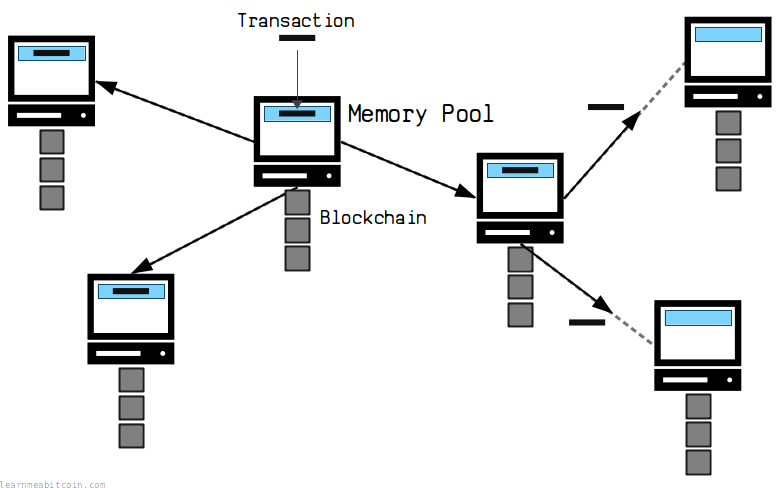](../../images/diagrams_png_memory-pool.png)

当前内存池大小：

2.54 vMB

9,648 笔交易

注意：这是我本地节点的内存池大小。  
你内存池的大小会因你节点的在线时长以及你连接 of 节点而有所不同。

内存池（mempool）是新[交易](../transaction.md)的**等待区**。

新交易在等待被[开采](../mining.md)到[区块链](../blockchain.md)上时，会被存储在[节点](../networking/node.md)的内存池中。

**不要依赖内存池交易。** 并非所有交易都能从内存池（临时存储）进入区块链（永久存储）。

## 目的

为什么存在内存池？

内存池用于**整理冲突交易**。

你可以看到，同时向[网络](../networking.md)的不同部分插入两笔花费相同比特币的不同交易是可能的。一些节点会先收到一笔交易，而另一些节点会先收到另一笔交易：

[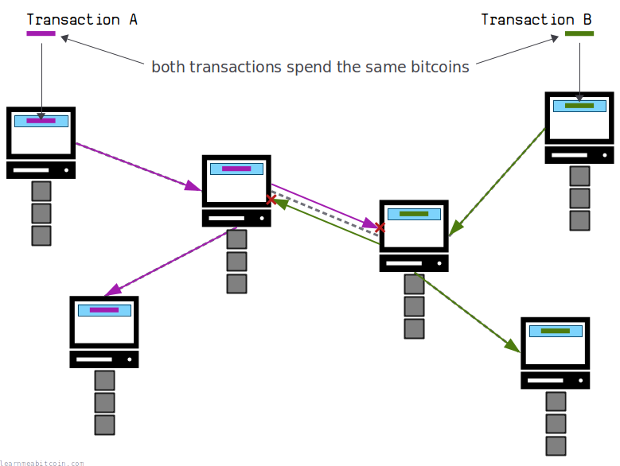](../../images/diagrams_png_memory-pool-conflict.png)


节点会拒绝它们收到的第二笔冲突交易，但冲突交易的不同版本仍会在网络中流传。

因为这两笔交易都试图花费相同的比特币，所以其中只有*一笔*应该被写入[区块链](../blockchain.md)。那么这些冲突交易中的哪一笔应该进入区块链呢？

当网络上的一个节点将*其*内存池中的交易[开采](../mining.md)到一个区块中时，这个冲突就解决了：

[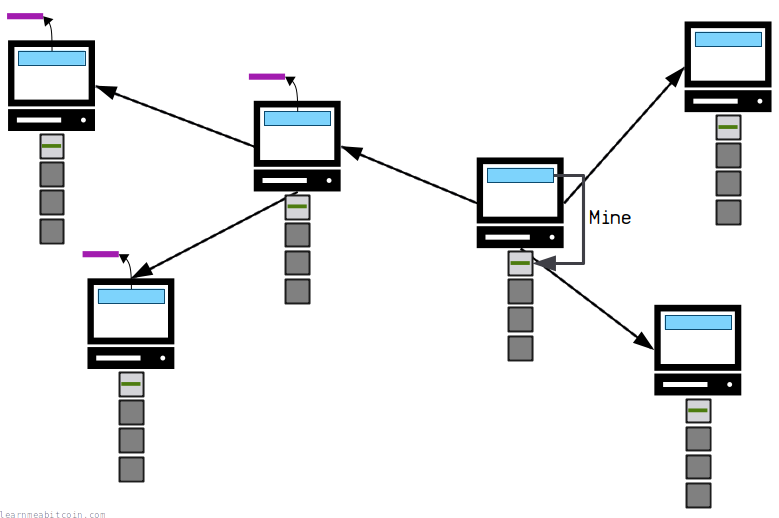](../../images/diagrams_png_memory-pool-conflict-resolved.png)


其中一个节点将开采下一个交易区块并在网络中广播它。

收到这个新开采的区块后，节点会将该区块添加到区块链上，并从其内存池中**剔除任何冲突交易**。

因此，内存池是防止冲突交易被写入区块链的*整理机制*（[挖矿](../mining.md)）的一部分。

内存池在防止冲突交易被写入区块链方面起着至关重要作用，这也是你必须*等待*交易被开采的原因。

## 进入

交易如何进入内存池？

交易可以通过多种方式进入节点的内存池：

### 1. 插入本地节点

（常见）

[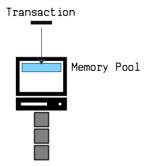](../../images/diagrams_png_memory-pool-entry-insert.png)

新交易可以直接插入到网络中的节点。

从这里开始，该节点将把该交易*广播*给网络中的其他节点，以便它们也可以将其添加到各自的内存池中。

你可以使用 `bitcoin-cli sendrawtransaction` 命令手动将交易插入到本地的 Bitcoin Core 节点。或者，当你想给某人发送比特币时，你的[钱包](../../beginners/wallets.md)也会将你的交易插入到一个节点中。

### 2. 从另一个节点接收

（常见）

[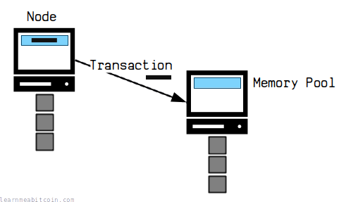](../../images/diagrams_png_memory-pool-entry-receive.png)

可以从网络上的其他节点接收新交易。

节点会不断将它们收到的最新交易广播给与它们连接的节点。因此，如果某个节点宣告了你的节点没有的交易，你的节点将[请求](../networking.md#requesting-transactions-and-blocks)它并将其也添加到自己的内存池中。

这个过程会重复，直到网络上的所有节点在其内存池中都拥有最新交易的副本。

**Only valid transactions can enter the memory pool.** 节点会在将接收到的每笔交易添加到其内存池或中继给所连接的节点之前，检查该交易是否有效（没有违反任何规则）。

### 3. 链分叉重组后重新进入

（罕见）

[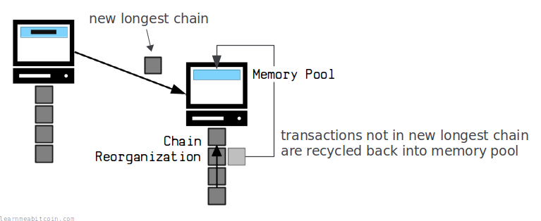](../../images/diagrams_png_memory-pool-entry-chain-reorganization.png)

在[链重组](../blockchain/chain-reorganization.md)期间，先前已被开采的交易可能会重新进入内存池。

有时，节点会执行链重组，即发现了一条新的[最长链](../blockchain/longest-chain.md)，它取代了该节点之前最长区块链中的某些区块。如果被替换的区块中的任何交易在新的最长链的区块中*未*被找到，它们将被回收回到你节点的内存池中（并再次重新广播），以争取在未来的区块中被重新开采。

## 退出

交易如何离开内存池？

交易离开内存池有多种原因：

### 1. 被开采

[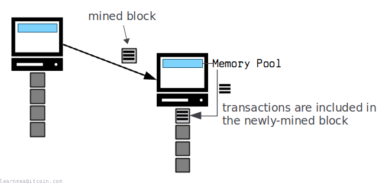](../../images/diagrams_png_memory-pool-exit-mined.png)

这是所有内存池交易的目标。

当矿工[开采](../mining.md)一个包含交易的新区块时，他们会将其广播给网络上的其他节点。当节点收到该区块时，其内存池中包含在该区块内的任何交易都将从其内存池中移除，并改为连接到该区块。

换句话说，交易已从临时存储（内存池）转移到永久存储（区块链）。

### 2. 被开采的冲突交易

[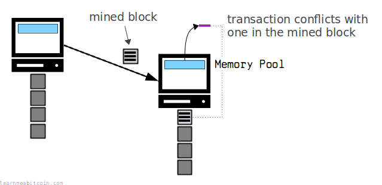](../../images/diagrams_png_memory-pool-exit-mined-conflict.png)

节点将从其内存池中移除与已开采区块中的交易相冲突的任何交易。

区块中已开采的交易被认为是“正确的”，因此如果节点内存池中有一笔交易与区块内的某笔交易花费了相同的比特币，它们会将该交易剔除出内存池。

换句话说，内存池已完成了作为冲突交易整理机制的一部分的工作。

冲突内存池交易的所有[后代](#descendants)都将同时被移除。

### 3. 被替换

[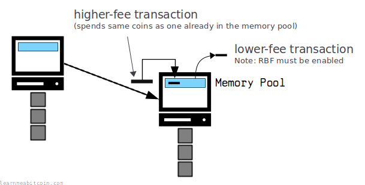](../../images/diagrams_png_memory-pool-exit-replaced.png)

如果一笔交易被一笔新的更高手续费的交易替换，它将从内存池中移除。

如果内存池中的现有交易具有[费用替换](../transaction/input/sequence.md#replace-by-fee)（RBF）设置，然后一笔*花费相同比特币*但手续费适当更高的新交易被广播到网络，就会发生这种情况。

交易的新高费率版本更有可能被开采到区块链上，因此节点会剔除旧交易以支持新交易。

### 4. 时间限制

[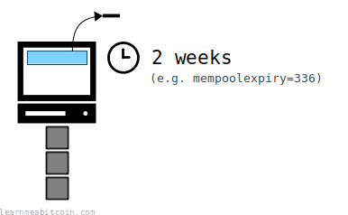](../../images/diagrams_png_memory-pool-exit-mempoolexpiry.png)

每个节点都有一个[时间限制设置](#mempoolexpiry)，用来规定它们愿意在内存池中保留交易多长时间。

因此，如果内存池中的一笔交易在达到时间限制之前没有被开采，节点会认为该交易*大概*不会被开采，并将其从其内存池中移除。

* 默认时间限制为 **2 周**。
* 如果交易由于超过过期时间而离开了内存池，你始终可以向网络重新广播该交易。

### 5. 大小限制

[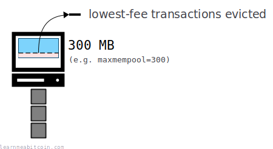](../../images/diagrams_png_memory-pool-exit-maxmpool.png)

当节点的内存池达到一定大小（以兆字节为单位）时，交易将从其内存池中移除。

每个节点都有能力为其内存池设置一个[最大大小](#maxmempool)。因此，当它们的内存池超过此限制时，它们将开始从内存池中移除手续费最低的交易，以腾出空间存放手续费更高的交易。

所以，如果网络中流传的交易多于你的节点内存池所能容纳的交易，你的节点将只保留可用手续费最高的交易。

* 默认大小限制为 **300 MB**。
* 某些节点维持着非常大的内存池，因此低手续费交易不太可能因为其他节点内存池小而完全离开网络。
* **内存池还会存储每笔交易的*[元数据](#getmempoolentry)*。** 因此，只有大约 25% 的内存池数据是由原始交易数据组成的。

## 设置

每个节点都保留着自己*独立的*内存池，并有能力为其使用自己的设置 and 规则。

如果你运行的是 Bitcoin Core 节点，以下是你的内存池最常用的 [bitcoin.conf](https://github.com/bitcoin/bitcoin/blob/master/doc/bitcoin-conf.md) 设置：

### `maxmempool=<n>`

默认 = 300 MB

此设置控制内存池的**最大大小**，单位为 MB（兆字节）。

使用 `maxmempool` 增加节点内存池的大小是尽可能多地跟踪内存池交易的最简单方法。但是，这会在你的计算机上使用更多内存（RAM）。

此设置包括交易*元数据*的大小，并非仅基于原始交易数据大小的最大大小。

### `mempoolexpiry=<n>`

默认 = 336 小时（2 周）

此设置控制你的节点在首次收到交易后，将在内存池中保留**多少个小时**。

### `minrelaytxfee=<amount>`

默认 = 0.00001 BTC/kvB（1 sat/vbyte）

此设置控制将交易添加到你节点内存池的**最小交易[费率](../transaction/fee.md#feerates)**。

此设置使用一种繁琐的 BTC/kvB（千[虚拟字节](../transaction/size.md#vbytes)）设置来衡量费率。默认的 0.00001 BTC/kvB 相当于 1 sat/vbyte。

 单位转换器

BTC

whole bitcoin

mBTC

one-thousandth of a bitcoin

uBTC

one-millionth of a bitcoin

Sats

one-hundred-millionth of a bitcoin

0 secs

因此，虽然每个内存池都可以是唯一的，但整个网络中最常用的内存池设置为：

* 最大大小为 **300 MB**。
* 保留交易最多 **2 周**。
* 拒绝手续费低于 **1 sat/byte** 的交易。

结果是，网络上的大多数节点在任何给定时间都会共享*相似的*内存池视图。

## 最低费用

什么是最低内存池费用？

[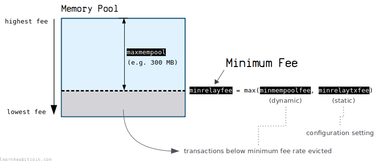](../../images/diagrams_png_memory-pool-minimum-fee.png)

每个节点都维持一个**最低费率**，以限制被接受进入其内存池的交易。

当内存池超过其[大小限制](#maxmempool)时，该值会增加。

例如，如果内存池变得太大，手续费最低的交易将被逐出，并且最低费率将增加以防止费率较低的交易进入。相反，如果内存池的大小降回到其最大大小以下，最低费率将下降以允许费率较低的交易重新进入。

默认的最低内存池费用是 **1 sat/byte**。

> 当交易因为在按费率排序时处于太大内存池的底部而被逐出内存池时，有效的 minrelayfee 将提高为被逐出交易的费率。
>
> 它会连续下降，非常缓慢，每 3 到 12 小时减半一次，直到由于再次逐出而不得不再次调高。

Pieter Wuille, [bitcoin.stackexchange.com](https://bitcoin.stackexchange.com/questions/58083/is-it-possible-to-set-a-dynamic-minrelaytxfee)

### 计算

该最低费率由 `minrelayfee` 控制。

* `minrelayfee` (动态) – 这是以下两个值中的最大值：
  + `minmempoolfee` (动态) – 当你的内存池达到其 `maxmempool` 大小时上下变动的内部值。
  + `minrelaytxfee` (静态) – 你可以在节点的[配置文件](https://github.com/bitcoin/bitcoin/blob/master/doc/bitcoin-conf.md)中设置的固定值。

所以换句话说，`minmempoolfee` 是一个内部计算的值，根据你内存池的大小动态调整，你可以通过使用 `minrelaytxfee` 设置一个永久的最小值来覆盖它。当 Bitcoin 运行时，`minrelayfee`（有效最低费率）是这两个值中较大的那个。

## 结构

内存池有结构吗？

内存池没有定义的结构；它只是一个**未确认交易的池**。

但是，内存池中的交易包括一些额外的[元数据](#getmempoolentry)，以帮助排序以包含在[候选区块](candidate-block.md)中。

该元数据包括诸如：*[大小](../transaction/size.md)*、*[手续费](../transaction/fee.md)*、*[后代](#descendants)* 和 *[祖先](#ancestors)* 之类的信息。

### 后代

[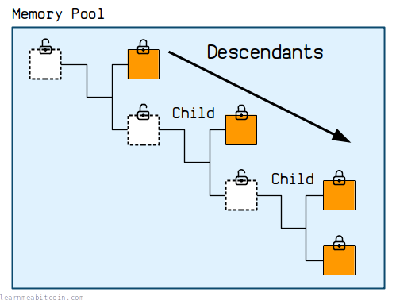](../../images/diagrams_png_memory-pool-descendants.png)

后代是**内存池交易的子项**。

换句话说，它是一笔*花费现有内存池交易*的交易。所以如果一笔交易正处于内存池中，就可以创建一笔花费该交易[输出](../transaction/output.md)的*子*交易，并将该交易也送入内存池。

因此，交易在内存池中时可以有多个后代。

**子交易的父项必须始终先被开采。** 子交易*依赖*于其父项被开采后它才能被开采（因为否则它将尝试花费不存在的比特币）。父项可以在较早的区块中被开采，或者在与子项相同的区块中较高位置被开采。无论哪种方式，你都无法在没有父项的情况下开采子交易。

**后代限制。** 内存池交易最多可以有 25 个后代。后代的总大小也限制在 101,000 个[虚拟字节](../transaction/size.md#vbytes)（101 kvB）。（参见 [policy.h](https://github.com/bitcoin/bitcoin/blob/master/src/policy/policy.h)）

#### 后代费率

内存池驱逐

[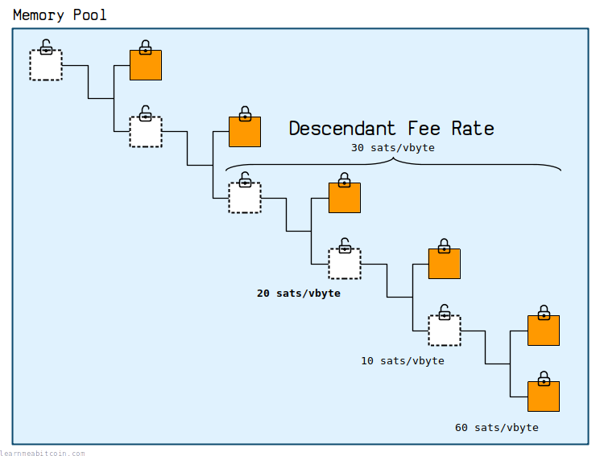](../../images/diagrams_png_memory-pool-descendant-fee-rate.png)

后代费率是**一笔交易及其所有后代的*平均费率***。

它用于决定*从内存池中逐出哪些交易*。

当节点的内存池达到其大小限制时，它会首先逐出手续费最低的交易。但在逐出交易之前，它会查看其后代费率，以确定是否值得将其保留在内存池中。

例如：

* **较高的后代费率：** 单个交易的费率可能足够低，使其成为被逐出的候选交易。但是，如果附加了一个非常高费率的后代交易，后代费率就会更高，因此可能值得将该特定交易保留在内存池中，因为它更有可能在不久的将来被开采到区块中（因为你无法在没有父项的情况下开采高手续费的后代）。
* **较低的后代费率：** 如果单个交易的费率足够低可以被逐出，*并且*后代费率相同（或更低），那么我们可以很愉快地逐出该交易及其所有后代。这是因为所有的后代都*依赖*于该交易，所以在没有它的情况下，它们将无法被开采到区块中。

**平均费率。** 平均费率是交易手续费之和除以交易大小之和。它与单笔交易的[费率](../transaction/fee.md#feerates)计算相同，但分摊在多笔交易中。

### 祖先

[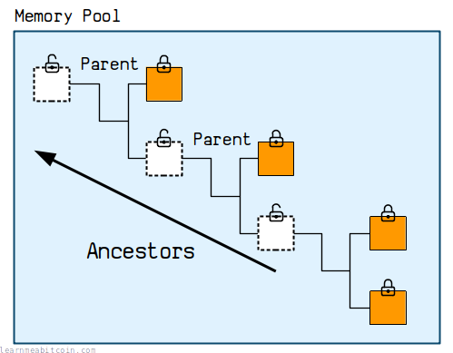](../../images/diagrams_png_memory-pool-ancestors.png)

祖先是**内存池交易的父项**。

内存池交易*依赖*于其祖先被开采到区块中。这是因为你无法在区块中包含一笔花费不存在（或尚未创建）的[输出](../transaction/output.md)的交易。

所以如果你查找内存池中的任何交易，它都有可能有多个祖先，并且这些祖先必须在该特定交易能够被开采之前先被开采。

#### 祖先费率

候选区块选择

[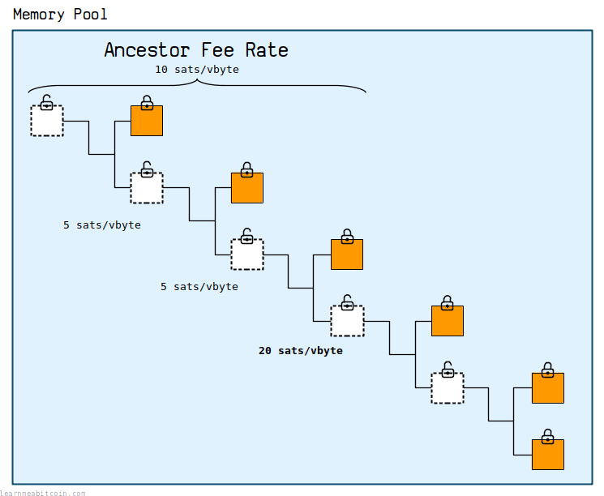](../../images/diagrams_png_memory-pool-ancestor-fee-rate.png)

祖先费率是**一笔交易及其所有祖先的平均费率**。

它在确定*选择哪些交易*以包含在[候选区块](candidate-block.md)中时使用。

矿工必须在他们的区块中包含一笔交易的所有祖先。所以他们计算每笔交易的祖先费率，以确定与包含另一笔具有相似费率（但没有任何祖先）的交易相比，是否值得包含该特定交易*及其所有祖先*。

例如：

* **较低的祖先费率：** 单个交易可能具有足够高的费率，值得将其包含在候选区块中。但是，如果它具有费率非常低的祖先，这会降低祖先费率，并且可能意味着实际上不值得将该交易包含在区块中（与具有较低绝对费率但没有祖先的其他交易相比）。
* **较高的祖先费率：** 较高的祖先费率不会提高交易被包含在区块中的机会，因为如果费率不够高，矿工可以简单地开采祖先而忽略当前交易。

**[子凭父贵 (CPFP)](../transaction/fee.md#cpfp)。** 你可以通过创建一个带高额手续费的子交易来增加内存池交易被开采的机会。这将增加平均费率，从而使父交易对矿工更具吸引力。

## 位置

内存池存储在哪里？

内存池存储在 [RAM](https://www.crucial.com/articles/about-memory/support-what-does-computer-memory-do) 中。

这意味着内存池交易可以**以最快的速度被访问**，这提供了多重好处：

* **更快验证新交易。** 需要检查每笔新交易是否与当前内存池中的任何交易冲突。将内存池交易保留在 RAM 中允许节点更迅速地验证和中继新交易。
* **更快中继新区块。** 节点收到的每个新区块都需要在写入其区块链并中继给其他节点之前进行验证。如果区块中的大多数交易已经存在于节点的内存池中，这会加快区块的验证速度（因为大多数交易已经过验证）。
* **更快构建候选区块。** 矿工在构建其候选区块时需要从内存池中获取交易。如果所有的内存池交易都保留在 RAM 中，那么对它们进行排序以进行选择就会快得多。

简而言之，将内存池保留在 RAM 中（而不是读取和写入磁盘）有助于节点更高效地运行。

这也解释了为什么内存池的默认[大小](#maxmempool)相对“较小”，为 300 MB（因为在典型计算机上，RAM 空间比磁盘空间小得多）。然而，这仍然足够大，可以在内存中保存*多个区块*份量的交易数据。

## 命令

从 Bitcoin Core 获取有关内存池信息的主要命令有三个：

### `bitcoin-cli getmempoolinfo`

显示有关你节点内存池的统计信息。

```
$ bitcoin-cli getmempoolinfo
{
    "loaded": true,
    "size": 9648,
    "bytes": 2539036,
    "usage": 16003120,
    "total_fee": 0.09412357,
    "maxmempool": 200000000,
    "mempoolminfee": 1.0e-5,
    "minrelaytxfee": 1.0e-5,
    "incrementalrelayfee": 1.0e-5,
    "unbroadcastcount": 0,
    "fullrbf": true
}
```

### `bitcoin-cli getrawmempool`

显示你节点内存池中所有交易的 [txid](../transaction/input/txid.md)。

### `bitcoin-cli getmempoolentry <txid>`

显示有关你节点内存池中特定交易的详细信息（包括元数据）。

例如：

```
{
  "vsize": 141,
  "weight": 561,
  "time": 1707864360,
  "height": 830390,
  "descendantcount": 2,
  "descendantsize": 282,
  "ancestorcount": 24,
  "ancestorsize": 4072,
  "wtxid": "2a088158bc6a69a1225de7e0465c749692bcf4f990db4b4c480fe804ea17851a",
  "fees": {
    "base": 0.00001128,
    "modified": 0.00001128,
    "ancestor": 0.00036896,
    "descendant": 0.00002538
  },
  "depends": [
    "95617833493987487f400cd8dc7c4874d6b8ec0898f2181f0a566ffc03b04a92"
  ],
  "spentby": [
    "d615139931d376c5f283db0259ca02d0ff1ee61f9b2b742fc7f82717675c9f41"
  ],
  "bip125-replaceable": true,
  "unbroadcast": false
}
```

## 备注

* **没有像“*那个*内存池”这样的东西。** 换句话说，没有所有新交易都会进入的单一内存池，因为每个节点都保留自己独立的内存池。因此，网络中各节点的内存池在任何给定时间都会略有不同。

  这是由于不同的内存池设置（例如 `maxmempool`, `mempoolexpiry`, `minrelaytxfee`）、交易传播速度以及网络中可能同时存在冲突交易的事实所致。

  然而，通常会有一个很大的重叠，即大多数节点在其内存池中都会有相似的交易，因此使用“内存池”一词来指代网络中内存池的总体状态并没有什么错。

  只是要做好在技术论坛上被纠正的准备，如果你将其称为“那个内存池”的话。
* **默认的内存池过期时间为 2 周。** 以前是 3 天，但在 2017 年随着 Bitcoin Core [v0.14.0](https://github.com/bitcoin/bitcoin/blob/master/doc/release-notes/release-notes-0.14.0.md) 的发布增加到了 14 天。
* **当交易离开内存池时，就好像它从未发生过一样。** 所以在接受付款时不要依赖内存池交易。如果交易在没有被开采的情况下离开了内存池，那么它也可以被视为从未发生过。将其重新带回内存池的唯一方法是重新广播到网络。

## 资源

* [Brink Podcast – Episode 2: Mempool Ancestors and Descendants](https://brink.dev/podcast/2-mempool-ancestors-descendants/)
* [Bitcoin Optech – Waiting for confirmation: a series about mempool and relay policy](https://bitcoinops.org/en/blog/waiting-for-confirmation/)
* [Is it possible to set a dynamic -minrelaytxfee?](https://bitcoin.stackexchange.com/questions/58083/is-it-possible-to-set-a-dynamic-minrelaytxfee)