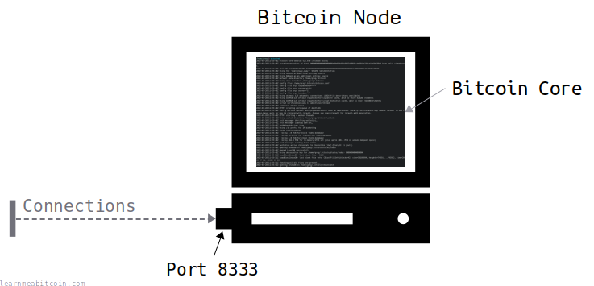
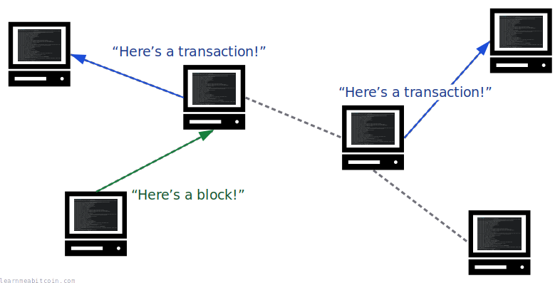
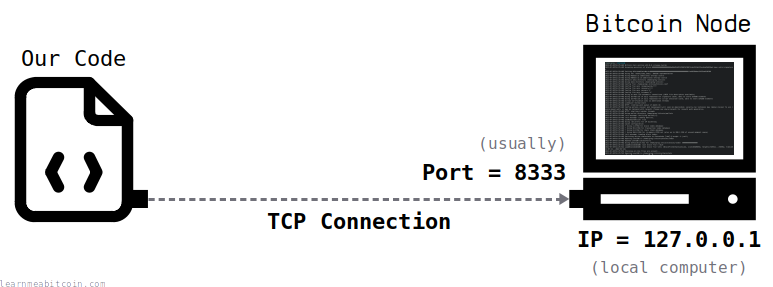
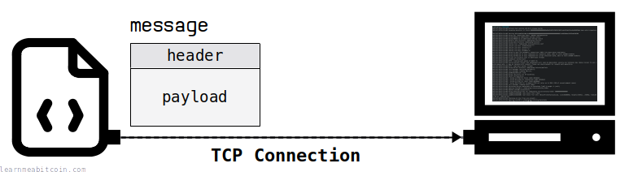
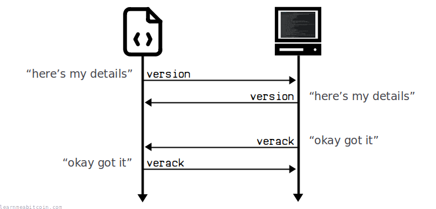
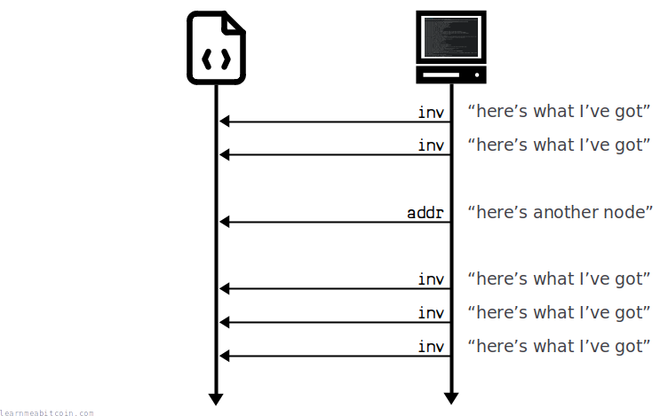
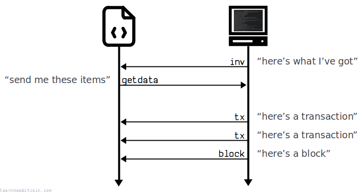
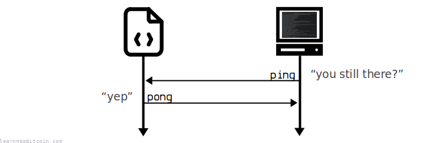

**The introductory code on this page works for nodes up to [v26.2](https://github.com/bitcoin/bitcoin/blob/master/doc/release-notes/release-notes-26.2.md).**

Bitcoin Core [v27.0](https://github.com/bitcoin/bitcoin/blob/master/doc/release-notes/release-notes-27.0.md) (released April 2024) and above use *version 2* protocol ([BIP 324](https://github.com/bitcoin/bips/blob/master/bip-0324.mediawiki)) by default. The underlying messages are the same, it's just that the messages are now *encrypted*, which this guide does not cover.

If you're running a v27.0 node or above, you can still communicate with it using the example code on this page by setting `-v2transport=0` (disabling the v2 protocol and running the old v1 protocol instead).

Here's a quick guide on how to *connect to* and *communicate with* a node on the Bitcoin network.

[](/docs/technical/networking/networking-terminal.gif.md)


Networking (Full Code)

```
# Sockets are in the standard library in Ruby
require 'socket'

# Open a TCP connection to an IP and port
socket = TCPSocket.open("127.0.0.1", 8333) # local computer = 127.0.0.1

require 'digest' # needed for creating checksums

# Handy functions for getting data in the right format for messages
def hexadecimal(number)
    return number.to_s(16)
end

def size(data, size)
    return data.rjust(size*2, '0') # pad the left of the data out with zeros up to a specific number of bytes (2 hexadecimal chars = 1 byte)
end

def reversebytes(bytes)
    return bytes.scan(/../).reverse.join() # grab each 2 characters (1 byte) as an array, reverse the array, then join back together
end

def ascii2hex(string)
    # Convert each character in the string to its hexadecimal byte representation
    bytes = string.each_byte.map {|c| c.to_s(16) }.join()

    # Pad up to 12 bytes (keeping the bytes for the ascii string on the left)
    return bytes.ljust(24, '0')
end

def checksum(bytes)
    # Hash the data twice
    hash = Digest::SHA256.digest(Digest::SHA256.digest([bytes].pack("H*"))).unpack("H*")[0]

    # Return the first 4 bytes (8 characters)
    return hash[0...8]
end

# Create the payload for a version message
payload  = reversebytes(size(hexadecimal(70014), 4))         # protocol version
payload += reversebytes(size(hexadecimal(0), 8))             # services e.g. (1<<3 | 1<<2 | 1<<0)
payload += reversebytes(size(hexadecimal(1640961477), 8))    # time
payload += reversebytes(size(hexadecimal(0), 8))             # remote node services
payload += "00000000000000000000ffff2e13894a"                # remote node ipv6 (https://dnschecker.org/ipv4-to-ipv6.php)
payload += size(hexadecimal(8333), 2)                        # remote node port
payload += reversebytes(size(hexadecimal(0), 8))             # local node services
payload += "00000000000000000000ffff7f000001"                # local node ipv6
payload += size(hexadecimal(8333), 2)                        # local node port
payload += reversebytes(size(hexadecimal(0), 8))             # nonce
payload += "00"                                              # user agent (compact_size, followed by ascii bytes)
payload += reversebytes(size(hexadecimal(0), 4))             # last block

# Create the message header
magic_bytes = 'f9beb4d9'
command     = ascii2hex('version')                                 # 76 65 72 73 69 6F 6E 00 00 00 00 00
size        = reversebytes(size(hexadecimal(payload.length/2), 4)) # 55 00 00 00
checksum    = checksum(payload)
header      = magic_bytes + command + size + checksum

# Combine the header and payload
message = header + payload

# 1. Send Version Message

# Prepare version message
version = message

# Write the message to the socket (the protocol sends and receives messages in raw bytes)
socket.write [version].pack("H*")
puts "version->"
puts version
puts


# 2. Receive Version Message

# Read the message header response from the socket
magic_bytes = socket.read(4)
command     = socket.read(12)
size        = socket.read(4)
checksum    = socket.read(4)

# View the message header
puts "<-version"
puts "magic_bytes: " + magic_bytes.unpack("H*").join  # convert raw bytes to hexadecimal characters
puts "command:     " + command.to_s                   # to_s automatically converts raw bytes to ASCII characters
puts "size:        " + size.unpack("V").join          # V = 32-byte unsigned, little-endian
puts "checksum:    " + checksum.unpack("H*").join

# Read the message payload
size = size.unpack("V").join.to_i
payload = socket.read(size)

# View the message payload
puts "payload:     " + payload.unpack("H*").join
puts


# 3. Receive Verack Message (verack = version acknowledged)

# Read the message header response from the socket
magic_bytes = socket.read(4)
command     = socket.read(12)
size        = socket.read(4)
checksum    = socket.read(4)

# View the message header
puts "<-verack"
puts "magic_bytes: " + magic_bytes.unpack("H*").join  # convert raw bytes to hexadecimal characters
puts "command:     " + command.to_s                   # to_s automatically converts raw bytes to ASCII characters
puts "size:        " + size.unpack("V").join          # V = 32-byte unsigned, little-endian
puts "checksum:    " + checksum.unpack("H*").join

# Read the message payload (there shouldn't be any)
size = size.unpack("V").join.to_i
payload = socket.read(size)

# View the message payload (there shouldn't be any)
puts "payload:     " + payload.unpack("H*").join
puts

# 4. Send Verack Message

# Create verack message
payload     = '' # verack has no payload, it's just a message header
magic_bytes = 'f9beb4d9'
command     = ascii2hex('verack')
size        = reversebytes(size(hexadecimal(payload.size/2), 4))
checksum    = checksum(payload)
verack      = magic_bytes + command + size + checksum + payload

# Write the message to the socket
socket.write [verack].pack("H*")
puts "verack->"
puts "magic_bytes: " + magic_bytes
puts "command:     " + 'verack'
puts "size:        " + size.to_i(16).to_s
puts "checksum:    " + checksum
puts "payload:     " + payload
puts

# Keep reading messages
loop do

    # Create an empty buffer to help us find the next stream of magic bytes (the start of a new message)
    buffer = ''

    # Keep looping to read bytes from the socket
    loop do

        # Read one byte at the time
        byte = socket.read(1)

        # Check that we haven't been disconnected from the node.
        if byte.nil?
            puts "Read a nil byte from the socket. Looks like the remote node has disconnected from us. We probably failed the handshake too many times, or didn't respond to enough pings. No worries, try connecting to another node for the time being instead."
            exit
        end

        # Add each byte to the temporary buffer
        buffer += byte.unpack("H*").join unless byte.nil? # do not do anything if we got a nil byte for some reason

        # Check the buffer when it reaches 4 bytes
        if (buffer.size == 8) # 8 hexadecimal characters = 4 bytes

            # See if the buffer matches the magic bytes
            if (buffer == 'f9beb4d9')

                # If we've got the magic bytes we're looking for, go ahead and read the full message from the socket
                command     = socket.read(12).to_s.delete("\x00")  # convert to ascii and remove any empty bytes
                size        = socket.read(4).unpack("V").join.to_i # convert to an integer
                checksum    = socket.read(4).unpack("H*").join     # convert to hexadecimal string of bytes
                payload     = socket.read(size).unpack("H*").join  # use the size from the header to read the payload, then convert to a hexadecimal string

                # Print the message
                puts "<-#{command}"
                puts "magic_bytes: " + buffer
                puts "command:     " + command
                puts "size:        " + size.to_s
                puts "checksum:    " + checksum
                puts "payload:     " + payload
                puts

                # Respond to all inv messages with getdata messages
                if command == "inv"

                    # Set new command name
                    command = "getdata"

                    # Use the same payload as the one we got from the inv message
                    payload = payload

                    # Create message
                    magic_bytes = 'f9beb4d9'
                    command_hex = ascii2hex(command)
                    size        = reversebytes(size(hexadecimal(payload.size/2), 4))
                    checksum    = checksum(payload)
                    message     = magic_bytes + command_hex + size + checksum + payload

                    # Print the message header and payload
                    puts "#{command}->"
                    puts "magic_bytes: " + magic_bytes
                    puts "command:     " + command
                    puts "size:        " + (payload.size/2).to_s
                    puts "checksum:    " + checksum
                    puts "payload:     " + payload
                    puts

                    # Send the message (convert from hexadecimal string to raw bytes first)
                    socket.write [message].pack("H*")

                end

                # Respond to all ping messages with pong messages
                if command == "ping"

                    # Set new command name
                    command = "pong"

                    # Use the same payload as the one we got from the ping message
                    payload = payload

                    # Create message
                    magic_bytes = 'f9beb4d9'
                    command_hex = ascii2hex(command)
                    size        = reversebytes(size(hexadecimal(payload.size/2), 4))
                    checksum    = checksum(payload)
                    message     = magic_bytes + command_hex + size + checksum + payload

                    # Print the message header and payload
                    puts "#{command}->"
                    puts "magic_bytes: " + magic_bytes
                    puts "command:     " + command
                    puts "size:        " + (payload.size/2).to_s
                    puts "checksum:    " + checksum
                    puts "payload:     " + payload
                    puts

                    # Send the message (convert from hexadecimal string to raw bytes first)
                    socket.write [message].pack("H*")

                end

                # Break out of the loop for reading a single message
                break

            end

            # Reset the buffer and keep looking for a stream of magic bytes
            buffer = ''

        end

    end

end
```

## 0. Intro

Bitcoin is a computer program. You can [download](https://bitcoin.org/en/download) it for free.

It runs on an open port on your computer, which means anyone can connect to it and communicate with it across the Internet.

[](https://static.learnmeabitcoin.com/diagrams/png/networking.png)


Computers connect to each other through "ports". Bitcoin uses port `8333` by default.

When you run Bitcoin, it uses ports to connect to other computers running the same program. So when you have lots of people running Bitcoin, you end up with a network of computers connected together and communicating with each other.

[](https://static.learnmeabitcoin.com/diagrams/png/networking-network-chatter.png)


Computers on the Bitcoin network share the latest [transactions](/docs/technical/transaction.md) and [blocks](/docs/technical/block.md) with each other.

Anyway, the cool thing about Bitcoin is **you can write your own basic program to connect to a node if you want to**. You just need to know how to speak its language.

In this guide I'm going to show you how to connect to a bitcoin node using [Ruby](https://www.ruby-lang.org/en/). Ruby is a simple language, so you should be able to translate the code into whichever language you prefer to use. I personally like Ruby.

And trust me, if *I* can connect to a Bitcoin node, anyone can.

## 1. Connecting

[8333</code> and a local IP." width="773" height="287" />](https://static.learnmeabitcoin.com/diagrams/png/networking-connecting.png)

First things first, two quick facts you need to know about the Bitcoin program:

* It runs on **port `8333`** (usually)
* It uses **TCP** for communication

So all you need to connect to a Bitcoin node is the **IP address** of the computer it's running on, and the ability to make **TCP connections** from your programming language. For example:

```
# Sockets are in the standard library in Ruby
require 'socket'

# Open a TCP connection to an IP and port
socket = TCPSocket.open("162.120.69.182", 8333) # local computer = 127.0.0.1
```

And there we have a connection to a Bitcoin node.

But that's pretty boring on its own. To start *receiving* data (like actual [transactions](/docs/technical/transaction.md) and [blocks](/docs/technical/block.md)), you need to start by sending it some *messages* first.

* See [Finding Nodes](#finding-nodes) if you don't already have an IP to connect to. The easiest method is to connect to your own local node (`127.0.0.1`), or you could try connecting to the node running on this server if you prefer (`162.120.69.182`).
* You can use this [Bitnodes.io tool](https://bitnodes.io/#join-the-network) to check if a remote node is accepting incoming connections.

These are the ports you'll usually find Bitcoin running on:

```
mainnet =  8333
testnet = 18333
regtest = 18444
```

**TCP = Transmission Control Protocol.** This is just a way that two computers can communicate with each other over the Internet (one says hello first, the other says hello back, etc.). For example, your computer used TCP it when you downloaded this webpage. Another protocol is UDP, but that's less common. You don't need to know how these protocols work: all you need to know is that Bitcoin uses TCP.

## 2. Messages

A "message" is just a structured piece of data that Bitcoin nodes send to each other over the network. They all have the same format:

[](https://static.learnmeabitcoin.com/diagrams/png/networking-message.png)

Here's an example of what an *actual* Bitcoin message looks like:

```
Header:  F9BEB4D976657273696F6E0000000000550000002C2F86F3
Payload: 7E1101000000000000000000C515CF6100000000000000000000000000000000000000000000FFFF2E13894A208D000000000000000000000000000000000000FFFF7F000001208D00000000000000000000000000
```

This looks like jargon right now, but it will make sense in a moment.

When you construct a message to send to another node, you're basically taking normal human-readable data (like numbers and text) and converting them to computer-readable [bytes](/docs/technical/general/bytes.md) that can be sent across the network more efficiently.

Therefore, the trick to sending messages in Bitcoin is just getting a bunch of data into the *correct format*.

So I'm going to start by showing you the basic structure of a message `header` and `payload`, and then I'll show you how to construct one yourself. I'm going to use a "version" type message as the first example, as that's the first message you want to send to a Bitcoin node after connecting to one.

> The “version” message provides information about the transmitting node to the receiving node at the beginning of a connection. Until both peers have exchanged “version” messages, no other messages will be accepted.

[developer.bitcoin.org](https://developer.bitcoin.org/reference/p2p_networking.html)


### Version

#### Header

The header contains a **summary of the message**, and its structure is the same for every message in the Bitcoin protocol.

Here's what a header looks like for a "version" message:

```
Header: (version message)
┌─────────────┬──────────────┬───────────────┬───────┬─────────────────────────────────────┐
│ Name        │ Example Data │ Format        │ Size  │ Bytes                               │
├─────────────┼──────────────┼───────────────┼───────┼─────────────────────────────────────┤
│ Magic Bytes │              │ bytes         │     4 │ F9 BE B4 D9                         │
│ Command     │ "version"    │ ascii bytes   │    12 │ 76 65 72 73 69 6F 6E 00 00 00 00 00 │
│ Size        │ 85           │ little-endian │     4 │ 55 00 00 00                         │
│ Checksum    │              │ bytes         │     4 │ F7 63 9C 60                         │
└─────────────┴──────────────┴───────────────┴───────┴─────────────────────────────────────┘
```

##### Fields

* **[Magic Bytes](/docs/technical/networking/magic-bytes.md):** This is a unique set of bytes used to identify the start of a new message. They're always the same. You see, you'll be reading a stream of bytes from your TCP connection when receiving messages, so it's handy to be able to identify when a new message starts. This random-looking set of bytes has been specifically chosen so that it's unlikely that they would appear anywhere else in a message.
* **Command:** This indicates the type of message being sent. You can send different types of messages in the Bitcoin protocol, and they contain different types of information. It's a 12-byte field containing the *ASCII* encoding of the name of the message type. The one in this example says that we are sending a "version" message, which is used to send information about ourselves to another node.

   ASCII

  Example

  Hex`0 bytes`


  Bytes
   

  ASCII`0 characters`
  + The hex bytes **between `0x20` and 0x7f** contain the *printable characters*.
  + Anything **`0x1f` or below** is a *control character* (will not display, or will display a weird character).
  + Anything **`0x80` or above** will show *nothing*.

  See the [ISO 646](https://en.wikipedia.org/wiki/ISO/IEC_646) encoding standard for details.


  0 secs
* **Size:** This is the size of the upcoming payload. This indicates how many bytes you need to read from the socket to get the full message being sent.
* **[Checksum](/docs/technical/keys/checksum.md):** This is a small fingerprint for the payload. It allows us to quickly check that the data in the payload hasn't been tampered with during transit. It's created by double-hashing the payload, then taking the first 4 bytes of the result.

#### Payload

The payload contains the main **content of the message**. Different message types have different structures for their payloads.

Here's the payload for a "version" message:

```
Payload (version message):
┌───────────────────────┬─────────────────────┬────────────────────────────┬─────────┬─────────────────────────────────────────────────┐
│ Name                  │ Example Data        │ Format                     │    Size │ Example Bytes                                   │
├───────────────────────┼─────────────────────┼────────────────────────────┼─────────┼─────────────────────────────────────────────────┤
│ Protocol Version      │ 70014               │ little-endian              │       4 │ 7E 11 01 00                                     │
│ Services              │ 0                   │ bit field, little-endian   │       8 │ 00 00 00 00 00 00 00 00                         │
│ Time                  │ 1640961477          │ little-endian              │       8 │ C5 15 CF 61 00 00 00 00                         │
│ Remote Services       │ 0                   │ bit field, little-endian   │       8 │ 00 00 00 00 00 00 00 00                         │
│ Remote IP             │ 46.19.137.74        │ ipv6, big-endian           │      16 │ 00 00 00 00 00 00 00 00 00 00 FF FF 2E 13 89 4A │
│ Remote Port           │ 8333                │ big-endian                 │       2 │ 20 8D                                           │
│ Local Services        │ 0                   │ bit field, little-endian   │       8 │ 00 00 00 00 00 00 00 00                         │
│ local IP              │ 127.0.0.1           │ ipv6, big-endian           │      16 │ 00 00 00 00 00 00 00 00 00 00 FF FF 7F 00 00 01 │
│ Local Port            │ 8333                │ big-endian                 │       2 │ 20 8D                                           │
│ Nonce                 │ 0                   │ little-endian              │       8 │ 00 00 00 00 00 00 00 00                         │
│ User Agent            │ ""                  │ compact size, ascii        │ compact │ 00                                              │
│ Last Block            │ 0                   │ little-endian              │       4 │ 00 00 00 00                                     │
└───────────────────────┴─────────────────────┴────────────────────────────┴─────────┴─────────────────────────────────────────────────┘
```

A "version" message is one of the more complex messages you can send in Bitcoin, but that's only because it contains lots of information. It's a good place to start though, because if you can construct a "version" message, you can construct any message in the Bitcoin protocol.

##### Fields

Here's what each of the individual fields mean for this particular message:

* **Protocol Version:** This is the version of the protocol our node understands. Different versions of the protocol have different messages, so by giving our protocol version we let the other node know what kind of messages we can work with.
* **Services:** This is a list of optional services that your node can offer. This is a 64 bit field, where each bit can be set to `1` to indicate a different service you offer (see [this table](https://developer.bitcoin.org/reference/p2p_networking.html#version) for a full list). For example, setting the first bit (on the right) indicates that you are a full node and can provide all of the blocks in the blockchain. You can leave this as zero if you're just testing.
* **Time:** Your computer's time as a Unix timestamp (the number of seconds since 01 Jan 1970).
* **Remote Services:** This is a list of optional services you think the node you're connecting to can offer. It's the same structure as the main "Services" field above. I'm not sure why this is useful or if it's actually used for anything, so I leave it as zero.
* **Remote IP:** This is the IP address of the node you think you're connecting to. This is in IPv6 format (you can easily [convert between IPv4 and IPv6](https://dnschecker.org/ipv4-to-ipv6.php) if you need to). I don't think this is crucial either, but I set it as the IP I'm connecting to anyway.
* **Remote Port:** This is the port on the node you think you're connecting to. I just leave it as the default `8333`.
* **Local Services:** This is the list of services your node offers. I'm not sure why this gets repeated.
* **Local IP:** This is what you think your local IP is. This is your IP address in IPv6 format (again, you can [convert between IPv4 and IPv6](https://dnschecker.org/ipv4-to-ipv6.php) if you need to). This is not actually used by the remote node, so you can set it to what you want. I just set it as localhost (`127.0.0.1`).
* **Local Port:** This is the local port you're communicating from. Again, I don't think this is crucial, but I leave it as the default `8333`.
* **Nonce:** A randomly generated number that can be used to detect connections to yourself later on. You can leave this as zero if it's not needed and it will just be ignored. The term "nonce" is short for "number used once", unless you're British, in which case it doesn't mean that at all.
* **User Agent:** A custom string you can use to identify the make and model of your node on the network. Bitcoin Core uses a string like "/Satoshi:22.0.0/", but you can put "Awesome Node 5000" or something like that if you prefer. You can see these user agents for yourself when you run `bitcoin-cli getpeerinfo`. You can leave this field blank if you want, but just remember you'll still need to place a `00` byte in this field to indicate that you have not provided any upcoming bytes.
* **Last Block:** The height of the top block in your local blockchain. Leave this as zero if you haven't got any blocks or don't care to share any.

As I say, this is one of the more complicated messages, so don't let it put you off from trying to connect to a node. Give it a go.

## Code

Here's some example code for constructing a "version" message in Ruby:

```
require 'digest' # needed for creating checksums

# Handy functions for getting data in the right format for messages
def hexadecimal(number)
    return number.to_s(16)
end

def size(data, size)
    return data.rjust(size*2, '0') # pad the left of the data out with zeros up to a specific number of bytes (2 hexadecimal chars = 1 byte)
end

def reversebytes(bytes)
    return bytes.scan(/../).reverse.join() # grab each 2 characters (1 byte) as an array, reverse the array, then join back together
end

def ascii2hex(string)
    # Convert each character in the string to its hexadecimal byte representation
    bytes = string.each_byte.map {|c| c.to_s(16) }.join()

    # Pad up to 12 bytes (keeping the bytes for the ascii string on the left)
    return bytes.ljust(24, '0')
end

def checksum(bytes)
    # Hash the data twice
    hash = Digest::SHA256.digest(Digest::SHA256.digest([bytes].pack("H*"))).unpack("H*")[0]

    # Return the first 4 bytes (8 characters)
    return hash[0...8]
end

# Create the payload for a version message
payload  = reversebytes(size(hexadecimal(70014), 4))         # protocol version
payload += reversebytes(size(hexadecimal(0), 8))             # services e.g. (1<<3 | 1<<2 | 1<<0)
payload += reversebytes(size(hexadecimal(1640961477), 8))    # time
payload += reversebytes(size(hexadecimal(0), 8))             # remote node services
payload += "00000000000000000000ffff2e13894a"                # remote node ipv6 (https://dnschecker.org/ipv4-to-ipv6.php)
payload += size(hexadecimal(8333), 2)                        # remote node port
payload += reversebytes(size(hexadecimal(0), 8))             # local node services
payload += "00000000000000000000ffff7f000001"                # local node ipv6
payload += size(hexadecimal(8333), 2)                        # local node port
payload += reversebytes(size(hexadecimal(0), 8))             # nonce
payload += "00"                                              # user agent (compact_size, followed by ascii bytes)
payload += reversebytes(size(hexadecimal(0), 4))             # last block

# Create the message header
magic_bytes = 'f9beb4d9'
command     = ascii2hex('version')                                 # 76 65 72 73 69 6F 6E 00 00 00 00 00
size        = reversebytes(size(hexadecimal(payload.length/2), 4)) # 55 00 00 00
checksum    = checksum(payload)
header      = magic_bytes + command + size + checksum

# Combine the header and payload
message = header + payload
```

**The trickiest part is making sure you convert the data into the correct bytes and the correct order.** That's where all those utility functions in the code above come in. But once you've got the hang of converting to [hexadecimal](/docs/technical/general/hexadecimal.md) and converting byte orders to [little-endian](/docs/technical/general/little-endian.md), it's not so bad.

And this is what our final "version" message looks like as a string of hexadecimal bytes:

```
F9BEB4D976657273696F6E0000000000550000002C2F86F37E1101000000000000000000C515CF6100000000000000000000000000000000000000000000FFFF2E13894A208D000000000000000000000000000000000000FFFF7F000001208D00000000000000000000000000
```

So now we know how to construct a message, we can start communicating with the node we've just connected to.

## 3. Handshake

> Handshaking is the process that establishes communication between two networking devices.

Before we can start receiving data, we need to perform a "handshake". This handshake is just a sequence of messages we send each other to get the ball rolling.

In the Bitcoin protocol, the handshake works like this:

[](https://static.learnmeabitcoin.com/diagrams/png/networking-handshake.png)

So the handshake is basically a 2-step process:

1. We initiate the communication by sending our "version" message, and they respond with their own "version" message.
2. They then send a "verack" message **ack**nowledging that they've received our **ver**sion message, and we finish by sending a "verack" message back to them.

And that's all there is to it.

**The *order* of the messages in the handshake is important.** If you get the order wrong, the handshake will fail, and the other node will reject your connection. You can always try again, but if you mess up the handshake too many times you may get temporarily banned. If that happens, you can always connect to another node in the meantime.

### Message preparation

We need to send two messages to perform the handshake:

1. [Version Message](#version)
2. [Verack Message](#verack)

We've already prepared our "version" message, so let's create a "verack" message.

#### Verack

The "verack" is a simple message header without a payload:

```
Verack Message:
┌─────────────┬──────────────┬───────────────┬───────┬─────────────────────────────────────┐
│ Name        │ Example Data │ Format        │ Size  │ Example Bytes                       │
├─────────────┼──────────────┼───────────────┼───────┼─────────────────────────────────────┤
│ Magic Bytes │              │ bytes         │     4 │ F9 BE B4 D9                         │
│ Command     │ "verack"     │ ascii bytes   │    12 │ 76 65 72 61 63 6B 00 00 00 00 00 00 │
│ Size        │ 0            │ little-endian │     0 │ 00 00 00 00                         │
│ Checksum    │              │ bytes         │     4 │ 5D F6 E0 E2                         │
└─────────────┴──────────────┴───────────────┴───────┴─────────────────────────────────────┘

Hexadecimal: F9BEB4D976657261636B000000000000000000005DF6E0E2
```

A "verack" message is always the same.

### Sending and receiving messages

Now we've got our messages ready, we just need to send them to the node we've connected to (and receive messages back from them).

* To "send" messages, we just *write* bytes to our TCP socket connection.
* To "receive" messages we just *read* bytes from the same socket.

## Code

Here's some Ruby code showing how to manually construct each message, and how to write/read bytes to/from the socket connection:

```
# 1. Send Version Message

# Prepare version message
version = message

# Write the message to the socket (the protocol sends and receives messages in raw bytes)
socket.write [version].pack("H*")
puts "version->"
puts version
puts


# 2. Receive Version Message

# Read the message header response from the socket
magic_bytes = socket.read(4)
command     = socket.read(12)
size        = socket.read(4)
checksum    = socket.read(4)

# View the message header
puts "<-version"
puts "magic_bytes: " + magic_bytes.unpack("H*").join  # convert raw bytes to hexadecimal characters
puts "command:     " + command.to_s                   # to_s automatically converts raw bytes to ASCII characters
puts "size:        " + size.unpack("V").join          # V = 32-byte unsigned, little-endian
puts "checksum:    " + checksum.unpack("H*").join

# Read the message payload
size = size.unpack("V").join.to_i
payload = socket.read(size)

# View the message payload
puts "payload:     " + payload.unpack("H*").join
puts


# 3. Receive Verack Message (verack = version acknowledged)

# Read the message header response from the socket
magic_bytes = socket.read(4)
command     = socket.read(12)
size        = socket.read(4)
checksum    = socket.read(4)

# View the message header
puts "<-verack"
puts "magic_bytes: " + magic_bytes.unpack("H*").join  # convert raw bytes to hexadecimal characters
puts "command:     " + command.to_s                   # to_s automatically converts raw bytes to ASCII characters
puts "size:        " + size.unpack("V").join          # V = 32-byte unsigned, little-endian
puts "checksum:    " + checksum.unpack("H*").join

# Read the message payload (there shouldn't be any)
size = size.unpack("V").join.to_i
payload = socket.read(size)

# View the message payload (there shouldn't be any)
puts "payload:     " + payload.unpack("H*").join
puts

# 4. Send Verack Message

# Create verack message
payload     = '' # verack has no payload, it's just a message header
magic_bytes = 'f9beb4d9'
command     = ascii2hex('verack')
size        = reversebytes(size(hexadecimal(payload.size/2), 4))
checksum    = checksum(payload)
verack      = magic_bytes + command + size + checksum + payload

# Write the message to the socket
socket.write [verack].pack("H*")
puts "verack->"
puts "magic_bytes: " + magic_bytes
puts "command:     " + 'verack'
puts "size:        " + size.to_i(16).to_s
puts "checksum:    " + checksum
puts "payload:     " + payload
puts
```

**Strings and Bytes.** When sending data "over the wire" you need to convert all of your data to raw bytes. In the code examples I've given, even though it looks like I'm working with bytes, I'm actually manipulating *strings* made up of hexadecimal characters that *represent* bytes. That's where the `pack()` function come in, as this allows you to convert strings to actual bytes. Your programming language will have something similar.

**Socket Programming.** The way you write/read bytes to/from a socket will be different from one programming language to another, so it might take some getting used to if you've never done it before.

Anyway, once you've received that "verack" message (and sent your own one back), the handshake is complete. And if everything has worked correctly, the node will start sending you some *new* message types...

## 4. Receiving Messages

The node we've just connected to will continuously send us new messages after the handshake. So to keep receiving these messages, all we need to do is **keep reading from the socket in a loop**.

This is what the new messages are going to look like:

[](https://static.learnmeabitcoin.com/diagrams/png/networking-receiving-data.png)

You may receive some different messages before the "inv" messages shown in the diagram above, depending on what protocol version you're using. I'm just going to ignore them for now as they're not critically important.

I'll explain what these "inv" messages are and how to respond to them in a moment. But for now I'll just show you how to *keep reading messages* from the node you've connected to:

## Code

The following code is similar to the code from before, except this time we've put it in a *loop* to continuously read from the socket.

```
# Keep reading messages
loop do

    # Create an empty buffer to help us find the next stream of magic bytes (the start of a new message)
    buffer = ''

    # Keep looping to read bytes from the socket
    loop do

        # Read one byte at the time
        byte = socket.read(1)

        # Check that we haven't been disconnected from the node.
        if byte.nil?
            puts "Read a nil byte from the socket. Looks like the remote node has disconnected from us. We probably failed the handshake too many times, or didn't respond to enough pings. No worries, try connecting to another node for the time being instead."
            exit
        end

        # Add each byte to the temporary buffer
        buffer += byte.unpack("H*").join unless byte.nil? # do not do anything if we got a nil byte for some reason

        # Check the buffer when it reaches 4 bytes
        if (buffer.size == 8) # 8 hexadecimal characters = 4 bytes

            # See if the buffer matches the magic bytes
            if (buffer == 'f9beb4d9')

                # If we've got the magic bytes we're looking for, go ahead and read the full message from the socket
                command     = socket.read(12).to_s.delete("\x00")  # convert to ascii and remove any empty bytes
                size        = socket.read(4).unpack("V").join.to_i # convert to an integer
                checksum    = socket.read(4).unpack("H*").join     # convert to hexadecimal string of bytes
                payload     = socket.read(size).unpack("H*").join  # use the size from the header to read the payload, then convert to a hexadecimal string

                # Print the message
                puts "<-#{command}"
                puts "magic_bytes: " + buffer
                puts "command:     " + command
                puts "size:        " + size.to_s
                puts "checksum:    " + checksum
                puts "payload:     " + payload
                puts

                # Break out of the loop for reading a single message
                break

            end

            # Reset the buffer and keep looking for a stream of magic bytes
            buffer = ''

        end

    end

end
```

Now we can keep reading data from this node forever, or at least until our computer randomly crashes and I end up losing all the code I've been writing for the last hour because I forgot to save it.

## 5. Requesting Transactions and Blocks

A node won't openly send you all the new transactions and blocks that it has received. Instead, to save bandwidth, they will send you a *list* of hashes of the latest transactions and blocks they've received in "inv" (inventory) messages.

You can then respond to these "inv" messages listing all the specific transactions and blocks you want with "getdata" messages.

Then, after you've sent your "getdata" message, the node will send you the full transactions and blocks you've requested in subsequent "tx" and "block" messages:

[](https://static.learnmeabitcoin.com/diagrams/png/networking-getting-transactions-and-blocks.png)

### Inv

The payload of an "inv" message looks like this:

```
Payload: (inv)
┌─────────────┬───────────────────┬──────────┬──────────────────────────────────────────────────────────────────────────────────────────────────────────────┐
│ Name        │ Format            │ Size     │ Example Bytes                                                                                                │
├─────────────┼───────────────────┼──────────┼──────────────────────────────────────────────────────────────────────────────────────────────────────────────┤
│ Count       │ compact size      │ variable │ 01                                                                                                           │
│ Inventory   │ inventory vector  │ variable │ 01 00 00 00 aa 32 5e 91 22 aa 39 ca 18 c7 5a ab e2 a3 ce af 98 02 ac d1 a4 07 20 92 5b fd 77 ff f5 8e d8 21  │
└─────────────┴───────────────────┴──────────┴──────────────────────────────────────────────────────────────────────────────────────────────────────────────┘
```

#### Inventory

The "Inventory" part of the payload is *another* data structure in itself. But it's pretty simple: it's just a list of [transaction hashes](/docs/technical/transaction/input/txid.md) and/or [block hashes](/docs/technical/block/hash.md):

```
Inventory:
┌─────────┬───────────────┬───────┬─────────────────────────────────────────────────────────────────────────────────────────────────┐
│ Name    │ Format        │ Size  │ Example Bytes                                                                                   │
├─────────┼───────────────┼───────┼─────────────────────────────────────────────────────────────────────────────────────────────────┤
│ Type    │ little-endian │     4 │ 01 00 00 00                                                                                     │
│ Hash    │ bytes         │    32 │ aa 32 5e 91 22 aa 39 ca 18 c7 5a ab e2 a3 ce af 98 02 ac d1 a4 07 20 92 5b fd 77 ff f5 8e d8 21 │
└─────────┴───────────────┴───────┴─────────────────────────────────────────────────────────────────────────────────────────────────┘

Types:

* 01 00 00 00 = MSG_TX (Transaction Hash)
* 02 00 00 00 = MSG_BLOCK (Block Hash)
```

### Getdata

The "getdata" message you respond with has the exact same structure as the "inv" message (which is convenient):

```
Payload: (getdata)
┌─────────────┬───────────────────┬──────────┬──────────────────────────────────────────────────────────────────────────────────────────────────────────────┐
│ Name        │ Format            │ Size     │ Example Bytes                                                                                                │
├─────────────┼───────────────────┼──────────┼──────────────────────────────────────────────────────────────────────────────────────────────────────────────┤
│ Count       │ compact size      │ variable │ 01                                                                                                           │
│ Inventory   │ inventory vector  │ variable │ 01 00 00 00 aa 32 5e 91 22 aa 39 ca 18 c7 5a ab e2 a3 ce af 98 02 ac d1 a4 07 20 92 5b fd 77 ff f5 8e d8 21  │
└─────────────┴───────────────────┴──────────┴──────────────────────────────────────────────────────────────────────────────────────────────────────────────┘
```

So if you want *all* of the transactions and blocks in the "inv", you can just reply with the exact same payload in your "getdata" message. Or if you don't want them all, just construct a payload with a list of the transaction/block hashes that you do want.

SegWit Transactions

To request the full transaction data for new [segwit transactions](/docs/technical/transaction.md#example-segwit) (i.e. including the [witness](/docs/technical/transaction/witness.md) data), you must change the *type* field in the [inventory](#inventory) part of your "getdata" message from:

* `01 00 00 00 = MSG_TX`
* `02 00 00 00 = MSG_BLOCK`

To:

* `01 00 00 40 = MSG_WITNESS_TX`
* `02 00 00 40 = MSG_WITNESS_BLOCK`

For example, the payload for the example "getdata" message above would be:

```
Payload: (getdata)
┌─────────────┬───────────────────┬──────────┬──────────────────────────────────────────────────────────────────────────────────────────────────────────────┐
│ Name        │ Format            │ Size     │ Example Bytes                                                                                                │
├─────────────┼───────────────────┼──────────┼──────────────────────────────────────────────────────────────────────────────────────────────────────────────┤
│ Count       │ compact size      │ variable │ 01                                                                                                           │
│ Inventory   │ inventory vector  │ variable │ 01 00 00 40 aa 32 5e 91 22 aa 39 ca 18 c7 5a ab e2 a3 ce af 98 02 ac d1 a4 07 20 92 5b fd 77 ff f5 8e d8 21  │
└─────────────┴───────────────────┴──────────┴──────────────────────────────────────────────────────────────────────────────────────────────────────────────┘
```

You should make this change for all "getdata" messages to make sure you're getting the full transaction data for both segwit and legacy transactions.

Anyway, after sending your "getdata" message, the node will proceed to send you full copies of the transactions and blocks you asked for in individual "tx" and "block" messages in response.

## Code

Here's some Ruby code that responds to every "inv" with a "getdata" message requesting everything in the payload:

```
# Keep reading messages
loop do

    # Create an empty buffer to help us find the next stream of magic bytes (the start of a new message)
    buffer = ''

    # Keep looping to read bytes from the socket
    loop do

        # Read one byte at the time
        byte = socket.read(1)

        # Check that we haven't been disconnected from the node.
        if byte.nil?
            puts "Read a nil byte from the socket. Looks like the remote node has disconnected from us. We probably failed the handshake too many times, or didn't respond to enough pings. No worries, try connecting to another node for the time being instead."
            exit
        end

        # Add each byte to the temporary buffer
        buffer += byte.unpack("H*").join unless byte.nil? # do not do anything if we got a nil byte for some reason

        # Check the buffer when it reaches 4 bytes
        if (buffer.size == 8) # 8 hexadecimal characters = 4 bytes

            # See if the buffer matches the magic bytes
            if (buffer == 'f9beb4d9')

                # If we've got the magic bytes we're looking for, go ahead and read the full message from the socket
                command     = socket.read(12).to_s.delete("\x00")  # convert to ascii and remove any empty bytes
                size        = socket.read(4).unpack("V").join.to_i # convert to an integer
                checksum    = socket.read(4).unpack("H*").join     # convert to hexadecimal string of bytes
                payload     = socket.read(size).unpack("H*").join  # use the size from the header to read the payload, then convert to a hexadecimal string

                # Print the message
                puts "<-#{command}"
                puts "magic_bytes: " + buffer
                puts "command:     " + command
                puts "size:        " + size.to_s
                puts "checksum:    " + checksum
                puts "payload:     " + payload
                puts

                # Respond to all inv messages with getdata messages
                if command == "inv"

                    # Set new command name
                    command = "getdata"

                    # Use the same payload as the one we got from the inv message
                    payload = payload

                    # Create message
                    magic_bytes = 'f9beb4d9'
                    command_hex = ascii2hex(command)
                    size        = reversebytes(size(hexadecimal(payload.size/2), 4))
                    checksum    = checksum(payload)
                    message     = magic_bytes + command_hex + size + checksum + payload

                    # Print the message header and payload
                    puts "#{command}->"
                    puts "magic_bytes: " + magic_bytes
                    puts "command:     " + command
                    puts "size:        " + (payload.size/2).to_s
                    puts "checksum:    " + checksum
                    puts "payload:     " + payload
                    puts

                    # Send the message (convert from hexadecimal string to raw bytes first)
                    socket.write [message].pack("H*")

                end

                # Break out of the loop for reading a single message
                break

            end

            # Reset the buffer and keep looking for a stream of magic bytes
            buffer = ''

        end

    end

end
```

And that's how you can get the latest transactions and blocks from an actual node on the network.

If you've got this far and everything is working, you've figured out how to connect to and communicate with a bitcoin node from scratch. Everything from here just involves constructing different types of messages.

Here's a [full list](https://en.bitcoin.it/wiki/Protocol_documentation#Message_types) of the messages Bitcoin nodes can send each other.

## 6. Keeping Connected

One last thing before you go: the node you've just connected to will occasionally send you "ping" messages to see if you're still there. So if you want to keep the connection alive, you'll need to respond with timely "pong" messages.

[](https://static.learnmeabitcoin.com/diagrams/png/networking-keeping-connected.png)

### Ping

As of protocol version `60001`, each "ping" message contains a random number as its payload:

```
Payload: (ping)
┌─────────────┬─────────┬──────┬─────────────────────────┐
│ Name        │ Format  │ Size │ Example Bytes           │
├─────────────┼─────────┼──────┼─────────────────────────┤
│ Nonce       │ bytes   │    8 │ 88 c8 49 39 65 b6 41 69 │
└─────────────┴─────────┴──────┴─────────────────────────┘
```

### Pong

Your "pong" message in response just needs to contain the same number in its payload too:

```
Payload: (pong)
┌─────────────┬─────────┬──────┬─────────────────────────┐
│ Name        │ Format  │ Size │ Example Bytes           │
├─────────────┼─────────┼──────┼─────────────────────────┤
│ Nonce       │ bytes   │    8 │ 88 c8 49 39 65 b6 41 69 │
└─────────────┴─────────┴──────┴─────────────────────────┘
```

So by adding one last adjustment to our loop, we can now keep the connection open and receive transactions and blocks forever:

## Code

```
# Keep reading messages
loop do

    # Create an empty buffer to help us find the next stream of magic bytes (the start of a new message)
    buffer = ''

    # Keep looping to read bytes from the socket
    loop do

        # Read one byte at the time
        byte = socket.read(1)

        # Check that we haven't been disconnected from the node.
        if byte.nil?
            puts "Read a nil byte from the socket. Looks like the remote node has disconnected from us. We probably failed the handshake too many times, or didn't respond to enough pings. No worries, try connecting to another node for the time being instead."
            exit
        end

        # Add each byte to the temporary buffer
        buffer += byte.unpack("H*").join unless byte.nil? # do not do anything if we got a nil byte for some reason

        # Check the buffer when it reaches 4 bytes
        if (buffer.size == 8) # 8 hexadecimal characters = 4 bytes

            # See if the buffer matches the magic bytes
            if (buffer == 'f9beb4d9')

                # If we've got the magic bytes we're looking for, go ahead and read the full message from the socket
                command     = socket.read(12).to_s.delete("\x00")  # convert to ascii and remove any empty bytes
                size        = socket.read(4).unpack("V").join.to_i # convert to an integer
                checksum    = socket.read(4).unpack("H*").join     # convert to hexadecimal string of bytes
                payload     = socket.read(size).unpack("H*").join  # use the size from the header to read the payload, then convert to a hexadecimal string

                # Print the message
                puts "<-#{command}"
                puts "magic_bytes: " + buffer
                puts "command:     " + command
                puts "size:        " + size.to_s
                puts "checksum:    " + checksum
                puts "payload:     " + payload
                puts

                # Respond to all inv messages with getdata messages
                if command == "inv"

                    # Set new command name
                    command = "getdata"

                    # Use the same payload as the one we got from the inv message
                    payload = payload

                    # Create message
                    magic_bytes = 'f9beb4d9'
                    command_hex = ascii2hex(command)
                    size        = reversebytes(size(hexadecimal(payload.size/2), 4))
                    checksum    = checksum(payload)
                    message     = magic_bytes + command_hex + size + checksum + payload

                    # Print the message header and payload
                    puts "#{command}->"
                    puts "magic_bytes: " + magic_bytes
                    puts "command:     " + command
                    puts "size:        " + (payload.size/2).to_s
                    puts "checksum:    " + checksum
                    puts "payload:     " + payload
                    puts

                    # Send the message (convert from hexadecimal string to raw bytes first)
                    socket.write [message].pack("H*")

                end

                # Respond to all ping messages with pong messages
                if command == "ping"

                    # Set new command name
                    command = "pong"

                    # Use the same payload as the one we got from the ping message
                    payload = payload

                    # Create message
                    magic_bytes = 'f9beb4d9'
                    command_hex = ascii2hex(command)
                    size        = reversebytes(size(hexadecimal(payload.size/2), 4))
                    checksum    = checksum(payload)
                    message     = magic_bytes + command_hex + size + checksum + payload

                    # Print the message header and payload
                    puts "#{command}->"
                    puts "magic_bytes: " + magic_bytes
                    puts "command:     " + command
                    puts "size:        " + (payload.size/2).to_s
                    puts "checksum:    " + checksum
                    puts "payload:     " + payload
                    puts

                    # Send the message (convert from hexadecimal string to raw bytes first)
                    socket.write [message].pack("H*")

                end

                # Break out of the loop for reading a single message
                break

            end

            # Reset the buffer and keep looking for a stream of magic bytes
            buffer = ''

        end

    end

end
```

**Functions.** I've repeated the same code in my code examples to keep everything as readable as possible. It would be better to put the code for reading messages and sending messages of these into their own functions.

## 7. Finding Nodes

Don't know where to find a node you can connect to? Here are a few places you can try:

* **Your own node.** If you download and run your own Bitcoin Core node on your local computer, you can connect to it at the IP address `127.0.0.1`. Or if you're hosting it on a remote server, use the IP for that server.
* **[bitnodes.io](https://bitnodes.io/)** This is a handy website that lists all of the available nodes on the Bitcoin network that it can find.
* **DNS Seeds.** There are some DNS servers run by trusted Bitcoin Core developers that will return some IPs of reliable full nodes. You can query these DNS seeds by using any online "DNS lookup" tool. Here are some examples of DNS Seeds:

  + seed.bitcoin.sipa.be - Pieter Wuille
  + dnsseed.bitcoin.dashjr.org - Luke Dashjr
  + seed.bitcoin.sprovoost.nl - Sjors Provoost

You can perform a DNS request on a DNS seed from the command line with: `nslookup seed.bitcoin.sipa.be`. Note that this may not work if you are using a VPN.

### Bitcoin Core

In terms of how the *Bitcoin Core* client finds nodes to connect to, it looks for them in the following order when starting up:

1. **Previous Connections.** Bitcoin Core maintains a list of nodes it has previously connected to, and tries connecting to those again once it starts up.
2. **DNS Seeds.** If you're running Bitcoin Core for the first time, you won't have a database of previous nodes, so it will use DNS Seeds like the ones above to find nodes to connect to.
3. **Hardcoded List.** If all else fails, Bitcoin Core comes with a hard-coded list of "seed nodes" it will connect to and use as a starting point to help it find other nodes on the network. This list can be found in [chainparamsseeds.h](https://github.com/bitcoin/bitcoin/blob/master/src/chainparamsseeds.h).

Ultimately the goal is to just be able to connect to *one* other reliable node on the network, because from there that node will be able to let you know about other nodes you can connect to, and so on and so on.

## 8. Summary

Connecting to a node from scratch is a cool way to get started with programming in Bitcoin. It allows you to see how nodes communicate with each other, and it gives you live access to the latest transactions and blocks on the network.

You can connect to a node from pretty much any programming language you like. All you need is to be able to make TCP connections and have the IP and port number for a computer running a bitcoin node. If you're running bitcoin locally, the IP will be `127.0.0.1` and the port will be `8333` (by default).

The trickiest part by far is figuring out how to construct messages. You need to get all the raw bytes of data in the correct order, because even if you get one byte wrong, the node you're sending messages to will not understand you. And this can be a somewhat frustrating process until you get it right. But once you've got that first message sent correctly, all of the other [message types](https://en.bitcoin.it/wiki/Protocol_documentation#Message_types) are much easier to construct.

Getting my first raw transaction from a real-life bitcoin node using a script I wrote from scratch was one of the most satisfying achievements of my programming career.

Good luck.