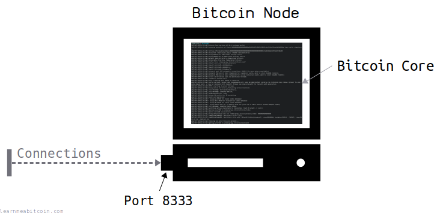
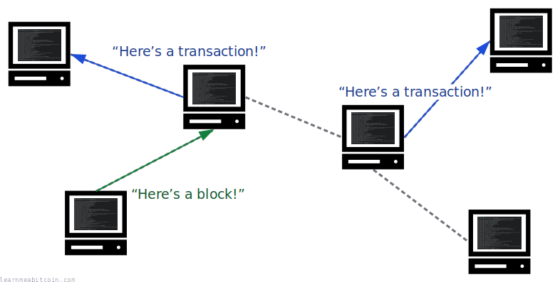
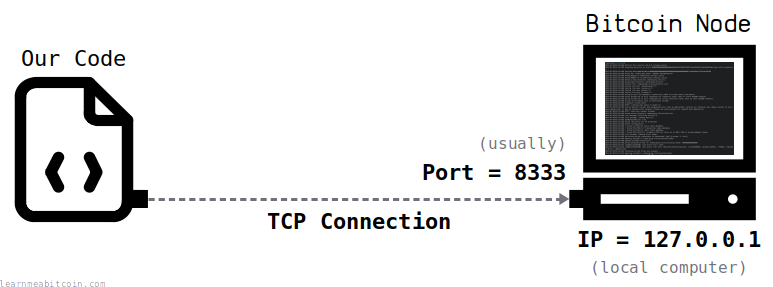
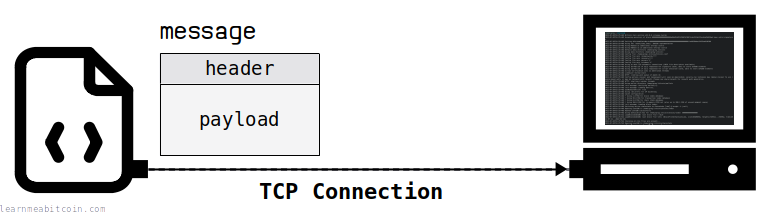
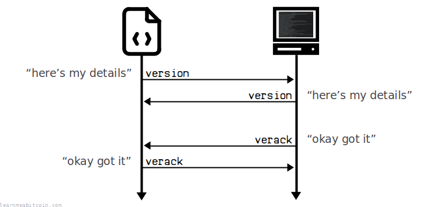
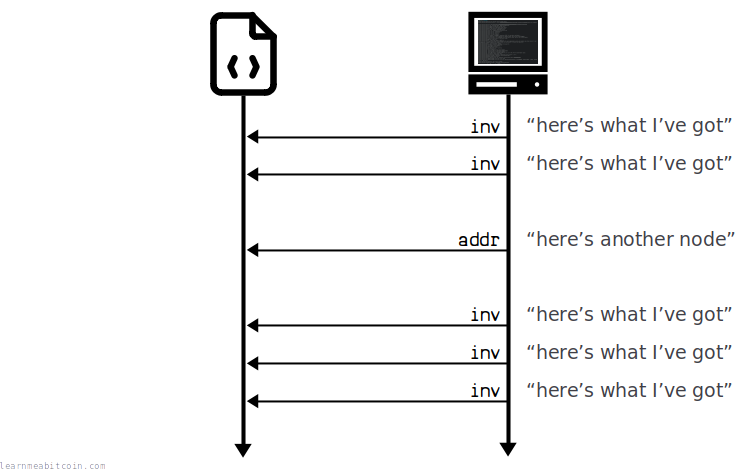
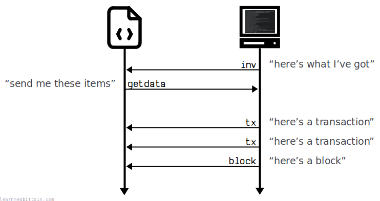
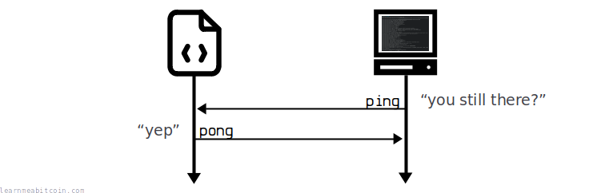

# 网络协议总览 (Networking)


**本页的入门代码适用于 [v26.2](https://github.com/bitcoin/bitcoin/blob/master/doc/release-notes/release-notes-26.2.md) 及以下版本的节点。**

Bitcoin Core [v27.0](https://github.com/bitcoin/bitcoin/blob/master/doc/release-notes/release-notes-27.0.md) (于 2024 年 4 月发布) 及以上版本默认使用 *version 2* 协议 ([BIP 324](https://github.com/bitcoin/bips/blob/master/bip-0324.mediawiki))。底层的消息内容是相同的，只是现在这些消息被*加密*了，而本指南不涉及加密部分。

如果你运行的是 v27.0 或以上版本的节点，你仍然可以通过设置 `-v2transport=0` (禁用 v2 协议并运行旧版的 v1 协议)，使用本页上的示例代码与其进行通信。

以下是一个关于如何*连接到*比特币网络上的节点并与其进行*通信*的快速指南。

[](../images/technical_networking_networking-terminal.gif)

## 网络 (完整代码)

```ruby
# Sockets are in the standard library in Ruby
require 'socket'

# Open a TCP connection to an IP and port
socket = TCPSocket.open("127.0.0.1", 8333) # local computer = 127.0.0.1

require 'digest' # needed for creating checksums

# Handy functions for getting data in the right format for messages
def hexadecimal(number)
    return number.to_s(16)
end

def size(data, size)
    return data.rjust(size*2, '0') # pad the left of the data out with zeros up to a specific number of bytes (2 hexadecimal chars = 1 byte)
end

def reversebytes(bytes)
    return bytes.scan(/../).reverse.join() # grab each 2 characters (1 byte) as an array, reverse the array, then join back together
end

def ascii2hex(string)
    # Convert each character in the string to its hexadecimal byte representation
    bytes = string.each_byte.map {|c| c.to_s(16) }.join()

    # Pad up to 12 bytes (keeping the bytes for the ascii string on the left)
    return bytes.ljust(24, '0')
end

def checksum(bytes)
    # Hash the data twice
    hash = Digest::SHA256.digest(Digest::SHA256.digest([bytes].pack("H*"))).unpack("H*")[0]

    # Return the first 4 bytes (8 characters)
    return hash[0...8]
end

# Create the payload for a version message
payload  = reversebytes(size(hexadecimal(70014), 4))         # protocol version
payload += reversebytes(size(hexadecimal(0), 8))             # services e.g. (1<<3 | 1<<2 | 1<<0)
payload += reversebytes(size(hexadecimal(1640961477), 8))    # time
payload += reversebytes(size(hexadecimal(0), 8))             # remote node services
payload += "00000000000000000000ffff2e13894a"                # remote node ipv6 (https://dnschecker.org/ipv4-to-ipv6.php)
payload += size(hexadecimal(8333), 2)                        # remote node port
payload += reversebytes(size(hexadecimal(0), 8))             # local node services
payload += "00000000000000000000ffff7f000001"                # local node ipv6
payload += size(hexadecimal(8333), 2)                        # local node port
payload += reversebytes(size(hexadecimal(0), 8))             # nonce
payload += "00"                                              # user agent (compact_size, followed by ascii bytes)
payload += reversebytes(size(hexadecimal(0), 4))             # last block

# Create the message header
magic_bytes = 'f9beb4d9'
command     = ascii2hex('version')                                 # 76 65 72 73 69 6F 6E 00 00 00 00 00
size        = reversebytes(size(hexadecimal(payload.length/2), 4)) # 55 00 00 00
checksum    = checksum(payload)
header      = magic_bytes + command + size + checksum

# Combine the header and payload
message = header + payload

# 1. Send Version Message

# Prepare version message
version = message

# Write the message to the socket (the protocol sends and receives messages in raw bytes)
socket.write [version].pack("H*")
puts "version->"
puts version
puts


# 2. Receive Version Message

# Read the message header response from the socket
magic_bytes = socket.read(4)
command     = socket.read(12)
size        = socket.read(4)
checksum    = socket.read(4)

# View the message header
puts "<-version"
puts "magic_bytes: " + magic_bytes.unpack("H*").join  # convert raw bytes to hexadecimal characters
puts "command:     " + command.to_s                   # to_s automatically converts raw bytes to ASCII characters
puts "size:        " + size.unpack("V").join          # V = 32-byte unsigned, little-endian
puts "checksum:    " + checksum.unpack("H*").join

# Read the message payload
size = size.unpack("V").join.to_i
payload = socket.read(size)

# View the message payload
puts "payload:     " + payload.unpack("H*").join
puts


# 3. Receive Verack Message (verack = version acknowledged)

# Read the message header response from the socket
magic_bytes = socket.read(4)
command     = socket.read(12)
size        = socket.read(4)
checksum    = socket.read(4)

# View the message header
puts "<-verack"
puts "magic_bytes: " + magic_bytes.unpack("H*").join  # convert raw bytes to hexadecimal characters
puts "command:     " + command.to_s                   # to_s automatically converts raw bytes to ASCII characters
puts "size:        " + size.unpack("V").join          # V = 32-byte unsigned, little-endian
puts "checksum:    " + checksum.unpack("H*").join

# Read the message payload (there shouldn't be any)
size = size.unpack("V").join.to_i
payload = socket.read(size)

# View the message payload (there shouldn't be any)
puts "payload:     " + payload.unpack("H*").join
puts

# 4. Send Verack Message

# Create verack message
payload     = '' # verack has no payload, it's just a message header
magic_bytes = 'f9beb4d9'
command     = ascii2hex('verack')
size        = reversebytes(size(hexadecimal(payload.size/2), 4))
checksum    = checksum(payload)
verack      = magic_bytes + command + size + checksum + payload

# Write the message to the socket
socket.write [verack].pack("H*")
puts "verack->"
puts "magic_bytes: " + magic_bytes
puts "command:     " + 'verack'
puts "size:        " + size.to_i(16).to_s
puts "checksum:    " + checksum
puts "payload:     " + payload
puts

# Keep reading messages
loop do

    # Create an empty buffer to help us find the next stream of magic bytes (the start of a new message)
    buffer = ''

    # Keep looping to read bytes from the socket
    loop do

        # Read one byte at the time
        byte = socket.read(1)

        # Check that we haven't been disconnected from the node.
        if byte.nil?
            puts "Read a nil byte from the socket. Looks like the remote node has disconnected from us. We probably failed the handshake too many times, or didn't respond to enough pings. No worries, try connecting to another node for the time being instead."
            exit
        end

        # Add each byte to the temporary buffer
        buffer += byte.unpack("H*").join unless byte.nil? # do not do anything if we got a nil byte for some reason

        # Check the buffer when it reaches 4 bytes
        if (buffer.size == 8) # 8 hexadecimal characters = 4 bytes

            # See if the buffer matches the magic bytes
            if (buffer == 'f9beb4d9')

                # If we've got the magic bytes we're looking for, go ahead and read the full message from the socket
                command     = socket.read(12).to_s.delete("\x00")  # convert to ascii and remove any empty bytes
                size        = socket.read(4).unpack("V").join.to_i # convert to an integer
                checksum    = socket.read(4).unpack("H*").join     # convert to hexadecimal string of bytes
                payload     = socket.read(size).unpack("H*").join  # use the size from the header to read the payload, then convert to a hexadecimal string

                # Print the message
                puts "<-#{command}"
                puts "magic_bytes: " + buffer
                puts "command:     " + command
                puts "size:        " + size.to_s
                puts "checksum:    " + checksum
                puts "payload:     " + payload
                puts

                # Respond to all inv messages with getdata messages
                if command == "inv"

                    # Set new command name
                    command = "getdata"

                    # Use the same payload as the one we got from the inv message
                    payload = payload

                    # Create message
                    magic_bytes = 'f9beb4d9'
                    command_hex = ascii2hex(command)
                    size        = reversebytes(size(hexadecimal(payload.size/2), 4))
                    checksum    = checksum(payload)
                    message     = magic_bytes + command_hex + size + checksum + payload

                    # Print the message header and payload
                    puts "#{command}->"
                    puts "magic_bytes: " + magic_bytes
                    puts "command:     " + command
                    puts "size:        " + (payload.size/2).to_s
                    puts "checksum:    " + checksum
                    puts "payload:     " + payload
                    puts

                    # Send the message (convert from hexadecimal string to raw bytes first)
                    socket.write [message].pack("H*")

                end

                # Respond to all ping messages with pong messages
                if command == "ping"

                    # Set new command name
                    command = "pong"

                    # Use the same payload as the one we got from the ping message
                    payload = payload

                    # Create message
                    magic_bytes = 'f9beb4d9'
                    command_hex = ascii2hex(command)
                    size        = reversebytes(size(hexadecimal(payload.size/2), 4))
                    checksum    = checksum(payload)
                    message     = magic_bytes + command_hex + size + checksum + payload

                    # Print the message header and payload
                    puts "#{command}->"
                    puts "magic_bytes: " + magic_bytes
                    puts "command:     " + command
                    puts "size:        " + (payload.size/2).to_s
                    puts "checksum:    " + checksum
                    puts "payload:     " + payload
                    puts

                    # Send the message (convert from hexadecimal string to raw bytes first)
                    socket.write [message].pack("H*")

                end

                # Break out of the loop for reading a single message
                break

            end

            # Reset the buffer and keep looking for a stream of magic bytes
            buffer = ''

        end

    end

end
```

## 0. 简介 (Intro)

比特币 (Bitcoin) 是一个计算机程序。你可以免费[下载](https://bitcoin.org/en/download)它。

它在你的计算机上的一个开放端口上运行，这意味着任何人都可以通过互联网连接到它并与其通信。

[](../images/diagrams_png_networking.png)

计算机之间通过“端口”相互连接。比特币默认使用端口 `8333`。

当你运行比特币时，它使用端口连接到运行相同程序的其他计算机。因此，当有很多人在运行比特币时，你最终会得到一个由计算机组成的网络，它们相互连接并相互通信。

[](../images/diagrams_png_networking-network-chatter.png)

比特币网络上的计算机相互共享最新的[交易](transaction.md)和[区块](block.md)。

无论如何，关于比特币的酷炫之处在于，**如果你愿意，你可以编写自己的基本程序来连接到节点**。你只需要知道如何用它的语言交流。

在本指南中，我将向你展示如何使用 [Ruby](https://www.ruby-lang.org/en/) 连接到比特币节点。Ruby 是一种简单的语言，所以你应该能够将代码转换为你喜欢使用的任何语言。我个人比较喜欢 Ruby。

相信我，如果*我*能连接到比特币节点，那么任何人都可以。

## 1. 连接 (Connecting)

[8333</code> and a local IP." width="773" height="287" />](../images/diagrams_png_networking-connecting.png)

首先，你需要了解关于比特币程序的两个简短事实：

* 它运行在 **`8333` 端口** (通常情况)
* 它使用 **TCP** 进行通信

因此，连接到比特币节点你只需要知道运行它的计算机的 **IP 地址**，并且能够从你所使用的编程语言发起 **TCP 连接**。例如：

```ruby
# Sockets are in the standard library in Ruby
require 'socket'

# Open a TCP connection to an IP and port
socket = TCPSocket.open("162.120.69.182", 8333) # local computer = 127.0.0.1
```

这样我们就和比特币节点建立连接了。

但这本身相当无聊。要开始*接收*数据 (例如实际的[交易](transaction.md)和[区块](block.md))，你需要首先向它发送一些*消息* (messages)。

* 如果你还没有可连接的 IP，请参阅[查找节点 (Finding Nodes)](#finding-nodes)。最简单的方法是连接到你自己的本地节点 (`127.0.0.1`)，或者如果你愿意，可以尝试连接到在此服务器上运行的节点 (`162.120.69.182`)。
* 你可以使用这个 [Bitnodes.io 工具](https://bitnodes.io/#join-the-network)来检查远程节点是否接受传入的连接。

以下是你通常会发现比特币运行的端口：

```text
mainnet =  8333
testnet = 18333
regtest = 18444
```

**TCP = 传输控制协议 (Transmission Control Protocol)。** 这只是两台计算机在互联网上相互通信的一种方式 (一台先说你好，另一台回复你好，等等)。例如，你的计算机在下载此网页时使用了 TCP。另一种协议是 UDP，但不太常见。你不需要了解这些协议是如何工作的：你只需要知道比特币使用 TCP。

## 2. 消息 (Messages)

“消息 (message)”只是比特币节点通过网络相互发送的一段结构化数据。它们都具有相同的格式：

[](../images/diagrams_png_networking-message.png)

以下是*实际*的比特币消息示例：

```text
Header:  F9BEB4D976657273696F6E0000000000550000002C2F86F3
Payload: 7E1101000000000000000000C515CF6100000000000000000000000000000000000000000000FFFF2E13894A208D000000000000000000000000000000000000FFFF7F000001208D00000000000000000000000000
```

这现在看起来像行话，但等下就会明白。

当你构建要发送给另一个节点的消息时，你基本上是将正常的人类可读数据 (如数字和文本) 转换为计算机可读的[字节](general/bytes.md)，以便可以更有效地通过网络发送。

因此，在比特币中发送消息的诀窍只是将一堆数据整理成*正确的格式*。

所以我将从向你展示消息标头 (`header`) 和有效载荷 (`payload`) 的基本结构开始，然后我将向你展示如何自己构建一个。我将使用 "version" (版本) 类型的消息作为第一个示例，因为这是连接到比特币节点后你想要发送的第一条消息。

> “version”消息在连接开始时将发射节点的信息提供给接收节点。在两个对等节点交换了“version”消息之前，将不接受任何其他消息。

[developer.bitcoin.org](https://developer.bitcoin.org/reference/p2p_networking.html)


### 版本 (Version)

#### 标头 (Header)

标头包含**消息的摘要**，它的结构在比特币协议中的每条消息都是相同的。

以下是 "version" 消息标头的样子：

```text
Header: (version message)
┌─────────────┬──────────────┬───────────────┬───────┬─────────────────────────────────────┐
│ Name        │ Example Data │ Format        │ Size  │ Bytes                               │
├─────────────┼──────────────┼───────────────┼───────┼─────────────────────────────────────┤
│ Magic Bytes │              │ bytes         │     4 │ F9 BE B4 D9                         │
│ Command     │ "version"    │ ascii bytes   │    12 │ 76 65 72 73 69 6F 6E 00 00 00 00 00 │
│ Size        │ 85           │ little-endian │     4 │ 55 00 00 00                         │
│ Checksum    │              │ bytes         │     4 │ F7 63 9C 60                         │
└─────────────┴──────────────┴───────────────┴───────┴─────────────────────────────────────┘
```

##### 字段 (Fields)

* **[魔术字节 (Magic Bytes)](networking/magic-bytes.md):** 这是一个用于标识新消息开始的唯一点字节集。它们始终相同。你看，在接收消息时，你将从 TCP 连接读取字节流，因此能够识别新消息何时开始很方便。这组看似随机的字节是经过特别挑选的，因为它们不太可能出现在消息的其他任何地方。
* **命令 (Command):** 这指示了正在发送的消息类型。你可以在比特币协议中发送不同类型的消息，它们包含不同类型的信息。它是一个 12 字节的字段，包含消息类型名称的 *ASCII* 编码。本例中的命令表明我们正在发送 "version" (版本) 消息，它用于将我们自己的信息发送给另一个节点。

  | Field | Value |
  | --- | --- |
  | Hex | `0 bytes` |
  | Bytes | |
  | ASCII | `0 characters`<br><br>+ The hex bytes **between `0x20` and 0x7f** contain the *printable characters*.<br>+ Anything **`0x1f` or below** is a *control character* (will not display, or will display a weird character).<br>+ Anything **`0x80` or above** will show *nothing*.<br><br>See the [ISO 646](https://en.wikipedia.org/wiki/ISO/IEC_646) encoding standard for details. |
* **大小 (Size):** 这是即将到来的有效载荷的大小。这表示你需要从套接字读取多少字节才能获得正在发送的完整消息。
* **[校验和 (Checksum)](keys/checksum.md):** 它是有效载荷的小型指纹。它使我们能够快速检查有效载荷中的数据在传输过程中是否被篡改。它是通过对有效载荷进行双重哈希处理，然后获取结果的前 4 个字节来创建的。

#### 有效载荷 (Payload)

有效载荷包含消息的**主要内容**。不同的消息类型具有不同结构的有效载荷。

以下是 "version" 消息的有效载荷：

```
Payload (version message):
┌───────────────────────┬─────────────────────┬────────────────────────────┬─────────┬─────────────────────────────────────────────────┐
│ Name                  │ Example Data        │ Format                     │    Size │ Example Bytes                                   │
├───────────────────────┼─────────────────────┼────────────────────────────┼─────────┼─────────────────────────────────────────────────┤
│ Protocol Version      │ 70014               │ little-endian              │       4 │ 7E 11 01 00                                     │
│ Services              │ 0                   │ bit field, little-endian   │       8 │ 00 00 00 00 00 00 00 00                         │
│ Time                  │ 1640961477          │ little-endian              │       8 │ C5 15 CF 61 00 00 00 00                         │
│ Remote Services       │ 0                   │ bit field, little-endian   │       8 │ 00 00 00 00 00 00 00 00                         │
│ Remote IP             │ 46.19.137.74        │ ipv6, big-endian           │      16 │ 00 00 00 00 00 00 00 00 00 00 FF FF 2E 13 89 4A │
│ Remote Port           │ 8333                │ big-endian                 │       2 │ 20 8D                                           │
│ Local Services        │ 0                   │ bit field, little-endian   │       8 │ 00 00 00 00 00 00 00 00                         │
│ local IP              │ 127.0.0.1           │ ipv6, big-endian           │      16 │ 00 00 00 00 00 00 00 00 00 00 FF FF 7F 00 00 01 │
│ Local Port            │ 8333                │ big-endian                 │       2 │ 20 8D                                           │
│ Nonce                 │ 0                   │ little-endian              │       8 │ 00 00 00 00 00 00 00 00                         │
│ User Agent            │ ""                  │ compact size, ascii        │ compact │ 00                                              │
│ Last Block            │ 0                   │ little-endian              │       4 │ 00 00 00 00                                     │
└───────────────────────┴─────────────────────┴────────────────────────────┴─────────┴─────────────────────────────────────────────────┘
```

"version" 消息是你在比特币中可以发送的较为复杂的消息之一，但这仅仅是因为它包含了大量信息。不过这是一个很好的起点，因为如果你能构建一条 "version" 消息，你就能构建比特币协议中的任何消息。

##### 字段 (Fields)

以下是每个单独字段针对此特定消息的含义：

* **协议版本 (Protocol Version):** 这是我们节点理解的协议版本。协议的不同版本有不同的消息，因此通过提供我们的协议版本，我们让其他节点知道我们可以处理哪种消息。
* **服务 (Services):** 这是你的节点可以提供的可选服务列表。这是一个 64 位字段，其中每一位都可以设置为 `1` 以指示你提供的不同服务 (完整列表请参见[此表](https://developer.bitcoin.org/reference/p2p_networking.html#version))。例如，设置第一位 (右侧) 表示你是全节点，可以提供区块链中的所有区块。如果你只是在测试，可以将其保留为零。
* **时间 (Time):** 你计算机的时间，以 Unix 时间戳表示 (自 1970 年 1 月 1 日以来的秒数)。
* **远程服务 (Remote Services):** 这是你认为你要连接的节点可以提供的可选服务列表。它的结构与上面的主要“服务 (Services)”字段相同。我不确定这为什么有用或它实际用于什么，所以我将其保留为零。
* **远程 IP (Remote IP):** 这是你认为你要连接到的节点的 IP 地址。这采用 IPv6 格式 (如果需要，你可以轻松地在 [IPv4 和 IPv6 之间转换](https://dnschecker.org/ipv4-to-ipv6.php))。我认为这也不是至关重要的，但我仍然将其设置为我要连接的 IP。
* **远程端口 (Remote Port):** 这是你认为你要连接到的节点的端口。我只是把它保留为默认的 `8333`。
* **本地服务 (Local Services):** 这是你的节点提供的服务列表。我不确定为什么会重复这个。
* **本地 IP (Local IP):** 这是你认为你的本地 IP。这是你的 IPv6 格式的 IP 地址 (同样的，如果需要，你可以 [在 IPv4 和 IPv6 之间转换](https://dnschecker.org/ipv4-to-ipv6.php))。远程节点实际上并不使用它，所以你可以根据需要进行设置。我只是将其设置为 localhost (`127.0.0.1`)。
* **本地端口 (Local Port):** 这是你从中进行通信的本地端口。同样，我认为这不是至关重要的，但我将其保留为默认的 `8333`。
* **随机数 (Nonce):** 一个随机生成的数字，可用于稍后检测到自己的连接。如果不需要，你可以将其留为零，它将被忽略。
* **用户代理 (User Agent):** 你可以用来在网络上识别节点品牌和型号的自定义字符串。Bitcoin Core 使用诸如 "/Satoshi:22.0.0/" 之类的字符串，但如果你愿意，可以放入 "Awesome Node 5000" 之类的名称。当你运行 `bitcoin-cli getpeerinfo` 时，你可以亲眼看到这些用户代理。如果你愿意，你可以将此字段留空，但只要记住你仍然需要在此字段中放置一个 `00` 字节以指示你没有提供任何后续字节。
* **最新区块 (Last Block):** 你的本地区块链中最高区块的高度。如果你没有任何区块或不想共享任何区块，请将其留为零。

正如我所说，这是较为复杂的消息之一，所以不要让它打消你尝试连接到节点的念头。去试试看。

## 代码 (Code)

以下是在 Ruby 中构建 "version" 消息的一些示例代码：

```ruby
require 'digest' # needed for creating checksums

# Handy functions for getting data in the right format for messages
def hexadecimal(number)
    return number.to_s(16)
end

def size(data, size)
    return data.rjust(size*2, '0') # pad the left of the data out with zeros up to a specific number of bytes (2 hexadecimal chars = 1 byte)
end

def reversebytes(bytes)
    return bytes.scan(/../).reverse.join() # grab each 2 characters (1 byte) as an array, reverse the array, then join back together
end

def ascii2hex(string)
    # Convert each character in the string to its hexadecimal byte representation
    bytes = string.each_byte.map {|c| c.to_s(16) }.join()

    # Pad up to 12 bytes (keeping the bytes for the ascii string on the left)
    return bytes.ljust(24, '0')
end

def checksum(bytes)
    # Hash the data twice
    hash = Digest::SHA256.digest(Digest::SHA256.digest([bytes].pack("H*"))).unpack("H*")[0]

    # Return the first 4 bytes (8 characters)
    return hash[0...8]
end

# Create the payload for a version message
payload  = reversebytes(size(hexadecimal(70014), 4))         # protocol version
payload += reversebytes(size(hexadecimal(0), 8))             # services e.g. (1<<3 | 1<<2 | 1<<0)
payload += reversebytes(size(hexadecimal(1640961477), 8))    # time
payload += reversebytes(size(hexadecimal(0), 8))             # remote node services
payload += "00000000000000000000ffff2e13894a"                # remote node ipv6 (https://dnschecker.org/ipv4-to-ipv6.php)
payload += size(hexadecimal(8333), 2)                        # remote node port
payload += reversebytes(size(hexadecimal(0), 8))             # local node services
payload += "00000000000000000000ffff7f000001"                # local node ipv6
payload += size(hexadecimal(8333), 2)                        # local node port
payload += reversebytes(size(hexadecimal(0), 8))             # nonce
payload += "00"                                              # user agent (compact_size, followed by ascii bytes)
payload += reversebytes(size(hexadecimal(0), 4))             # last block

# Create the message header
magic_bytes = 'f9beb4d9'
command     = ascii2hex('version')                                 # 76 65 72 73 69 6F 6E 00 00 00 00 00
size        = reversebytes(size(hexadecimal(payload.length/2), 4)) # 55 00 00 00
checksum    = checksum(payload)
header      = magic_bytes + command + size + checksum

# Combine the header and payload
message = header + payload
```

**最棘手的部分是确保将数据转换为正确的字节和正确的顺序。** 这就是上面代码中所有那些实用函数的用武之地。但是，一旦你掌握了转换为[十六进制](general/hexadecimal.md)并将字节顺序转换为[小端序 (little-endian)](general/little-endian.md)的方法，那就没那么糟糕了。

这就是我们最终的 "version" 消息作为十六进制字节字符串的样子：

```text
F9BEB4D976657273696F6E0000000000550000002C2F86F37E1101000000000000000000C515CF6100000000000000000000000000000000000000000000FFFF2E13894A208D000000000000000000000000000000000000FFFF7F000001208D00000000000000000000000000
```

所以现在我们知道如何构建消息了，我们可以开始与刚刚连接的节点进行通信。

## 3. 握手 (Handshake)

> 握手 (Handshaking) 是在两个网络设备之间建立通信的过程。

在我们开始接收数据之前，我们需要进行一次“握手”。这次握手只是我们相互发送的一系列消息，用来让一切运转起来。

在比特币协议中，握手是这样进行的：

[](../images/diagrams_png_networking-handshake.png)

因此，握手基本上是一个分为两步的过程：

1. 我们通过发送我们的 "version" 消息来发起通信，然后他们回复自己的 "version" 消息。
2. 然后他们发送一条 "verack" 消息，**确认** (acknowledge) 他们已收到我们的**版本** (version) 消息，最后我们也发送一条 "verack" 消息回复给他们。

这就是它的全部内容。

**握手中消息的*顺序*很重要。** 如果弄错顺序，握手将失败，对方节点将拒绝你的连接。你总是可以重试，但是如果你把握手搞砸太多次，你可能会被暂时封禁。如果发生这种情况，在此期间你可以连接到另一个节点。

### 消息准备 (Message preparation)

我们需要发送两条消息来完成握手：

1. [版本消息 (Version Message)](#version)
2. [确认消息 (Verack Message)](#verack)

我们已经准备好了我们的 "version" 消息，所以让我们创建一个 "verack" 消息。

#### 确认 (Verack)

"verack" 是一个没有有效载荷的简单消息标头：

```
Verack Message:
┌─────────────┬──────────────┬───────────────┬───────┬─────────────────────────────────────┐
│ Name        │ Example Data │ Format        │ Size  │ Example Bytes                       │
├─────────────┼──────────────┼───────────────┼───────┼─────────────────────────────────────┤
│ Magic Bytes │              │ bytes         │     4 │ F9 BE B4 D9                         │
│ Command     │ "verack"     │ ascii bytes   │    12 │ 76 65 72 61 63 6B 00 00 00 00 00 00 │
│ Size        │ 0            │ little-endian │     0 │ 00 00 00 00                         │
│ Checksum    │              │ bytes         │     4 │ 5D F6 E0 E2                         │
└─────────────┴──────────────┴───────────────┴───────┴─────────────────────────────────────┘

Hexadecimal: F9BEB4D976657261636B000000000000000000005DF6E0E2
```

"verack" 消息始终是相同的。

### 发送和接收消息 (Sending and receiving messages)

现在我们的消息准备好了，我们只需要将它们发送到我们连接的节点 (并从他们那里接收消息)。

* 要“发送”消息，我们只需将字节*写入*我们的 TCP 套接字连接。
* 要“接收”消息，我们只需从同一个套接字*读取*字节。

## 代码 (Code)

以下是一些 Ruby 代码，显示了如何手动构建每条消息，以及如何向/从套接字连接写入/读取字节：

```ruby
# 1. Send Version Message

# Prepare version message
version = message

# Write the message to the socket (the protocol sends and receives messages in raw bytes)
socket.write [version].pack("H*")
puts "version->"
puts version
puts


# 2. Receive Version Message

# Read the message header response from the socket
magic_bytes = socket.read(4)
command     = socket.read(12)
size        = socket.read(4)
checksum    = socket.read(4)

# View the message header
puts "<-version"
puts "magic_bytes: " + magic_bytes.unpack("H*").join  # convert raw bytes to hexadecimal characters
puts "command:     " + command.to_s                   # to_s automatically converts raw bytes to ASCII characters
puts "size:        " + size.unpack("V").join          # V = 32-byte unsigned, little-endian
puts "checksum:    " + checksum.unpack("H*").join

# Read the message payload
size = size.unpack("V").join.to_i
payload = socket.read(size)

# View the message payload
puts "payload:     " + payload.unpack("H*").join
puts


# 3. Receive Verack Message (verack = version acknowledged)

# Read the message header response from the socket
magic_bytes = socket.read(4)
command     = socket.read(12)
size        = socket.read(4)
checksum    = socket.read(4)

# View the message header
puts "<-verack"
puts "magic_bytes: " + magic_bytes.unpack("H*").join  # convert raw bytes to hexadecimal characters
puts "command:     " + command.to_s                   # to_s automatically converts raw bytes to ASCII characters
puts "size:        " + size.unpack("V").join          # V = 32-byte unsigned, little-endian
puts "checksum:    " + checksum.unpack("H*").join

# Read the message payload (there shouldn't be any)
size = size.unpack("V").join.to_i
payload = socket.read(size)

# View the message payload (there shouldn't be any)
puts "payload:     " + payload.unpack("H*").join
puts

# 4. Send Verack Message

# Create verack message
payload     = '' # verack has no payload, it's just a message header
magic_bytes = 'f9beb4d9'
command     = ascii2hex('verack')
size        = reversebytes(size(hexadecimal(payload.size/2), 4))
checksum    = checksum(payload)
verack      = magic_bytes + command + size + checksum + payload

# Write the message to the socket
socket.write [verack].pack("H*")
puts "verack->"
puts "magic_bytes: " + magic_bytes
puts "command:     " + 'verack'
puts "size:        " + size.to_i(16).to_s
puts "checksum:    " + checksum
puts "payload:     " + payload
puts
```

**字符串和字节 (Strings and Bytes)。** 当“通过网络”发送数据时，你需要将所有数据转换为原始字节。在我给出的代码示例中，尽管看起来我正在处理字节，但实际上我正在处理由*表示*字节的十六进制字符组成的*字符串*。这就是 `pack()` 函数派上用场的地方，因为它允许你将字符串转换为实际字节。你的编程语言应该会有类似的功能。

**套接字编程 (Socket Programming)。** 向套接字写入/读取字节的方式会因一种编程语言而异，因此如果你以前从未做过，可能需要一些时间来适应。

无论如何，一旦你收到了那条 "verack" 消息 (并回传了你自己的消息)，握手就完成了。如果一切正常，该节点将开始向你发送一些*新的*消息类型...

## 4. 接收消息 (Receiving Messages)

我们刚刚连接的节点将在握手后不断向我们发送新消息。因此，为了继续接收这些消息，我们需要做的就是**在循环中不断从套接字读取**。

这些新消息将如下所示：

[](../images/diagrams_png_networking-receiving-data.png)

在上面图表中显示的 "inv" 消息之前，你可能会收到一些不同的消息，这取决于你使用的协议版本。我暂时忽略它们，因为它们并非至关重要。

我稍后会解释这些 "inv" 消息是什么以及如何回应它们。但现在，我只向你展示如何*持续读取*来自你连接节点的*消息*：

## 代码 (Code)

以下代码与之前的代码类似，只是这次我们将其放入*循环*中，以便不断从套接字读取。

```ruby
# Keep reading messages
loop do

    # Create an empty buffer to help us find the next stream of magic bytes (the start of a new message)
    buffer = ''

    # Keep looping to read bytes from the socket
    loop do

        # Read one byte at the time
        byte = socket.read(1)

        # Check that we haven't been disconnected from the node.
        if byte.nil?
            puts "Read a nil byte from the socket. Looks like the remote node has disconnected from us. We probably failed the handshake too many times, or didn't respond to enough pings. No worries, try connecting to another node for the time being instead."
            exit
        end

        # Add each byte to the temporary buffer
        buffer += byte.unpack("H*").join unless byte.nil? # do not do anything if we got a nil byte for some reason

        # Check the buffer when it reaches 4 bytes
        if (buffer.size == 8) # 8 hexadecimal characters = 4 bytes

            # See if the buffer matches the magic bytes
            if (buffer == 'f9beb4d9')

                # If we've got the magic bytes we're looking for, go ahead and read the full message from the socket
                command     = socket.read(12).to_s.delete("\x00")  # convert to ascii and remove any empty bytes
                size        = socket.read(4).unpack("V").join.to_i # convert to an integer
                checksum    = socket.read(4).unpack("H*").join     # convert to hexadecimal string of bytes
                payload     = socket.read(size).unpack("H*").join  # use the size from the header to read the payload, then convert to a hexadecimal string

                # Print the message
                puts "<-#{command}"
                puts "magic_bytes: " + buffer
                puts "command:     " + command
                puts "size:        " + size.to_s
                puts "checksum:    " + checksum
                puts "payload:     " + payload
                puts

                # Break out of the loop for reading a single message
                break

            end

            # Reset the buffer and keep looking for a stream of magic bytes
            buffer = ''

        end

    end

end
```

现在我们可以永远从这个节点持续读取数据了，或者至少直到我的计算机随机崩溃，然后我丢失了过去一小时所写的所有代码，因为我忘了保存它。

## 5. 请求交易和区块 (Requesting Transactions and Blocks)

节点不会公开向你发送它收到的所有新交易和区块。相反，为了节省带宽，它们会在 "inv" (库存, inventory) 消息中向你发送它们收到的最新交易和区块的哈希*列表*。

然后，你可以使用 "getdata" 消息回应这些 "inv" 消息，列出你想要的所有特定交易和区块。

然后，在你发送 "getdata" 消息后，该节点将在随后的 "tx" (交易) 和 "block" (区块) 消息中向你发送你所请求的交易和区块的完整副本：

[](../images/diagrams_png_networking-getting-transactions-and-blocks.png)

### 库存 (Inv)

"inv" 消息的有效载荷如下所示：

```text
Payload: (inv)
┌─────────────┬───────────────────┬──────────┬──────────────────────────────────────────────────────────────────────────────────────────────────────────────┐
│ Name        │ Format            │ Size     │ Example Bytes                                                                                                │
├─────────────┼───────────────────┼──────────┼──────────────────────────────────────────────────────────────────────────────────────────────────────────────┤
│ Count       │ compact size      │ variable │ 01                                                                                                           │
│ Inventory   │ inventory vector  │ variable │ 01 00 00 00 aa 32 5e 91 22 aa 39 ca 18 c7 5a ab e2 a3 ce af 98 02 ac d1 a4 07 20 92 5b fd 77 ff f5 8e d8 21  │
└─────────────┴───────────────────┴──────────┴──────────────────────────────────────────────────────────────────────────────────────────────────────────────┘
```

#### 库存 (Inventory)

有效载荷的 "Inventory" (库存) 部分本身也是*另一种*数据结构。但它非常简单：它只是一个[交易哈希](transaction/input/txid.md)和/或[区块哈希](block/hash.md)的列表：

```text
Inventory:
┌─────────┬───────────────┬───────┬─────────────────────────────────────────────────────────────────────────────────────────────────┐
│ Name    │ Format        │ Size  │ Example Bytes                                                                                   │
├─────────┼───────────────┼───────┼─────────────────────────────────────────────────────────────────────────────────────────────────┤
│ Type    │ little-endian │     4 │ 01 00 00 00                                                                                     │
│ Hash    │ bytes         │    32 │ aa 32 5e 91 22 aa 39 ca 18 c7 5a ab e2 a3 ce af 98 02 ac d1 a4 07 20 92 5b fd 77 ff f5 8e d8 21 │
└─────────┴───────────────┴───────┴─────────────────────────────────────────────────────────────────────────────────────────────────┘

Types:

* 01 00 00 00 = MSG_TX (Transaction Hash)
* 02 00 00 00 = MSG_BLOCK (Block Hash)
```

这里的 Type 表明即将到来的哈希对应的是什么。比如 `1` 表示一笔交易，`2` 表示一个区块。

因此，当你收到一条 "inv" 消息时，它是在告诉你这个节点有些什么新鲜玩意儿，你可以决定是否想请求查看这些对象的完整数据。

### 获取数据 (Getdata)

要在收到 "inv" 消息后获取某个交易或区块，你需要发送一条 "getdata" 消息。

好消息是，**"getdata" 消息的有效载荷格式与 "inv" 消息完全相同**。

因此，向节点请求数据的最简单方法是获取你刚收到的 "inv" 消息的有效载荷，将其粘贴到具有新 "getdata" 标头的消息中，然后将其发送回去。你实质上只是在回复你刚收到的一组完整的哈希。

#### 隔离见证 (Segwit)

**注意:** 在请求*交易*时，如果将 "Type" 更改为 `1` 的隔离见证 (segwit) 等效项，你将获得更多数据 (因为隔离见证将部分交易数据移动到了交易结构的不同部分)。因此，你只需在第 4 个字节添加一个 `40` 字节即可，它就变成了隔离见证类型。

例如，你可以将以下类型：

* `01 00 00 00 = MSG_TX`
* `02 00 00 00 = MSG_BLOCK`

更改为：

* `01 00 00 40 = MSG_WITNESS_TX`
* `02 00 00 40 = MSG_WITNESS_BLOCK`

例如，上述示例中 "getdata" 消息的有效载荷将是：

```text
Payload: (getdata)
┌─────────────┬───────────────────┬──────────┬──────────────────────────────────────────────────────────────────────────────────────────────────────────────┐
│ Name        │ Format            │ Size     │ Example Bytes                                                                                                │
├─────────────┼───────────────────┼──────────┼──────────────────────────────────────────────────────────────────────────────────────────────────────────────┤
│ Count       │ compact size      │ variable │ 01                                                                                                           │
│ Inventory   │ inventory vector  │ variable │ 01 00 00 00 aa 32 5e 91 22 aa 39 ca 18 c7 5a ab e2 a3 ce af 98 02 ac d1 a4 07 20 92 5b fd 77 ff f5 8e d8 21  │
└─────────────┴───────────────────┴──────────┴──────────────────────────────────────────────────────────────────────────────────────────────────────────────┘
```

你应该对所有 "getdata" 消息进行此更改，以确保你获得隔离见证和传统交易的完整交易数据。

无论如何，在发送你的 "getdata" 消息之后，该节点将继续向你发送你在后续单独的 "tx" 和 "block" 消息中请求的交易和区块的完整副本。

## 代码 (Code)

以下是一些 Ruby 代码，该代码响应每一个 "inv"，并回复一个 "getdata" 消息请求有效载荷中的所有内容：

```text
Payload: (getdata)
┌─────────────┬───────────────────┬──────────┬──────────────────────────────────────────────────────────────────────────────────────────────────────────────┐
│ Name        │ Format            │ Size     │ Example Bytes                                                                                                │
├─────────────┼───────────────────┼──────────┼──────────────────────────────────────────────────────────────────────────────────────────────────────────────┤
│ Count       │ compact size      │ variable │ 01                                                                                                           │
│ Inventory   │ inventory vector  │ variable │ 01 00 00 40 aa 32 5e 91 22 aa 39 ca 18 c7 5a ab e2 a3 ce af 98 02 ac d1 a4 07 20 92 5b fd 77 ff f5 8e d8 21  │
└─────────────┴───────────────────┴──────────┴──────────────────────────────────────────────────────────────────────────────────────────────────────────────┘
```

这就是你如何从网络上的实际节点获取最新的交易和区块。

如果你已经到了这一步，并且一切正常，那么你已经弄清楚了如何从头开始连接并与比特币节点进行通信。从此以后的所有工作都只涉及构建不同类型的消息。

这是比特币节点可以互相发送的消息的[完整列表](https://en.bitcoin.it/wiki/Protocol_documentation#Message_types)。

## 6. 保持连接 (Keeping Connected)

离开前最后一件事：你刚才连接的节点偶尔会向你发送 "ping" (乒) 消息，看看你是否还在那里。所以，如果你想保持连接畅通，你需要及时回应 "pong" (乓) 消息。

[](../images/diagrams_png_networking-keeping-connected.png)

### 乒 (Ping)

从协议版本 `60001` 开始，每个 "ping" 消息都包含一个随机数作为其有效载荷：

```ruby
# Keep reading messages
loop do

    # Create an empty buffer to help us find the next stream of magic bytes (the start of a new message)
    buffer = ''

    # Keep looping to read bytes from the socket
    loop do

        # Read one byte at the time
        byte = socket.read(1)

        # Check that we haven't been disconnected from the node.
        if byte.nil?
            puts "Read a nil byte from the socket. Looks like the remote node has disconnected from us. We probably failed the handshake too many times, or didn't respond to enough pings. No worries, try connecting to another node for the time being instead."
            exit
        end

        # Add each byte to the temporary buffer
        buffer += byte.unpack("H*").join unless byte.nil? # do not do anything if we got a nil byte for some reason

        # Check the buffer when it reaches 4 bytes
        if (buffer.size == 8) # 8 hexadecimal characters = 4 bytes

            # See if the buffer matches the magic bytes
            if (buffer == 'f9beb4d9')

                # If we've got the magic bytes we're looking for, go ahead and read the full message from the socket
                command     = socket.read(12).to_s.delete("\x00")  # convert to ascii and remove any empty bytes
                size        = socket.read(4).unpack("V").join.to_i # convert to an integer
                checksum    = socket.read(4).unpack("H*").join     # convert to hexadecimal string of bytes
                payload     = socket.read(size).unpack("H*").join  # use the size from the header to read the payload, then convert to a hexadecimal string

                # Print the message
                puts "<-#{command}"
                puts "magic_bytes: " + buffer
                puts "command:     " + command
                puts "size:        " + size.to_s
                puts "checksum:    " + checksum
                puts "payload:     " + payload
                puts

                # Respond to all inv messages with getdata messages
                if command == "inv"

                    # Set new command name
                    command = "getdata"

                    # Use the same payload as the one we got from the inv message
                    payload = payload

                    # Create message
                    magic_bytes = 'f9beb4d9'
                    command_hex = ascii2hex(command)
                    size        = reversebytes(size(hexadecimal(payload.size/2), 4))
                    checksum    = checksum(payload)
                    message     = magic_bytes + command_hex + size + checksum + payload

                    # Print the message header and payload
                    puts "#{command}->"
                    puts "magic_bytes: " + magic_bytes
                    puts "command:     " + command
                    puts "size:        " + (payload.size/2).to_s
                    puts "checksum:    " + checksum
                    puts "payload:     " + payload
                    puts

                    # Send the message (convert from hexadecimal string to raw bytes first)
                    socket.write [message].pack("H*")

                end

                # Break out of the loop for reading a single message
                break

            end

            # Reset the buffer and keep looking for a stream of magic bytes
            buffer = ''

        end

    end

end
```

### 乓 (Pong)

作为回应，你的 "pong" 消息也只需要在其有效载荷中包含相同的数字：

```text
Payload: (ping)
┌─────────────┬─────────┬──────┬─────────────────────────┐
│ Name        │ Format  │ Size │ Example Bytes           │
├─────────────┼─────────┼──────┼─────────────────────────┤
│ Nonce       │ bytes   │    8 │ 88 c8 49 39 65 b6 41 69 │
└─────────────┴─────────┴──────┴─────────────────────────┘
```

因此，通过对我们的循环做最后一次调整，我们现在可以保持连接处于打开状态并永远接收交易和区块：

## 代码 (Code)

```text
Payload: (pong)
┌─────────────┬─────────┬──────┬─────────────────────────┐
│ Name        │ Format  │ Size │ Example Bytes           │
├─────────────┼─────────┼──────┼─────────────────────────┤
│ Nonce       │ bytes   │    8 │ 88 c8 49 39 65 b6 41 69 │
└─────────────┴─────────┴──────┴─────────────────────────┘
```

**函数 (Functions)。** 为了尽可能保持代码可读，我在代码示例中重复了相同的代码。最好将读取消息和发送消息的代码放入它们各自的函数中。

## 7. 寻找节点 (Finding Nodes)

不知道在哪里可以找到你可以连接的节点？你可以尝试以下几个地方：

* **你自己的节点 (Your own node)。** 如果你下载并在你的本地计算机上运行你自己的 Bitcoin Core 节点，你可以通过 IP 地址 `127.0.0.1` 连接到它。或者如果你将它托管在远程服务器上，请使用该服务器的 IP。
* **[bitnodes.io](https://bitnodes.io/)** 这是一个方便的网站，列出了它能找到的所有比特币网络上可用的节点。
* **DNS 种子 (DNS Seeds)。** 有一些由可信的 Bitcoin Core 开发者运行的 DNS 服务器，会返回一些可靠的全节点的 IP。你可以通过使用任何在线的“DNS 查找”工具来查询这些 DNS 种子。以下是 DNS 种子的一些示例：

  + seed.bitcoin.sipa.be - Pieter Wuille
  + dnsseed.bitcoin.dashjr.org - Luke Dashjr
  + seed.bitcoin.sprovoost.nl - Sjors Provoost

你可以从命令行对 DNS 种子执行 DNS 请求：`nslookup seed.bitcoin.sipa.be`。请注意，如果你正在使用 VPN，这可能不起作用。

### Bitcoin Core

就 *Bitcoin Core* 客户端如何寻找节点来连接而言，它在启动时会按照以下顺序进行查找：

1. **以前的连接 (Previous Connections)。** Bitcoin Core 维护它以前连接过的节点的列表，并在启动后尝试再次连接到这些节点。
2. **DNS 种子 (DNS Seeds)。** 如果你是第一次运行 Bitcoin Core，你将没有以前节点的数据库，因此它将使用像上面那样的 DNS 种子来寻找节点以连接。
3. **硬编码列表 (Hardcoded List)。** 如果其他方法都失败了，Bitcoin Core 附带了一个硬编码的“种子节点”列表，它将连接到这些节点，并将其作为起点来帮助它查找网络上的其他节点。这个列表可以在 [chainparamsseeds.h](https://github.com/bitcoin/bitcoin/blob/master/src/chainparamsseeds.h) 中找到。

最终目标只是能够连接到网络上的*一个*可靠节点，因为从那里该节点就能让你知道你可以连接到的其他节点，依此类推。

## 8. 总结 (Summary)

从头开始连接到一个节点，是开始比特币编程的一种很酷的方式。它可以让你看到节点之间是如何互相通信的，并且让你能够实时访问网络上的最新交易和区块。

你可以用几乎任何你喜欢的编程语言来连接到节点。你所需要的只是能够进行 TCP 连接，并且知道运行着比特币节点的计算机的 IP 和端口号。如果你在本地运行比特币，IP 将会是 `127.0.0.1`，端口默认将会是 `8333`。

迄今为止最棘手的部分是弄清楚如何构建消息。你需要让所有原始数据字节按正确的顺序排列，因为即使你弄错了一个字节，你发送消息的节点也无法理解你的意思。这可能是一个有些令人沮丧的过程，直到你做对为止。但是，一旦你正确发送了第一条消息，所有其他[消息类型](https://en.bitcoin.it/wiki/Protocol_documentation#Message_types)就容易构建得多。

使用我从头开始编写的脚本，从真实的比特币节点获取我的第一笔原始交易，这是我的编程生涯中最令人满意的成就之一。

祝你好运。
```ruby
# Keep reading messages
loop do

    # Create an empty buffer to help us find the next stream of magic bytes (the start of a new message)
    buffer = ''

    # Keep looping to read bytes from the socket
    loop do

        # Read one byte at the time
        byte = socket.read(1)

        # Check that we haven't been disconnected from the node.
        if byte.nil?
            puts "Read a nil byte from the socket. Looks like the remote node has disconnected from us. We probably failed the handshake too many times, or didn't respond to enough pings. No worries, try connecting to another node for the time being instead."
            exit
        end

        # Add each byte to the temporary buffer
        buffer += byte.unpack("H*").join unless byte.nil? # do not do anything if we got a nil byte for some reason

        # Check the buffer when it reaches 4 bytes
        if (buffer.size == 8) # 8 hexadecimal characters = 4 bytes

            # See if the buffer matches the magic bytes
            if (buffer == 'f9beb4d9')

                # If we've got the magic bytes we're looking for, go ahead and read the full message from the socket
                command     = socket.read(12).to_s.delete("\x00")  # convert to ascii and remove any empty bytes
                size        = socket.read(4).unpack("V").join.to_i # convert to an integer
                checksum    = socket.read(4).unpack("H*").join     # convert to hexadecimal string of bytes
                payload     = socket.read(size).unpack("H*").join  # use the size from the header to read the payload, then convert to a hexadecimal string

                # Print the message
                puts "<-#{command}"
                puts "magic_bytes: " + buffer
                puts "command:     " + command
                puts "size:        " + size.to_s
                puts "checksum:    " + checksum
                puts "payload:     " + payload
                puts

                # Respond to all inv messages with getdata messages
                if command == "inv"

                    # Set new command name
                    command = "getdata"

                    # Use the same payload as the one we got from the inv message
                    payload = payload

                    # Create message
                    magic_bytes = 'f9beb4d9'
                    command_hex = ascii2hex(command)
                    size        = reversebytes(size(hexadecimal(payload.size/2), 4))
                    checksum    = checksum(payload)
                    message     = magic_bytes + command_hex + size + checksum + payload

                    # Print the message header and payload
                    puts "#{command}->"
                    puts "magic_bytes: " + magic_bytes
                    puts "command:     " + command
                    puts "size:        " + (payload.size/2).to_s
                    puts "checksum:    " + checksum
                    puts "payload:     " + payload
                    puts

                    # Send the message (convert from hexadecimal string to raw bytes first)
                    socket.write [message].pack("H*")

                end

                # Respond to all ping messages with pong messages
                if command == "ping"

                    # Set new command name
                    command = "pong"

                    # Use the same payload as the one we got from the ping message
                    payload = payload

                    # Create message
                    magic_bytes = 'f9beb4d9'
                    command_hex = ascii2hex(command)
                    size        = reversebytes(size(hexadecimal(payload.size/2), 4))
                    checksum    = checksum(payload)
                    message     = magic_bytes + command_hex + size + checksum + payload

                    # Print the message header and payload
                    puts "#{command}->"
                    puts "magic_bytes: " + magic_bytes
                    puts "command:     " + command
                    puts "size:        " + (payload.size/2).to_s
                    puts "checksum:    " + checksum
                    puts "payload:     " + payload
                    puts

                    # Send the message (convert from hexadecimal string to raw bytes first)
                    socket.write [message].pack("H*")

                end

                # Break out of the loop for reading a single message
                break

            end

            # Reset the buffer and keep looking for a stream of magic bytes
            buffer = ''

        end

    end

end
```

**Functions.** I've repeated the same code in my code examples to keep everything as readable as possible. It would be better to put the code for reading messages and sending messages of these into their own functions.

## 7. Finding Nodes

Don't know where to find a node you can connect to? Here are a few places you can try:

* **Your own node.** If you download and run your own Bitcoin Core node on your local computer, you can connect to it at the IP address `127.0.0.1`. Or if you're hosting it on a remote server, use the IP for that server.
* **[bitnodes.io](https://bitnodes.io/)** This is a handy website that lists all of the available nodes on the Bitcoin network that it can find.
* **DNS Seeds.** There are some DNS servers run by trusted Bitcoin Core developers that will return some IPs of reliable full nodes. You can query these DNS seeds by using any online "DNS lookup" tool. Here are some examples of DNS Seeds:

  + seed.bitcoin.sipa.be - Pieter Wuille
  + dnsseed.bitcoin.dashjr.org - Luke Dashjr
  + seed.bitcoin.sprovoost.nl - Sjors Provoost

You can perform a DNS request on a DNS seed from the command line with: `nslookup seed.bitcoin.sipa.be`. Note that this may not work if you are using a VPN.

### Bitcoin Core

In terms of how the *Bitcoin Core* client finds nodes to connect to, it looks for them in the following order when starting up:

1. **Previous Connections.** Bitcoin Core maintains a list of nodes it has previously connected to, and tries connecting to those again once it starts up.
2. **DNS Seeds.** If you're running Bitcoin Core for the first time, you won't have a database of previous nodes, so it will use DNS Seeds like the ones above to find nodes to connect to.
3. **Hardcoded List.** If all else fails, Bitcoin Core comes with a hard-coded list of "seed nodes" it will connect to and use as a starting point to help it find other nodes on the network. This list can be found in [chainparamsseeds.h](https://github.com/bitcoin/bitcoin/blob/master/src/chainparamsseeds.h).

Ultimately the goal is to just be able to connect to *one* other reliable node on the network, because from there that node will be able to let you know about other nodes you can connect to, and so on and so on.

## 8. Summary

Connecting to a node from scratch is a cool way to get started with programming in Bitcoin. It allows you to see how nodes communicate with each other, and it gives you live access to the latest transactions and blocks on the network.

You can connect to a node from pretty much any programming language you like. All you need is to be able to make TCP connections and have the IP and port number for a computer running a bitcoin node. If you're running bitcoin locally, the IP will be `127.0.0.1` and the port will be `8333` (by default).

The trickiest part by far is figuring out how to construct messages. You need to get all the raw bytes of data in the correct order, because even if you get one byte wrong, the node you're sending messages to will not understand you. And this can be a somewhat frustrating process until you get it right. But once you've got that first message sent correctly, all of the other [message types](https://en.bitcoin.it/wiki/Protocol_documentation#Message_types) are much easier to construct.

Getting my first raw transaction from a real-life bitcoin node using a script I wrote from scratch was one of the most satisfying achievements of my programming career.

Good luck.
