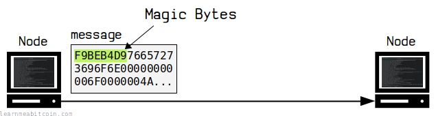
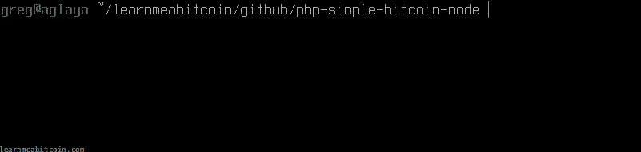

[](https://static.learnmeabitcoin.com/diagrams/png/networking-magic-bytes.png)

Magic bytes help **identify the separate messages** sent between nodes on the [bitcoin network](/technical/networking/).

For example, when [connecting to a node](/technical/networking/#connecting) with your own code, *every message* you receive from that node will start with `f9beb4d9`, and every message you send should begin with the same magic bytes.

## Bitcoin

What are the magic bytes in Bitcoin?

The magic bytes used in Bitcoin are 4 [bytes](/technical/general/bytes/) in length, and they are different for each network:

| Network | Magic Bytes |
| --- | --- |
| Mainnet | `f9beb4d9` |
| Testnet3 | `0b110907` |
| Regtest | `fabfb5da` |

## Examples

Where can you find magic bytes?

This is a raw "[version](/technical/networking/#version)" message, which is the first message you'll receive when connecting to a node:

```
f9beb4d976657273696f6e00000000006f0000004aae42a47c11010005000000000000001436396400000000010000000000000000000000000000000000ffffc1207f8db0d0050000000000000000000000000000000000ffff8a4414c5208df66af23ecba5bd68192f5361746f7368693a302e31322e3128626974636f7265292fc8fb0b0001
```

And this is a raw "tx" message containing a single [transaction](/technical/transaction/):

```
f9beb4d9747800000000000000000000e00000006a86deb701000000015ac5ae0a2ba96622c9b79de2c339084c8b1d30f63bb55a315f354db4d9a6abcf010000006b4830450221009ad52459e1e8bd5e758399cc0be963c75726c5089499465d9aa79ffb304ecd3802207d73ea58047f4d1f857b400cbff725ef562b7ada1c26e763c5a1aa6d29d2fdf401210234b7b614fcc0e4d926747d491992d8cc133f076bd79095eddf60c34b0e3fef4affffffff02390205000000000017a914ea3b6d7e92e05370bc8a61d3f05dbfdc90bb1d9587d1df3000000000001976a91425f0800454530549ed93747a6449aefe2618203988ac00000000
```

If you print out the genesis block from the [raw blockchain files](/technical/block/blkdat/) of your local node, you'll see that it's stored on disk along with the magic bytes too:

```
$ hexdump -C -n 293 blk00000.dat

00000000  f9 be b4 d9 1d 01 00 00  01 00 00 00 00 00 00 00  |................|
00000010  00 00 00 00 00 00 00 00  00 00 00 00 00 00 00 00  |................|
00000020  00 00 00 00 00 00 00 00  00 00 00 00 3b a3 ed fd  |............;...|
00000030  7a 7b 12 b2 7a c7 2c 3e  67 76 8f 61 7f c8 1b c3  |z{..z.,>gv.a....|
00000040  88 8a 51 32 3a 9f b8 aa  4b 1e 5e 4a 29 ab 5f 49  |..Q2:...K.^J)._I|
00000050  ff ff 00 1d 1d ac 2b 7c  01 01 00 00 00 01 00 00  |......+|........|
00000060  00 00 00 00 00 00 00 00  00 00 00 00 00 00 00 00  |................|
00000070  00 00 00 00 00 00 00 00  00 00 00 00 00 00 ff ff  |................|
00000080  ff ff 4d 04 ff ff 00 1d  01 04 45 54 68 65 20 54  |..M.......EThe T|
00000090  69 6d 65 73 20 30 33 2f  4a 61 6e 2f 32 30 30 39  |imes 03/Jan/2009|
000000a0  20 43 68 61 6e 63 65 6c  6c 6f 72 20 6f 6e 20 62  | Chancellor on b|
000000b0  72 69 6e 6b 20 6f 66 20  73 65 63 6f 6e 64 20 62  |rink of second b|
000000c0  61 69 6c 6f 75 74 20 66  6f 72 20 62 61 6e 6b 73  |ailout for banks|
000000d0  ff ff ff ff 01 00 f2 05  2a 01 00 00 00 43 41 04  |........*....CA.|
000000e0  67 8a fd b0 fe 55 48 27  19 67 f1 a6 71 30 b7 10  |g....UH'.g..q0..|
000000f0  5c d6 a8 28 e0 39 09 a6  79 62 e0 ea 1f 61 de b6  |\..(.9..yb...a..|
00000100  49 f6 bc 3f 4c ef 38 c4  f3 55 04 e5 1e c1 12 de  |I..?L.8..U......|
00000110  5c 38 4d f7 ba 0b 8d 57  8a 4c 70 2b 6b f1 1d 5f  |\8M....W.Lp+k.._|
00000120  ac 00 00 00 00                                    |.....|
00000125
```

Here's another "version" message, but this time it's on the **Testnet3** network, so the magic bytes are different:

```
0b11090776657273696f6e000000000066000000c0094f817e1101000d000000000000004659775800000000000000000000000000000000000000000000ffff0000000000000d000000000000000000000000000000000000000000000000003d2324b2fc764108102f5361746f7368693a302e31332e312fab3d100001
```

## Purpose

Why do we use magic bytes?

If you connect to a bitcoin node, the messages you get are part of a continual stream of data.

[](https://static.learnmeabitcoin.com/technical/networking/magic-bytes/magic-bytes-terminal.gif)


Nodes receive data in streams of bytes.

If you are trying to read this data, it's good to have a way of figuring out when a new message may be starting. This is why a specific set of **magic bytes** are used as a **marker** so that you can more easily identify the start of a new message.

So there's nothing actually *magical* about magic bytes; they're just used to help with delimiting a stream of data.

## Origin

Why were these specific bytes chosen?

> The message start string is designed to be unlikely to occur in normal data. The characters are rarely used upper ASCII, not valid as UTF-8, and produce a large 32-bit integer with any alignment.

[chainparams.cpp](https://github.com/bitcoin/bitcoin/blob/306ccd4927a2efe325c8d84be1bdb79edeb29b04/src/chainparams.cpp)

This quote above was originally in the chainparams.cpp file, but has since been [removed](https://github.com/bitcoin/bitcoin/commit/382b692a503355df7347efd9c128aff465b5583e#diff-ff53e63501a5e89fd650b378c9708274df8ad5d38fcffa6c64be417c4d438b6d).

So they could be different, but these are just 4 bytes that have the properties that make for good-enough magic bytes on the Bitcoin network.

* **ASCII.** If you convert the bytes `f9beb4d9` to [Extended ASCII](https://en.wikipedia.org/wiki/Extended_ASCII) you get `ù¾´Ù`, which makes for an unlikely string of characters to be unintentionally placed inside the [scriptsig](/technical/transaction/input/scriptsig/) of a [coinbase transaction](/technical/mining/coinbase-transaction/) by a miner, or as a text string in an [OP\_RETURN](/technical/script/return/) output.
* **UTF-8.** The [basic Latin UTF-8 character set](https://www.w3schools.com/charsets/ref_utf_basic_latin.asp) does not go above `7e`, so if you're encoding some text using basic UTF-8, you're not going to collide with any of the magic bytes (as they're all greater than `7e`).
* **Integers.** If you convert `f9beb4d9` to an integer you get **4190024921**. If you also reverse the byte order to `d9b4bef9` and convert to an integer you get **3652501241**. Both of these are very large numbers, so it's less likely they're going to be used within one of the fields of raw [transaction](/technical/transaction/) data (e.g. [version](/technical/transaction/#structure-version), input count, [vout](/technical/transaction/#structure-inputs-vout), output count, amount, script size, etc.).

 Number Converter

Binary (Base 2)

0b

`0 digits`

Decimal (Base 10)

0d

`0 digits`

Hexadecimal (Base 16)

0x

`0 digits`


+1


0 secs

 Reverse Bytes

Random Example

Bytes

`0 bytes`

Reversed

`0 bytes`


 Show Details


0 secs

It's not impossible for this particular set of bytes to appear within a block or transaction, but it's less likely that they're going to occur naturally, which is the next-best thing.

So you wouldn't rely solely on the magic bytes to identify the start of each message, but it's useful to help identify **where a message likely begins** and also to identify **what network you're working with** (i.e. mainnet, testnet, or regtest).

This particular set of magic bytes is also unique to the Bitcoin protocol.

## Resources

* <https://en.bitcoin.it/wiki/Protocol_documentation#Message_structure>
* <https://en.wikipedia.org/wiki/Magic_number_(programming)>