[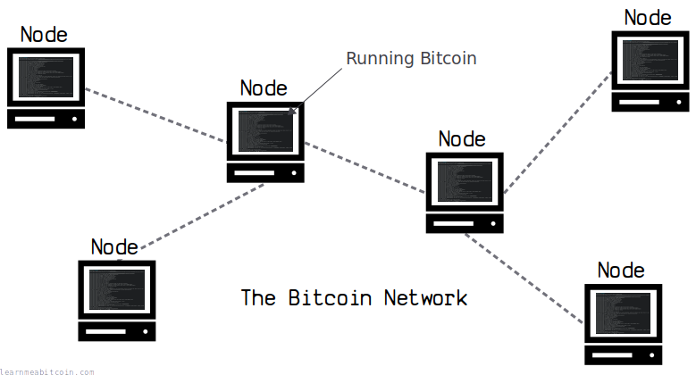](../../images/diagrams_png_node.png)

节点是运行比特币程序的计算机。

它连接到[网络](../networking.md)上的其他节点，以分享有关[交易](../transaction.md)和[区块](../block.md)的信息。

> 节点是连接到网络、发送、接收或处理数据的任何设备。

[techjury.net](https://web.archive.org/web/20250419134646/https://techjury.net/blog/what-is-a-node-in-networking/)

成为节点最简单的方法是下载并运行 [Bitcoin Core](https://bitcoincore.org/en/download/) 软件。

## 工作

节点是做什么的？

节点有两项主要工作：

### 1. 保留一份区块链的副本

[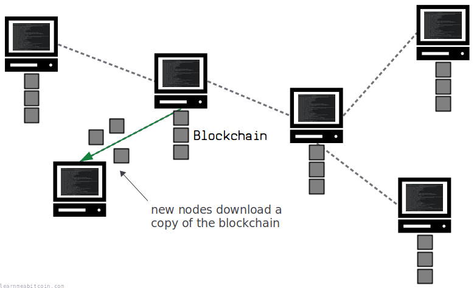](../../images/diagrams_png_node-blockchain.png)

当你第一次运行比特币时，它会连接到网络上的其他节点来下载一份完整的[区块链](../blockchain.md)副本。

这允许你的节点与区块链的当前状态**保持最新同步**，以便你可以开始接收（并验证）在网络中传输的最新交易和区块。

下载完整的区块链还意味着它已**在另一台计算机上进行了复制**。这*增强*了网络，因为任何想要破坏比特币的人都需要尝试移除每一份区块链副本。而且，通过保留区块链的副本，你将有助于向未来加入网络的其他节点进行复制。

当前区块链大小：

856.92 GB

956,479 个区块

注意：这是我本地节点的区块链大小。  
你的区块链大小会有所不同，具体取决于你的节点经历过多少次[链重组](../blockchain/chain-reorganization.md)以及你在磁盘上存储了多少[陈旧区块](../blockchain/chain-reorganization.md#stale-blocks)。

比特币非常像[种子下载 (torrent)](https://en.wikipedia.org/wiki/BitTorrent)，许多不同的计算机都在做种同一个文件（区块链）。

### 2. 验证并中继新交易和区块。

在下载了最新副本的区块链之后，节点就可以**开始接收最新的[交易](../transaction.md)和[区块](../block.md)**。

每个节点都会根据一组规则检查它收到的交易和区块，以确保它们是*有效的*，然后再将它们中继给与其连接的节点。

因此，节点在网络中不断地为**执行规则**和**传输数据**而工作。

#### 交易中继：

[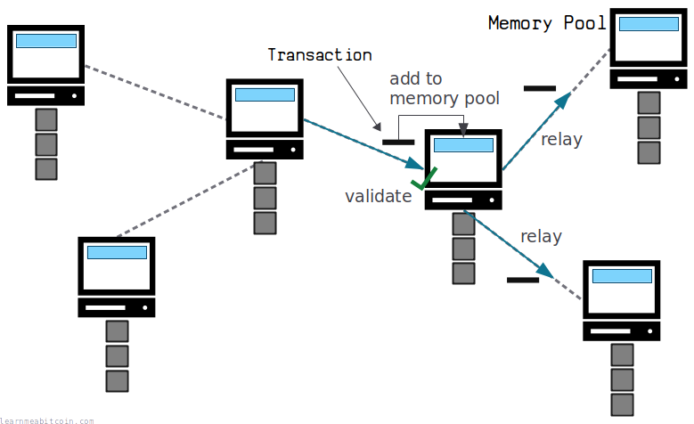](../../images/diagrams_png_node-relay-transaction.png)

新交易会被添加到[内存池](../mining/memory-pool.md)。

#### 区块中继：

[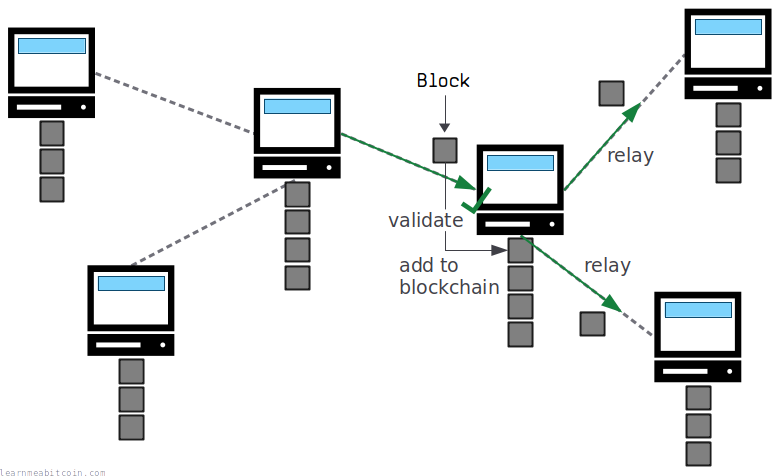](../../images/diagrams_png_node-relay-block.png)

新区块会被写入[区块链](../blockchain.md)。

## 要求

运行比特币节点需要什么？

比特币只是一个计算机 program，所以运行比特币节点所需的全部就是一台**计算机**和一个**互联网连接**。

有一些系统要求可以帮助程序运行顺畅：

### 磁盘空间
:   推荐：2+ TB

    * 当前区块链大小：856.92 GB

    首先也是最重要的一点，你需要一个足够大的硬盘来存储[区块链](../blockchain.md)。

    区块链还以每年约 **100 GB** 的速度增长，所以如果你计划长期运行节点，你需要有足够的可用磁盘空间来跟上。

    你可以通过运行[剪枝节点](#pruned-node)来大幅减少所需的磁盘空间。

### 内存 (RAM)
:   推荐：2+ GB

    * 当前内存池大小：2.57 vMB

    内存用于存储[内存池](../mining/memory-pool.md)中的最新交易，以及存储 [UTXO](../transaction/utxo.md) 以帮助加快新交易和区块的验证。

    你不需要巨大的内存来运行比特币，但你给它分配得越多，它运行得就越高效。

### 带宽
:   推荐：2+ TB/月

    * 传入：平均 2.24 GB/天
    * 传出：平均 25.20 GB/天

    节点会不断地与网络中的其他节点发送和接收数据（[交易](../transaction.md)和[区块](../block.md)），因此你需要足够的带宽来满足这一需求。

    虽然这不是一个天文数字的数据量，但比特币节点将比你用于浏览网页和发送电子邮件的带宽要多得多。

    如果你是种子下载用户，你的月度带宽与你下载和做种 torrent 文件时看到的不会有太大不同。

    你可以使用 `maxuploadtarget` 配置设置来限制节点使用的带宽。

最大的要求是拥有存储区块链的**磁盘空间**，以及在网络上发送和接收最新数据所需的足够**带宽**。

所以比特币并不是世界上最*轻量级*的程序，但完全可以在日常的笔记本或台式计算机上运行它。事实上，人们通常会[在树莓派 (Raspberry Pi) 上设置比特币节点](https://raspibolt.org/)。

**你不需要 24/7 全天候保持比特币节点运行。**

尽可能保持它运行对网络是有帮助的，但你可以根据需要随时启动和停止程序。

> 消息的广播是尽力而为的，节点可以随意离开和重新加入网络，并在它们离开时接受最长的工作量证明链作为发生过什么的证明。

中本聪，[密码学邮件列表 (比特币 P2P 电子现金论文)](https://satoshi.nakamotoinstitute.org/emails/cryptography/1/)

## 通信

节点如何与其他节点通信？

[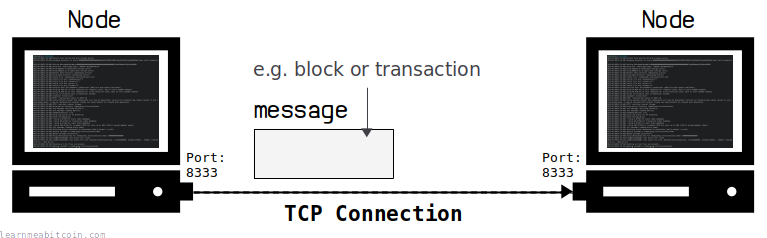](../../images/diagrams_png_node-communication.png)

节点通过发送许多单独的[消息](../networking.md#messages)与其他节点通信。

这些消息是通过 TCP（传输控制协议）发送的，这是网络中两台计算机相互通信的常用方式。

每个节点在通信时还必须遵循特定的*比特币协议*，这基本上就是一组关于节点之间发送的消息结构和顺序的规则。

所以除了遵循特定的协议之外，节点之间的通信方式并没有什么特别之处。与你的计算机和我的服务器必须相互连接并遵循下载此网页的协议（[HTTP](https://en.wikipedia.org/wiki/HTTP)）的原理相同，比特币节点有其自己的自定义协议用于发送和接收交易和区块（比特币协议）。

你的节点将与网络上的许多其他节点保持 TCP 连接，因此你的节点将在多台计算机之间同时发送 and 接收许多消息。例如，运行在该网站上的节点当前有 **`113` 个传入** 和 **`10` 个传出** 连接。

**比特币网络是完全开放且任何人都可以访问的。** 所以只要你遵守连接和发送消息的规则，任何人都可以编写自己的软件来与节点通信。详情请参见[网络](../networking.md)。

## 好处

为什么运行你自己的节点？

有一些原因可能会让你想要运行自己的比特币节点。

### 1. 信任

[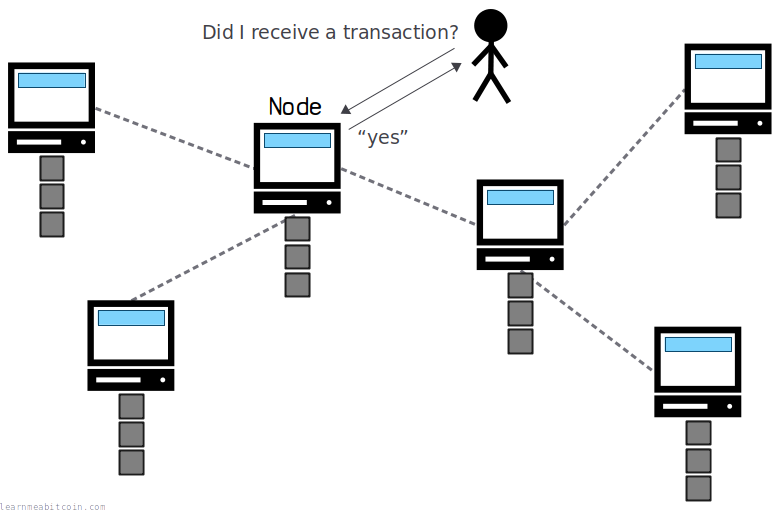](../../images/diagrams_png_node-trust.png)

运行自己的节点意味着你**不需要信任任何其他人关于交易的信息**。

这意味着你可以 100% 确定收到的每一笔付款都是有效的，并且你对区块链的每一次查询都是正确的。如果你不运行自己的节点，你就是在信任运行节点的其他人向你发送正确的交易和区块信息。

我以前从其他节点获取数据从未遇到过问题，但如果你想彻底省去中间人，不依赖任何人，运行自己的节点是实现这一目标的方法。

在最纯粹的形式中，这就是比特币的全部意义所在。

> 不要信任，去验证 (Don't trust, verify)。

比特币中常用的短语

### 2. 隐私

[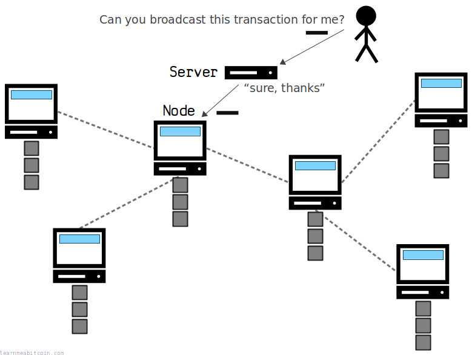](../../images/diagrams_png_node-privacy.png)

运行自己的节点意味着你**不需要与第三方服务共享你的[交易](../transaction.md)**。

如果你不运行自己的节点，你需要使用运行节点的第三方网站或钱包来替你向[网络](../networking.md)发送交易。这些第三方服务可以跟踪你的请求以及你的 IP 地址，以构建你活动的全貌。

你可以想象，这对于隐私来说并不好。

但是，通过运行自己的节点，你可以直接通过自己的节点广播交易，因此它们在进入网络之前不再通过中间人。同样，你可以从自己的区块链中获取数据，而无需使用第三方的区块链浏览器网站。

Again，我到目前为止使用值得信赖的[钱包](../../beginners/wallets.md)或[区块链浏览器](/explorer/)从没遇到过问题，但重要的是要意识到如果这样做可能会存在隐私泄露的*潜在风险*。

### 3. 支持网络

运行你自己的节点以两种方式支持网络：

1. **区块链复制。** 比特币很难被消灭，因为交易的整个历史在世界各地被复制，所以向网络中添加另一个节点会让比特币*更具韧性*。例如，如果网络中的所有其他节点都爆炸了并丢失了其[区块链](../blockchain.md)副本，你将有效地维持整个系统，直到其他节点可以从你那里重新下载区块链。
2. **数据传输。** 比特币之所以起作用，是因为许多单独的节点协同工作以在网络中传播最新的[交易](../transaction.md)和[区块](../block.md)。所以通过运行节点，你是在向网络添加另一个中继。例如，如果有一大批节点下线，并且某些节点由于某种原因无法相互连接，你的节点可能最终会成为网络不同部分之间的关键纽带。

运行节点就像种子下载做种文件一样；每个人都喜欢做种者。

简而言之，通过运行节点，你可以帮助网络*生存下去*。

当然，在网络达到一定规模后，增加节点数量带来的好处会有所减少。毕竟，如果世界各地分布着 10,000 份区块链副本，且所有节点之间都保持着良好的连接，那么再添加一个节点并不会产生巨大的变化。所以并不是每个男人、女人和智能冰箱都非要尽力运行一个节点。

尽管如此，比特币是一个去中心化的系统，它之所以存在，只是因为人们自愿运行节点，而通过这样做，你正在为维持它生存的共同愿景做出贡献。

而且，一个网络永远不会*过于强韧*。

### 4. 开发

如果你打算成为比特币开发者，运行自己的节点是很有用的。

有几个好处：

1. **数据。** 如果你有自己的全节点，你将可以在本地计算机上访问所有的比特币数据。例如，你可以使用 `bitcoin-cli` 命令快速查询区块、交易和网络数据，或者你可以使用 [bitcoin-iterate](https://github.com/rustyrussell/bitcoin-iterate) 等工具分析整个区块链。如果你依靠第三方 API 来获取数据，那么其中的某些任务会很慢和/或很困难。
2. **源代码。** 如果你从头编译 Bitcoin Core，你将可以访问让它运行的代码。这允许你在计算机上浏览代码以查看某项功能是如何工作的，并尝试通过修改它来改进软件。

简而言之，如果你打算*围绕*一个程序进行开发，你可能需要它的一份自己的副本。

当然，运行你自己的节点并不是制作你自己的比特币工具的*必要条件*，但有它在还是很好的。我在所有的计算机上都会安装 [Bitcoin Core](https://bitcoincore.org/en/download/)，即使我没有连续将其作为节点运行。

## 定义

节点有哪些不同的类型？

有几个不同的术语用于描述比特币网络上不同*类型*的节点。

### 全节点 (Full Node)

[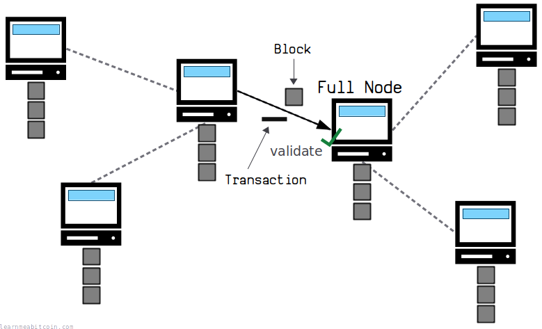](../../images/diagrams_png_node-full-node.png)

全节点是可以跟上区块链并**验证**其接收到的区块 and 交易的节点。

全节点会*接收*区块链的完整副本，这意味着它记忆了交易的完整历史，并且可以确定接收到的任何新区块或交易是否有效。

换句话说，全节点能够对通过它的所有数据**执行系统规则**，因此是网络中的*活跃参与者*。

全节点有两种类型：

#### 1. 归档节点 (Archival Node)

[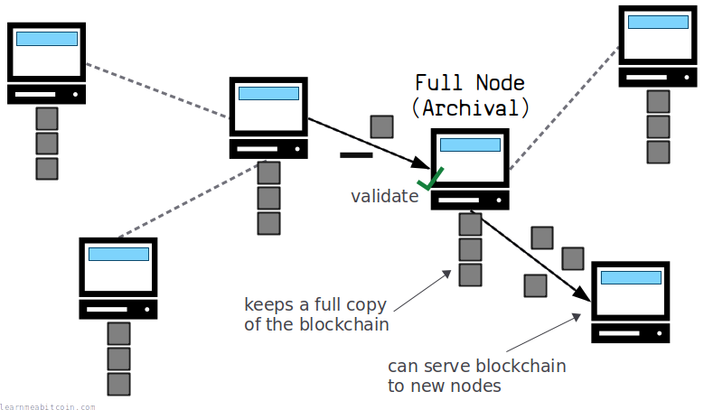](../../images/diagrams_png_node-full-node-archival.png)

归档节点保留**完整的区块链副本**。

这意味着它可以将整个区块链复制给加入网络的任何新节点。

#### 2. 剪枝节点 (Pruned Node)

[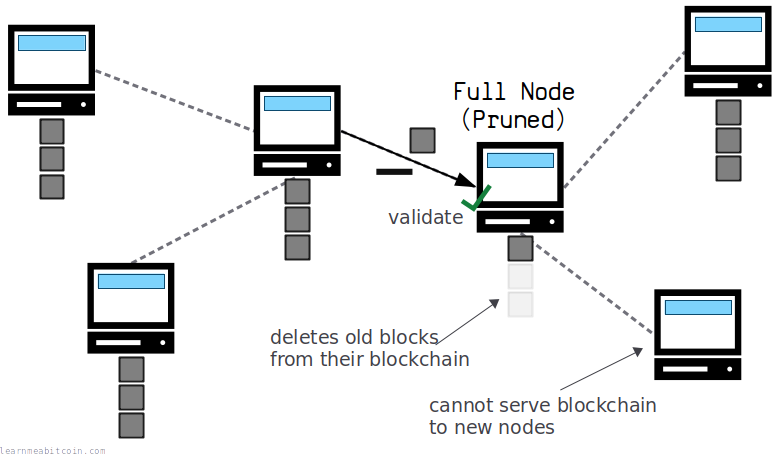](../../images/diagrams_png_node-full-node-pruned.png)

剪枝节点**不保留完整的区块链副本**。

相反，剪枝节点会*接收*区块链的完整副本，但它会删除链上更深处的较旧区块，以节省[磁盘空间](#disk-space)。

所以，虽然剪枝节点很有用，因为它仍然可以执行系统规则（即验证并中继新区块和交易），但它唯一无法做的事情是为加入网络的新节点提供完整的区块链副本。

节点会将所有 [UTXO](../transaction/utxo.md) 保存在单独的数据库中，所以即使剪枝节点在进行中删除了较旧的区块，它也将始终具有 UTXO 的完整副本以供参考，从而使其能够验证新的交易和区块。

### 轻量级节点 (Lightweight Node)

“薄节点 (Thin Node)”、“薄客户端”、“轻量级客户端”

轻量级节点是可以跟上区块链，但它**无法验证**其收到的区块和交易的节点。

相反，轻量级节点可以验证区块或交易是否*存在*于区块链中，但无法确认它们是否有效。

换句话说，轻量级节点**无法执行系统规则**，因此*不是活跃参与者*在网络中。

将“轻量级节点”称为*客户端*更为准确。节点是网络中的活跃参与者，而客户端实际上只是从网络中的其他节点读取数据。

#### SPV 钱包

简单支付验证 (Simple Payment Verification)

一种常见类型的轻量级节点是 SPV 钱包（例如 [Electrum](https://electrum.org/)）。

SPV 钱包只接收区块链的[区块头](../block.md#header)（它比完整的区块小得多），这使它们能够跟上最长链**看起来的样子**：

[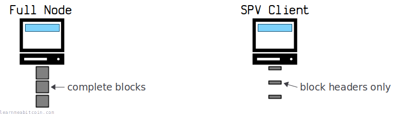](../../images/diagrams_png_node-spv-client.png)

区块头只有 160 字节。完整的区块通常大于 1,000,000 字节。

然后，它可以从全节点请求*证明*以确认特定交易是否在特定区块中：

[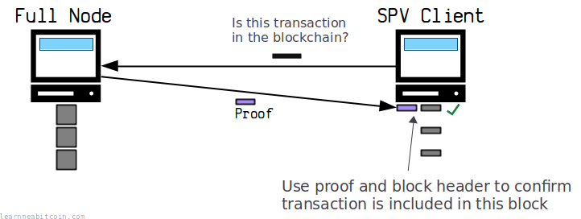](../../images/diagrams_png_node-spv-client-proof.png)

这被称为 [Merkle 证明](../block/merkle-root.md#merkle-proof)。

多亏了这一证明，SPV 钱包可以确信交易确实在区块内，并可以更新钱包的余额。

然而，虽然 SPV 钱包使用极少的带宽和磁盘空间（并可以验证交易是否存在于区块链中），但它必须**信任从全节点向其发送的信息是有效的**。

例如，全节点可以构建一个有效的区块头并将其发送给 SPV 钱包，但*实际*的区块可能包含 invalid 交易。换句话说，全节点如果愿意的话，可以对轻量级节点**说谎**。

[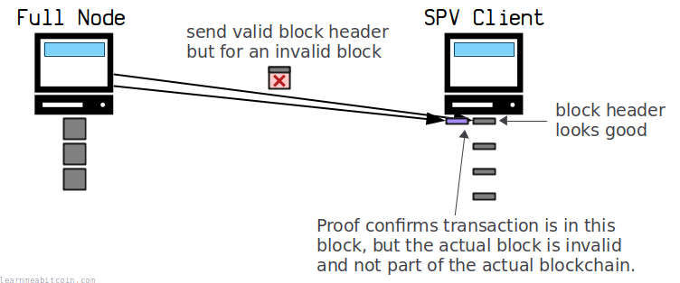](../../images/diagrams_png_node-spv-client-proof-invalid-block.png)

证明和区块头是有效的，但该区块头是从包含无效交易的区块创建的。因此，SPV 客户端认为自己收到了一笔付款，但区块内的这笔交易实际上是无效的。

对于全节点来说，以这种方式向 SPV 钱包说谎需要付出很多努力，因为全节点需要故意[开采](../mining.md)一个无效区块。因此，SPV 钱包在全节点为说谎而付出的代价太高的假设下运行。

如果你想在不信任任何人的情况下*确保*你看到的所有交易都是有效的，你需要运行一个全节点。

### 矿工

矿工是致力于从[内存池](../mining/memory-pool.md)中提取交易并将其添加到[区块链](../blockchain.md)中的人。

然而：

* 节点并不总是矿工。
* 矿工不需要是节点。

在[比特币白皮书](/bitcoin.pdf)中，节点有时被称为矿工，而矿工总是被认为是在运行全节点。

然而，**矿工不需要执行节点的工作**。相反，矿工可以简单地连接到全节点以获取构建[候选区块](../mining/candidate-block.md)所需的信息，然后在完成后将区块发送回全节点。

所以虽然最容易将*矿工*视为“进行区块挖掘的全节点”，但从技术上讲，*节点*和*矿工*可以分开以执行两个不同的角色。

本网站上的许多图表都假设矿工始终作为全节点运行。我这样做是为了让图表尽可能保持简单。

## 实现

我运行全节点需要什么软件？

运行全节点最简单的方法是下载原始实现：

* [Bitcoin Core](https://bitcoincore.org/en/download/)

然而，如果你愿意，还有*其他*实现来运行比特币节点：

* [btcd](https://github.com/btcsuite/btcd) (最受欢迎的替代方案)
* [bcoin](https://github.com/bcoin-org/bcoin)
* [BitcoinJ](https://bitcoinj.org/)

不过这些都远没有原始客户端受欢迎，如果你是设置全节点的新手，我推荐使用 Bitcoin Core。

本网站上提到的所有 `bitcoin-cli` 命令都假设你正在运行 Bitcoin Core 节点。

### 自定义软件

如果你愿意，没有什么能阻止你编写**自己的节点软件**。

比特币[网络](../networking.md)是完全开放的，因此如果你能弄清楚如何[连接](../networking.md#connecting)到其他节点并遵守网络的规则（即你可以发送并接收[交易](../transaction.md)和[区块](../block.md)），那么你将能够使用自己独有的软件来使用比特币。这非常酷。

然而，有些人认为如果没有太多（或任何）相互竞争的比特币软件实现会更好：

> 我不认为比特币的第二种兼容实现会是一个好主意。它的许多设计都取决于所有节点步骤完全一致地得到精确相同的结果，以至于第二种实现会对网络构成威胁。

中本聪，[bitcointalk.org](ttps://bitcointalk.org/index.php?topic=195.msg1611#msg1611)

On the other hand，如果你有*多种*实现，那么它们受到相同漏洞影响的可能性就会降低。所以如果网络上运行某个特定实现的所有节点都因为一个严重漏洞而宕机，运行其他实现的节点仍然在线并能保持网络运行（假设它们没有受到相同漏洞的影响）。

所以我可以理解为什么只拥有单一实现是更可取的，但我认为让网络上的节点运行不同的软件实现是一件好事。

但最重要的一点是，无论如何，**没有人可以阻止你**编写自己的节点软件，如果你想写的话。

而这就是比特币的全部意义所在。

## 资源

* [Running A Full Node](https://bitcoin.org/en/full-node)
* [What is the meaning of the term "full-node"?](https://bitcoin.stackexchange.com/questions/48436/what-is-the-meaning-of-the-term-full-node)