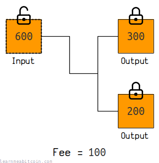
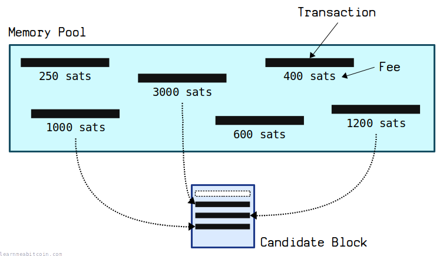
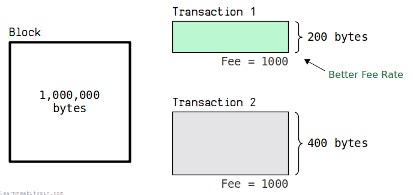
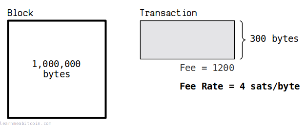
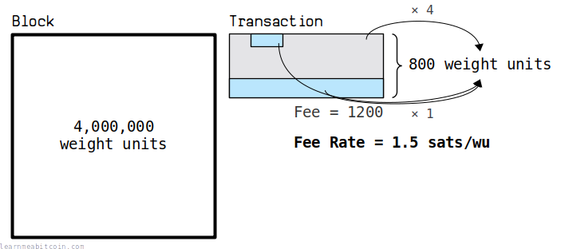
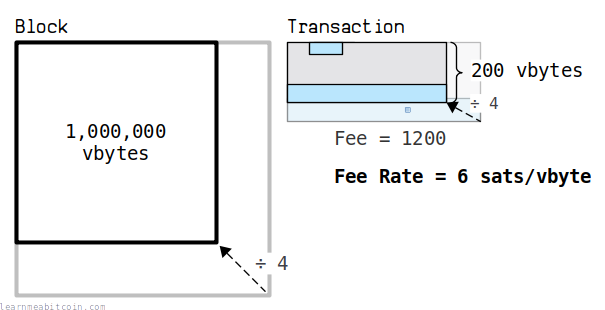
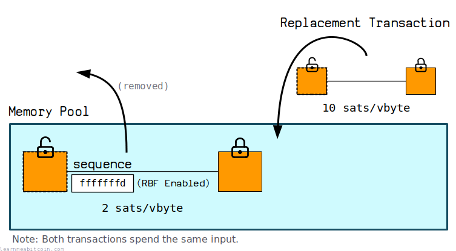
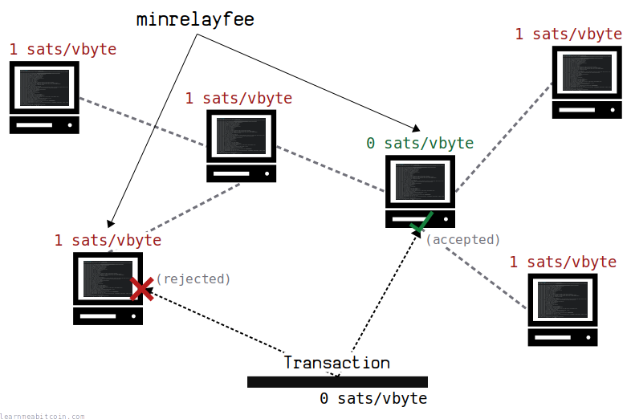

[](https://static.learnmeabitcoin.com/diagrams/png/transaction-fee.png)

A transaction fee is the **remainder of a [transaction](/docs/technical/transaction.md)**.

If you add up all the [input](/docs/technical/transaction/input.md) values and subtract all the [output](/docs/technical/transaction/output.md) values, the amount left over is the fee. For example:

Transaction: [82b81a39d1b6bff8366eab2297f61db7ac34b7d901f5cfc40143ca704ded980e](/explorer/tx/82b81a39d1b6bff8366eab2297f61db7ac34b7d901f5cfc40143ca704ded980e)

```
input  0 = 2699815 satoshis

output 0 = 1593900 satoshis
output 1 = 1060915 satoshis

fee      =   45000 satoshis
```

As you can see there's no designated "fee" output or anything like that. The fee is just the amount of coins that you do not use up in the transaction.

Be careful, as *any* amount of satoshis left over in a transaction will be taken as the fee. Some people have mistakenly set large fees on their transactions by incorrectly sizing their outputs. For example, transaction [cc455ae816e6cdafdb58d54e35d4f46d860047458eacf1c7405dc634631c570d](/explorer/tx/cc455ae816e6cdafdb58d54e35d4f46d860047458eacf1c7405dc634631c570d) had a 291.240900 BTC fee on it.

## Miner Incentive

Why set a fee on a transaction?

A transaction fee acts as an **incentive** for a [miner](/docs/technical/mining.md) to include your transaction in their [candidate block](/docs/technical/mining/candidate-block.md).

This is because miners can collect all the fees from the transactions they have included in their block via the [coinbase transaction](/docs/technical/mining/coinbase-transaction.md) (if they are able to successfully mine the block on to the [blockchain](/docs/technical/blockchain.md)).

[](https://static.learnmeabitcoin.com/diagrams/png/block-coinbase-transaction.png)

Therefore, if there are more transactions in the [memory pool](/docs/technical/mining/memory-pool.md) than can fit inside the next block, miners will choose to fill their candidate blocks with the highest-fee transaction available. This maximizes the amount of bitcoins they are able to claim if they mine the block.

[](https://static.learnmeabitcoin.com/diagrams/png/transaction-fee-miner-incentive.png)

Therefore, setting a fee on your transaction allows you to **compete with other transactions for space in the next block**. Generally speaking:

* The higher the fee, the sooner your transaction will get mined.
* The lower the fee, the longer it will take for your transaction to get mined.

If all of the transactions in the memory pool can fit into the next block, you just can set the *[minimum](#minimum-relay-fee)* fee on your transaction, as there is no competition to get into the next block.

## Feerates

How are transaction fees measured?

Miners want to maximize the amount of fees they can claim from their blocks. To achieve this, they measure each transaction based on how much fee they provide **per the amount of space they take up in a block**.

For example, a small transaction with a large fee on it is more valuable than a large transaction with the same fee on it.

[](https://static.learnmeabitcoin.com/diagrams/png/transaction-fee-rate-basics.png)

So when comparing the fees on transactions, we take the **size of the fee** and divide it by the **size of the transaction** (in terms of how much space it takes up in a block). This is called the *feerate*, and it allows us to compare transactions to figure out which ones are more valuable to miners than others.

* The higher the *feerate*, the sooner your transaction will get mined.
* The lower the *feerate*, the longer it will take for your transaction to get mined.

There are 3 different ways to measure feerates:

1. [sats/byte](#sats-per-byte) (Deprecated)
2. [sats/wu](#sats-per-wu) (Used Internally)
3. [sats/vbyte](#sats-per-vbyte) (Most Common)

### sats/byte (Deprecated)

[](https://static.learnmeabitcoin.com/diagrams/png/transaction-fee-rate-sats-per-byte.png)

The block limit used to be **1,000,000 bytes** (1 MB).

So naturally the value of a transaction to a miner was measured in **satoshis per byte**, or **sats/byte** for short.

However, since the [segregated witness](/docs/technical/upgrades/segregated-witness.md) upgrade ([BIP 141](https://github.com/bitcoin/bips/blob/master/bip-0141.mediawiki)) we now use a new *weight* measurement to determine how many transactions can fit inside a block…

### sats/wu (Used Internally)

[](https://static.learnmeabitcoin.com/diagrams/png/transaction-fee-rate-sats-per-weight-unit.png)

The [block limit](/docs/technical/block.md#weight) is now **4,000,000 weight units**.

The size of transactions are now measured in terms of their [weight](/docs/technical/transaction/size.md#weight), which multiplies the size of most of the transaction data by 4. However, the new [witness](/docs/technical/transaction/witness.md) data gets multiplied by 1, which effectively gives it a discount relative to the other parts of the transaction.

So because blocks now have a maximum *weight* limit, miners measure the feerates of transactions in **satoshis per weight unit** (or **sats/wu** for short).

However, this **sats/wu** is on a different scale to the old **sats/byte** measurement. So to maintain backwards compatibility with old software that still uses **sats/byte**, we have one last measurement for feerates…

### sats/vbyte (Most Common)

[](https://static.learnmeabitcoin.com/diagrams/png/transaction-fee-rate-sats-per-vbyte.png)

If you divide the block limit of 4,000,000 weight units by 4, you get a **1,000,000 virtual bytes**.

And if you divide the weight of a transaction by 4 too, you get back down to pretty much using the same **sats/byte** measurement as before. But now every byte of witness data only counts as 0.25 of a byte, which is why we refer to this measurement as [virtual bytes](/docs/technical/transaction/size.md#vbytes) instead of actual bytes.

The **sats/vbyte** measurement means that the feerates for newer [segwit transactions](/docs/technical/transaction.md#example-segwit) are kept in line with the feerates for legacy transactions measured in **sats/byte**. For example:

Legacy Transaction: [a04c291e586b10f6db4d38bcba414dea2fd39d53745763d13c49026af1f09262](/explorer/tx/a04c291e586b10f6db4d38bcba414dea2fd39d53745763d13c49026af1f09262)

```
fee:          15977 sats

size:         223 bytes
virtual size: 223 vbytes

sats/byte:    72
sats/vbyte:   72
```

Segwit Transaction: [7169e93ede0096c32e4fb90f267ea29fb539324cfc3927ea9ded9066b879a1e8](/explorer/tx/7169e93ede0096c32e4fb90f267ea29fb539324cfc3927ea9ded9066b879a1e8)

```
fee:          10317 sats

size:         226 bytes
virtual size: 143.50 vbytes

sats/byte:    46
sats/vbyte:   72
```

As you can see, a legacy transaction has the same **sats/byte** and **sats/vbyte** feerate.

So instead of using the new *weight* measurement for both, we bring the weight of the new segwit transactions back on to the **same scale** as before. This makes it easy to compare the feerates for transactions on software that still uses **sats/byte**.

Internally in Bitcoin we only care about transactions in terms of weight units. But on things like [blockchain explorers](/explorer/), we tend to use **sats/vbyte** instead of **sats/wu**.

## Fee Bumping

How can you increase the fee on a transaction?

If there are lots of transactions in the [memory pool](/docs/technical/mining/memory-pool.md) and you've sent a **low-fee transaction** into the [network](/docs/technical/networking.md), you may end up waiting for some time for the transaction to get mined.

If this happens, you may want to *increase the fee* on your transaction while it's still sitting in the memory pool. This *increases the incentive* for a miner to include your transaction in their next block, which will subsequently speed up the time it takes for your transaction to get mined.

This process is called "fee bumping", and there are two methods for doing this:

1. [Replace By Fee (RBF)](#rbf)
2. [Child Pays For Parent (CPFP)](#cpfp)

### 1. Replace By Fee (RBF)

[BIP 125](https://github.com/bitcoin/bips/blob/master/bip-0125.mediawiki)

[](https://static.learnmeabitcoin.com/diagrams/png/transaction-replace-by-fee.png)

This is the simplest method.

To enable this feature you just need to set one of the [sequence](/docs/technical/transaction/input/sequence.md) values on your transaction to 0xFFFFFFFD or below. Then whilst this transaction is in the memory pool, you have the option to send a new version of the transaction with a higher fee on it into the memory pool, and this higher-fee transaction will directly replace the old low-fee transaction.

And that's all there is to it. If a node or miner receives a transaction that spends the same inputs (but this time with a higher fee), they will be happy to evict the original transaction from their mempool and keep the new higher-fee transaction instead.

Replace By Fee allows you to *directly* replace transactions in the memory pool.

If a current transaction in the memory pool doesn't have RBF enabled, then there is nothing you can do to replace it. You will just have to wait, or use CPFP (see below) instead.

### 2. Child Pays For Parent (CPFP)

[](https://static.learnmeabitcoin.com/diagrams/png/transaction-child-pays-for-parent.png)

This is an old technique, but it still works today.

Basically, this technique takes advantage of two facts:

1. You can spend the [output](/docs/technical/transaction/output.md) of a transaction whilst it's still in the memory pool.
2. A miner must always include the "parents" of any transaction they include in a block (if the parents are also in the memory pool).

Therefore, if you've got a low-fee transaction sitting in the memory pool, you can incentivize a miner to include that transaction in their next block by spending one of its outputs in a new transaction, and putting a suitably large fee on that new transaction to **make it worth including the first transaction**.

So the child transaction has such a juicy fee on it that it makes it worthwhile for the miner to include the low-fee parent transaction too. Or to be more precise, the child transaction increases the *average feerate* for both transactions.

There's no reason to use CPFP when you can use RBF instead. But it's a handy option to have if you've got a transaction stuck in the memory pool without RBF enabled.

## Minimum Relay Fee

What's the minimum fee you can set on a transaction?

[](https://static.learnmeabitcoin.com/diagrams/png/networking-minrelayfee.png)

You generally want to set at least a `1 sat/vbyte` fee on your transactions due to the *minimum relay fee* settings that nodes use.

Each node can choose their own minimum relay fee. This setting is used so that nodes do not have to waste resources by processing and holding on to low-value transactions that pay little or no fee. So it's a bit like a spam filter.

The current default minimum relay fee is `1 sat/vbyte`.

However, the minimum relay fee is a *policy* and not a consensus rule, so it's not impossible for a zero-fee transaction to get mined into the [blockchain](/docs/technical/blockchain.md). It just means that any node you send a transaction to with a feerate below this setting will not accept or relay it to other nodes.

So basically, unless you know a miner or can mine the transaction yourself, the fee you set on your transaction needs to be above the minimum relay fee of the nodes/miners you're broadcasting your transaction to.

You can find the current minimum relay fee for your node by running `bitcoin-cli getmempoolinfo`. You can adjust this by setting the `minrelaytxfee=<amt>` option in your Bitcoin Core config file.

The default minimum relay fee set by Bitcoin Core can be found in [validation.h](https://github.com/bitcoin/bitcoin/blob/master/src/validation.h). For some reason this is defined as 1000 sat/kb instead of 1 sat/vbyte, but they both mean the same thing.

## Summary

> There will be transaction fees, so [miners] will have an
> incentive to receive and include all the transactions
> they can.

Satoshi Nakamoto, [Cryptography Mailing List (Bitcoin P2P e-cash paper)](https://satoshi.nakamotoinstitute.org/emails/cryptography/13/)

A transaction fee is the remainder of a bitcoin transaction, and it's used as an incentive for a miner to include your transaction in a block.

Miners select transactions based on **fee per weight unit**, which is a measure of how much a miner can get in fees per the amount of space the transaction takes up in a block. This means that if there are lots of transactions being sent into the network at the same time, there will be more competition to get transactions into blocks, and the feerates will increase.

If you set a low fee on your transaction and you find it's not getting mined quickly enough, you can always replace it with a higher-fee transaction using RBF. Or if RBF is not enabled, you can always use CPFP instead to incentivize a miner to include your transaction in their next block.

Lastly, if you're constructing a bitcoin transaction manually, **always double-check the size of your outputs**. Getting a bunch of satoshis eaten up by a miner because you miscalculated the size of your change output is not a fun way to learn how to build transactions correctly. Here are some unfortunate examples:

* [cc455ae816e6cdafdb58d54e35d4f46d860047458eacf1c7405dc634631c570d](/explorer/tx/cc455ae816e6cdafdb58d54e35d4f46d860047458eacf1c7405dc634631c570d): 291.2409 BTC Fee ([bitcointalk thread](https://bitcointalk.org/index.php?topic=1451924.0))
* [7e8fce9686572d8308d8c40fa3cb96fdbf96c0787c147d3159c893fd560aabc7](/explorer/tx/7e8fce9686572d8308d8c40fa3cb96fdbf96c0787c147d3159c893fd560aabc7): 30 BTC Fee ([Reddit post](https://www.reddit.com/r/Bitcoin/comments/1eh57i/messed_up_transaction_feeplease_help/))
* [891af6431550ece772e2e2ebee13e856b971402763533babb2c49475ec260445](/explorer/tx/891af6431550ece772e2e2ebee13e856b971402763533babb2c49475ec260445): 7 BTC Fee (only about $85 at the time, but still unnecessary)