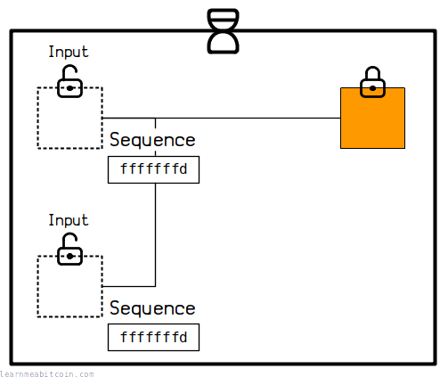
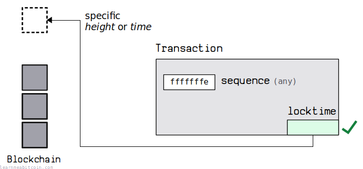
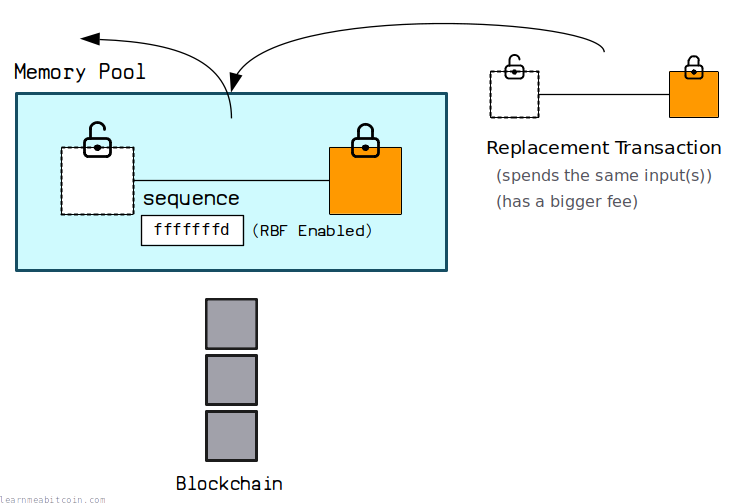
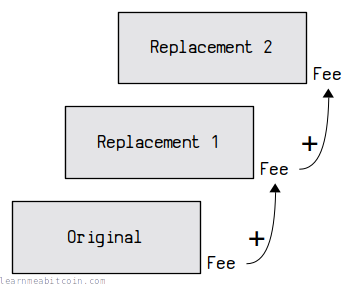

[](https://static.learnmeabitcoin.com/diagrams/png/transaction-sequence.png)

The sequence field can be found inside every transaction [input](/technical/transaction/input/). It gives you control over when a transaction **can be mined** or if a transaction **can be replaced** whilst it's in the [mempool](/technical/mining/memory-pool/).

In more technical terms, you can say that the sequence field has control over the "finality" of a transaction, as in whether a transaction is in its "final" state before it gets mined into a block. If it's not in its "final" state, then it's possible for it to be replaced before it ends up in the [blockchain](/technical/blockchain/).

These are the most common settings:

* <=0xFFFFFFFE — **Locktime.**  
  This setting enables the transaction's [locktime](/technical/transaction/locktime/) field to be used.
* <=0xFFFFFFFD — **Replace By Fee (RBF)**.  
  This setting enables the RBF feature, which allows you to replace a transaction with a higher-fee one if it's still in the mempool.
* <=0xEFFFFFFF — **Relative Locktime**.  
  This setting allows you to set a locktime on the transaction relative to when the output being spent was mined.
  + 0x00000000 to 0x0000FFFF — **Blocks.** Set the relative locktime as a number of blocks.
  + 0x00400000 to 0x0040FFFF — **Time.** Set the relative locktime as a number of seconds.

A popular choice is to use 0xFFFFFFFD for your sequence fields, as this enables both the locktime field (in case you want to use it) and also replace-by-fee (which is generally useful).

Sequence (Little Endian)

The sequence as found in raw transaction data

0x

`4 bytes`

Sequence (Big Endian)

0x

`4 bytes`


Features

 Locktime

 Replace-by-Fee

 Relative Locktime


Relative Locktime Type


Time


seconds

Blocks


Count

0 secs

If you set the maximum value of 0xFFFFFFFF on *all* the inputs to a transaction, the entire transaction is considered "final" and cannot be replaced or prevented from being mined.

You only need to set *one* of the sequence fields to enable **locktime** or **RBF** (even if you have multiple inputs and sequence fields in one transaction). However, **relative locktime** settings are specific to each input.

## Locktime

[](https://static.learnmeabitcoin.com/diagrams/png/transaction-sequence-locktime.png)

You can enable the [locktime](/technical/transaction/locktime/) field for the entire transaction if you set *any* of the input sequence values to 0xFFFFFFE or below.

For example:

```
0xFFFFFFFE <- enables locktime
```

As mentioned, setting all of the sequence values in a transaction to 0xFFFFFFFF indicates that the transaction is *final*. So by setting any of the sequences to *below the maximum value* of 0xFFFFFFFF, you're indicating that the transaction is *not final* and therefore the locktime field will be enabled.

By default, the [Bitcoin Core](https://bitcoin.org/en/bitcoin-core/) wallet sets the sequence field for each input to 0xFFFFFFFE. This enables the locktime field for the transaction, but no other features.

### Usage

If you want a transaction to only be able to be [mined](/technical/mining/) at some point in the future, you need to make use of the locktime field at the end of the transaction.

To enable the locktime field, you need to set one of the sequence values in your transaction to 0xFFFFFFFE or below.

You can then set the locktime field to between 0 and 499999999 for the transaction to be able to be mined after a certain block [height](/technical/blockchain/height/), or between 500000000 and 4294967295 for it to be mined after a specific point in time (i.e. a Unix timestamp).

 Unix Time

Unix Time

0d


Now

Date


0 secs

## Replace By Fee

[BIP 125](https://github.com/bitcoin/bips/blob/master/bip-0125.mediawiki)

[](https://static.learnmeabitcoin.com/diagrams/png/transaction-sequence-replace-by-fee.png)

You can allow for a transaction to be replaced by a higher-fee transaction later on (whilst it's still in the [memory pool](/technical/mining/memory-pool/)) by setting the sequence value on *any* of its inputs to 0xFFFFFFFD or below.

For example:

```
0xFFFFFFFD <- enables replace-by-fee
```

This value is **1 less** than the [locktime](#locktime) setting above, which means you can enable the locktime *without* enabling replace-by-fee.

### Usage

Let's say you've created a transaction and sent it into the [network](/technical/networking/), but you've set an annoyingly low [fee](/technical/transaction/fee/) on it.

If there's a high volume of high-fee transactions on the network, your transaction may end up hanging around in the memory pool waiting to get mined. Normally you wouldn't be able to undo or replace this transaction until it gets mined or expires from the memory pool, but this could take a few days.

However, if you set a sequence value of 0xFFFFFFFD on any of the inputs in your transaction, you're signaling that any of those inputs can be spent by a newer transaction with a higher fee on it. So instead of having to wait around for the first transaction to get mined, you can send a replacement transaction to speed up the process.

Nodes and miners will be aware that a sequence has been set to 0xFFFFFFFD or below, and so they will be happy to replace that transaction in their memory pools if one arrives with a higher fee.

A few notes on using RBF:

* **You do not need to increase or decrease the sequence number in the replacement transaction.** All that matters is that the replacement transaction has a higher fee.
* **You can replace transactions over and over again as long as the new transaction has a higher fee than the one you're replacing.** The more replacements you make, the higher the fee will need to be each time to surpass the fees on the previous replacement transactions.
* **You can send the coins to a different destination (i.e. create different [outputs](/technical/transaction/output/)) in the replacement transaction if you want.** This is why this is sometimes referred to as "Full RBF", as other RBF proposals required the replacement transaction to have the same outputs.

**RBF is transaction-wide, not input-specific.** Setting a sequence of 0xFFFFFFFD or below on any input makes the *whole transaction* replaceable. So if you have a number of other inputs in the same transaction, those individual inputs can also be spent in a higher-fee transaction *even if* you gave them the maximum sequence of 0xFFFFFFFF.

### Setting Higher Fees

[](https://static.learnmeabitcoin.com/diagrams/png/transaction-replace-by-fee-increase.png)

The fee on the replacement transaction must be enough to cover the *minimum relay fee*, **plus the size of fee(s) on the transaction(s) it replaces**.

```
RBF Transaction Minimum Fee = Minimum Relay Fee + Previous Transaction Fee(s)
```

**[Minimum Relay Fee](/technical/transaction/fee/#minimum-relay-fee):**

This is the *minimum* fee you have to put on a transaction for a node to accept it into their memory pools. Each node can set this fee independently, but the default is 1 sat/[vbyte](/technical/transaction/size/#vbytes). This helps to prevent anyone from spamming the network with "free" transactions.


### RBF Examples

Let's say the minimum relay fee is currently **1 sat/[vbyte](/technical/transaction/size/#vbytes)**.

For a simple *replace by fee* transaction (where the replacement transaction is exactly the same as the original), the fee on the replacement transaction just needs to be at least *double* that of the transaction you want to replace:

```
Minimum Relay Fee: 1sat/vbyte

Transaction   | Size      | Min Relay Fee | Previous Fee(s) | Minimum Fee  | Feerate
--------------|-----------|---------------|-----------------|--------------|------------
Original      | 200 bytes | 200 sats      | 0               | 200 sats     | 1 sat/vbyte
Replacement 1 | 200 bytes | 200 sats      | 200 sats        | 400 sats     | 2 sat/vbyte
```

So in this example, the fee for the replacement transaction needed to be at least 200 sats on its own (to satisfy the minimum relay fee of 1sat/vbyte), *plus* the 200 sat fee on the transaction we're replacing, making the minimum fee 400 sats in total. You can go much higher than this if you want, and you possibly will to create a more attractive feerate, but this is the *minimum*.

Now, if you're replacing a transaction multiple times (bumping up the fee repeatedly), the minimum fee on the next transaction needs to be greater than the **sum of all the fees on the previous transactions you want to replace** *plus* the minimum relay fee for the current transaction (as usual):

```
Minimum Relay Fee: 1sat/vbyte

Transaction   | Size      | Min Relay Fee | Previous Fee(s) | Minimum Fee  | Feerate
--------------|-----------|---------------|-----------------|--------------|------------
Original      | 200 bytes | 200 sats      | 0               | 200 sats     | 1 sat/vbyte
Replacement 1 | 200 bytes | 200 sats      | 200 sats        | 400 sats     | 2 sat/vbyte
Replacement 2 | 200 bytes | 200 sats      | 400 sats        | 600 sats     | 3 sat/vbyte
```

Here's another example where the replacement transactions are different sizes (which is also perfectly acceptable):

```
Minimum Relay Fee: 1sat/vbyte

Transaction   | Size      | Min Relay Fee | Previous Fee(s) | Minimum Fee  | Feerate
--------------|-----------|---------------|-----------------|--------------|---------------
Original      | 200 bytes | 200 sats      | 0               |  200 sats    | 1 sat/vbyte
Replacement 1 | 800 bytes | 800 sats      | 200 sats        | 1000 sats    | 1.25 sat/vbyte
Replacement 2 | 300 bytes | 300 sats      | 1000 sats       | 1300 sats    | 4.33 sat/vbyte
Replacement 3 | 200 bytes | 200 sats      | 1300 sats       | 1500 sats    | 7.50 sat/vbyte
```

So basically, to work out the next higher fee, you just need to start by adding up the fees on the transaction(s) you want to replace. The *minimum fee* is then the sum of all those previous fees *plus* the minimum relay fee for the current transaction.

But in general, for a straightforward replace-by-fee transaction you're just looking to double the size of the previous fee.

## Relative Locktime

[BIP 68](https://github.com/bitcoin/bips/blob/master/bip-0068.mediawiki)

[](https://static.learnmeabitcoin.com/diagrams/png/transaction-sequence-relative-locktime.png)

> Relative lock-time (RLT) enables a signed transaction input to remain invalid for a defined period of time after confirmation of its corresponding outpoint.

[BIP 68](https://github.com/bitcoin/bips/blob/master/bip-0068.mediawiki)

Relative locktime allows you to **specify an amount of time or number of blocks *from when an output was mined* before a transaction spending it becomes valid**.

So whereas the transaction locktime allows you to specify an *absolute* time when a transaction can be mined, relative locktime allows you to specify a relative amount of time (from when an output was mined) before the transaction spending it can be mined.

To set the relative locktime on an input you need to view the sequence as a field of 32 individual bits (i.e. a [bit field](/technical/general/bytes/#bit-field)):

Sequence (Little Endian)

The sequence as found in raw transaction data

0x

`4 bytes`

Sequence (Big Endian)

0x

`4 bytes`


Sequence (Bit Field)

0

0

0

0

0

0

0

0

0

1

0

0

0

0

0

0

0

0

0

0

0

0

0

0

0

0

0

0

0

0

0

0


Settings

 Disable Flag

 Type Flag


Relative Locktime


Time

Value

`x 512 = 0 seconds`

Blocks

Value


0 secs

* **Bit 31: Disable Flag**
  + 1 = Relative Locktime Disabled
  + 0 = Relative Locktime Enabled
* **Bit 22: Type Flag**
  + 1 = Time (the value gets multiplied by 512 to give you the time in seconds)
  + 0 = Blocks
* **Bits 15-0: Value**
  + These 16 bits can hold any number between 0 and 65535 (0x0000 to 0xffff)

Firstly, to enable the relative locktime setting you need to set the **disable flag** (bit 31) to 0. I know it's a bit counter-intuitive to set something to zero to turn it on, but that's how it works here. But because this is the first bit and it's set to zero, all relative locktime settings are always going to be less than or equal to 0xEFFFFFFF.

Secondly we have the **type flag** (bit 22), which allows you to choose between setting a relative locktime as an *amount of time* or a *number of blocks* since the output you're spending was mined.

Lastly, the last 16 bits contain the actual **value** (bits 15-0) in terms of *blocks* or *time*. If you choose *time*, this value gets multiplied by 512 to give you the relative locktime in seconds.

RBF and locktime will be enabled when using relative locktime.

To enable relative locktime the transaction **version must be 2 or greater**.

### Why does the time value get multiplied by 512?

Because this creates a similar range between setting a number of blocks and a number of seconds.

For example, there's an average of 600 seconds (10 minutes) between blocks, and the maximum value you can put for either is relative locktime types is 65535 (0xffff), so:

```
Max Blocks = 65535 * 600 = 39321600 seconds = 455.11111 days
Max Time   = 65535 * 512 = 33553920 seconds = 388.35556 days
```

So whether you're using a type flag of either blocks *or* time, you're able to set a **maximum relative locktime of slightly over a year into the future** for both.

But why multiply by 512 instead of 600? Because 512 is 2^9, which means that you can do a bitwise left shift of 9 to convert the value in to seconds quickly. This is faster than multiplying by 600, and 512 is the closest power of 2 you can get to 600.

```
0b0000000001 = 1
0b1000000000 = 512 (bit shifting on a computer is faster than multiplying)
```

> Bit shifts are cheap.

Mark Friedenbach (BIP 68 author), (via Email)


### Relative Locktime Examples

Set a relative locktime of 65535 \* 512 = 33553920 seconds:

```
┌─┬─┬─┬─┬─┬─┬─┬─┬─┬─┬─┬─┬─┬─┬─┬─┬─┬─┬─┬─┬─┬─┬─┬─┬─┬─┬─┬─┬─┬─┬─┬─┐
│0│0│0│0│0│0│0│0│0│1│0│0│0│0│0│0│1│1│1│1│1│1│1│1│1│1│1│1│1│1│1│1│
└─┴─┴─┴─┴─┴─┴─┴─┴─┴─┴─┴─┴─┴─┴─┴─┴─┴─┴─┴─┴─┴─┴─┴─┴─┴─┴─┴─┴─┴─┴─┴─┘
  
0x0040ffff
```

Set a relative locktime of 1 \* 512 = 512 seconds:

```
┌─┬─┬─┬─┬─┬─┬─┬─┬─┬─┬─┬─┬─┬─┬─┬─┬─┬─┬─┬─┬─┬─┬─┬─┬─┬─┬─┬─┬─┬─┬─┬─┐
│0│0│0│0│0│0│0│0│0│1│0│0│0│0│0│0│0│0│0│0│0│0│0│0│0│0│0│0│0│0│0│1│
└─┴─┴─┴─┴─┴─┴─┴─┴─┴─┴─┴─┴─┴─┴─┴─┴─┴─┴─┴─┴─┴─┴─┴─┴─┴─┴─┴─┴─┴─┴─┴─┘

0x00400001
```

Set a relative locktime of 65535 blocks:

```
┌─┬─┬─┬─┬─┬─┬─┬─┬─┬─┬─┬─┬─┬─┬─┬─┬─┬─┬─┬─┬─┬─┬─┬─┬─┬─┬─┬─┬─┬─┬─┬─┐
│0│0│0│0│0│0│0│0│0│0│0│0│0│0│0│0│1│1│1│1│1│1│1│1│1│1│1│1│1│1│1│1│
└─┴─┴─┴─┴─┴─┴─┴─┴─┴─┴─┴─┴─┴─┴─┴─┴─┴─┴─┴─┴─┴─┴─┴─┴─┴─┴─┴─┴─┴─┴─┴─┘

0x0000ffff
```

Set a relative locktime of 1 block:

```
┌─┬─┬─┬─┬─┬─┬─┬─┬─┬─┬─┬─┬─┬─┬─┬─┬─┬─┬─┬─┬─┬─┬─┬─┬─┬─┬─┬─┬─┬─┬─┬─┐
│0│0│0│0│0│0│0│0│0│0│0│0│0│0│0│0│0│0│0│0│0│0│0│0│0│0│0│0│0│0│0│1│
└─┴─┴─┴─┴─┴─┴─┴─┴─┴─┴─┴─┴─┴─┴─┴─┴─┴─┴─┴─┴─┴─┴─┴─┴─┴─┴─┴─┴─┴─┴─┴─┘

0x00000001
```

Disable the relative locktime completely:

```
┌─┬─┬─┬─┬─┬─┬─┬─┬─┬─┬─┬─┬─┬─┬─┬─┬─┬─┬─┬─┬─┬─┬─┬─┬─┬─┬─┬─┬─┬─┬─┬─┐
│1│0│0│0│0│0│0│0│0│0│0│0│0│0│0│0│0│0│0│0│0│0│0│0│0│0│0│0│0│0│0│0│
└─┴─┴─┴─┴─┴─┴─┴─┴─┴─┴─┴─┴─┴─┴─┴─┴─┴─┴─┴─┴─┴─┴─┴─┴─┴─┴─┴─┴─┴─┴─┴─┘
  
0x80000000
```

A relative locktime of 0 blocks (0x00000000) means that the input can be mined into a block immediately without having to wait. This is like having no relative locktime at all, so you might as well use a sequence of 0xFFFFFFFF instead.

Any sequence value of 0x80000000 or above will disable the relative locktime feature.


### Code

```


copied


copied

# -----------------
# Bitwise Operators
# -----------------
#
# The easiest way to work with bits directly is by using "bitwise operators". These are available in all good programming languages:
#
#  << - "SHIFT LEFT" - Move bits a number of positions to the left
#  |  - "OR"         - Combine two sets of bits
#  &  - "AND"        - Extract bits from a set of bits using a "bit mask"

# ---------------------------
# Construct Relative Locktime
# ---------------------------

# Set Disable Flag (0 = enabled, 1 = disabled)
disable = 0<<31 # Move a zero 31 bits to the left. Pointless really as this is just 0, but whatever
# 00000000000000000000000000000000

# Set Type Flag (0 = blocks, 1 = time)
type    = 1<<22 # Move a one 22 bits to the left.
#          10000000000000000000000

# Set Value
value   = 10000 # This is just an integer; every integer has its own underlying bit representation
#                   10011100010000

# Combine all of the bits together into a single field
sequence = 0<<31 | 1<<22 | 10000
# disable  = 00000000000000000000000000000000
# type     =          10000000000000000000000 |
# value    =                   10011100010000 | (The OR bitwise operator returns a 1 if either bit is set)
#            --------------------------------
#            00000000010000000010011100010000


# Ruby will print this value as an integer by default, but for display purposes we can convert it to a string of bits (base 2)
bits = sequence.to_s(2)
puts bits #=> 10000000010011100010000

# We can also convert the sequence value to a hexadecimal string (base 16)
hex  = sequence.to_s(16)
puts hex #=> "402710"


# ------
# Decode
# ------

# Sequence
sequence = 0x00402710

# Extract Disable Flag
disable = 1<<31 & sequence
# 1<31     = 10000000000000000000000000000000
# sequence = 00000000010000000010011100010000 & (The AND operator returns a 1 if both bits are set)
#            --------------------------------
#            00000000000000000000000000000000 = 0

# Extract Type Flag
type = 1<<22 & sequence
# 1<22     = 00000000010000000000000000000000
# sequence = 00000000010000000010011100010000 &
#            --------------------------------
#            00000000010000000000000000000000 = 4194304 (Anything other than zero means this bit has been set)

# Extract Value
value = 0xffff & sequence # 0xffff is the bit mask
# 0xffff   = 00000000000000001111111111111111
# sequence = 00000000010000000010011100010000 &
#            --------------------------------
#            00000000000000000010011100010000 = 10000

# Show results
puts (disable ? 'true' : 'false')
puts (type ? 'time' : 'blocks')
puts value #=> 10000
```

## Examples

Here are some examples of sequence values being used in actual transactions in the blockchain:

* [2833fece3b1c38dffc11a7f211b05512512b0f8dec7055b6d7e7c155d83e7dec](/explorer/tx/2833fece3b1c38dffc11a7f211b05512512b0f8dec7055b6d7e7c155d83e7dec#input-0) (Input 0)
  + Sequence = `fffffffe`
  + **Locktime enabled.** The value of the locktime field was also 699999, so this transaction couldn't be mined until *after* block 699,999. It was eventually mined into block [700,000](/explorer/700000).
* [163558ace2946d805b688d89d8ba0dd607d9f947073b45f393d9757eef1a4af7](/explorer/tx/163558ace2946d805b688d89d8ba0dd607d9f947073b45f393d9757eef1a4af7#input-0) (Input 0)
  + Sequence = `fffffffd`
  + **RBF enabled.** Can't tell if this transaction was replaced or not, but it could have been whilst it was in the mempool.
* [62fb5ecd3f022a2f09b73723b56410db0545923516b611013aed5218e4979322](/explorer/tx/62fb5ecd3f022a2f09b73723b56410db0545923516b611013aed5218e4979322#input-0) (Input 0)
  + Sequence = `00000090`
  + **Relative locktime enabled (blocks).** This transaction couldn't be mined until 144 blocks (0x0090 = 144) *after* the output being spent was mined. The output being spent was mined into block [603,018](/explorer/603018), and this transaction was mined **146 blocks later** into block [603,164](/explorer/603164).
* [12fa403cb22bf08c4c5542cc00673495a0c54c9cc8181bea850a12d40d7593a2](/explorer/tx/12fa403cb22bf08c4c5542cc00673495a0c54c9cc8181bea850a12d40d7593a2#input-0) (Input 0)
  + Sequence = `00400007`
  + **Relative locktime enabled (time).** This transaction couldn't be mined until 3584 seconds (0x0007 = 7, 7 \* 512 = 3584) *after* the output being spent was mined. The output being spent was mined into block [603,434](/explorer/603434) with a timestamp of 1573549241 (*12 Nov 2019, 09:00:41*), and this transaction was mined **6426 seconds later** into block [603,450](/explorer/603450) with a timestamp of 1573555667 (*12 Nov 2019, 10:47:47*).

## History

The sequence field was originally designed to allow for the replacement of transactions whilst they were still in the memory pool.

Originally, you would set a locktime on a transaction for some time in the future, and if any of the sequence fields were below the maximum value of 0xFFFFFFFF, you could replace it with a new version of the transaction with a higher sequence value.

Nodes and miners were expected to hold these non-final transactions until the locktime was reached, or until a replacement transaction arrived with all the sequence values set to 0xFFFFFFFF (meaning it could finally be mined into a block). However, there was no incentive for miners to hold these non-final transactions in memory, so the sequence field was never fully utilized for this purpose, and was [quietly disabled](https://github.com/bitcoin/bitcoin/commit/05454818dc7ed92f577a1a1ef6798049f17a52e7#diff-118fcbaaba162ba17933c7893247df3aR522) by Satoshi in 2010 in Bitcoin v0.3.12.

Since then the sequence field has been repurposed a number of times, but all of the changes to the sequence field are related to the "finality" of the transaction, or the ability to replace a transaction whilst it's in (or before it gets in to) the memory pool.

## Resources

* [BIP 125: Opt-in Full Replace-by-Fee Signaling](https://github.com/bitcoin/bips/blob/master/bip-0125.mediawiki)
* [BIP 68: Relative lock-time using consensus-enforced sequence numbers](https://github.com/bitcoin/bips/blob/master/bip-0068.mediawiki)
* [What does the sequence in a transaction input mean?](https://bitcoin.stackexchange.com/questions/87372/what-does-the-sequence-in-a-transaction-input-mean)
* [Sequence number semantics](https://bitcoin.stackexchange.com/questions/53398/sequence-number-semantics)
* [What is the recommended sequence for signalling RBF?](https://bitcoin.stackexchange.com/questions/55112/what-is-the-recommended-sequence-for-signalling-rbf)
* [What is transaction "finality"?](https://bitcoin.stackexchange.com/questions/88289/what-is-transaction-finality)