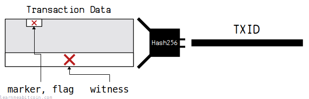
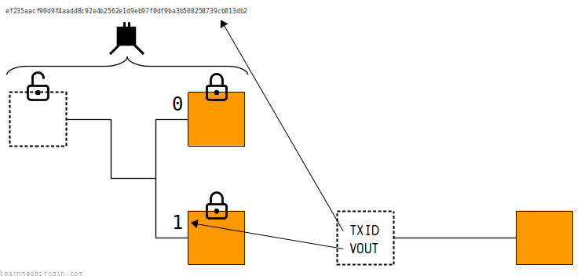

[](https://static.learnmeabitcoin.com/diagrams/png/transaction-txid.png)

A TXID (Transaction ID) is a **unique reference for a bitcoin [transaction](/docs/technical/transaction.md)**.

They're used to look up specific transactions in a [blockchain explorer](/explorer/). For example:

* [f4184fc596403b9d638783cf57adfe4c75c605f6356fbc91338530e9831e9e16](/explorer/tx/f4184fc596403b9d638783cf57adfe4c75c605f6356fbc91338530e9831e9e16) — First ever Bitcoin transaction to Hal Finney in 2009.
* [a1075db55d416d3ca199f55b6084e2115b9345e16c5cf302fc80e9d5fbf5d48d](/explorer/tx/a1075db55d416d3ca199f55b6084e2115b9345e16c5cf302fc80e9d5fbf5d48d) — [Pizza transaction](https://bitcointalk.org/index.php?topic=137.0) for 10,000 BTC in 2010.
* [4ce18f49ba153a51bcda9bb80d7f978e3de6e81b5fc326f00465464530c052f4](/explorer/tx/4ce18f49ba153a51bcda9bb80d7f978e3de6e81b5fc326f00465464530c052f4) — The transaction containing the first donation I received for making this website.

The letters and numbers in a TXID have no special meaning. They're just random-looking bunches of 32 [bytes](/docs/technical/general/bytes.md) (represented as 64 [hexadecimal](/docs/technical/general/hexadecimal.md) characters). But they are *unique* to each transaction.

## Creating

How do you create a TXID?

[](https://static.learnmeabitcoin.com/diagrams/png/transaction-txid-structure.png)

A TXID is created by [hashing](/docs/technical/cryptography/hash-function.md) the transaction data. More precisely, it's created by putting specific parts of the transaction data through the SHA256 hash function, then putting the result through the SHA256 again (this double-SHA256 hashing is referred to as *HASH256*).

* For **[legacy transactions](/docs/technical/transaction.md#example-legacy)** you [HASH256](/docs/technical/cryptography/hash-function.md#hash256) all of the transaction data.
* For **[segwit transactions](/docs/technical/transaction.md#example-segwit)** you HASH256 all of the transaction data except the [marker](/docs/technical/transaction.md#structure-marker), [flag](/docs/technical/transaction.md#structure-flag), [witness](/docs/technical/transaction.md#structure-witness) fields.

So for segwit transactions the [signatures](/docs/technical/keys/signature.md) are no longer included as part of the TXID.

Random Example

Transaction Data

`0 bytes`


 Show Details


TXID (Natural Byte Order)

Used internally inside raw transaction data

`0 bytes`

TXID (Reverse Byte Order)

Used externally when searching for transactions on block explorers

`0 bytes`


0 secs

The TXIDs you see on blockchain explorers are actually in **[reverse byte order](/docs/technical/general/byte-order.md#reverse-byte-order)**. This is just a quirk of bitcoin.

### Code

A TXID is created in the same way as a [block hash](/docs/technical/block/hash.md). You just need to **HASH256** the correct parts of transaction data to create the TXID:

```
require 'digest'

# ----------------
# transaction data
# ----------------
data = "0100000001c997a5e56e104102fa209c6a852dd90660a20b2d9c352423edce25857fcd3704000000004847304402204e45e16932b8af514961a1d3a1a25fdf3f4f7732e9d624c6c61548ab5fb8cd410220181522ec8eca07de4860a4acdd12909d831cc56cbbac4622082221a8768d1d0901ffffffff0200ca9a3b00000000434104ae1a62fe09c5f51b13905f07f06b99a2f7159b2225f374cd378d71302fa28414e7aab37397f554a7df5f142c21c1b7303b8a0626f1baded5c72a704f7e6cd84cac00286bee0000000043410411db93e1dcdb8a016b49840f8c53bc1eb68a382e97b1482ecad7b148a6909a5cb2e0eaddfb84ccf9744464f82e160bfa9b8b64f9d4c03f999b8643f656b412a3ac00000000"

# ----
# TXID
# ----

# Note: Don't put the transaction data into the hash function as a string.
#       Convert it from hexadecimal to raw bytes first.

# convert hexadecimal string to byte sequence
bytes = [data].pack("H*") # H = hex string (highest byte first), * = multiple bytes

# SHA-256 (first round)
hash1 = Digest::SHA256.digest(bytes)

# SHA-256 (second round)
hash2 = Digest::SHA256.digest(hash1)

# convert from byte sequence back to hexadecimal string
txid = hash2.unpack("H*")[0]

# print result (natural byte order)
puts txid #=> 169e1e83e930853391bc6f35f605c6754cfead57cf8387639d3b4096c54f18f4

# print result (reverse byte order)
puts txid.scan(/../).reverse.join #=> f4184fc596403b9d638783cf57adfe4c75c605f6356fbc91338530e9831e9e16
```

Remember that when working with segwit transactions you do not include the marker, flag, and [witness](/docs/technical/transaction/witness.md) as part of the transaction data that is being hashed.

## Examples

What does a TXID look like?

### 1. Legacy Transaction

To create a TXID for a legacy transaction you HASH256 **all** of the transaction data:

```
0100000001c997a5e56e104102fa209c6a852dd90660a20b2d9c352423edce25857fcd3704000000004847304402204e45e16932b8af514961a1d3a1a25fdf3f4f7732e9d624c6c61548ab5fb8cd410220181522ec8eca07de4860a4acdd12909d831cc56cbbac4622082221a8768d1d0901ffffffff0200ca9a3b00000000434104ae1a62fe09c5f51b13905f07f06b99a2f7159b2225f374cd378d71302fa28414e7aab37397f554a7df5f142c21c1b7303b8a0626f1baded5c72a704f7e6cd84cac00286bee0000000043410411db93e1dcdb8a016b49840f8c53bc1eb68a382e97b1482ecad7b148a6909a5cb2e0eaddfb84ccf9744464f82e160bfa9b8b64f9d4c03f999b8643f656b412a3ac00000000
```

Note: The data that gets hashed to create the TXID is highlighted in green.

If you HASH256 all of this data you get `169e1e83e930853391bc6f35f605c6754cfead57cf8387639d3b4096c54f18f4`, which is the TXID in [natural byte order](/docs/technical/general/byte-order.md#natural-byte-order) and is what's found inside raw transaction data.

Then, if you reverse the byte order you get the TXID [f4184fc596403b9d638783cf57adfe4c75c605f6356fbc91338530e9831e9e16](/explorer/tx/f4184fc596403b9d638783cf57adfe4c75c605f6356fbc91338530e9831e9e16), which is the byte order used when searching for transactions in blockchain explorers.

### 2. Segwit Transaction

To create a TXID for a segwit transaction you HASH256 all of the transaction data except the marker, flag, and witness fields.

```
020000000001013a53de6e1fe821452674c5435e3989eecdf35cb1de1c8bafb674f543a55d658c3600000000fdffffff01599aea0400000000160014cfbd92a6337e8b6043552d6fc5c35c7e5062281e0247304402201250febbce0a5b333c2d715b869cb960f5abf1702192c7af6e112c6d6030be880220073c55f4814a064bf804d9ed16b57eaaeaafb536c4187e6260ef3fc61ca98a77012102e71911951e1f9799d5ccd05200ea0c18f786cb1bb45754d4a0799a06c2b80e8000000000
```

Note: The data that gets hashed to create the TXID is highlighted in green.

If you HASH256 the highlighted data you get `01cda497b58d876f207b74c1f0b741f397c376852b3c68b0b6db042a24ffd96c`, then if you reverse the byte order you get the TXID [6cd9ff242a04dbb6b0683c2b8576c397f341b7f0c1747b206f878db597a4cd01](/explorer/tx/6cd9ff242a04dbb6b0683c2b8576c397f341b7f0c1747b206f878db597a4cd01).

When creating a TXID for a segwit transaction, you **do not hash the fields that are new to segwit transactions**. This avoids having any [signature](/docs/technical/keys/signature.md) data forming part of the TXID (which are now in the [witness](/docs/technical/transaction/witness.md) instead) as signatures can be manipulated to change the TXID after a transaction has been sent into the [network](/docs/technical/networking.md) (which is rare, but it makes TXIDs less dependable).

This was the primary reason for the [segregated witness](/docs/technical/upgrades/segregated-witness.md) upgrade.

### Try it yourself

You can check that the above data produces the correct TXIDs by manually hashing the same data using HASH256 directly:

Random Transaction Data

Random Block Header

Data (Hex)

`0 bytes`


SHA-256


SHA-256

HASH256

SHA-256(SHA-256(data))

`0 bytes`


0 secs

Then don't forget to reverse the byte order:

Random Example

Bytes

`0 bytes`

Reversed

`0 bytes`


 Show Details


0 secs

## Usage

How are TXIDs used in Bitcoin?

TXIDs play an important role in the way Bitcoin works. They are used in the following situations:

### 1. Searching for transactions

You typically use TXIDs to look up specific transactions on a [blockchain explorer](/explorer/) or from your own local node:

```
$ bitcoin-cli getrawtransaction f4184fc596403b9d638783cf57adfe4c75c605f6356fbc91338530e9831e9e16

0100000001c997a5e56e104102fa209c6a852dd90660a20b2d9c352423edce25857fcd3704000000004847304402204e45e16932b8af514961a1d3a1a25fdf3f4f7732e9d624c6c61548ab5fb8cd410220181522ec8eca07de4860a4acdd12909d831cc56cbbac4622082221a8768d1d0901ffffffff0200ca9a3b00000000434104ae1a62fe09c5f51b13905f07f06b99a2f7159b2225f374cd378d71302fa28414e7aab37397f554a7df5f142c21c1b7303b8a0626f1baded5c72a704f7e6cd84cac00286bee0000000043410411db93e1dcdb8a016b49840f8c53bc1eb68a382e97b1482ecad7b148a6909a5cb2e0eaddfb84ccf9744464f82e160bfa9b8b64f9d4c03f999b8643f656b412a3ac00000000

# Note: You need to set txindex=1 in bitcoin.conf to look up all the transactions in the blockchain.
```

This is useful when you want to check out the details of a transaction or to find out its location (i.e. if it has been mined into the [blockchain](/docs/technical/blockchain.md) or if it's still in the [mempool](/docs/technical/mining/memory-pool.md)).

### 2. Referencing previous outputs for spending

You use TXIDs for referencing [outputs](/docs/technical/transaction/output.md) from previous transactions for use as [inputs](/docs/technical/transaction/input.md) when you create a bitcoin transaction.

[](https://static.learnmeabitcoin.com/diagrams/png/transaction-input-select.png)

TXIDs are unique, so you can use them in combination with a [VOUT](/docs/technical/transaction/input/vout.md) to reference any specific output in the [blockchain](/docs/technical/blockchain.md) for spending.

### 3. Creating a merkle root

TXIDs are used to create the [merkle root](/docs/technical/block/merkle-root.md) for the [block header](/docs/technical/block.md#header):

[](https://static.learnmeabitcoin.com/diagrams/png/block-merkle-root.png)

A merkle root is created by basically hashing all of TXIDs in a block in a tree-like structure. This creates a unique fingerprint for all the transactions inside the block, which then gets placed inside the block header to prevent the contents of the block from being tampered with later on.

This is because any change to transaction data will change the TXID, and any change to a TXID will have a knock-on affect to the resulting merkle root.

 Merkle Root

Random Example

Block

TXID List

A list of TXIDs separated by *spaces*, *commas*, or *new lines*. Quotes and brackets are ignored.

The TXIDs should be input in [reverse byte order](/docs/technical/general/byte-order.md#reverse-byte-order) (as they appear on blockchain explorers), but they are converted to [natural byte order](/docs/technical/general/byte-order.md#natural-byte-order) before the merkle root is calculated.


TXIDs (0)
 

Merkle Root (Natural Byte Order)

The byte order as it comes out of the hash function

Merkle Root (Reverse Byte Order)

The byte order as shown on blockchain explorers


0 secs

## Duplicate TXIDs

TXIDs are unique to each transaction.

However, there actually are two examples of duplicate TXIDs appearing in the blockchain:

1. [e3bf3d07d4b0375638d5f1db5255fe07ba2c4cb067cd81b84ee974b6585fb468](/explorer/tx/e3bf3d07d4b0375638d5f1db5255fe07ba2c4cb067cd81b84ee974b6585fb468)
   * [Block 91,880](/explorer/block/00000000000743f190a18c5577a3c2d2a1f610ae9601ac046a38084ccb7cd721) (15 Nov 2010, 00:36)
   * [Block 91,722](/explorer/block/00000000000271a2dc26e7667f8419f2e15416dc6955e5a6c6cdf3f2574dd08e) (14 Nov 2010, 08:37)
2. [d5d27987d2a3dfc724e359870c6644b40e497bdc0589a033220fe15429d88599](/explorer/tx/d5d27987d2a3dfc724e359870c6644b40e497bdc0589a033220fe15429d88599)
   * [Block 91,842](/explorer/block/00000000000a4d0a398161ffc163c503763b1f4360639393e0e4c8e300e0caec) (14 Nov 2010, 21:04)
   * [Block 91,812](/explorer/block/00000000000af0aed4792b1acee3d966af36cf5def14935db8de83d6f9306f2f) (14 Nov 2010, 17:59)

Technically speaking, they're the *same transaction* each time, because they both have the same underlying [transaction data](/docs/technical/transaction.md#structure). It's not like two completely different transactions ended up with the same TXID (i.e. a [hash collision](/docs/technical/cryptography/hash-function.md#strong-hash-function)) — it's just the same transaction ended up appearing across multiple blocks.

Anyway, this duplicate TXID situation only happened due to the fact they are **[coinbase transactions](/docs/technical/mining/coinbase-transaction.md)**.

You see, the TXID and [VOUT](/docs/technical/transaction/input/vout.md) fields for the [input](/docs/technical/transaction/input.md) of a coinbase transaction are *fixed*, rather than being *dynamic* like they are with all other transactions. This means the input is not forced to be unique, so if you decide to keep the output exactly the same too (by using the same [locking script](/docs/technical/transaction/output/scriptpubkey.md) to claim the same value [block reward](/docs/technical/mining/block-reward.md), which is what happened with these two examples), there ~~is~~ was nothing stopping you from creating duplicate coinbase transactions and mining them into the blockchain.

Of course, you don't really want to have duplicate transactions in the blockchain, because **TXIDs are used to reference previous transactions**. If you have multiple transactions with the same TXID, only the unspent [outputs](/docs/technical/transaction/output.md) of *one* of those transactions will be spendable (the most recent one), because there's simply no way to uniquely reference the others (the earlier ones).

### The Fixes

1. [BIP 30](https://github.com/bitcoin/bips/blob/master/bip-0030.mediawiki) **(22 February 2012)**: Introduced a rule that prevented blocks from containing a TXID that already exists (although this only includes checking the TXIDs within the [UTXO](/docs/technical/transaction/utxo.md) set).
2. [BIP 34](https://github.com/bitcoin/bips/blob/master/bip-0034.mediawiki) **(06 July 2012)**: Required coinbase transactions to [include the current block height](/docs/technical/mining/coinbase-transaction.md#bip34) in their transaction data, which means that coinbase transaction data will always be unique.

These fixes mean that it's no longer possible to create duplicate coinbase transactions.

However, it was too late for the two duplicate transactions above. Consequently, only the most recent copy of each transaction can have their output spent, as the outputs (50 BTC) of the earlier duplicates are inaccessible and are therefore "lost" forever (I say "lost" because we know where they are... it's just that they cannot be accessed).

Anyway, these two transactions serve as an interesting artifact in the history of the blockchain, and also make for a great pub quiz question.

**It's important to be aware of these duplicate TXIDs if you are storing transactions in a database.** It's a small issue, but it can catch you out if you're inserting a row and expect every TXID to not already exist. So you'll just need to account for these two edge-cases to make your import script work.

* [handle historic transactions with duplicate IDs.](https://github.com/bitpay/insight-api/issues/42)
* [What would happened if two transactions have the same hash?](https://bitcoin.stackexchange.com/questions/75300/what-would-happened-if-two-transactions-have-the-same-hash)
* [Two blocks, two transactions, same hash](https://bitcoin.stackexchange.com/questions/3030/two-blocks-two-transactions-same-hash)
* [Can the outputs of transactions with duplicate hashes be spent?](https://bitcoin.stackexchange.com/questions/11999/can-the-outputs-of-transactions-with-duplicate-hashes-be-spent)

Thanks to DJBunnies for [pointing this out](https://www.reddit.com/r/Bitcoin/comments/5waqc1/comment/de8m12j/).