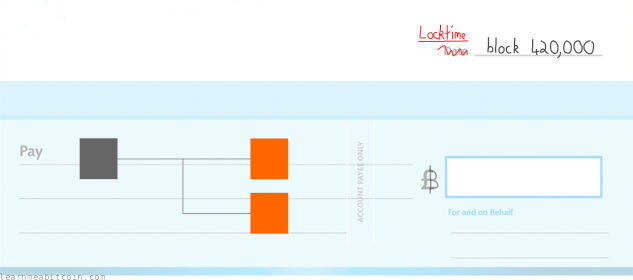
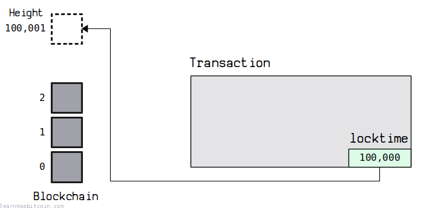
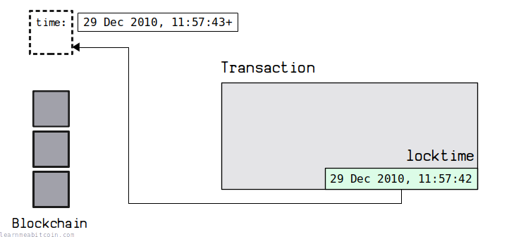

[](https://static.learnmeabitcoin.com/diagrams/png/transaction-locktime.png)

The locktime field allows you to **prevent a [transaction](/docs/technical/transaction.md) from being [mined](/docs/technical/mining.md)** until *after* a specific block **height** or **[time](/docs/technical/block/time.md)**.

A transaction with a locktime in the future will not be accepted or relayed by nodes either, so you have to store it locally until the locktime you have set on the transaction has passed.

In other words, setting a locktime on a transaction is the equivalent of [post-dating a cheque](https://en.wikipedia.org/wiki/Post-dated_cheque).

[](https://static.learnmeabitcoin.com/technical/transaction/locktime/cheque.jpg)

## Usage

How does locktime work?

The locktime field is 4 bytes in size and can hold values between 0 (0x00000000) and 4294967295 (0xffffffff).

You can set a specific block [height](/docs/technical/blockchain/height.md) or [time](/docs/technical/block/time.md) by using different *ranges* of values:

| Locktime | Description |
| --- | --- |
| <=499999999 | Transaction cannot be mined until *after* a specific **height**. |
| >=500000000 | Transaction cannot be mined until *after* a specific **time**. |

This is also known as "absolute locktime", as you're setting a specific height or time in the future. It's also possible to set a [relative locktime](/docs/technical/transaction/input/sequence.md#relative-locktime) on a transaction if you prefer.

For the locktime field to be enabled, at least one of the [sequence](/docs/technical/transaction/input/sequence.md) values on the [inputs](/docs/technical/transaction/input.md) must be set to 0xfffffffe or below. If all of the inputs' sequence values are set to the maximum value of 0xffffffff, the transaction is considered "final" and the locktime feature is disabled.

### Height

0 to 499999999

[](https://static.learnmeabitcoin.com/diagrams/png/transaction-locktime-height.png)

By setting the locktime between 0 (0x00000000) and 499999999 (0x1dcd64ff) you can specify that the transaction can only be mined into the blockchain *after* a specific height.

This is a more than suitable range, as the blockchain is not expected to reach a height of 499,999,999 for another **9488 years**.

### Time

500000000 to 4294967295

[](https://static.learnmeabitcoin.com/diagrams/png/transaction-locktime-time.png)

By setting the locktime between 500000000 (0x1dcd6500) and the maximum value of 4294967295 (0xffffffff) you can specify that the transaction can only be mined into the blockchain after a specific time.

This time value is in [Unix Time](https://en.wikipedia.org/wiki/Unix_time):

Unix Time

0d


Now

Date


0 secs

The actual time restriction is then based on the [time](/docs/technical/block/time.md) field inside a [block header](/docs/technical/block.md#header). The time set inside a block is controlled by the miner, and whilst it's usually pretty close to the current time, it can sometimes be an hour or two out.

This range of values allows you to set a locktime between *05 Nov 1985, 00:53:20* and *07 Feb 2106, 06:28:15*.

## Examples

Here are a couple of simple examples of the locktime in action:

* [b0fa60f601d5fe6fb1501aa614503b9af688492f68bcf8268d7cdb30f3534079](/explorer/tx/b0fa60f601d5fe6fb1501aa614503b9af688492f68bcf8268d7cdb30f3534079)
  + Locktime: `199000`
  + First transaction with a valid locktime set for a specific block height. Locktime was set to a block height of [199,000](/explorer/199000), and the transaction was then mined into block [199,002](/explorer/199002).
* [648fe76b22bc1768b56facab73af046ea40fa190f2e882a7cc99a5b6fccf05de](/explorer/tx/648fe76b22bc1768b56facab73af046ea40fa190f2e882a7cc99a5b6fccf05de)
  + Locktime: `1358106524`
  + First transaction with a valid locktime set for a specific Unix time. Locktime was set to 1358106524 (*13 Jan 2013, 19:48:44*), and the transaction was mined into block [216,410](/explorer/216410) with a timestamp of 1358111522 (*13 Jan 2013, 21:12:02*).

And for good measure, here are a couple of examples where the locktime field was used, but it wasn't actually functioning because none of the sequence values were set to below the maximum value of 0xffffffff:

* [13e100dd08b6da0a7426ea520b0bb3ae54cef79dd045e2e4f7116023df3a5c95](/explorer/tx/13e100dd08b6da0a7426ea520b0bb3ae54cef79dd045e2e4f7116023df3a5c95)
  + Locktime: `198370`
  + This is the first ever transaction with a setting for the locktime for a specific block height. However, the locktime feature was not enabled because the only sequence value was set to 0xffffffff. The locktime was set to a block height of [198,370](/explorer/198370), but it actually got mined 11 blocks *earlier* into block [198,359](/explorer/198359).
* [938b171fdeabc7b99d1720c1df070ba373d892cd5aec3d6dda641ce67ed37ca2](/explorer/tx/938b171fdeabc7b99d1720c1df070ba373d892cd5aec3d6dda641ce67ed37ca2)
  + Locktime: `1409599601`
  + This transaction has a locktime set for a specific Unix time, but the locktime feature was not enabled again because the only input had a sequence value of 0xffffffff. The locktime was set to 1409599601 (*01 Sep 2014, 19:26:41*), but it actually got mined earlier than this time into block [287,080](/explorer/287080) with a timestamp of 1393005249 (*21 Feb 2014, 17:54:09*).

### Raw Transaction

The locktime field is always the **last 4 bytes** of a transaction:

```
020000000001019a40d4b676ad05adea5a0aa1d093a5c16f298c4b7e31d70fd157e262e86d08900100000000feffffff0228e227000000000017a914ae72b0ccd1a65ec89a7be021e47eccc60a440bb3874dcbf91600000000160014553be08a6faa63e4038b4627996af76637522c500247304402200d9f0f85b355a29f4c14b3ee16257d92fc67429b47a15c1658d8b6737425a1c7022000d0c64c2004b0c1c47968b94c9d24820d1df20c13d37a66d20f62b8feca67b00121021853828191c3e1a4fa29c685e5e1da4710dd1dc35c9b85d6bab23c0e00109f45500e0c00
```

Transaction: [f168381d64b32d7b03b3f0b82cadba72e815351686e3bff2b8b5ab92f65a58bf](/explorer/tx/f168381d64b32d7b03b3f0b82cadba72e815351686e3bff2b8b5ab92f65a58bf)

The locktime field in a raw transaction is in [little-endian](/docs/technical/general/little-endian.md). So in the example above, if we reverse the byte order of `500e0c00` we get `000c0e50`, and if we convert that from [hexadecimal](/docs/technical/general/hexadecimal.md) to decimal we get 790096.

So this transaction set the locktime to a block height of [790,096](/explorer/790096) (and was mined into the block after that).

 Little Endian

+1

Decimal

0d

Hex Bytes (Big Endian)

0x

`0 bytes`

Hex Bytes (Little Endian)

0x

`0 bytes`


Field Size

 Any

 2 Bytes

 4 Bytes

 8 Bytes

 12 Bytes

 16 Bytes

 32 Bytes


0 secs

## Resources

* [Is my understanding of locktime correct?](https://bitcoin.stackexchange.com/questions/40764/is-my-understanding-of-locktime-correct)
* [How is locktime enforced in the standard client?](https://bitcoin.stackexchange.com/questions/5914/how-is-locktime-enforced-in-the-standard-client)
* [nLockTime](https://github.com/search?q=repo%3Abitcoin%2Fbitcoin+nLockTime&type=code)
* [validation.cpp](https://github.com/bitcoin/bitcoin/blob/master/src/validation.cpp) (look for the IsFinalTx function)