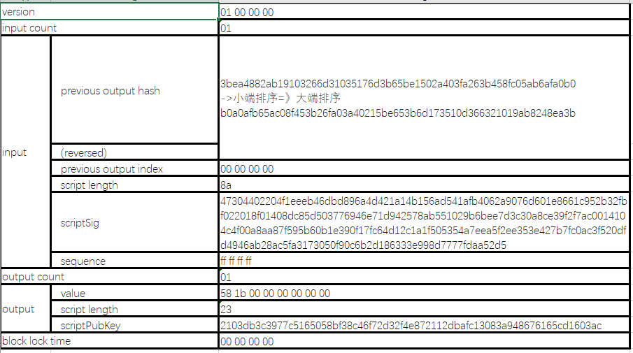
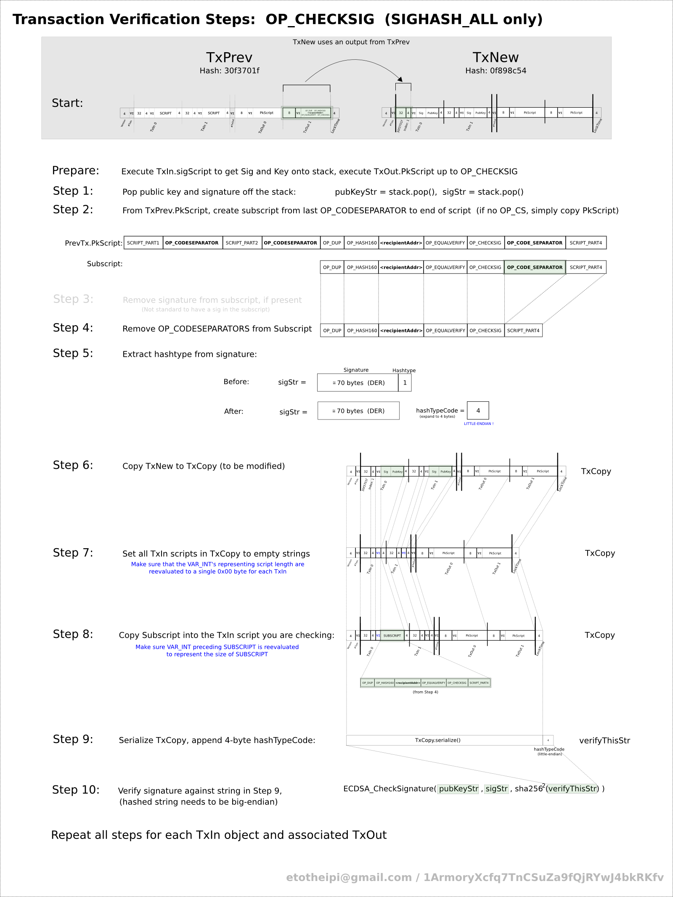

# 实战：用 Python 手工构造并签署裸交易 (Constructing Raw Transaction)

在深入学习了[交易结构](../transaction.md)、[输入 (Inputs)](input.md)、[输出 (Outputs)](output.md) 以及锁定解锁脚本之后，最好的巩固方式就是脱离所有第三方高级开发库，用最底层的原生 Python 代码纯手工拼接十六进制字节，构造并签署一笔真正的比特币裸交易（Raw Transaction）。

在这里，我们以比特币网络上的一笔真实交易 [3a295e4d385f4074f6a7bb28f6103b7235cf48f8177b7153b0609161458ac517](https://mempool.space/tx/3a295e4d385f4074f6a7bb28f6103b7235cf48f8177b7153b0609161458ac517) 为例，拆解其构造与签名的全过程。

---

## 1. 准备工作

假设我们要花费一个已知的 UTXO 并发送给新的收款人：

#### 私钥与公钥
我们持有的私钥 WIF 格式为：
```text
5KUN8s42BCTkQVMTy3oFfqeXE8awVskbDi6XbDMpRnFvHJW9fgk
```
由该私钥派生出的未压缩公钥十六进制：
```text
0489077434373547985693783396961781741114890330080946587550950125758215996319671114001858762817543140175961139571810325965930451644331549950109688554928624341
```

#### 目标交易主体
这笔交易有 1 个输入（vin），1 个输出（vout）。整体结构字段如下：



#### 手工构造 Input 所需参数：
1. **引用上一笔交易哈希 (txid)**：`b0a0afb65ac08f453b26fa03a40215be653b6d173510d366321019ab8248ea3b`
2. **输出索引 (vout index)**：`00000000`（索引 0）
3. **解锁脚本 (scriptSig)**：使用私钥针对该交易的哈希做数字签名，这是构造的难点，后面详细计算。

#### 手工构造 Output 所需参数：
1. **输出金额 (value)**：扣除矿工费后实际转账的聪数（Satoshi）。
2. **锁定脚本 (scriptPubKey)**：根据收款方设定的脚本约束。

#### 组装裸交易的 Python 辅助函数：
```python
import struct

def makeRawTransaction(outputTransactionHash, sourceIndex, scriptSig, outputs):
    """
    组装裸交易原始十六进制字符串 (对应 bitcoin-cli 的 createrawtransaction)
    """
    def makeOutput(data):
        redeemptionSatoshis, outputScript = data
        return (
            struct.pack("<Q", redeemptionSatoshis).hex() +
            '{:02x}'.format(len(bytes.fromhex(outputScript))) +
            outputScript
        )

    formattedOutputs = ''.join(map(makeOutput, outputs))
    return (
        "01000000" +                                                # 4 字节版本号 (version)
        "01" +                                                      # VarInt 输入数量 (1)
        bytes.fromhex(outputTransactionHash)[::-1].hex() +          # 小端序翻转的引用 txid
        struct.pack('<L', sourceIndex).hex() +                      # 4 字节小端序 vout 索引
        '{:02x}'.format(len(bytes.fromhex(scriptSig))) + scriptSig +# 脚本长度 + scriptSig
        "ffffffff" +                                                # 4 字节序列号 (sequence)
        "{:02x}".format(len(outputs)) +                             # 输出数量
        formattedOutputs +                                          # 序列化后的输出列表
        "00000000"                                                  # 4 字节锁定时间 (lockTime)
    )
```

---

## 2. 构造交易输出 (Outputs)

在构造完整交易前，我们需要：
1. 构造输出 (Output)。
2. 对输入中的 UTXO 进行签名以构造 `scriptSig`。

在这个例子中，我们要构造一个 P2PK (Pay-to-Public-Key) 输出，其锁定脚本极其简单，仅为 `<pubkey> OP_CHECKSIG`：

```python
def makeOutput(value, index, pubkey):
    OP_CHECKSIG = 'ac'
    value_hex = struct.pack('<Q', int(value)).hex()
    pubkey_length = "{:02x}".format(len(pubkey) // 2)
    script = pubkey_length + pubkey + OP_CHECKSIG
    script_length = "{:02x}".format(len(script) // 2)
    return value_hex + script_length + script

# 示例输出：向目标公钥转账 7000 satoshi
# 输出字节串格式为：8字节金额 + 脚本长度 + 脚本内容
outputs = [makeOutput(7000, 0, '2103db3c3977c5165058bf38c46f72d32f4e872112dbafc13083a948676165cd1603ac')]
```

---

## 3. 签署交易与构造 scriptSig

签署交易是比特币交易构造中最精密、最繁琐的核心环节。其思想是使用 ECDSA 椭圆曲线算法，用私钥对交易数据的摘要进行签名。

### 签名与校验的十个步骤
验证签名（以及反向构造签名）的完整流程如下图所示：



以交易 $B$ 花费交易 $A$ 的输出为例：
1. 解析交易 $B$ 的 `vin`，提取 `scriptSig` 中的签名和公钥。
2. 从交易 $A$ 中找到对应的 `vout`，获取其锁定脚本 `scriptPubKey`（即待解锁的子脚本 `subScript`）。
3. 如果 `subScript` 中含有 `OP_CODESEPARATOR`，按规则截取最后一段。
4. 复制一份交易 $B$ 得到 $B_{copy}$。
5. 将 $B_{copy}$ 中所有输入的 `scriptSig` 清空，**唯独将当前正在签署的输入其 `scriptSig` 替换为上一个交易的锁定脚本 `subScript`**。
6. 在交易 $B_{copy}$ 末尾追加 4 字节的哈希类型（HashType，例如 `SIGHASH_ALL` 为 `01000000`）。
7. 对序列化后的 $B_{copy}$ 做双重 SHA-256 哈希：`hash256 = SHA256(SHA256(B_copy))`。
8. 使用私钥对 `hash256` 进行 ECDSA 签名，生成 $(r, s)$ 并按 DER 编码输出。
9. 在 DER 签名后追加 1 字节的 HashType 标志（`01`），再连同公钥拼装为真正的 `scriptSig`。
10. 将组装好的 `scriptSig` 填回交易 $B$ 中。

### 疑点深入解答

#### 为什么不能直接对交易 B 整体签名？
因为签名本身最终必须存放在交易 $B$ 内部的 `scriptSig` 字段中！**签名无法对包含自身的数据进行签名**。因此，签名时必须构造一份副本，将所有输入的 `scriptSig` 置空，并在待签署的输入位置填入引用的锁定脚本。

> **历史回响**：这种设计让签名数据与交易本身交织在一起，由于 ECDSA 签名的可变性，埋下了**交易延展性（Transaction Malleability）**的隐患。这最终促成了后来的[隔离见证 (SegWit)](../upgrades/segwit-malleability-history.md)软分叉升级。

#### 为什么要用上一笔交易的 scriptPubKey 填入输入位置？
单纯的 `txid` 和 `index` 只能指明你要花哪笔钱，但签名必须对**这笔钱当时设定的花费规则**一并做加密承诺。通过将上一笔交易的锁定脚本嵌入待签名副本中，确保了任何第三方都无法篡改原输出的赎回条件。

#### 什么是 HashType (SIGHASH)？
SIGHASH 标志指明了签名者究竟对交易的哪些部分做出承诺：
* `SIGHASH_ALL`（默认 `01`）：对全部输入和输出做出签名，不允许任何人增删修改。
* `SIGHASH_NONE`：仅对输入签名，不锁定输出（任何人可以修改资金去向）。
* `SIGHASH_SINGLE`：只对本输入对应的同索引输出做签名。

### 签名实现代码：
```python
import hashlib
import ecdsa

def makeSignedTransaction(privateKeyHex, outputTransactionHash, sourceIndex, scriptPubKey, outputs):
    """
    手工签署单输入裸交易
    """
    # 1. 构造带有 scriptPubKey 和 SIGHASH_ALL 的临时待签名交易数据
    txn_for_sig = (
        makeRawTransaction(outputTransactionHash, sourceIndex, scriptPubKey, outputs) +
        "01000000"  # 4 字节 SIGHASH_ALL
    )

    # 2. 对待签名交易执行 Double-SHA256
    digest = hashlib.sha256(hashlib.sha256(bytes.fromhex(txn_for_sig)).digest()).digest()

    # 3. 使用 secp256k1 曲线执行 ECDSA 签名
    sk = ecdsa.SigningKey.from_string(bytes.fromhex(privateKeyHex), curve=ecdsa.SECP256k1)
    der_sig = sk.sign_digest(digest, sigencode=ecdsa.util.sigencode_der)

    # 4. 追加 1 字节 SIGHASH_ALL (0x01)
    sig_with_hashtype = der_sig + b'\x01'

    # 5. 拼装 scriptSig: [签名长度] + [签名] + [公钥长度] + [公钥]
    pubkey = sk.verifying_key.to_string("uncompressed")
    scriptSig = (
        '{:02x}'.format(len(sig_with_hashtype)) + sig_with_hashtype.hex() +
        '{:02x}'.format(len(pubkey)) + pubkey.hex()
    )

    # 6. 生成最终包含真实 scriptSig 的完整裸交易
    signed_txn = makeRawTransaction(outputTransactionHash, sourceIndex, scriptSig, outputs)
    return signed_txn
```

---

## 4. 广播交易到比特币网络

构造好完整的十六进制字符串后，即可将其向比特币全节点广播。底层网络协议使用 TCP 套接字与节点通信：

```python
import socket
import struct
import time
import hashlib
import random

magic = 0xd9b4bef9  # 主网魔数 (Magic Bytes)

def makeMessage(magic, command, payload):
    checksum = hashlib.sha256(hashlib.sha256(payload).digest()).digest()[0:4]
    return struct.pack('<L12sL4s', magic, command.encode('ascii'), len(payload), checksum) + payload

def broadcast_tx(raw_tx_hex, node_ip, node_port=8333):
    sock = socket.socket(socket.AF_INET, socket.SOCK_STREAM)
    sock.connect((node_ip, node_port))

    # 1. 发送 version 握手消息 (简化示意)
    # 2. 接收 verack 确认
    # 3. 发送 tx 广播消息
    tx_payload = bytes.fromhex(raw_tx_hex)
    tx_msg = makeMessage(magic, 'tx', tx_payload)
    sock.send(tx_msg)
    print("交易广播成功！")
    sock.close()
```

---

## 5. 小结

通过本章的纯 Python 实战，我们亲历了：
1. 交易的序列化小端序规则（Little-Endian）；
2. 构造输入、输出以及锁定脚本的底层字节格式；
3. **最为关键的签名算法**：如何利用待签名交易副本消除“自包含签名”的死锁，完成双重 SHA-256 和 ECDSA 签名计算。

从零构造一笔比特币交易，虽然需要极其严谨细致的字节对齐，但它是真正通往比特币协议核心大门的必经之路。