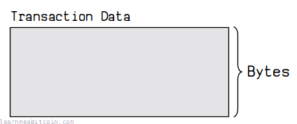
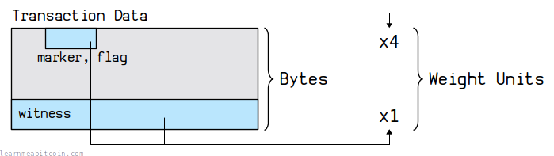
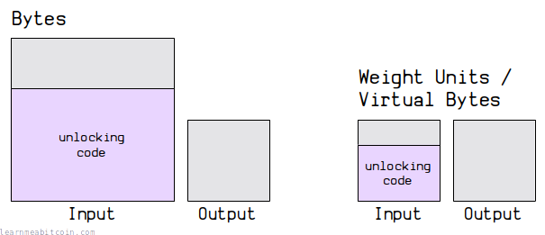
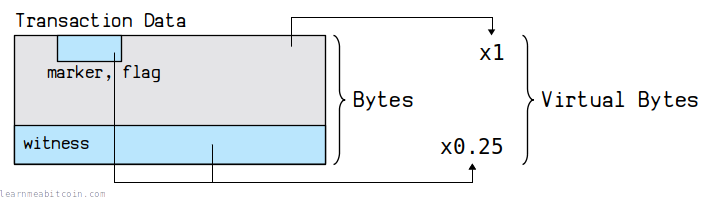

你可以通过 3 种方式来测量比特币交易（[transaction](../transaction.md)）的大小：

1. **[字节 (Bytes)](#bytes)** – 磁盘上的交易大小。
2. **[重量单位 (Weight Units)](#weight-units)** – 用于确定放入区块的交易大小。
3. **[虚拟字节 (Virtual Bytes)](#virtual-bytes)** – 用于比较交易之间的[费率](fee.md)。

“字节”是最直接的单位。它用于测量计算机上的任何数据量。

“重量单位”和“虚拟字节”是比特币所特有的测量单位。它们同样也是以字节为单位来测量交易的体积，但它们**对交易数据的某些部分给予了折扣**，并在计算一个[区块](../block.md)中能容纳多少交易时被使用。

 交易拆分器 (Transaction Splitter)

随机示例

交易数据


* `0 bytes`
* `0 vbytes`

结果

```
 
```


0 secs

## Bytes (b)

[](../../images/diagrams_png_transaction-size.png)

这是测量交易大小的自然方式。它是交易在占用空间方面的*实际*大小（以[字节](../general/bytes.md)计算）。

当交易在[网络](../networking.md)中发送时，或者在测量它在磁盘上占用多少空间时（例如存储在[区块文件](../block/blkdat.md)中时），都会使用字节。

在区块大小限制也是以字节（1,000,000 字节，或 1 MB）来衡量时，以字节来测量交易大小更为重要。然而，现在的区块大小限制是基于 *重量（weight）* 计算的。

### 示例

交易：[30dcd74b7fd8a585db3b2beddd4a7fc0edcfe9b8a1bac9abee695648659f8a6a](/explorer/tx/30dcd74b7fd8a585db3b2beddd4a7fc0edcfe9b8a1bac9abee695648659f8a6a)

```
01000000000101dd40a8d7f105055e781afa632207f5d3c4b4f4cad9f0fb320d0f0aa8e1ba904b0000000000ffffffff021027000000000000160014858e1f88ff6f383f45a75088e15a095f20fc663f841c0000000000001976a9142241a6c3d4cc3367efaa88b58d24748caef79a7288ac02483045022100d66341c3e6ce846b92bedcf9bc673ab8e47b770c616618eb91009e44816f4c2f0220622b5ebf6afabee3f4255bbcb84609e1185d4b6b1055602f5eed2541e26324620121022ed6c7d33a59cc16d37ad9ba54230696bd5424b8931c2a68ce76b0dbbc222f6500000000
```

大小：226 字节

该交易中包含 226 字节。

你可以自己验证这一点，因为每 2 个[十六进制](../general/hexadecimal.md)字符代表 1 个字节。

#### 典型交易大小

以*字节*为单位的交易大小主要**取决于交易中包含多少 [inputs](input.md) 和 [outputs](output.md)**。以下是典型交易的平均大小（ outputs 上带有标准 [P2PKH](../script/p2pkh.md) 锁定脚本）：

* Inputs: 1, Outputs: 1 = 191 或 192 字节
* Inputs: 1, Outputs: 2 = 225 或 226 字节 *(最常见)*
* Inputs: 2, Outputs: 1 = 338 或 339 字节
* Inputs: 2, Outputs: 2 = 373 或 374 字节 *(非常常见)*

交易中的 inputs 和 outputs 越多，其体积就越大。

以字节为单位的交易大小没有限制，唯一的限制是它必须能够装入一个[区块](../block.md)中。

## Weight Units (wu)

[BIP 141](https://github.com/bitcoin/bips/blob/master/bip-0141.mediawiki)

[](../../images/diagrams_png_transaction-weight.png)

每笔交易都有一个*重量*测量值。此项测量是在 [SegWit](../upgrades/segregated-witness.md) 升级中引入的。交易的重量是通过将[交易](../transaction.md)不同部分的体积（以字节为单位）乘以 4 或 1 来计算的：

| 字段 | 乘数 |
| --- | --- |
| version | x4 |
| marker | x1 |
| flag | x1 |
| input | x4 |
| output | x4 |
| witness | x1 |
| locktime | x4 |

因此，这给 [witness](witness.md) 数据提供了*折扣*。

### 示例

交易：[30dcd74b7fd8a585db3b2beddd4a7fc0edcfe9b8a1bac9abee695648659f8a6a](/explorer/tx/30dcd74b7fd8a585db3b2beddd4a7fc0edcfe9b8a1bac9abee695648659f8a6a)

```
01000000000101dd40a8d7f105055e781afa632207f5d3c4b4f4cad9f0fb320d0f0aa8e1ba904b0000000000ffffffff021027000000000000160014858e1f88ff6f383f45a75088e15a095f20fc663f841c0000000000001976a9142241a6c3d4cc3367efaa88b58d24748caef79a7288ac02483045022100d66341c3e6ce846b92bedcf9bc673ab8e47b770c616618eb91009e44816f4c2f0220622b5ebf6afabee3f4255bbcb84609e1185d4b6b1055602f5eed2541e26324620121022ed6c7d33a59cc16d37ad9ba54230696bd5424b8931c2a68ce76b0dbbc222f6500000000
```

大小：226 字节

重量：574 重量单位 (`116 x 4` + `110 x 1`)

该交易中包含 226 字节。其中，116 字节是 `non-witness` 数据，所以它们要乘以 4；110 字节是 `witness` 数据，所以它们要乘以 1。将两者相加，你就得到了 574 重量单位。

### 区块限制 (4,000,000 重量单位)

重量测量非常重要，因为**[区块](../block.md)最多能容纳 4,000,000 重量单位**的交易数据。

因此，当[矿工](../mining.md)用交易填满他们的[候选区块](../mining/candidate-block.md)时，他们使用交易重量来确定区块中能容纳多少笔交易。

[](../../images/diagrams_png_block-weight.png)

直接使用字节来衡量交易大小和区块限制之前更简单。但这种新的重量测量方法为花费输出的成本引入了*公平性*。

### 为什么 witness 数据重量较轻？

因为它有助于平衡创建输出与花费输出的成本（就[交易手续费](fee.md)而言）。

解锁输出所需的数据量（即[签名](../keys/signature.md)数据）要比最初在输出上加[锁](output/scriptpubkey.md)所需的数据量大得多，这并不公平。因此，新的重量测量让交易中输出和输入的大小能够更加匹配。

[](../../images/diagrams_png_transaction-weight-spending-sending-balance.png)

## Virtual Bytes (vBytes)

[](../../images/diagrams_png_transaction-vsize.png)

交易的*虚拟大小 (vSize)* 等于其*重量*除以 4。

换句话说，你不用为了给 witness 数据打折而将交易的其他部分乘以 4，而是直接将 witness 数据乘以 0.25 来折算：

| 字段 | 乘数 |
| --- | --- |
| version | x1 |
| marker | x0.25 |
| flag | x0.25 |
| input | x1 |
| output | x1 |
| witness | x0.25 |
| locktime | x1 |

因此，“重量”和“虚拟大小”提供了相同的测量值，只是单位不同。但是，使用虚拟字节使得对比新的 SegWit 交易与旧版交易的费率（此前使用 *sats-per-byte*）变得更加容易。

旧版交易的*字节*大小与其*虚拟字节 (vbytes)* 大小相同。

一个区块可以容纳 1,000,000 虚拟字节。

### 示例

交易：[30dcd74b7fd8a585db3b2beddd4a7fc0edcfe9b8a1bac9abee695648659f8a6a](/explorer/tx/30dcd74b7fd8a585db3b2beddd4a7fc0edcfe9b8a1bac9abee695648659f8a6a)

```
01000000000101dd40a8d7f105055e781afa632207f5d3c4b4f4cad9f0fb320d0f0aa8e1ba904b0000000000ffffffff021027000000000000160014858e1f88ff6f383f45a75088e15a095f20fc663f841c0000000000001976a9142241a6c3d4cc3367efaa88b58d24748caef79a7288ac02483045022100d66341c3e6ce846b92bedcf9bc673ab8e47b770c616618eb91009e44816f4c2f0220622b5ebf6afabee3f4255bbcb84609e1185d4b6b1055602f5eed2541e26324620121022ed6c7d33a59cc16d37ad9ba54230696bd5424b8931c2a68ce76b0dbbc222f6500000000
```

大小：226 字节

虚拟大小：143.50 虚拟字节 (`116 x 1` + `110 x 0.25`)

该交易中包含 226 字节。其中，116 字节是 `non-witness` 数据，所以它们要乘以 1；110 字节是 `witness` 数据，所以它们要乘以 0.25。将两者相加，你就得到了 143.50 虚拟字节。

如你所见，重量和虚拟大小的计算工作原理是完全相同的。

### 为什么我们要使用虚拟字节 (vbytes)？

既然如此，为什么我们既有重量又有虚拟字节？为什么不直接通过将某些部分乘以 0.25 来计算交易重量并使用它呢？

换句话说，为什么要有两个起相同作用的测量值？

> 因为在精确计算时，虚拟大小会出现小数。而重量是一个整数。我们只在共识代码中使用整数。
> 
> —— Pieter Wuille，[bitcoin.stackexchange.com](https://bitcoin.stackexchange.com/questions/53623/why-does-bip141-define-both-virtual-transaction-size-and-weight)

在计算机上处理小数往往会导致[舍入误差](https://floating-point-gui.de/errors/rounding/)，这就是为什么在比特币中，我们在进行至关重要的计算时，更倾向于处理*整数*。**整数运算总是返回一致且可靠的结果，而浮点运算则不然。**

所以，总结来说：

* **重量单位 (Weight Units)** — 用于*内部*计算一个区块中能容纳多少交易。
* **虚拟字节 (Virtual Bytes)** — 用于*人类*在对比交易的不同费率时使用。

## 资源

* [BIP 141 (Transaction size calculations)](https://github.com/bitcoin/bips/blob/master/bip-0141.mediawiki#transaction-size-calculations)
* [Is there a difference between bytes and virtual bytes (vbytes)?](https://bitcoin.stackexchange.com/questions/89385/is-there-a-difference-between-bytes-and-virtual-bytes-vbytes)
* 感谢 [luke-jr](https://github.com/luke-jr) 在 IRC 上向我解释：将 non-witness 数据乘以 4 有助于在创建和花费 [UTXO](utxo.md) 的成本之间建立平衡。