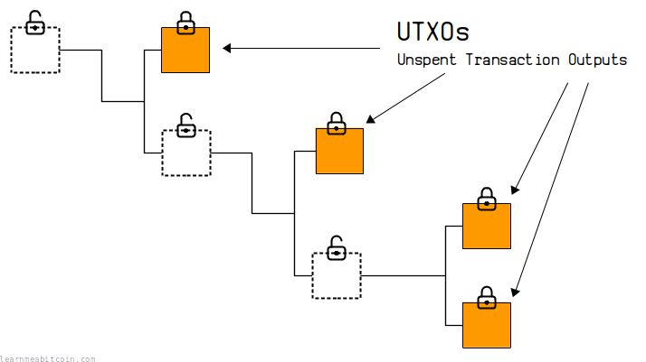
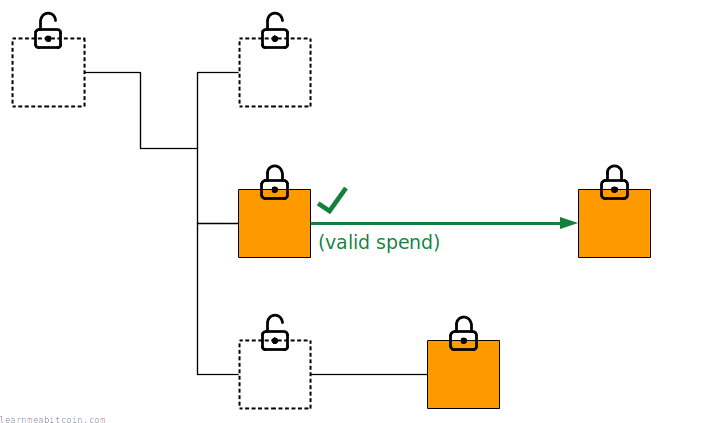
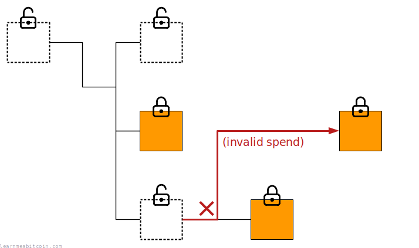
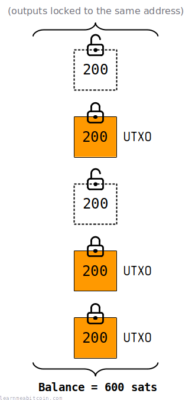

[](../../images/diagrams_png_transaction-utxo.png)

UTXO 是 **未花费的交易输出（unspent transaction output）**。

每个比特币交易（[transaction](../transaction.md)）都会创建 [outputs](output.md)，这些输出可以在未来的交易中作为 [inputs](input.md) 被消耗。UTXOs 就是那些尚未被消耗、依然可用于支付的交易输出。

因此，如果你把比特币看作是一个庞大的交易关系图，UTXOs 就位于这个关系图的末梢。

所有 UTXO 的集合被称为 UTXO 集合 (UTXO set)。

## 使用

UTXOs 在比特币中是如何使用的？

追踪 UTXOs 在以下两个方面非常有用：

1. [验证交易](#verify-transactions)
2. [计算地址余额](#calculate-balances)

### Verify Transactions

当你的节点从[网络](../networking.md)接收到一笔新交易时，它需要验证该交易的所有 inputs 所引用的 outputs **尚未被花费**。

如果交易的 inputs 全都是未花费的输出 (UTXOs)，那么该交易就是有效的：

[](../../images/diagrams_png_transaction-utxo-spending-valid.png)

然而，如果交易试图花费一笔已经在之前的交易中被花费过的输出，那么该交易就是无效的，并且会被拒绝：

[](../../images/diagrams_png_transaction-utxo-spending-invalid.png)

### Calculate Balances

一个[地址](../keys/address.md)的“余额”是锁定在该地址下的所有 UTXOs 的总和：

[](../../images/diagrams_png_transaction-utxo-address-balance.png)

你可以在诸如 [mempool.space](https://mempool.space) 和 [bitcoinexplorer.org](https://bitcoinexplorer.org) 等区块链浏览器上查看地址的余额。

**需要特别注意的是，比特币并不“存在”于地址内部。** 比ty币是保存在 [outputs](output.md) 里的，而地址本质上是加在输出之上的一把 *锁*。因此，一个地址的余额只是锁定在该地址下的所有 UTXOs 的总和。

## 位置

UTXOs 在比特币中存储在哪里？

在 [Bitcoin Core](https://bitcoin.org/en/bitcoin-core/) 中，所有的 UTXOs 都存储在 [chainstate 数据库](https://github.com/in3rsha/bitcoin-chainstate-parser)中：

```
~/.bitcoin/chainstate
```

这是一个存储在内存 (RAM) 中的独立数据库，这使得访问它的速度要比在[原始区块链文件](../block/blkdat.md)中搜寻以检查输出是否已被花费要快得多。

chainstate 数据库是一个简单的 [LevelDB](https://github.com/google/leveldb) **key:value** 存储库，包含以下信息：

* **Key (键)** - 这由每个输出的 [TXID](input/txid.md):[VOUT](input/vout.md) 组成。这被称为“outpoint（输出点）”，区块链中的每个输出都有其自己唯一的 outpoint，这意味着它可以用作直接查找每个独立输出的引用。
* **Value (值)** - 数据库中每个 UTXO 的值包含以下字段：
  * **Height (高度)** - 包含该 UTXO 的[区块](../block.md)的[高度](../blockchain/height.md)。
  * **Coinbase** - 该 UTXO 是否来自 [Coinbase](../mining/coinbase-transaction.md) 交易。这很重要，因为来自 Coinbase 交易的输出在区块链中深度达到 100 个区块之前不能被花费。
  * **Amount (金额)** - 输出的聪数（satoshis）值。
  * **Locking Code (锁定代码)** - 加在输出上的[锁定代码](output/scriptpubkey.md)。这很重要，因为在交易中花费输出时，每个输出都需要被 *解锁*，因此这允许你快速检查 input 上的解锁代码是否满足 output 上锁定代码的条件。

每当有新交易被打包挖出到[区块链](../blockchain.md)上时，chainstate 数据库就会更新；在交易中被花费的 UTXOs 会从数据库中移除，而新的 outputs 会被添加到数据库中。

你可以通过在本地节点运行 `bitcoin-cli gettxoutsetinfo` 来获取关于 UTXO 集合的一些基本信息：

```
$ bitcoin-cli gettxoutsetinfo

{
  "height": 796565,
  "bestblock": "00000000000000000002f63578950b747bfaa88dcd0bc0d8730827176d01b1f9",
  "txouts": 106662924,
  "bogosize": 8071055609,
  "hash_serialized_2": "596d06c8a5052e1d3e492ee26a811606f5fe30b20bbbd9db2fe64e44e411c17a",
  "total_amount": 19415818.12246298,
  "transactions": 68046641,
  "disk_size": 6827932282
}
```

以上只是 `bitcoin-cli gettxoutsetinfo` 输出的一个示例。运行此命令可能需要几秒钟才能返回结果。

### 内存 (RAM)

RAM 是 **随机存取存储器 (Random Access Memory)** 的简称。

如果你在计算机上存储数据，从 RAM 读取数据要比从磁盘（即你的 SSD 或 HDD）读取数据更快。你的硬盘用于长期存储，而你的 RAM 是临时存储，你可以更快速地从中读取数据。

当你运行 `bitcoind` 时，UTXO 数据库会被加载到 RAM 中，这有助于加速验证新接收到的交易。

你可以通过在 bitcoin.conf 文件中设置 `dbcache=` 选项来更改用于 UTXO 数据库的 RAM 大小（默认 = 100 MB）。增加此值将缩短节点验证传入交易所花费的时间。

## 工具

* [bitcoin-utxo-dump](https://github.com/in3rsha/bitcoin-utxo-dump) - 此工具从你的本地节点读取 chainstate 数据库，并将所有 UTXOs 保存到 CSV 文件中。
* [Statoshi.info (Unspent Transaction Output Set)](https://statoshi.info/d/000000009/unspent-transaction-output-set) - 运行中的节点上关于 UTXO 集合状态的实时统计数据。

## 总结

UTXO 只是对尚未被花费的交易输出的一个高级称呼。

因此，UTXO 集合指的就是**比特币的循环供应量**。

比特币中有许多缩写词，但归根结底，它们几乎都是些听起来复杂、但实际上非常直接的事物的名字。不要被它们退缩。

## 资源

* [Programming Bitcoin by Jimmy Song (Chapter 5: Transactions)](https://github.com/jimmysong/programmingbitcoin/blob/master/ch05.asciidoc#outputs)
* [Did Satoshi invent UTXOs?](https://bitcoin.stackexchange.com/questions/109961/did-satoshi-invent-utxos)
* [Where is the UTXO data stored?](https://bitcoin.stackexchange.com/questions/37397/where-is-the-utxo-data-stored)
* [UTXO uh-oh…](http://gavinandresen.ninja/utxo-uhoh)