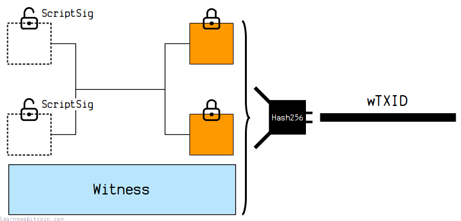
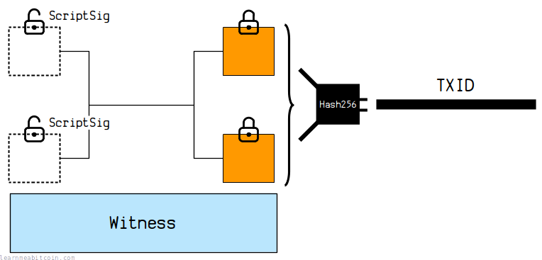
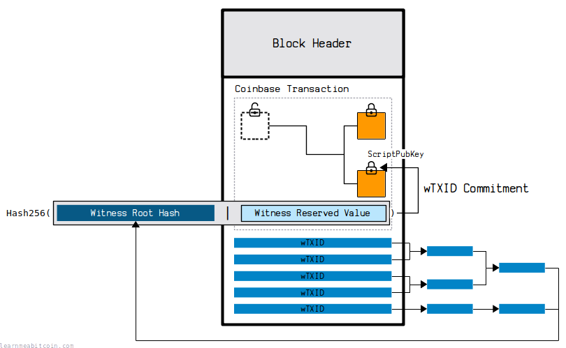

A wTXID is like a [TXID](/docs/technical/transaction/input/txid.md), but a wTXID includes the [witness](/docs/technical/transaction/witness.md) data of a [transaction](/docs/technical/transaction.md).

For example:

A **wTXID** is the [HASH256](/docs/technical/cryptography/hash-function.md#hash256) of all of the transaction data, *including* the [marker](/docs/technical/transaction.md#structure-marker), [flag](/docs/technical/transaction.md#structure-flag), and [witness](/docs/technical/transaction.md#structure-witness):

[](https://static.learnmeabitcoin.com/diagrams/png/transaction-witness-wtxid.png)

 wTXID

Random Example

Transaction Data

`0 bytes`

wTXID (Natural Byte Order)

`0 bytes`

wTXID (Reverse Byte Order)

Also known as the transaction "hash" when using `bitcoin-cli` commands

`0 bytes`


0 secs

Whereas a **TXID** is the HASH256 of all of the transaction data *except* the marker, flag, and witness:

[](https://static.learnmeabitcoin.com/diagrams/png/transaction-witness-txid.png)

 TXID

Random Example

Transaction Data

`0 bytes`


 Show Details


TXID (Natural Byte Order)

Used internally inside raw transaction data

`0 bytes`

TXID (Reverse Byte Order)

Used externally when searching for transactions on block explorers

`0 bytes`


0 secs

The diagrams above do not show the marker and flag fields.

## Examples

How do you create a wTXID?

From a technical perspective, a wTXID is calculated by [hashing](/docs/technical/cryptography/hash-function.md) the following fields of a serialized raw transaction:

```
wTXID = HASH256([version][marker][flag][inputs][outputs][witness][locktime])
```

### Segwit Transaction

Here's the raw transaction data for a segwit transaction. I've highlighted the new segwit fields:

```
01000000000101438afdb24e414d54cc4a17a95f3d40be90d23dfeeb07a48e9e782178efddd8890100000000fdffffff020db9a60000000000160014b549d227c9edd758288112fe3573c1f85240166880a81201000000001976a914ae28f233464e6da03c052155119a413d13f3380188ac024730440220200254b765f25126334b8de16ee4badf57315c047243942340c16cffd9b11196022074a9476633f093f229456ad904a9d97e26c271fc4f01d0501dec008e4aae71c2012102c37a3c5b21a5991d3d7b1e203be195be07104a1a19e5c2ed82329a56b431213000000000
```

The **TXID** is the HASH256 of all of the transaction data except the marker, flag, and witness:

[c06aaaa2753dc4e74dd4fe817522dc3c126fd71792dd9acfefdaff11f8ff954d](/explorer/tx/c06aaaa2753dc4e74dd4fe817522dc3c126fd71792dd9acfefdaff11f8ff954d)

The **wTXID** is then just the HASH256 of all of the transaction data including the marker, flag, and witness:

`f12d56f2234e809129dbf59392961bbe7a89b6250651f6aea7852cc00ced63ff`

You can check this for yourself by putting the data through HASH256 manually:

 HASH256

Random Transaction Data

Random Block Header

Data (Hex)

`0 bytes`


SHA-256


SHA-256

HASH256

SHA-256(SHA-256(data))

`0 bytes`


0 secs

 Reverse Bytes

Random Example

Bytes

`0 bytes`

Reversed

`0 bytes`


 Show Details


0 secs

**Byte Order.** Don't forget that TXIDs and wTXIDs are displayed in [reverse byte order](/docs/technical/general/byte-order.md#reverse-byte-order), so the initial result of the HASH256 will be in natural byte order (which means that the result looks backwards at first).

### Legacy Transaction

A non-segwit transaction will have the same TXID and wTXID.

For example, here's the raw transaction data for a legacy transaction:

```
0100000001ba1e48633efb7397536c3b45582cb763b1903b1364865f6de0f53387d306c87d010000006b483045022100df50e78ee42725165eceed6e6e1c534936015d3ef9e410d301de682a3655012f02203d21199bc19d982926fcf6bfe26773f4a0b2befdabb742542469f04e739764cb012103668b0f35effa223f001fb1c39d61bde513d5c6291b84227e84fd3e7daf0e3a6afeffffff02ce6d6002000000001976a9144ccb1bfd0099bf5ba2e2799a9f444f9583a74ce088ac35102408000000001976a914e5555373c7d95bb6a2cfcf7e9ffb3fcb5a305ba988ac711a0600
```

This is the **TXID**:

[25346687d5d10239c25a88193c97228327826a4ff66a36c4ba7e038f3e2ae9ed](/explorer/tx/25346687d5d10239c25a88193c97228327826a4ff66a36c4ba7e038f3e2ae9ed)

And seeing as a legacy transaction does not include a marker, flag, or witness, it will have the same **wTXID**:

`25346687d5d10239c25a88193c97228327826a4ff66a36c4ba7e038f3e2ae9ed`

 HASH256

Random Transaction Data

Random Block Header

Data (Hex)

`0 bytes`


SHA-256


SHA-256

HASH256

SHA-256(SHA-256(data))

`0 bytes`


0 secs

 Reverse Bytes

Random Example

Bytes

`0 bytes`

Reversed

`0 bytes`


 Show Details


0 secs

You can find the wTXID of a transaction by running `bitcoin-cli getrawtransaction <txid> 1`. The wTXID will be equal to the "hash" field, as this "hash" is the HASH256 of the entire transaction data (in reverse byte order), which is currently equal to the wTXID.

## wTXID Commitment

Committing transaction witness data to the block

[](https://static.learnmeabitcoin.com/diagrams/png/block-wtxid-commitment.png)

wTXIDs are used to *commit* the new data in segwit transactions to the block via a **witness root hash**.

> Commitments are used to bind a party to a value so that they cannot adapt to other messages in order to gain some kind of inappropriate advantage.

[cryptography.fandom.com](https://cryptography.fandom.com/wiki/Commitment_scheme)

For example, all of the legacy transaction data is committed to the [block header](/docs/technical/block.md#header) by creating a [merkle root](/docs/technical/block/merkle-root.md) of all the TXIDs in the block.

However, the TXIDs do not include the marker, flag, and witness data. So for all blocks since the [Segregated Witness](/docs/technical/upgrades/segregated-witness.md) upgrade, we also create a **merkle root for all of the wTXIDs**, and commit that to the block by creating a *witness root hash*.

This *witness root hash* gets HASH256'd with the [*witness reserved value*](/docs/technical/transaction/witness.md#witness-reserved-value) to create a **wTXID commitment**. This gets placed inside the [ScriptPubKey](/docs/technical/transaction/output/scriptpubkey.md) of one of the [outputs](/docs/technical/transaction/output.md) of the [coinbase transaction](/docs/technical/mining/coinbase-transaction.md).

So now there is a commitment for all the new segwit transaction data placed inside the block. So if anyone tries to change the contents of the witness data in any of the transactions in the block, it will not match the wTXID commitment and the block will be invalid.

wTXIDs are ultimately used to prevent anyone from editing the new segregated witness transaction data included in the block.

### Example

The block at height [553,724](/explorer/block/0000000000000000002849bd7ea6df81fa2f07652af0600ffa0f2b0bc47d736c) contains the following 4 transactions:

[2d4cdcd29d0004c762790b579bc2541da788f042031fa87fc27e402244080394](/explorer/tx/2d4cdcd29d0004c762790b579bc2541da788f042031fa87fc27e402244080394)
[d367b86c0fa5cf0b7a202c41fdbb2e4e78314d50fdc12654b499bf33062f2f86](/explorer/tx/d367b86c0fa5cf0b7a202c41fdbb2e4e78314d50fdc12654b499bf33062f2f86)
[76d11f7e4a480dfb3168537299cba66ff32c53dc3f5c16223eeaec1e1f1c6ce6](/explorer/tx/76d11f7e4a480dfb3168537299cba66ff32c53dc3f5c16223eeaec1e1f1c6ce6)
[e51de361009ef955f182922647622f9662d1a77ca87c4eb2fd7996b2fe0d7785](/explorer/tx/e51de361009ef955f182922647622f9662d1a77ca87c4eb2fd7996b2fe0d7785)

The first three are segwit transactions, so they contain witness data that will not be committed to the block header via their TXIDs alone.

These are the wTXIDs for each of the transactions:

`0000000000000000000000000000000000000000000000000000000000000000`
`8700d546b39e1a0faf34c98067356206db50fdef24e2f70b431006c59d548ea2`
`c54bab5960d3a416c40464fa67af1ddeb63a2ce60a0b3c36f11896ef26cbcb87`
`e51de361009ef955f182922647622f9662d1a77ca87c4eb2fd7996b2fe0d7785`

When calculating the witness root hash, the wTXID for the coinbase transaction must be set to all zeros. This is because it's eventually going to contain the commitment inside it, so this avoids a [circular reference](https://en.wikipedia.org/wiki/Circular_reference).

The last transaction is a non-segwit transaction, so its wTXID is the same as its TXID.

If we create a merkle root from all of these wTXIDs we get the **witness root hash**:

```
witness root hash: dbee9a868a8caa2a1ddf683af1642a88dfb7ac7ce3ecb5d043586811a41fdbf2
```

 Merkle Root

Random Example

Block

TXID List

A list of TXIDs separated by *spaces*, *commas*, or *new lines*. Quotes and brackets are ignored.

The TXIDs should be input in [reverse byte order](/docs/technical/general/byte-order.md#reverse-byte-order) (as they appear on blockchain explorers), but they are converted to [natural byte order](/docs/technical/general/byte-order.md#natural-byte-order) before the merkle root is calculated.


TXIDs (0)
 

Merkle Root (Natural Byte Order)

The byte order as it comes out of the hash function

Merkle Root (Reverse Byte Order)

The byte order as shown on blockchain explorers


0 secs

Now if we look inside the [input of the coinbase transaction](/explorer/tx/2d4cdcd29d0004c762790b579bc2541da788f042031fa87fc27e402244080394#input-0) we find the **witness reserved value**:

```
witness reserved value: 0000000000000000000000000000000000000000000000000000000000000000
```

Finally, if we concatenate and HASH256 the *witness root hash* and *witness reserved value*, we get the **wTXID commitment**:

```
wTXID commitment = HASH256(witness root hash | witness reserved value)
wTXID commitment = 6502e8637ba29cd8a820021915339c7341223d571e5e8d66edd83786d387e715
```

 HASH256

Random Transaction Data

Random Block Header

Data (Hex)

`0 bytes`


SHA-256


SHA-256

HASH256

SHA-256(SHA-256(data))

`0 bytes`


0 secs

This wTXID commitment gets placed in the ScriptPubKey of *one* of the outputs in the coinbase transaction. So if we check the ScriptPubKey of [output 1](/explorer/tx/2d4cdcd29d0004c762790b579bc2541da788f042031fa87fc27e402244080394#output-1) of the coinbase transaction for this block we find the following script:

OP\_RETURN  
OP\_PUSHBYTES\_36  
aa21a9ed6502e8637ba29cd8a820021915339c7341223d571e5e8d66edd83786d387e715

You'll see that the wTXID commitment is contained within the last 32 bytes of that data push.

* The first 4 bytes `aa21a9ed` is just a fixed header used to identify that this output contains the wTXID commitment.
* The next 32 bytes `6502e8637ba29cd8a820021915339c7341223d571e5e8d66edd83786d387e715` is the same wTXID commitment we have just calculated.

All coinbase transactions since the [segregated witness](/docs/technical/upgrades/segregated-witness.md) upgrade must include this commitment to the witness data. They all have to include an output with this script pattern: starting with `OP_RETURN`, followed by a `OP_PUSHBYTES_36` that contains a 4-byte header followed by the 32-byte wTXID commitment.

The wTXID commitment can be contained inside *any* of the outputs of the coinbase transaction. If there are multiple outputs with this structure for some reason, the highest [output index number](/docs/technical/transaction/input/vout.md) that contains this wTXID commitment structure will be taken as the commitment.

## Usage

How are wTXIDs used in Bitcoin?

wTXIDs are only used internally in Bitcoin to create a commitment for the new segwit fields of transactions.

> The wtxid is only used to compute the Witness merkle root, which is committed to in the coinbase.

Pieter Wuille, [bitcoin.stackexchange.com](https://bitcoin.stackexchange.com/questions/55337/segwit-and-previous-hash-txid-or-wtxid-or-either/55339#55339)

So you wouldn't use the wTXID to look up a transaction in the [blockchain](/docs/technical/blockchain.md) or anything like that.

**You still use the [TXID](/docs/technical/transaction/input/txid.md) to look up transactions in the blockchain.** A TXID is still a unique identifier of a transaction, as it still hashes the *effect* of a transaction (moving coins from existing [outputs](/docs/technical/transaction/output.md) to new outputs), which is always unique to each transaction. The [witness](/docs/technical/transaction/witness.md) data is only important for transaction *validation* (unlocking the inputs), and this does not make the transaction data any more unique than it already is.

> Signatures inside a transaction actually don't describe the effect of a transaction. A transaction moves coins around, reassigns them. But the signature is only there to prove that the transaction was authorized, it doesn't change its effect.

Pieter Wuille, [SF Bitcoin Developers](https://youtu.be/NOYNZB5BCHM?t=113)

## Resources

* [BIP 141](https://github.com/bitcoin/bips/blob/master/bip-0141.mediawiki)
* [Why include the Segregated Witness Merkle Root in the input field of the coinbase transaction?](https://bitcoin.stackexchange.com/questions/58414/why-include-the-segregated-witness-merkle-root-in-the-input-field-of-the-coinbas)