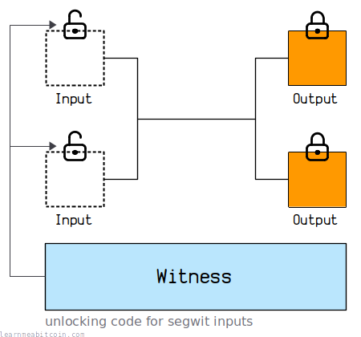
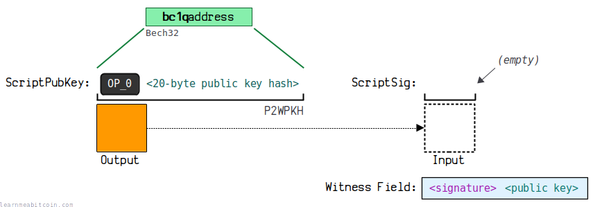
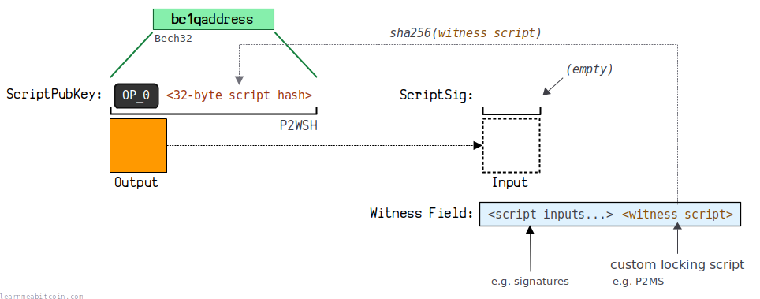

* [BIP 141: Segregated Witness (Consensus layer)](https://github.com/bitcoin/bips/blob/master/bip-0141.mediawiki)
* [BIP 143: Transaction Signature Verification for Version 0 Witness Program](https://github.com/bitcoin/bips/blob/master/bip-0143.mediawiki)
* [BIP 144: Segregated Witness (Peer Services)](https://github.com/bitcoin/bips/blob/master/bip-0144.mediawiki)

[](https://static.learnmeabitcoin.com/assets/icons/segwit.svg)

Segregated Witness (SegWit) was a major upgrade to the Bitcoin software activated in 2017 (block [481,824](/explorer/block/0000000000000000001c8018d9cb3b742ef25114f27563e3fc4a1902167f9893)).

The main changes were a **new transaction structure**, a **block size increase**, and the addition of a **new address format**.

**This page lists the *technical changes* introduced in the Segregated Witness upgrade.** For an introduction on why and how the upgrade took place, check out the [beginner's guide to SegWit](/docs/beginners/guide/segwit.md).

## Motivation

Why was Segregated Witness introduced?

The primary reason for the Segregated Witness upgrade was to **fix transaction malleability**.

Before Segregated Witness, the [TXID](/docs/technical/transaction/input/txid.md)s for [legacy transactions](/docs/technical/transaction.md#example-legacy) were created from the *entire transaction data*, including the [signatures](/docs/technical/keys/signature.md).

However, it's possible to [adjust the signatures](/docs/technical/keys/signature.md#legacy-step-6) inside a transaction and for them to remain valid, and this would have a knock-on effect to the TXID. This meant that it was possible for someone to change the TXID of your transaction after you sent it into the [network](/docs/technical/networking.md).

The problem with this is that any transactions that depend on this TXID (i.e. transactions that spend one of the [outputs](/docs/technical/transaction/output.md) while it was still in the [memory pool](/docs/technical/mining/memory-pool.md)) would become invalid. In other words, a miner could "cancel" the [descendants](/docs/technical/mining/memory-pool.md#descendants) of memory pool transactions and prevent them from getting [mined](/docs/technical/mining.md) into a block.

Therefore, the primary change in the Segregated Witness upgrade was a modification to the transaction data structure so that the signatures were no longer included as part of the TXID calculation, making TXIDs dependable and allowing you to confidently spend the outputs of transactions whilst they are still in the memory pool.

This new transaction data allowed for a block size increase at the same time, which is why Segregated Witness was introduced as **suite of changes** in one major upgrade to the software.

## Technical Changes

What were the changes to the Bitcoin?

The following is a **list of all the changes** that took place to Bitcoin with the Segregated Witness upgrade.

I'll start with the most significant changes first (the ones you're most likely to run into as a developer), and work down to the minor changes.

### 1. Transaction Structure

[](https://static.learnmeabitcoin.com/diagrams/png/transaction-witness.png)

The primary change was the addition of a new [segwit transaction](/docs/technical/transaction.md#example-segwit) structure.

These new segwit transactions include a **new [witness](/docs/technical/transaction/witness.md) section** that holds the unlocking code (i.e. signatures) for the [new locking scripts](#locking-scripts) introduced in the upgrade.

So whereas legacy transactions would use the [ScriptSig](/docs/technical/transaction/input/scriptsig.md) field to unlock inputs, segwit transactions now use the new *witness* section instead.

* Legacy locking scripts (e.g. [P2PKH](/docs/technical/script/p2pkh.md), [P2SH](/docs/technical/script/p2sh.md)) still need to be unlocked using the ScriptSig field. It's only the new locking scripts (e.g. [P2WPKH](/docs/technical/script/p2wpkh.md), [P2WSH](/docs/technical/script/p2wsh.md)) that use the new witness field for unlocking.
* Legacy transactions that do not use the witness section for unlocking inputs are therefore still vulnerable to transaction malleability.

 Transaction Splitter

Random Example

Transaction Data


* `0 bytes`
* `0 vbytes`

Result

```
 
```


0 secs

### 2. Transaction Size Calculation

[](https://static.learnmeabitcoin.com/diagrams/png/transaction-weight.png)

With the addition of the [new witness field](#transaction-structure), transactions were also given a **new [size](/docs/technical/transaction/size.md) calculation called [weight](/docs/technical/transaction/size.md#weight)**.

Instead of measuring the size of a transaction purely on the number of bytes, different parts of the transaction data were given *specific multipliers* so that some parts of a transaction would "weigh less" than others:

|  |  |
| --- | --- |
| Legacy Data | bytes x 4 |
| Segwit Data | bytes x 1 |

As a result, the unlocking code in a segwit transaction *weighs less* than the unlocking code in a legacy transaction, effectively giving a size discount (and reduced [fee](/docs/technical/transaction/fee.md) costs) to anyone using new segwit transactions.

#### [Virtual Bytes](/docs/technical/transaction/size.md#vbytes)

The virtual bytes measurement is equivalent to the *weight* measurement, but with different multipliers:

|  |  |
| --- | --- |
| Legacy Data | bytes x 1 |
| Segwit Data | bytes x 0.25 |

With virtual bytes, legacy transactions maintain the same size measurement, and new segwit transactions can be *compared* to the size of legacy transactions in terms of "virtual bytes".

You'll typically see the virtual bytes measurement on [blockchain explorers](/explorer/), but internally Bitcoin uses weight to determine how many transactions can fit inside a [block](/docs/technical/block.md).

 Transaction Splitter

Random Example

Transaction Data


* `0 bytes`
* `0 vbytes`

Result

```
 
```


0 secs

### 3. Block Size Increase

[](https://static.learnmeabitcoin.com/diagrams/png/block-weight.png)

Using the [new weight calculation](#transaction-size-calculation) for transactions, the [block size limit](/docs/technical/block.md#weight) was changed from **1,000,000 *bytes*** to **4,000,0000 *weight units***.

This results in a block size increase that is **up to 4 times bigger** than the old block size limit.

Seeing as transaction data always contains *some legacy data* along with the new segwit data, the *effective* block size increase works out to be around **1,700,000 to 2,000,000 *bytes*** on average (depending on the composition of transactions included in the block).

### 4. Locking Scripts

Two new locking script patterns were introduced to take advantage of the [new witness field](#transaction-structure) for unlocking certain types of outputs:

1. [P2WPKH](/docs/technical/script/p2wpkh.md)
   [](https://static.learnmeabitcoin.com/diagrams/png/script-p2wpkh.png)
2. [P2WSH](/docs/technical/script/p2wsh.md)
   [](https://static.learnmeabitcoin.com/diagrams/png/script-p2wsh.png)

These are *functionally* the same as the legacy [P2PKH](/docs/technical/script/p2pkh.md) and [P2SH](/docs/technical/script/p2sh.md) locking scripts.

The main difference is that P2WPKH and P2WSH are unlocked using the [witness](/docs/technical/transaction/witness.md) area of a transaction instead of the [ScriptSig](/docs/technical/transaction/input/scriptsig.md).

**The new P2WPKH and P2WSH locking scripts *do not* use the traditional [Script](/docs/technical/script.md) language for locking and unlocking.** They use a fixed structure of bytes instead, and have their own hard-coded method for execution. But nonetheless, they are still functionally the same as P2PKH and P2SH.

 Script

Random ScriptPubKey
Random ScriptSig

Hex


`0 bytes`

ASM
Type

 Non-Standard
 P2PK (Pay To Pubkey)
 P2PKH (Pay To Pubkey Hash)
 P2MS (Multisig)
 P2SH (Pay To Script Hash)
 P2WPKH (Pay To Witness Pubkey Hash)
 P2WSH (Pay To Witness Script Hash)
 P2TR (Pay To Taproot)
 OP\_RETURN (Data)


Address`0 characters`


0 secs

### 5. Address Format

The [new P2WPKH and P2WSH locking scripts](#locking-scripts) use the new **[Bech32](/docs/technical/keys/bech32.md) address format**.

These Bech32 addresses allow for **better error-detection** and are **easier to transcribe**.

 Address (Bech32)

Generate Random


ScriptPubKey

Version
 `OP_0` (P2WPKH or P2WSH)
 `OP_1` (P2TR)

Data
(public key hash or script hash)
`0 bytes`

Hex

`0 bytes`
`Type:`

Network
 Mainnet
 Testnet
 Regtest

Address

Bech32 encoding of the ScriptPubKey

`0 characters`


0 secs

So whereas legacy P2PKH and P2SH locking scripts continue to use [Base58](/docs/technical/keys/base58.md) addresses, the new P2WPKH and P2WSH locking scripts use Bech32 addresses instead.

### 6. Signature Algorithm

The [new P2WPKH and P2WSH locking scripts](#locking-scripts) also make use of a **[new signature algorithm](/docs/technical/keys/signature.md#segwit-algorithm)**.

This new "segwit signature algorithm" is designed to be more efficient than the [legacy signing algorithm](/docs/technical/keys/signature.md#legacy-algorithm).

So now the process for creating signatures to unlock P2WPKH and P2WSH locking scripts is different to the process for creating signatures for legacy locking scripts (e.g. P2PKH and P2SH).

**Both the legacy and new segwit signature algorithm still use [ECDSA](/docs/technical/cryptography/elliptic-curve/ecdsa.md).** It's just that now the method for *preparing the transaction data* for signing is different when you want to unlock P2WPKH and P2WSH locking scripts.

### 7. wTXID Commitment

[](https://static.learnmeabitcoin.com/diagrams/png/block-wtxid-commitment.png)

Due to the fact that [new segwit transactions](#transaction-structure) contain data that is no longer part of the [TXID](/docs/technical/transaction/input/txid.md), this new witness data needs to be *committed* to the block via a [wTXID commitment](/docs/technical/transaction/wtxid.md#commitment).

So in addition to the TXID (which does not include the new fields in a segwit transaction), each transaction also has a [wTXID](/docs/technical/transaction/wtxid.md) that is calculated by hashing all the data in a segwit transaction (which does includes the new fields in a segwit transaction).

[](https://static.learnmeabitcoin.com/diagrams/png/transaction-witness-wtxid.png)

 TXID

Random Example

Transaction Data

`0 bytes`


 Show Details


TXID (Natural Byte Order)

Used internally inside raw transaction data

`0 bytes`

TXID (Reverse Byte Order)

Used externally when searching for transactions on block explorers

`0 bytes`


0 secs

 wTXID

Random Example

Transaction Data

`0 bytes`

wTXID (Natural Byte Order)

`0 bytes`

wTXID (Reverse Byte Order)

Also known as the transaction "hash" when using `bitcoin-cli` commands

`0 bytes`


0 secs

So when constructing a block, a miner will now also calculate a [merkle root](/docs/technical/block/merkle-root.md) for all of the wTXIDs in the block and include this in the block via a wTXID commitment in the [coinbase transaction](/docs/technical/mining/coinbase-transaction.md).

As a result, this wTXID commitment **prevents anyone from modifying the witness data** for the transactions included in a block.

* The wTXID is placed inside the coinbase transaction because it's the only part of a block that can include new additional data without causing a [hard fork](/docs/technical/blockchain/hard-fork.md).
* Seeing as a [legacy transaction](/docs/technical/transaction.md#example-legacy) does not include any new segwit fields, its wTXID will be the same as its TXID.

### 8. Network Messages

When communicating with other nodes on the [network](/docs/technical/networking.md), you now have to specifically **request for a node to send you the full transaction data for segwit transactions** (i.e. including the [new witness data](#transaction-structure)).

So whereas in a [`getdata`](/docs/technical/networking.md#getdata) message the *type* field would be one of the following:

* `01000000 = MSG_TX`
* `02000000 = MSG_BLOCK`

To request a transaction or block including the new witness data you need to use the following *type* fields instead:

* `01000040 = MSG_WITNESS_TX`
* `02000040 = MSG_WITNESS_BLOCK`

### 9. Other

* In addition to legacy bytes getting multiplied by 4 during the [new transaction size calculation](#transaction-size-calculation), all [signature](/docs/technical/keys/signature.md) operations (e.g. `OP_CHECKSIG`, `OP_CHECKMULTISIG`, `OP_CHECKSIGVERIFY`, `OP_CHECKMULTISIGVERIFY`) in a legacy transaction are multiplied by 4 too. This is important when calculating how many signature operations are in a block, as a block has a [limit of **80,000** signature operations](/docs/technical/mining/candidate-block.md#requirement-sigops) (sigops).

## Summary

As you can see, Segregated Witness introduced **multiple technical changes** to Bitcoin in one go.

Many of these changes also seem unnecessarily complex at first, but that's because technical workarounds were required to be able to introduce these changes as a [soft fork as opposed to a hard fork](/docs/beginners/guide/segwit.md#why-were-the-changes-implemented-in-this-way).

However, depending on what you're working on, you probably do not need to include all of the changes in your software; you can just implement the changes that are relevant to your tool (e.g. you probably don't need to worry about the new [network messages](#network-messages) if you're developing a wallet).

Nonetheless, it's useful to be aware of all the changes that took place, and how they all tie together to create the biggest upgrade to Bitcoin since its release.

Implementing support for SegWit might seem like a daunting technical challenge at first, but if you work on incorporating each change as you go you'll get there eventually. Just take it one step at a time.