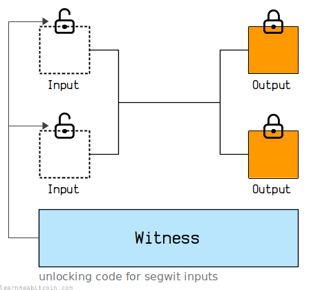

# 隔离见证深度溯源：从交易延展性危机谈起 (SegWit Malleability & History)

在前面的[隔离见证总览](segregated-witness.md)中，我们了解了见证字段的基本格式与区块权重计算。然而，隔离见证（Segregated Witness，简称 SegWit）之所以成为比特币历史上最波澜壮阔、影响深远的技术升级，其最根本的动因并非扩容，而是为了彻底解决困扰比特币网络多年的致命痼疾——**交易延展性（Transaction Malleability）**。

本章将深入剖析密码学签名层面的延展性机理、它对早期交易所造成的历史危机，以及 SegWit 是如何通过一次精巧的软分叉设计，既修复了漏洞又为二层网络（闪电网络）铺平道路的。

---

## 1. 交易延展性的密码学根源

在比特币传统交易中，当一笔交易被私钥签名时，签名本身存放在输入的 `scriptSig` 中。由于“签名无法对自身进行签名”，签名计算时待哈希的数据并不包含这个签名本身；但在计算交易的唯一标识符 **TXID** 时，却是对**包含签名的完整交易**做 Double-SHA256：

$$\text{TXID} = \text{SHA256}(\text{SHA256}(\text{Version} + \text{Inputs(含 scriptSig)} + \text{Outputs} + \text{LockTime}))$$

这就带来了一个严峻问题：如果任何第三方在**不改变交易转账意图（输入来源、输出金额和收款地址）**的前提下，能够合法地微调 `scriptSig` 中的字节，那么**交易内容依然合法有效，但 TXID 却会彻底改变！** 这种特性被称为交易延展性（可锻性）。

### 为什么签名可以被修改？
在 ECDSA（椭圆曲线数字签名算法）中，签名由两个大整数 $(r, s)$ 组成。在 secp256k1 椭圆曲线阶为 $N$ 的有限域中，存在一个数学特性：
$$\text{如果 } (r, s) \text{ 是消息的有效签名，那么 } (r, N - s \pmod N) \text{ 同样是完全合法的有效签名！}$$

此外，签名在 `scriptSig` 中采用 DER 编码表示，早期 OpenSSL 对 DER 编码的填充字节容忍度较高。攻击者只需截获一笔在网络中广播但尚未打包确认的交易，将签名中的 $s$ 替换为 $N - s$，或者调整 DER 编码格式，就能生成一个全新的 `scriptSig'`。

这笔新交易输入输出完全一致，私钥所有者依然认可，但由于 `scriptSig` 变了，其 **TXID 发生了变异**。

---

## 2. 延展性危机：早期交易所的双重提现攻击

交易延展性不仅是一个密码学趣闻，更曾对整个行业造成过实质性的重创：



1. **攻击过程**：
   * 攻击者从交易所发起一笔合法的比特币提现。
   * 交易所后端自动生成交易并广播，并在内部数据库中记录：*“用户 A 的提现对应交易 TXID_1，等待区块确认”*。
   * 攻击者在 P2P 网络中监听到这笔交易，利用延展性将其变异为合法的 `TXID_2` 并抢先广播。
   * 矿工最终打包了变异后的 `TXID_2` 上链入块。攻击者的钱包如愿收到了比特币。
2. **致命后果**：
   * 交易所的自动化监控程序扫描区块链，一直在查询 `TXID_1` 是否确认。由于链上记录的是 `TXID_2`，监控系统判定 `TXID_1`“超时未确认并已失效”。
   * 攻击者向交易所客服投诉：“提现失败，链上查不到 TXID_1，请补发！”
   * 客服核查系统记录发现 `TXID_1` 确实不存在，于是手工或自动重新补发了一笔提现。
   * **攻击者成功实现了“双重提现 (Double Withdrawal)”**。

臭名昭著的 Mt.Gox 交易所崩盘事件中，延展性漏洞就曾被大量利用作为攻击借口。

### 历史妥协：BIP62 与 BIP66
社区很早就意识到延展性危害，并推出了 [BIP66](https://github.com/bitcoin/bips/blob/master/bip-0066.mediawiki) 软分叉，强制全网节点必须遵循严格的 DER 编码规范（严禁多余填充字节），并规定必须使用小数值的 $s$（Low-S）。

但这些补丁治标不治本——只要输入者本身拥有私钥，他依然可以合法构造出不同签名的延展性交易。**只要签名数据依然被纳入 TXID 计算，延展性问题就永远无法从根本上消除。**

---

## 3. 隔离见证的终极解法：分离见证数据

2015 年底，Bitcoin Core 核心开发者 Pieter Wuille 提出了隔离见证（BIP141、BIP143、BIP144）：

> **核心思路**：将负责解锁证明的见证数据（Witness / 签名）从输入结构中剥离出来，放置在交易末尾。计算交易的 TXID 时，**只对交易的状态本身（版本号、输入点引用、输出列表、锁定时间）做哈希，彻底排除见证数据！**

```text
传统交易 TXID 计算范围：
[nVersion][txins (包含 scriptSig)][txouts][nLockTime]

SegWit 交易 TXID 计算范围：
[nVersion][txins (scriptSig 为空)][txouts][nLockTime]  <-- 签名改变不再影响 TXID！

见证数据独立存放于交易末尾：
[witness 数据]
```

从此之后：
* 交易在发起的那一刻，其 **TXID 就已永久确定**。
* 任何第三方即使篡改了见证数据中的签名编码，也只能导致签名失效，绝不可能篡改该交易的 TXID！
* **为闪电网络奠基**：链下支付通道依赖于多笔相互引用的未确认交易。如果父交易的 TXID 会被第三方改变，子交易就会瞬间变成孤儿失效。SegWit 彻底清除了延展性，让闪电网络的安全构建成为现实。

---

## 4. 架构兼容：WTXID 与 Coinbase 承诺

隔离见证是一次向前兼容的**软分叉 (Soft Fork)**。老节点看不到交易尾部的见证数据，依然能把其当成合法的“人人可花”交易接受。但全网如何保证见证数据不被篡改呢？

开发团队引入了 **WTXID (Witness Transaction ID)**：
* `WTXID` 是对包含见证数据的完整交易执行 Double-SHA256 的哈希值。
* 区块头中的原 `Merkle Root` 依然由所有交易的传统 `TXID` 计算（保证老节点兼容）。
* 所有交易的 `WTXID` 会计算出一棵独立的 **Witness Merkle Tree**。
* 为了将这棵见证树锚定进区块链，矿工在区块的第一笔交易（Coinbase 交易）的输出中，嵌入一个 `OP_RETURN` 见证承诺（Witness Commitment）：

```cpp
// Bitcoin Core 生成 Coinbase 见证承诺的核心逻辑
std::vector<unsigned char> GenerateCoinbaseCommitment(CBlock& block, ...) {
    uint256 witnessroot = BlockWitnessMerkleRoot(block, nullptr);
    CTxOut out;
    out.nValue = 0;
    // 固定的 38 字节承诺脚本: OP_RETURN 0x24 0xaa21a9ed [32字节见证根哈希]
    out.scriptPubKey = CScript() << OP_RETURN << ToByteVector(witnessroot);
    block.vtx[0]->vout.push_back(out);
}
```

通过这一绝妙的“隐式锚定”，新节点能够严密校验全块见证数据的完整性，而老节点完全不受影响。

---

## 5. 意外的惊喜：BIP143 签名性能优化与权重扩容

在设计 SegWit 时，开发者顺带解决了一系列历史痛点：

### 1. 签名哈希计算从 $O(n^2)$ 降至 $O(n)$
在传统比特币交易中，每个输入的签名哈希算法存在设计缺陷：包含 $n$ 个输入的交易在签名校验时需要执行约 $O(n^2)$ 级别的哈希运算。曾有攻击者构造过包含数千个输入的极端交易，导致全网节点验证耗时数十秒，构成拒绝服务攻击。
SegWit 引入了全新的 [BIP143](https://github.com/bitcoin/bips/blob/master/bip-0143.mediawiki) 签名哈希算法，通过预计算共享哈希，将计算复杂度彻底降到了 $O(n)$。

### 2. 区块容量变相扩容 (Block Weight)
为了激励生态采用见证分离，SegWit 将传统的 1MB 物理上限改为了 4,000,000 重量单位（Weight Units）：
$$\text{Block Weight} = \text{Base Size} \times 4 + \text{Witness Size} \le 4,000,000$$
见证数据享受了 **75% 的折扣（仅计 1/4 重量）**。这不仅让全网实际吞吐量提升至约 1.7~2.0MB，更促使开发者把复杂的解锁逻辑放入轻量廉价的见证区中。

---

## 6. 小结

隔离见证绝非单纯的“容量扩充补丁”，它是比特币协议自创世以来最深刻的一次架构蜕变：
1. **终结了延展性梦魇**，守护了交易系统的确定性；
2. **铺平了 Layer 2 之路**，使得无信任的支付通道网络（闪电网络）成为可能；
3. **引入了版本化脚本**，为后续的 [Taproot 与 Schnorr 签名](taproot.md) 扫清了升级阻碍。