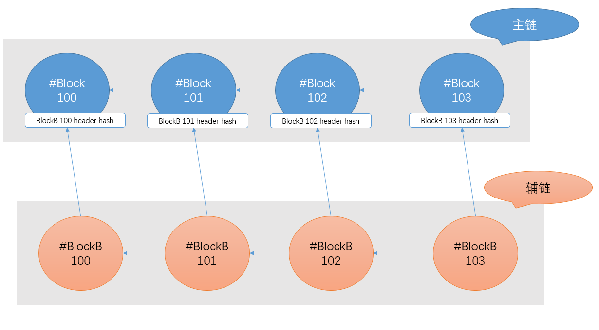
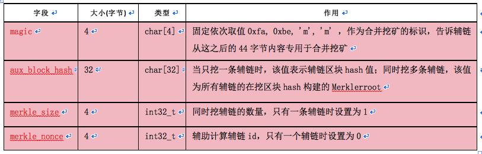
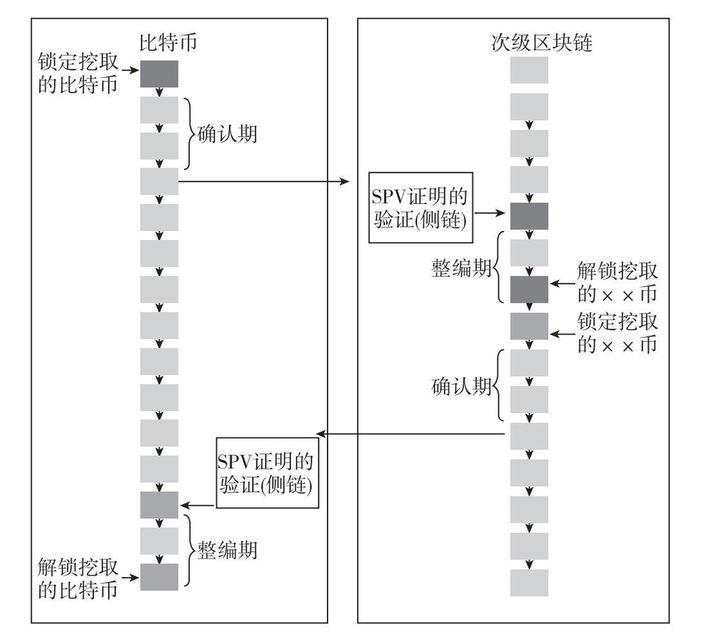

# 侧链与跨链技术演进：从 BitDNS、Namecoin 到 Liquid (Sidechains & Cross-chain)

比特币主网为了保证去中心化与账本安全，在脚本表达力与区块吞吐量上做出了极其克制的取舍。然而早在比特币诞生的最初几年，极客们就已经在探索如何以比特币强大的工作量证明（PoW）算力为信任基石，扩展出更多元化的资产发行、去中心化域名与高频交易网络。

从最初的 **BitDNS**、**Namecoin 联合挖矿 (AuxPOW)**，到基于燃烧证明的 **单向挂钩 (One-way Peg)**，再到 Blockstream 提出的 **双向锚定侧链 (Two-way Peg)**、联盟侧链 **Liquid**，乃至跨链 **原子互换 (Atomic Swap)**，本章将全面复盘比特币侧链与跨链技术的演进脉络。

---

## 1. BitDNS 与 Namecoin：联合挖矿 (Merged Mining) 的诞生

2010 年 11 月，bitcointalk.org 论坛上出现了一个划时代的讨论帖：有人提议借鉴比特币的去中心化共识，建立一个抗审查的分布式 DNS 系统——[BitDNS](https://bitcointalk.org/index.php?topic=1790.0)。

社区的共识逐渐明确：既然比特币公链已经提供了不可篡改的时间戳、数据完整性与密码学身份验证，**为什么不以比特币区块链为主锚定物，在其之上延伸出新的应用链？** 这一思想最终孕育了世界上第一个侧链雏形——**Namecoin**。

### 联合挖矿协议 (AuxPOW) 的演进
如果为 Namecoin 单独开启一条全新的 PoW 链，其初期微弱的算力极易遭到 51% 攻击。为了复用比特币全网庞大的算力庇护，开发者们发明了 **联合挖矿（Merged Mining / AuxPOW）** 机制：



1. **父链与辅链**：我们将比特币链称为父链（主链），Namecoin 链称为辅链（侧链）。
2. **在 Coinbase 中嵌入证明**：比特币矿工在挖矿时，把辅链候选区块的哈希值嵌入到比特币区块的 Coinbase 交易中。
3. **难度复用**：父链的难度远高于辅链。一个哈希计算如果达到了父链难度，自然同时达到了辅链难度；而即便未达到父链难度、但只要达到了辅链难度，矿工同样可以把该区块提交给辅链网络赚取辅链奖励。
4. **多链 Merkle 聚合**：当矿工希望同时联合挖数十条辅链时，只需把各辅链区块头哈希构造成一棵独立的 Merkle 树，将树根写入比特币 Coinbase 的 `scriptSig` 中（需 44 字节标识）。

```c
// 矿工通过 chain_id 计算该辅链在 Merkle 树中的槽位 (slot num)
unsigned int rand = merkle_nonce;
rand = rand * 1103515245 + 12345;
rand += chain_id;
rand = rand * 1103515245 + 12345;
slot_num = rand % merkle_size;
```



通过 AuxPOW，辅链节点只需验证父链的区块头和 Merkle 包含分支，即可无损借用比特币的安全性。

---

## 2. 单向挂钩 (One-way Peg) 与燃烧证明 (Proof-of-Burn)

联合挖矿虽然共享了算力，但辅链资产的发行依然依赖辅链自身的挖矿逻辑。为了将真正的比特币“搬”到新链上，2013 年社区提出了 **单向挂钩协议 (One-way Peg)**。

### 运作机制
1. 用户在比特币主链上发起一笔交易，将一定数量的 BTC 发送到一个数学上不可花费的黑洞地址（如 `1111111111111111111114oLvT2`），完成“代币燃烧 (Proof-of-Burn)”。
2. 在该交易的 `OP_RETURN` 字段中附加指定的协议脚本，声明：*“源地址销毁 1 BTC，在侧链生成 1 单位侧链代币”*。
3. 侧链客户端监听到该主链交易确认后，在侧链为对应地址铸造资产。

> **代表协议**：早期的 **Omni Layer**（USDT 最初所依赖的发币协议）和 Counterparty 就是基于类似在主链嵌入元数据的思想运行的附生协议。
> **局限性**：单向挂钩是不可逆的单行道，进入侧链的资产无法再原路返回比特币主链。

---

## 3. 双向锚定（Two-way Peg）与侧链协议

为了实现资产在主链与侧链之间的双向自由流转，2014 年 Adam Back 等人发表了里程碑式的白皮书《Enabling Blockchain Innovations with Pegged Sidechains》，正式定义了**双向锚定侧链 (Two-way Pegged Sidechains)**。



### 四阶段流转流程：
1. **主链锁定**：用户发起交易，将比特币转入主链的一个特殊锁定脚本中。
2. **确认期 (Confirmation Period)**：等待锁定交易在主链获得充分区块确认（通常需要 1~2 天），防止主链分叉重组导致虚假充值。
3. **侧链赎回与 SPV 证明**：用户在侧链发起赎回交易，提交主链锁定交易的 **SPV 包含证明**。侧链验证其 PoW 累积深度后，在侧链铸造等额代币。
4. **竞争期 (Contest Period)**：在侧链设定一段挑战缓冲期，防范双花与欺诈；竞争期过后，用户即可在侧链自由使用代币。
5. **反向赎回**：用户在侧链锁定代币，凭借侧链 SPV 证明在主链解锁原始比特币。

### 现实挑战
真正的“去信任对称双向挂钩”要求比特币主链具备直接解析侧链 SPV 证明的能力，这需要在比特币主链引入新的操作码（如软分叉支持）。由于主网升级审慎，目前主流的侧链实现多转向了**联盟多重签名 (Federated Peg)**。

---

## 4. 商业级联盟侧链：Blockstream Liquid

由于对称双向锚定需要主链分叉，Blockstream 团队推出了面向交易所和机构间清算的商业侧链——**Liquid Network**。

* **运作模式**：Liquid 采用强信任联邦机制（Strong Federation）。主链资金由数十家知名交易所和金融机构组成的联合委员会（Federation）通过门限多重签名共同托管。
* **技术优势**：
  * **快速终结性**：采用 PBFT 类共识算法，出块时间缩短至 1 分钟，无需等待繁冗的工作量证明。
  * **保密交易 (Confidential Transactions)**：利用同态加密技术隐藏交易金额和资产类型，保障商业隐私。
  * **多资产发行**：支持在侧链一键发行数字证券、稳定币和代币化资产。

---

## 5. 跨链原子互换 (Atomic Swap)

除了建立侧链，对于两条完全独立运行的异构公链（如比特币网络与莱特币或以太坊），如何实现无需中心化交易所介入的资产互换？答案是 **跨链原子互换 (Atomic Swap)**。

原子互换完全依赖 **哈希时间锁合约 (HTLC - Hashed Timelock Contracts)** 和博弈论设计：

```text
Alice (拥有 1 BTC)  <================ 原子互换 ================>  Bob (拥有 3 ETH)
```

### 交互流程：
1. **秘密生成**：Alice 生成一个随机原像 $x$，计算其哈希值 $H = \text{Hash}(x)$。
2. **Alice 主链锁定**：Alice 在比特币网络创建合约交易 $TX_1$，将 1 BTC 锁定。解锁条件为：
   * 条件 A：Bob 提供原像 $x$ 及 Bob 的签名（可提款）；
   * 条件 B：48 小时后超时，Alice 可凭自身签名撤回资金（退款）。
3. **Bob 异构链镜像锁定**：Bob 看到 $TX_1$ 确认后，在以太坊网络使用**相同的哈希值 $H$** 创建镜像合约 $TX_2$，锁定 3 ETH。解锁条件为：
   * 条件 A：Alice 提供原像 $x$ 及 Alice 的签名（可提款）；
   * 条件 B：24 小时后超时（**必须明显短于 Alice 的 48 小时！**），Bob 可撤回资金。
4. **互换完成**：
   * Alice 在以太坊网络调用 $TX_2$ 提现 3 ETH，此时 Alice**必须公开原像 $x$**。
   * Bob 在区块链上获知了原像 $x$，立即在比特币网络凭借 $x$ 提现 Alice 锁定的 1 BTC。
   * 双方均成功获得对方资产；若任何一方中途离线，在各自超时后资金原路退回，任何人不会损失资产。

---

## 6. 小结

侧链与跨链技术是比特币向外探索边界的缩影：
1. **Namecoin 与 AuxPOW** 证明了比特币工作量证明算力作为基础设施的复用价值；
2. **双向锚定侧链与 Liquid** 展现了通过状态隔离来实验前沿密码学（如保密交易）的工程可行性；
3. **HTLC 与原子互换** 则奠定了密码学时间锁的博弈模型，为接下来我们将要介绍的最伟大的二层扩容方案——[闪电网络 (Lightning Network)](../lightning.md)，提供了最关键的基石。